**计算机视觉的任务：**


## 一、R-CNN
**论文：Rich feature hierarchies for accurate object detection and semantic segmentation**

### 1、解决的问题
（1）、经典的目标检测算法使用滑动窗法依次判断所有可能的区域。本文则预先提取一系列较可能是物体的候选区域，之后仅在这些候选区域上提取特征，进行判断。
（2）、经典的目标检测算法在区域中提取人工设定的特征（Haar，HOG）。本文则需要训练深度网络进行特征提取。可供使用的有两个数据库： 

 - 一个较大的识别库（ImageNet ILSVC 2012）：标定每张图片中物体的类别。一千万图像，1000类。 
 - 一个较小的检测库（PASCAL VOC 2007）：标定每张图片中，物体的类别和位置。一万图像，20类。 

本文使用识别库进行预训练，而后用检测库调优参数。最后在检测库上评测。

### 2、算法流程
RCNN算法分为4个步骤 
- 一张图像生成1K~2K个**候选区域（ROI）** 
- 对每个候选区域（Warp后的Region），使用深度网络**提取特征** 
- 将特征送入每一类的**SVM 分类器**，判别是否属于该类 
- 使用**回归器**精细修正候选框位置 


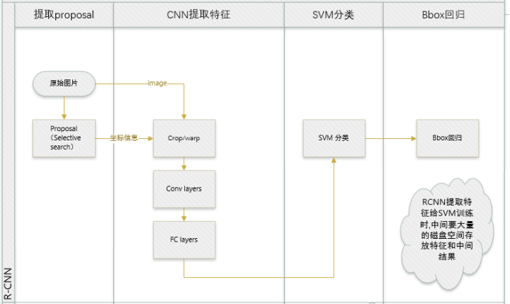

#### 2.1、候选区域生成
使用了Selective Search方法从一张图像生成约2000-3000个候选区域（Region Proposal）。基本思路如下： 
- 使用一种过分割手段，将图像分割成小区域 
- 查看现有小区域，合并可能性最高的两个区域。重复直到整张图像合并成一个区域位置 
- 输出所有曾经存在过的区域，所谓候选区域

候选区域生成和后续步骤相对独立，实际可以使用任意算法进行。

###### （1）、合并规则
优先合并以下四种区域： 
- 颜色（颜色直方图）相近的 
- 纹理（梯度直方图）相近的 
- 合并后总面积小的 
- 合并后，总面积在其BBOX中所占比例大的

第三条，保证合并操作的尺度较为均匀，避免一个大区域陆续“吃掉”其他小区域。
例：设有区域：a-b-c-d-e-f-g-h。
较好的合并方式是：ab-cd-ef-gh -> abcd-efgh -> abcdefgh。 
不好的合并方法是：ab-c-d-e-f-g-h ->abcd-e-f-g-h ->abcdef-gh -> abcdefgh。

第四条，保证合并后形状规则。
例：左图适于合并，右图不适于合并：


上述四条规则只涉及区域的颜色直方图、纹理直方图、面积和位置。合并后的区域特征可以直接由子区域特征计算而来，速度较快。

###### （2）、缩放候选区域
因为CNN对输入图像的大小有限制，所以在将候选区域输入CNN网络之前，要将候选区域进行固定尺寸的缩放。缩放分为两大类（该部分在原文附录A）：

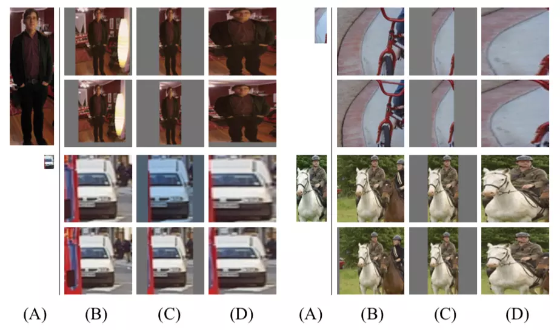

1）各向同性缩放，长宽放缩相同的倍数

 - tightest square with context：把region proposal的边界进行扩展延伸成正方形，灰色部分用原始图片中的相应像素填补，如图(B)所示
 - tightest square without context：把region proposal的边界进行扩展延伸成正方形，灰色部分不填补，如图(C)所示

2）各向异性缩放, 长宽放缩的倍数不同
不管图片是否扭曲，长宽缩放的比例可能不一样，直接将长宽缩放到227x227，如图(D)所示。在放缩之前，作者考虑，在region proposal周围补额外的原始图片像素（pad p）。上图中，第一层p=0，第二层p=16。最后试验发现，采用各向异性缩放并且p=16的时候效果最好。

###### （3）、多样化与后处理
为尽可能不遗漏候选区域，上述操作在多个颜色空间中同时进行（RGB,HSV,Lab等）。在一个颜色空间中，使用上述四条规则的不同组合进行合并。**所有颜色空间与所有规则的全部结果，在去除重复后，都作为候选区域输出。**

<p style="font-size:140%;font-weight:bold;color:red">疑问1： 不知道怎么去除重复？</p>

#### 2.2、特征提取
###### （1）、预处理：监督预训练
使用深度网络提取特征之前，首先把候选区域（Warp后的Region）归一化成同一尺寸227×227。 

**网络结构** 
基本借鉴Hinton 2012年在ImageNet上的分类网络，略作简化。 

 
 
此网络提取的特征为4096维，之后送入一个4096->1000的全连接(fc)层进行分类。 学习率0.01。

**训练数据** 
使用ILVCR 2012的全部数据进行训练，输入一张图片，输出1000维的类别标号。

###### （2）、调优训练（fine-tuning）：特征领域的微调
这种方法也是当数据量不够的时候，常用的一种训练方式，即先用别的数据库训练网络，然后再用自己的数据库微调训练(fine-tuning)。微调期间，定义与ground truth的IoU大于0.5的候选区域为正样本，其余的为负样本。这里训练时，网络输出要有所改变，因为分类问题，网络输出为 `!$N+1$`，其中N为正样本的类别数，1为背景。对于VOC，N=20，对于ILSVRC2013检测数据集（不是全部的数据）， N=200。

**网络结构** 
同样使用上述网络，最后一层换成 `!$4096\to 21$`的全连接网络。 学习率0.001，每一个batch包含32个正样本（属于20类）和96个背景。网络的输入是所有的Warp后的Region，这就是RCNN耗时的原因。

<span style="font-size:110%;font-weight:bold;color:red">batch怎么取？正样本和背景怎么判断？</span> 考察一个候选框和当前图像上所有标定框重叠面积（IoU）最大的一个。如果重叠比例大于等于0.5，则认为此候选框为此标定的类别；否则认为此候选框为背景。采样偏向正窗口，因为它们与背景相比非常少。

**训练数据** 
使用PASCAL VOC 2007的训练集，输入一张图片，输出 21 维的类别标号，表示 20类+背景。 

#### 2.3、类别判断
将缩放后的图片输入CNN进行特征提取，对CNN输出的特征用SVM进行打分(每类都有一个SVM，21类就有21个SVM分类器)，**对打好分的区域使用NMS即非极大抑制（每类都单独使用）。**

**分类器** 
首先要说明的是，每个候选区域经过CNN后得到的4096维特征，一种方法是经过FC后送入softmax直接分类，一种是采用如SVM的分类器进行分类。但是在这里，对每一类目标，使用一个线性SVM二类分类器进行判别。输入为深度网络输出的 4096 维特征，输出是否属于此类。 由于负样本很多，使用hard negative mining方法。 

<p style="font-size:120%;font-weight:bold;color:red">hard negative mining方法 ：</p>

**正样本** 
本类的真值标定框。 
**负样本** 
考察每一个候选框，如果和本类所有标定框的重叠都小于 0.3，认定其为负样本。

**1）为什么fine-tuning与SVM正负样本定义不一样？**
在训练SVM时，正样本为ground truth，负样本定义为与ground truth的IoU小于 0.3 的候选区域为负样本，落入灰色区域（超过 0.3 IoU重叠，但不是真实值）的候选区域被忽略。fine-tuning时担心过拟合的原因，要扩大正样本的样本量，所以定义比较宽松，但是SVM是最终用于分类的分类器，而且SVM原理就是最小的距离最大化，越难分的数据越有利于SVM的训练，所以对样本的定义比较严格。

**2）为什么不直接用softmax的输出结果？**
因为在训练softmax的时候数据本来就不是很准确，而SVM的训练使用的是hard negative也就是样本比较严格，所以SVM效果会更好。

#### 2.4、位置精修（回归器）
目标检测问题的衡量标准是重叠面积：许多看似准确的检测结果，往往因为候选框不够准确，重叠面积很小。故需要一个位置精修步骤。 
**回归器** 
<span style="font-size:100%;font-weight:bold;color:red">对每一类目标，</span>使用一个线性回归器进行精修。正则项 `!$\lambda=10000$`。 输入为深度网络pool5层的 4096 维特征，输出为 `!$x,y$` 方向的缩放和平移。 

**训练样本** 
判定为本类的候选框中，和真值重叠面积大于 `!$0.6$` 的候选框。

**BoundingBox Regression（BBR）**
对于预测框 P，我们有一个ground truth是 G：当 `!$0.1< IoU < 0.5$` 时出现重复，这种情况属于作者说的poor localiazation, 因此使用 IoU>0.6 的 Bounding Box 进行BBR,也就是 IoU<0.6 的 Bounding Box 会直接被舍弃，不进行BBR。这样做是为了满足线性转换的条件。

#### 2.5、BoundingBox Regression

###### 2.5.1、边框回归是什么？
 对于窗口一般使用四维向量 `!$(x,y,w,h)$` 来表示， 分别表示窗口的中心点坐标和宽高。 对于图 2, 红色的框 P 代表原始的Proposal, 绿色的框 G 代表目标的 Ground Truth， 我们的目标是寻找一种关系使得输入原始的窗口 P 经过映射得到一个跟真实窗口 G 更接近的回归窗口 `!$\hat G$`。

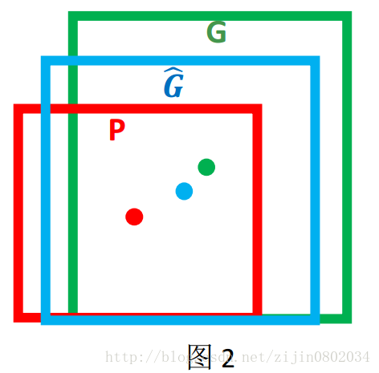

边框回归的目的既是：给定 `!$(P_x,P_y,P_w,P_h)$` 寻找一种映射 `!$f$`， 使得 `!$f(P_x,P_y,P_w,P_h)=(\hat G_x,\hat G_y,\hat G_w,\hat G_h)$`  并且 `!$(\hat G_x,\hat G_y,\hat G_w,\hat G_h)\approx (G_x,G_y,G_w,G_h)$`

###### 2.5.2、边框回归怎么做的？
那么经过何种变换才能从图 2 中的窗口 P 变为窗口 `!$\hat G$` 呢？ 比较简单的思路就是: 平移+尺度放缩：

 1. 先做平移 `!$(\Delta x,\Delta y)， \Delta x=P_w d_x(P),\Delta y=P_h d_y(P) $`，这是R-CNN论文的：
```mathjax!
$$
\hat G_x = P_w d_x(P) + P_x \ \ \ \ \ \ \  \text(1)  \\
\hat G_y= P_h d_y(P) + P_y  \ \ \ \ \ \ \  \text(2)
$$
```

 2. 然后再做尺度缩放 `!$(S_w,S_h), S_w=exp(d_w(P)),S_h=exp(d_h(P))$`，对应论文中：
```mathjax!
$$
\hat G_w= P_w exp(d_w(P) ) \ \ \ \ \ \ \  \text(3)  \\
\hat G_h= P_h exp(d_h(P) ) \ \ \ \ \ \ \  \text(4)
$$
```

观察(1)-(4)我们发现， 边框回归学习就是 `!$d_x(P),d_y(P),d_w(P),d_h(P)$` 这四个变换。下一步就是设计算法那得到这四个映射。

线性回归就是给定输入的特征向量 X, 学习一组参数 W, 使得经过线性回归后的值跟真实值 Y(Ground Truth)非常接近. 即 `!$Y\approx WX $`。 那么 Bounding-box 中我们的输入以及输出分别是什么呢？

<p style="font-size:160%;font-weight:bold">Input:</p>

`!$\text{RegionProposal}→P=(P_x,P_y,P_w,P_h)$`，这个是什么？ 输入就是这四个数值吗？其实真正的输入是这个窗口对应的 CNN 特征，也就是 R-CNN 中的 Pool5 feature（特征向量）。 (注：训练阶段输入还包括 Ground Truth， 也就是下边提到的 `!$t_∗=(t_x,t_y,t_w,t_h)$`

<p style="font-size:160%;font-weight:bold">Output:</p>

需要进行的平移变换和尺度缩放 `!$d_x(P),d_y(P),d_w(P),d_h(P)$`， 或者说是 `!$\Delta x,\Delta y,S_w,S_h$` 。 我们的最终输出不应该是 Ground Truth 吗？ 是的， 但是有了这四个变换我们就可以直接得到 Ground Truth， 这里还有个问题， 根据(1)~(4)我们可以知道， P 经过 `!$d_x(P),d_y(P),d_w(P),d_h(P)$` 得到的并不是真实值 G， 而是预测值 `!$\hat G$`。 的确， 这四个值应该是经过 Ground Truth 和 Proposal 计算得到的真正需要的平移量 `!$(tx,ty)$` 和尺度缩放`!$(tw,th)$` 。 这也就是 R-CNN 中的(6)~(9)： 
```mathjax!
$$
t_x = (G_x - P_x) / P_w \ \ \ \ \  (6)  \\
t_y = (G_y - P_y) / P_h \ \ \ \ \ \  (7)  \\
t_w = \log (G_w / P_w) \ \ \ \ \ \ \ \  (8)  \\
t_h = \log(G_h / P_h) \ \ \ \ \ \ \ \ \   (9)
$$
```
那么目标函数可以表示为 `!$d_∗(P)=w^T_∗\Phi_5(P)$`， `!$\Phi_5(P)$` 是输入 Proposal 的特征向量，`!$w_*$` 是要学习的参数（\*表示 x,y,w,h， 也就是每一个变换对应一个目标函数） ,`!$ d_∗(P)$` 是得到的预测值。 我们要让预测值跟真实值 `!$t_∗=(t_x,t_y,t_w,t_h)$` 差距最小， 得到损失函数为：
```mathjax!
$$
Loss = \sum_i^N(t_*^i - \hat w_*^T\phi_5(P^i))^2
$$
```
函数优化目标为：
```mathjax!
$$
W_* = argmin_{w_*} \sum_i^N(t_*^i - \hat w_*^T\phi_5(P^i))^2 + \lambda || \hat w_*||^2
$$
```
利用梯度下降法或者最小二乘法就可以得到 `!$w_∗$`。

###### 2.5.3、为什么宽高尺度会设计这种形式？
为什么设计的 `!$t_x,t_y$` 为什么除以宽高，为什么 `!$t_w,t_h$` 会有log形式？

首先CNN具有尺度不变性:

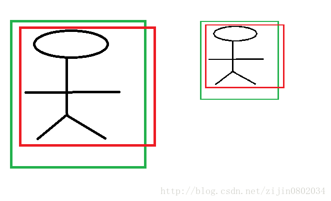

**x,y 坐标除以宽高**
上图的两个人具有不同的尺度，因为他都是人，我们得到的特征相同。假设我们得到的特征为 `!$\Phi_1,\Phi_2$`，那么一个完好的特征应该具备 `!$\Phi_1 = \Phi$`。如果我们直接学习坐标差值，以 x 坐标为例，`!$x_i,p_i$` 分别代表第 i 个框的x坐标，学习到的映射为 `!$f$` , `!$f(\Phi_1)=x_1−p_1$`，同理`!$f(\Phi_2)=x_2−p_2$`。从上图显而易见，`!$x_1−p_1\neq x_2−p_1$`。也就是说同一个 x 对应多个 y，这明显不满足函数的定义。边框回归学习的是回归函数，然而你的目标却不满足函数定义，当然学习不到什么。

**宽高坐标Log形式**
我们想要得到一个放缩的尺度，也就是说这里限制尺度必须大于 0。我们学习的 `!$t_w,t_h$`怎么保证满足大于 0 呢？直观的想法就是EXP函数，如公式(3), (4)所示，那么反过来推导就是Log函数的来源了。

###### 2.5.4、为什么IoU较大，认为是线性变换？
当输入的 Proposal 与 Ground Truth 相差较小时(RCNN 设置的是 `!$IoU > 0.6$`)， 可以认为这种变换是一种线性变换， 那么我们就可以用线性回归来建模对窗口进行微调， 否则会导致训练的回归模型不 work（当 Proposal跟 GT 离得较远，就是复杂的非线性问题了，此时用线性回归建模显然不合理）。

Log函数明显不满足线性函数，但是为什么当Proposal 和Ground Truth相差较小的时候，就可以认为是一种线性变换呢？
```mathjax!
$$
lim_{x=0}log(1+x) = x
$$
```
现在回过来看公式(8):
```mathjax!
$$
t_w = \log (G_w / P_w) = log(\frac{G_w + P_w - P_w}{P_w}) = log(1 + \frac{G_w-P_w}{P_w})
$$
```
当且仅当 `!$G_w−P_w=0$` 的时候，才会是线性函数，也就是宽度和高度必须近似相等。

### 3、结果
论文发表的2014年，DPM已经进入瓶颈期，即使使用复杂的特征和结构得到的提升也十分有限。本文将深度学习引入检测领域，一举将PASCAL VOC上的检测率从 35.1% 提升到 53.7%。 

## 二、Fast R-CNN
**论文：Fast R-CNN          ——        Microsoft Research**

### 1、解决的问题
Fast R-CNN方法解决了R-CNN的三个问题：

 1. R-CNN网络训练、测试速度都很慢：R-CNN网络中，一张图经由selective search算法提取约2k个建议框【这2k个建议框大量重叠】，而所有建议框变形后都要输入AlexNet CNN网络提取特征【即约2k次特征提取】，会出现上述重叠区域多次重复提取特征，提取特征操作冗余；

 2. R-CNN网络训练、测试繁琐：R-CNN网络训练过程分为ILSVRC 2012样本下有监督预训练、PASCAL VOC 2007该特定样本下的微调、20类即21个SVM分类器训练、20类即20个Bounding-box回归器训练，该训练流程繁琐复杂；同理测试过程也包括提取建议框、提取CNN特征、SVM分类和Bounding-box回归等步骤，过于繁琐；

 3. R-CNN网络训练需要大量存储空间：20类即21个SVM分类器和20类即20个Bounding-box回归器在训练过程中需要大量特征作为训练样本，这部分从CNN提取的特征会占用大量存储空间；

 4. R-CNN网络需要对建议框进行形变操作后【形变为227×227 size】再输入CNN网络提取特征，其实像AlexNet CNN等网络在提取特征过程中对图像的大小并无要求，只是在提取完特征进行全连接操作的时候才需要固定特征尺寸【R-CNN中将输入图像形变为227×227可正好满足AlexNet CNN网络最后的特征尺寸要求】，然后才使用SVM分类器分类，R-CNN需要进行形变操作的问题在Fast R-CNN已经不存在。

### 2、算法流程
Fast R-CNN对R-CNN的改进之处：

 1. 规避R-CNN中冗余的特征提取操作，只对整张图像全区域进行一次特征提取；
 
 2. 用RoI pooling层取代最后一层max pooling层，同时引入建议框信息，提取相应建议框特征；

 3. Fast  R-CNN网络末尾采用并行的不同的全连接层，可同时输出分类结果和窗口回归结果，实现了end-to-end的多任务训练【建议框提取除外】，也不需要额外的特征存储空间【R-CNN中这部分特征是供SVM和Bounding-box regression进行训练的】；

 4. 采用SVD对Fast R-CNN网络末尾并行的全连接层进行分解，减少计算复杂度，加快检测速度。

Fast R-CNN是端到端（end-to-end）的。


&nbsp;&nbsp;&nbsp;&nbsp;图中省略了通过 ss 获得proposal的过程，第一张图中红框里的内容即为通过ss提取到的proposal，中间的一块是经过深度卷积之后得到的conv feature map，图中灰色的部分就是我们红框中的proposal对应于conv feature map中的位置，之后对这个特征经过ROI pooling layer处理，之后进行全连接。在这里得到的ROI feature vector最终被分享，一个进行全连接之后用来做softmax回归，用来进行分类，另一个经过全连接之后用来做bbox回归。

>注意： 对中间的Conv feature map进行特征提取。每一个区域经过RoI pooling layer和FC layers得到一个 “固定长度” 的feature vector(这里需要注意的是，输入到后面RoI pooling layer的feature map是在Conv feature map上提取的，故整个特征提取过程，只计算了一次卷积。虽然在最开始也提取出了大量的RoI，但他们还是作为整体输入进卷积网络的，最开始提取出的RoI区域只是为了最后的Bounding box 回归时使用，用来输出原图中的位置)。

### 3、网络模型

#### 3.1、基本网络

图像归一化为 224×224 后直接送入网络。前五阶段是基础的conv+relu+pooling形式，在第五阶段结尾，输入P个候选区域（图像序号×1 + 几何位置×4，序号用于训练）。

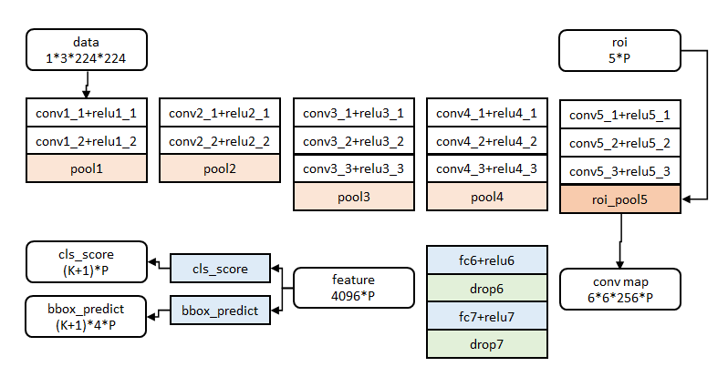

>注：文中给出了大中小三种网络，此处示出最大的一种。三种网络基本结构相似，仅conv+relu层数有差别，或者增删了norm层。

#### 3.2、SPP layer

根据pooling规则，每个pooling bin（window）对应一个输出，所以最终pooling后特征输出由bin的个数来决定。本文就是分级固定bin的个数，调整bin的尺寸来实现多级pooling固定输出。

如图所示，layer-5的unpooled FM维数为16\*24，按照图中所示分为3级，

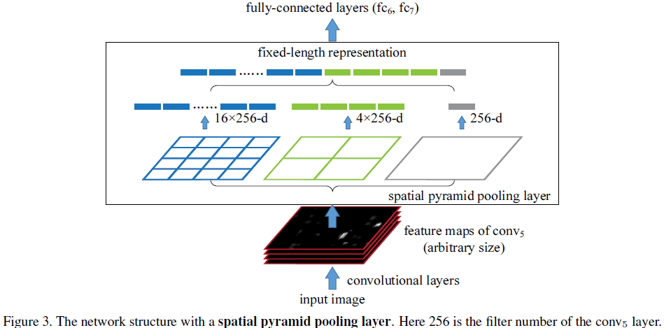

- 第一级bin个数为1，最终对应的window大小为16*24；
- 第二级bin个数为4个，最终对应的window大小为4*8
- 第三级bin个数为16个，最终对应的window大小为1*1.5（小数需要舍入处理）

通过融合各级bin的输出，最终每一个unpooled FM经过SPP处理后，得到了 1+4+16 维的SPPed FM输出特征，经过融合后输入分类器。这样就可以在任意输入size和scale下获得固定的输出；不同scale下网络可以提取不同尺度的特征，有利于分类。

#### 3.3、RoI pooling layer
每一个RoI都有一个四元组 `!$(r,c,h,w)$` 表示，其中`!$(r,c)$`表示左上角，而 `!$(h,w)$` 则代表高度和宽度。这一层使用最大池化（max pooling）来将RoI区域转化成固定大小的HW的特征图。假设一个RoI的窗口大小为 `!$h\times w$`，则转换成 `!$H\times W$` 之后，每一个网格都是一个 `!$h/H * w/W$` 大小的子网，利用最大池化将这个子网中的值映射到 `!$H\times W$` 窗口即可。Pooling对每一个特征图通道都是独立的，这是SPP layer的特例，即只有一层的空间金字塔。

#### 3.4、分类器与回归器
分类器和回归器的输入为RoI池化输出的固定大小向量经过两层全连接层后产生的特征向量，分类器用于判断物品属于哪一类（类别+背景），回归器用于计算4个调整因子，调整因子部分内容见RCNN笔记。

### 4、测试过程
Fast R-CNN的网络结构如下图所示：


 1. 任意size图片输入CNN网络，经过若干卷积层与池化层，得到特征图；

 2. 在任意size图片上采用selective search算法提取约2k个建议框；

 3. 根据原图中建议框到特征图映射关系，在特征图中找到每个建议框对应的特征框【深度和特征图一致】，并在RoI池化层中将每个特征框池化到 `!$H\times W$`【VGG-16网络是7×7】的size；

 4. 固定 `!$H\times W$`【VGG-16网络是7×7】大小的特征框经过全连接层得到固定大小的特征向量；

 5. 第4步所得特征向量经由各自的全连接层【由SVD分解实现】，分别得到两个输出向量：一个是softmax的分类得分，一个是Bounding-box窗口回归；

 6. 利用窗口得分分别对每一类物体进行非极大值抑制剔除重叠建议框，最终得到每个类别中回归修正后的得分最高的窗口。

<p style="font-size:160%;font-weight:bold">解释分析：</p>

**1、整个测试过程为什么可以只进行一次CNN特征提取操作？** 
先看R-CNN网络，它首先采用selective search算法提取约 2k 个建议框，并对所有建议框都进行了CNN特征提取操作，会出现重叠区域多次重复提取特征，这些操作非常耗时、耗空间。事实上我们并不需要对每个建议框都进行CNN特征提取操作，只需要对原始的整张图片进行 1 次CNN特征提取操作即可，因为selective search算法提取的建议框属于整张图片，因此对整张图片提取出特征图后，再找出相应建议框在特征图中对应的区域，这样就可以避免冗余的特征提取操作，节省大量时间。

**2、为什么要将每个建议框对应的特征框池化到  `!$H\times W$` 的size？如何实现？** 
问题4中已经指出像AlexNet CNN等网络在提取特征过程中对图像的大小并无要求，只是在提取完特征进行全连接操作的时候才需要固定特征尺寸，利用这一点，Fast R-CNN可输入任意size 图片，并在全连接操作前加入RoI池化层，将建议框对应特征图中的特征框池化到  `!$H\times W$` 的size，以便满足后续操作对size的要求；

具体如何实现呢? 
首先假设建议框对应特征图中的特征框大小为h×w，将其划分  `!$H\times W$` 个子窗口，每个子窗口大小为`!$h/H\times w/W$`，然后对每个子窗口采用max pooling下采样操作，每个子窗口只取一个最大值，则特征框最终池化为  `!$H\times W$` 的size【特征框各深度同理】，这将各个大小不一的特征框转化为大小统一的数据输入下一层。

**3、为什么要采用SVD分解实现Fast R-CNN网络中最后的全连接层？具体如何实现？**
图像分类任务中，用于卷积层计算的时间比用于全连接层计算的时间多，而在目标检测任务中，selective search算法提取的建议框比较多【约2k】，几乎有一半的前向计算时间被花费于全连接层，就Fast R-CNN而言，RoI池化层后的全连接层需要进行约 2k 次【每个建议框都要计算】，因此在Fast R-CNN中可以采用SVD分解加速全连接层计算；

具体如何实现呢? 
① 物体分类和窗口回归都是通过全连接层实现的，假设全连接层输入数据为 x，输出数据为 y，全连接层参数为 W，尺寸为 `!$u\times v$`，那么该层全连接计算为:

计算复杂度为 `!$u\times v$`；

② 若将W进行SVD分解，并用前t个特征值近似代替，即:
那么原来的前向传播分解成两步:
计算复杂度为 `!$u\times t + v\times t$`，若，则这种分解会大大减少计算量；

&nbsp;&nbsp;&nbsp;&nbsp;在实现时，相当于把一个全连接层拆分为两个全连接层，第一个全连接层不含偏置，第二个全连接层含偏置；实验表明，SVD分解全连接层能使mAP只下降0.3%的情况下提升30%的速度，同时该方法也不必再执行额外的微调操作。


### 5、训练过程
#### 5.1、有监督预训练

##### 5.1.1、参数初始化
（1）、网络除去末尾部分（即backbone）如下图，在ImageNet上训练 1000 类分类器。结果参数作为相应层的初始化参数。其余参数随机初始化。

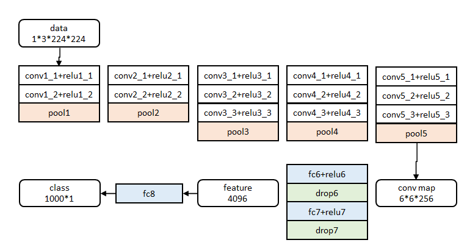

（2）、从预训练的网络中初始化数据
有三种预训练的网络：CaffeNet，VGG_CNN_M_1024，VGG-16，他们都有5个最大池化层和5到13个不等的卷积层。用他们来初始化Fast R-CNN时，需要修改三处：
- ①最后一个池化层被RoI pooling layer取代
- ②最后一个全连接层和softmax被替换成之前介绍过的两个兄弟并列层
- ③网络输入两组数据：一组图片和那些图片的一组RoIs

##### 5.1.2、roi_pool层的训练(backward)
首先考虑普通max pooling层。设 `!$x_i$` 为输入层的节点，`!$y_j$` 为输出层的节点。
```mathjax!
$$
\frac{\partial L}{\partial x_i}=\begin{cases} 0 & \delta(i,j)=false \\
\frac{\partial L}{\partial y_i} & \delta(i,j)=true \end{cases}
$$
```
其中判决函数 `!$\delta(i,j)$` 表示 i 节点是否被 j 节点选为最大值输出。不被选中有两种可能：`!$x_i$` 不在 `!$y_j$` 范围内，或者 `!$x_i$` 不是最大值。

对于roi max pooling，一个输入节点可能和多个输出节点相连。设 `!$x_i$` 为输入层的节点，`!$y_{rj}$` 为第 `!$r$` 个候选区域的第 `!$j$` 个输出节点。


```mathjax!
$$
\frac{\partial L}{\partial x_i}=\sum_{r,j} \delta(i,r,j)\frac{\partial L}{\partial y_{rj}}
$$
```
判决函数 `!$\delta(i,r,j)$` 表示 `!$i$` 节点是否被候选区域 `!$r$` 的第 `!$j$` 个节点选为最大值输出。代价对于 `!$x_i$` 的梯度等于所有相关的后一层梯度之和。

##### 5.1.3、分类与位置调整
###### 5.1.3.1、数据结构
第五阶段的特征输入到两个并行的全连层中（称为multi-task）。

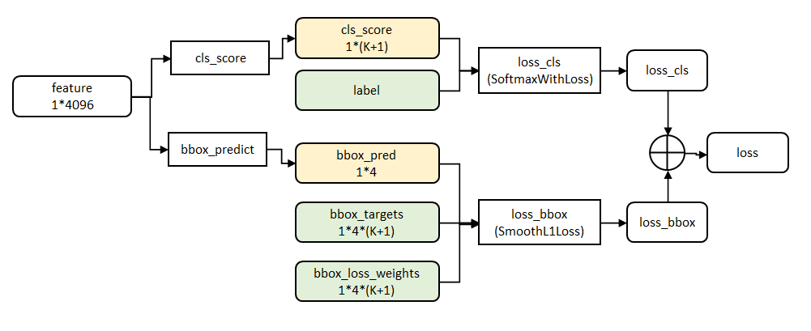

>cls_score层用于分类，输出 `!$K+1$` 维数组p，表示属于 K 类和背景的概率。
bbox_prdict层用于调整候选区域位置，输出 `!$4\times K$` 维数组 t，表示分别属于 K 类时，应该平移缩放的参数。

###### 5.1.3.2、代价函数
loss_cls层评估分类代价。由真实分类 `!$u$` 对应的概率决定：
```mathjax!
$$
L_{cls} = −log\ p_u
$$
```
loss_bbox评估检测框定位代价。比较真实分类对应的预测参数 `!$t^u$` 和真实平移缩放参数为 v 的差别：
```mathjax!
$$
L_{loc}=Σ^4_{i=1} g(t^u_i−v_i)
$$
```
g为Smooth L1误差，对outlier不敏感：
```mathjax!
$$
g(x)= \begin{cases}0.5x^2 & |x|<1 \\
|x|−0.5 & otherwise \end{cases}
$$
```
总代价为两者加权和，如果分类为背景则不考虑定位代价：
```mathjax!
$$
L= \begin{cases} L_{cls}+λL_{loc} & u\text{为前景} \\
L_{cls} & u\text{为背景} \end{cases}
$$
```
>源码中bbox_loss_weights用于标记每一个bbox是否属于某一个类

###### 5.1.3.3、全连接层提速
分类和位置调整都是通过全连接层(fc)实现的，设前一级数据为 x 后一级为 y，全连接层参数为W，尺寸`!$u×v$`。一次前向传播(forward)即为：
```mathjax!
$$
y=Wx
$$
```
计算复杂度为`!$u×v$`。
将W进行SVD分解，并用前 t 个特征值近似：
```mathjax!
$$
W=U\sum V^T \approx U(:,1:t)⋅\sum (1:t,1:t)⋅V(:,1:t)^T
$$
```
原来的前向传播分解成两步：
```mathjax!
$$
y=Wx=U⋅(\sum ⋅V^T)⋅x=U⋅z
$$
```
计算复杂度变为 `!$u×t+v×t$`。
在实现时，相当于把一个全连接层拆分成两个，中间以一个低维数据相连。

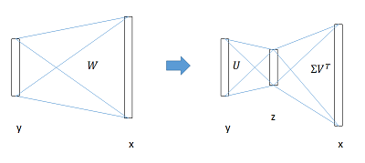

>在github的源码中，这部分似乎没有实现。


#### 5.2、特定样本下的微调

&nbsp;&nbsp;&nbsp;&nbsp;使用BP算法训练网络是Fast R-CNN的重要能力，前面已经说过，SPP-net不能微调spp层之前的层，主要是因为当每一个训练样本来自于不同的图片时，经过SPP层的BP算法是很低效的（感受野太大）. Fast R-CNN提出SGD mini_batch分层取样的方法：首先随机取样N张图片，然后每张图片取样R/N个RoIs e.g. N=2 and R=128 除了分层取样，还有一个就是FRCN在一次微调中联合优化softmax分类器和bbox回归，看似一步，实际包含了多任务损失（multi-task loss）、小批量取样（mini-batch sampling）、RoI pooling层的反向传播（backpropagation through RoI pooling layers）、SGD超参数（SGD hyperparameters）。

##### 5.2.1、分层数据
在调优训练时，每一个mini-batch中首先加入N张完整图片，而后加入从 N 张图片中选取的 R 个候选框。这 R 个候选框可以复用 N 张图片前5个阶段的网络特征。

>实际选择N=2， R=128。

##### 5.2.2、训练数据构成
N张完整图片以50%概率水平翻转。
R个候选框的构成方式如下：

| 类别 |	比例 | 方式 |
| --- | --- | --- |
| 前景 |	25% |	与某个真值重叠在 \[0.5,1] 的候选框 |
| 背景 |	75% |	与真值重叠的最大值在 \[0.1,0.5) 的候选框 |

### 6、实验与结论

- 网络末端同步训练的分类和位置调整，提升准确度
- 使用多尺度的图像金字塔，性能几乎没有提高
- 倍增训练数据，能够有2%-3%的准确度提升
- 网络直接输出各类概率(softmax)，比SVM分类器性能略好
- 更多候选窗不能提升性能

## 三、Faster R-CNN

经过R-CNN和Fast RCNN的积淀，Ross B. Girshick在2016年提出了新的Faster RCNN，在结构上，Faster RCNN已经将特征抽取(feature extraction)，proposal提取，bounding box regression(rect refine)，classification都整合在了一个网络中，使得综合性能有较大提高，在检测速度方面尤为明显。

### 1、网络结构

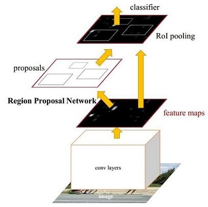

如图1，Faster RCNN其实可以分为4个主要内容：

1. Conv layers。作为一种CNN网络目标检测方法，Faster RCNN首先使用一组基础的conv+relu+pooling层提取image的feature maps。该feature maps被共享用于后续RPN层和全连接层。
2. Region Proposal Networks。RPN网络用于生成region proposals。该层通过softmax判断anchors属于positive或者negative，再利用bounding box regression修正anchors获得精确的proposals。
3. Roi Pooling。该层收集输入的feature maps和proposals，综合这些信息后提取proposal feature maps，送入后续全连接层判定目标类别。
4. Classification。利用proposal feature maps计算proposal的类别，同时再次bounding box regression获得检测框最终的精确位置。

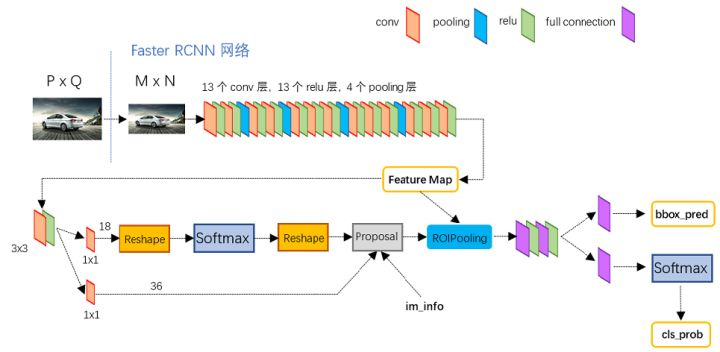

图2展示了python版本中的VGG16模型中的faster_rcnn_test.pt的网络结构，可以清晰的看到该网络对于一副任意大小PxQ的图像，首先缩放至固定大小MxN，然后将MxN图像送入网络；而Conv layers中包含了 13个conv层+13 个relu层+4个pooling层；RPN网络首先经过 3x3 卷积，再分别生成positive anchors和对应bounding box regression偏移量，然后计算出proposals；而Roi Pooling层则利用proposals从feature maps中提取proposal feature送入后续全连接和softmax网络作classification（即分类proposal到底是什么object）。

### 2、Conv layers

Conv layers包含了conv，pooling，relu三种层。以python版本中的VGG16模型中的faster_rcnn_test.pt的网络结构为例，如图2，Conv layers部分共有13个conv层，13个relu层，4个pooling层。这里有一个非常容易被忽略但是又无比重要的信息，在Conv layers中：

1. 所有的conv层都是：kernel_size=3，pad=1，stride=1
2. 所有的pooling层都是：kernel_size=2，pad=1，stride=1

为何重要？在Faster RCNN Conv layers中对所有的卷积都做了扩边处理（ pad=1，即填充一圈0），导致原图变为 (M+2)x(N+2)大小，再做3x3卷积后输出MxN 。正是这种设置，导致Conv layers中的conv层不改变输入和输出矩阵大小。如图3：

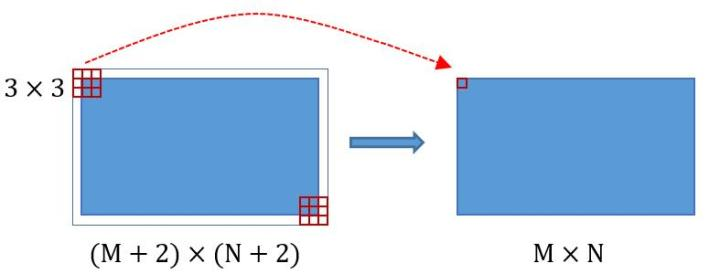

类似的是，Conv layers中的pooling层kernel_size=2，stride=2。这样每个经过pooling层的MxN矩阵，都会变为(M/2)x(N/2)大小。综上所述，在整个Conv layers中，conv和relu层不改变输入输出大小，只有pooling层使输出长宽都变为输入的1/2。

那么，一个MxN大小的矩阵经过Conv layers固定变为(M/16)x(N/16)！这样Conv layers生成的feature map中都可以和原图对应起来。

### 3、Region Proposal Networks(RPN)
经典的检测方法生成检测框都非常耗时，如OpenCV adaboost使用滑动窗口+图像金字塔生成检测框；或如R-CNN使用SS(Selective Search)方法生成检测框。而Faster RCNN则抛弃了传统的滑动窗口和SS方法，直接使用RPN生成检测框，这也是Faster R-CNN的巨大优势，能极大提升检测框的生成速度。

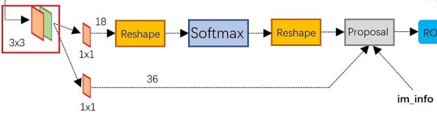

上图4展示了RPN网络的具体结构。可以看到RPN网络实际分为2条线，上面一条通过softmax分类anchors获得positive和negative分类，下面一条用于计算对于anchors的bounding box regression偏移量，以获得精确的proposal。而最后的Proposal层则负责综合positive anchors和对应bounding box regression偏移量获取proposals，同时剔除太小和超出边界的proposals。其实整个网络到了Proposal Layer这里，就完成了相当于目标定位的功能。

#### 3.1、多通道图像卷积基础知识介绍
在介绍RPN前，还要多解释几句基础知识：

1. 对于单通道图像+单卷积核做卷积，第一章中的图3已经展示了；
2. 对于多通道图像+多卷积核做卷积，计算方式如下：

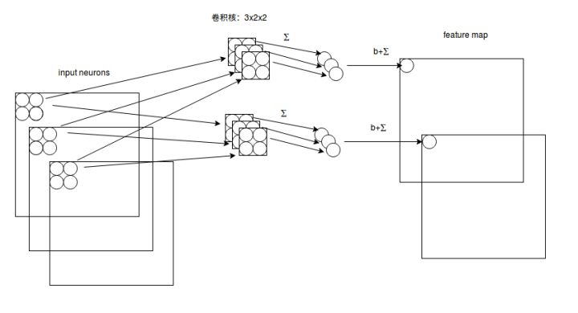

如图5，输入有3个通道，同时有2个卷积核。对于每个卷积核，先在输入3个通道分别作卷积，再将3个通道结果加起来得到卷积输出。所以对于某个卷积层，无论输入图像有多少个通道，输出图像通道数总是等于卷积核数量！

对多通道图像做1x1卷积，其实就是将输入图像于每个通道乘以卷积系数后加在一起，即相当于把原图像中本来各个独立的通道“联通”在了一起。

#### 3.2、anchors
提到RPN网络，就不能不说anchors。所谓anchors，实际上就是一组由rpn/generate_anchors.py生成的矩形。直接运行作者demo中的generate_anchors.py可以得到以下输出：
```
[[ -84.  -40.   99.   55.]
 [-176.  -88.  191.  103.]
 [-360. -184.  375.  199.]
 [ -56.  -56.   71.   71.]
 [-120. -120.  135.  135.]
 [-248. -248.  263.  263.]
 [ -36.  -80.   51.   95.]
 [ -80. -168.   95.  183.]
 [-168. -344.  183.  359.]]
 ```
其中每行的4个值 `!$(x_1,y_1,x_2,y_2)$` 表矩形左上和右下角点坐标。9个矩形共有3种形状，长宽比为大约为 `!$width:height\in \{1:1,1:2,2:1\}$` 三种，如图6。实际上通过anchors就引入了检测中常用到的多尺度方法。

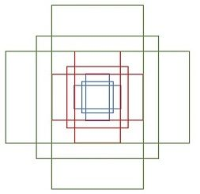

>注：关于上面的anchors size，其实是根据检测图像设置的。在python demo中，会把任意大小的输入图像reshape成800x600（即图2中的M=800，N=600）。再回头来看anchors的大小，anchors中长宽1:2中最大为352x704，长宽2:1中最大736x384，基本是cover了800x600的各个尺度和形状。

那么这9个anchors是做什么的呢？借用Faster RCNN论文中的原图，如图7，遍历Conv layers计算获得的feature maps，为每一个点都配备这9种anchors作为初始的检测框。这样做获得检测框很不准确，不用担心，后面还有2次bounding box regression可以修正检测框位置。

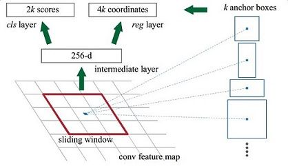

解释一下上面这张图的数字。

1. 在原文中使用的是ZF model中，其Conv Layers中最后的conv5层num_output=256，对应生成256张特征图，所以相当于feature map每个点都是256-dimensions
2. 在conv5之后，做了rpn_conv/3x3卷积且num_output=256，相当于每个点又融合了周围3x3的空间信息（猜测这样做也许更鲁棒？反正我没测试），同时256-d不变（如图4和图7中的红框）
3. 假设在conv5 feature map中每个点上有k个anchor（默认k=9），而每个anhcor要分positive和negative，所以每个点由256d feature转化为cls=2k scores；而每个anchor都有(x, y, w, h)对应4个偏移量，所以reg=4k coordinates
4. 补充一点，全部anchors拿去训练太多了，训练程序会在合适的anchors中随机选取128个postive anchors+128个negative anchors进行训练（什么是合适的anchors下文5.1有解释）

>注意，在本文讲解中使用的VGG conv5 num_output=512，所以是512d，其他类似。

**其实RPN最终就是在原图尺度上，设置了密密麻麻的候选Anchor。然后用cnn去判断哪些Anchor是里面有目标的positive anchor，哪些是没目标的negative anchor。所以，仅仅是个二分类而已！**

那么Anchor一共有多少个？原图800x600，VGG下采样16倍，feature map每个点设置9个Anchor，所以：
```mathjax!
$$
ceil(800/16)\times ceil(600/16) \times 9 = 50 \times 38 \times 9 = 17100
$$
```
其中ceil()表示向上取整，是因为VGG输出的feature map size= 50\*38。

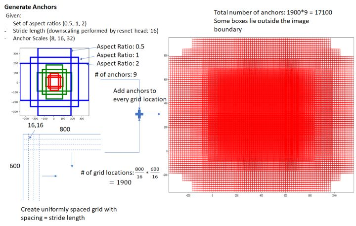

#### 3.3、softmax判定positive与negative
一副MxN大小的矩阵送入Faster RCNN网络后，到RPN网络变为(M/16)x(N/16)，不妨设 W=M/16，H=N/16。在进入reshape与softmax之前，先做了1x1卷积，如图9：

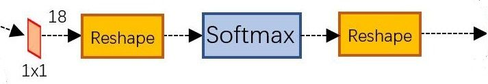

该1x1卷积的caffe prototxt定义如下：
```python
layer {
  name: "rpn_cls_score"
  type: "Convolution"
  bottom: "rpn/output"
  top: "rpn_cls_score"
  convolution_param {
    num_output: 18   # 2(positive/negative) * 9(anchors)
    kernel_size: 1 pad: 0 stride: 1
  }
}
```
可以看到其num_output=18，也就是经过该卷积的输出图像为WxHx18大小（注意第二章开头提到的卷积计算方式）。这也就刚好对应了feature maps每一个点都有9个anchors，同时每个anchors又有可能是positive和negative，所有这些信息都保存WxHx(9\*2)大小的矩阵。为何这样做？后面接softmax分类获得positive anchors，也就相当于初步提取了检测目标候选区域box（一般认为目标在positive anchors中）。

那么为何要在softmax前后都接一个reshape layer？其实只是为了便于softmax分类，至于具体原因这就要从caffe的实现形式说起了。在caffe基本数据结构blob中以如下形式保存数据：
```
blob=[batch_size, channel，height，width]
```
对应至上面的保存positive/negative anchors的矩阵，其在caffe blob中的存储形式为 \[1, 2x9, H, W]。而在softmax分类时需要进行positive/negative二分类，所以reshape layer会将其变为 \[1, 2, 9xH, W] 大小，即单独“腾空”出来一个维度以便softmax分类，之后再reshape回复原状。贴一段caffe softmax_loss_layer.cpp的reshape函数的解释，非常精辟：
```
"Number of labels must match number of predictions; "
"e.g., if softmax axis == 1 and prediction shape is (N, C, H, W), "
"label count (number of labels) must be N*H*W, "
"with integer values in {0, 1, ..., C-1}.";
```
综上所述，RPN网络中利用anchors和softmax初步提取出positive anchors作为候选区域（另外也有实现用sigmoid代替softmax，原理类似）。

#### 3.4、bounding box regression原理
如图9所示绿色框为飞机的Ground Truth(GT)，红色为提取的positive anchors，即便红色的框被分类器识别为飞机，但是由于红色的框定位不准，这张图相当于没有正确的检测出飞机。所以我们希望采用一种方法对红色的框进行微调，使得positive anchors和GT更加接近。

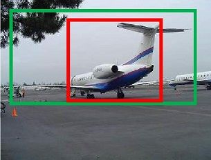

对于窗口一般使用四维向量 `!$(x,y,w,h)$` 表示，分别表示窗口的中心点坐标和宽高。对于图 11，红色的框A代表原始的positive Anchors，绿色的框G代表目标的GT，我们的目标是寻找一种关系，使得输入原始的anchor A经过映射得到一个跟真实窗口G更接近的回归窗口G'，即：

- 给定anchor `!$A = (A_x,A_y,A_w,A_h)$` 和 `!$GT = (G_x,G_y,G_w,G_h)$`。
- 寻找一种变换F，使得： `!$F(A_x,A_y,A_w,A_h) = (G_x',G_y',G_w',G_h')$`，其中 `!$(G_x',G_y',G_w',G_h') \approx (G_x,G_y,G_w,G_h)$`

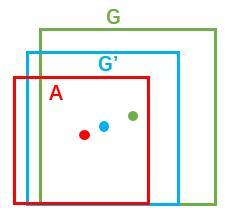

那么经过何种变换F才能从图10中的anchor A变为G'呢？ 比较简单的思路就是:

- 先做平移
```mathjax!
$$
G_x' = A_w \cdot d_x(A) + A_x \\
G_y' = A_h \cdot d_y(A) + A_y
$$
```
- 再做缩放
```mathjax!
$$
G_w' = A_w \cdot exp(d_w(A)) \\
G_h' = A_h \cdot exp(d_h(A))
$$
```
观察上面4个公式发现，需要学习的是 `!$d_x(A),d_y(A),d_w(A),d_h(A)$` 这四个变换。当输入的anchor A与GT相差较小时，可以认为这种变换是一种线性变换， 那么就可以用线性回归来建模对窗口进行微调（注意，只有当anchors A和GT比较接近时，才能使用线性回归模型，否则就是复杂的非线性问题了）。

接下来的问题就是如何通过线性回归获得 `!$d_x(A),d_y(A),d_w(A),d_h(A)$` 了。线性回归就是给定输入的特征向量 X, 学习一组参数 W, 使得经过线性回归后的值跟真实值 Y 非常接近，即 `!$Y = WX$`。对于该问题，输入 X 是cnn feature map，定义为 `!$\phi$`；同时还有训练传入 A 与 GT 之间的变换量，即 `!$(t_x,t_y,t_w,t_h)$`。输出是 `!$d_x(A),d_y(A),d_w(A),d_h(A)$` 四个变换。那么目标函数可以表示为：
```mathjax!
$$
d_*(A) = W^T_* \cdot \phi(A)
$$
```
其中 `!$\phi(A)$` 是对应anchor的feature map组成的特征向量， `!$W_*$` 是需要学习的参数， `!$d_*(A)$` 是得到的预测值（\*表示 x，y，w，h，也就是每一个变换对应一个上述目标函数）。为了让预测值 `!$d_*(A)$` 与真实值 `!$t_*$` 差距最小，设计L1损失函数：
```mathjax!
$$
Loss = \sum_t^N |t_*^i - W_*^T \cdot \phi(A^i)|
$$
```
函数优化目标为：
```mathjax!
$$
\hat{W}_* = argmin_{W_*} \sum_i^n|t^i_* - W_*^T \cdot \phi(A^i)| + \lambda||W_*||
$$
```
为了方便描述，这里以 L1损失为例介绍，而真实情况中一般使用soomth-L1损失。

需要说明，只有在GT与需要回归框位置比较接近时，才可近似认为上述线性变换成立。
说完原理，对应于Faster RCNN原文，positive anchor与ground truth之间的平移量 `!$(t_x,t_y)$` 与尺度因子 `!$(t_w,t_h)$` 如下：
```mathjax!
$$
t_x = (x - x_a) / w_a \ \ \ \ \ t_y = (x - y_a) / h_a  \\
t_w = log(w/w_a) \ \ \ \ \  t_h = log(h/h_a)
$$
```
对于训练bouding box regression网络回归分支，输入是cnn feature `!$\phi$`，监督信号是Anchor与GT的差距 `!$(t_x,t_y,t_w,t_h)$`，即训练目标是：输入 `!$\phi$` 的情况下使网络输出与监督信号尽可能接近。那么当bouding box regression工作时，再输入 `!$\phi$` 时，回归网络分支的输出就是每个Anchor的平移量和变换尺度 `!$(t_x,t_y,t_w,t_h)$`，显然即可用来修正Anchor位置了。

#### 3.5、对proposals进行bounding box regression
在了解bounding box regression后，再回头来看RPN网络第二条线路，如图12。

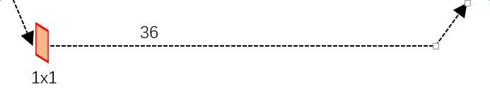

先来看一看上图11中1x1卷积的caffe prototxt定义：
```python
layer {
  name: "rpn_bbox_pred"
  type: "Convolution"
  bottom: "rpn/output"
  top: "rpn_bbox_pred"
  convolution_param {
    num_output: 36   # 4 * 9(anchors)
    kernel_size: 1 pad: 0 stride: 1
  }
}
```
可以看到其 num_output=36，即经过该卷积输出图像为 `!$W\times H\times 36$`，在caffe blob存储为 `!$[1, 4\times 9, H, W]$`，这里相当于feature maps每个点都有 9 个anchors，每个anchors又都有 4 个用于回归的变换量：
```mathjax!
$$
[d_x(A),d_y(A),d_w(A),d_h(A)]
$$,
```
回到图8，VGG输出 `!$50*38*512$` 的特征，对应设置 `!$50*38*k$` 个anchors，而RPN输出：

1. 大小为 `!$50*38*2k$` 的positive/negative softmax分类特征矩阵
2. 大小为 `!$50*38*4k$` 的regression坐标回归特征矩阵

恰好满足 RPN 完成 positive/negative 分类 +bounding box regression 坐标回归.

#### 3.6、Proposal Layer
Proposal Layer负责综合所有 `!$[d_x(A),d_y(A),d_w(A),d_h(A)]$` 变换量和positive anchors，计算出精准的proposal，送入后续RoI Pooling Layer。还是先来看看Proposal Layer的caffe prototxt定义：
```python
layer {
  name: 'proposal'
  type: 'Python'
  bottom: 'rpn_cls_prob_reshape'
  bottom: 'rpn_bbox_pred'
  bottom: 'im_info'
  top: 'rois'
  python_param {
    module: 'rpn.proposal_layer'
    layer: 'ProposalLayer'
    param_str: "'feat_stride': 16"
  }
}
```
Proposal Layer有3个输入：positive vs negative anchors分类器结果rpn_cls_prob_reshape，对应的bbox reg的 `!$[d_x(A),d_y(A),d_w(A),d_h(A)]$` 变换量rpn_bbox_pred，以及im_info；另外还有参数feat_stride=16，这和图4是对应的。
首先解释im_info。对于一副任意大小 `!$P\times Q$` 图像，传入Faster RCNN前首先reshape到固定`!$M\times N$`，im_info=`!$[M, N, \text{scale_factor}]$`则保存了此次缩放的所有信息。然后经过Conv Layers，经过4次pooling变为 `!$W \times H=(M/16)\times (N/16)$` 大小，其中 feature_stride=16 则保存了该信息，用于计算anchor偏移量。

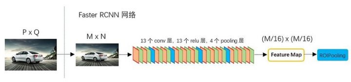

Proposal Layer forward（caffe layer的前传函数）按照以下顺序依次处理：

1. 生成anchors，利用 `!$[d_x(A),d_y(A),d_w(A),d_h(A)]$` 对所有的anchors做bbox regression回归（这里的anchors生成和训练时完全一致）。
2. 按照输入的positive softmax scores由大到小排序anchors，提取前pre_nms_topN(e.g. 6000)个anchors，即提取修正位置后的positive anchors。
3. 限定超出图像边界的positive anchors为图像边界（防止后续roi pooling时proposal超出图像边界）。
4. 剔除非常小（width<threshold or height<threshold）的positive anchors。
5. 进行nonmaximum suppression。
6. Proposal Layer有3个输入：positive和negative anchors分类器结果rpn_cls_prob_reshape，对应的bbox reg的(e.g. 300)结果作为proposal输出。

之后输出proposal=`!$[x1, y1, x2, y2]$`，注意，由于在第三步中将anchors映射回原图判断是否超出边界，所以这里输出的proposal是对应 `!$M\times N$` 输入图像尺度的，这点在后续网络中有用。另外我认为，严格意义上的检测应该到此就结束了，后续部分应该属于识别了。

>RPN网络结构总结起来就是：生成anchors -> softmax分类器提取positvie anchors -> bbox reg回归positive anchors -> Proposal Layer生成proposals

### 4、RoI pooling
而RoI Pooling层则负责收集proposal，并计算出proposal feature maps，送入后续网络。从图2中可以看到Rol pooling层有2个输入：

1. 原始的feature maps
2. RPN输出的proposal boxes（大小各不相同）

#### 4.1、为何需要RoI Pooling
先来看一个问题：对于传统的CNN（如AlexNet和VGG），当网络训练好后输入的图像尺寸必须是固定值，同时网络输出也是固定大小的vector or matrix。如果输入图像大小不定，这个问题就变得比较麻烦。有2种解决办法：

1. 从图像中crop一部分传入网络
2. 将图像warp成需要的大小后传入网络

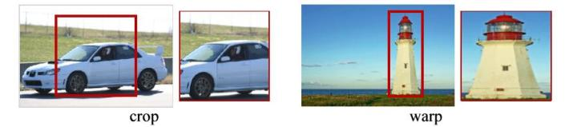

两种办法的示意图如图14，可以看到无论采取那种办法都不好，要么crop后破坏了图像的完整结构，要么warp破坏了图像原始形状信息。

回忆RPN网络生成的proposals的方法：对positive anchors进行bounding box regression，那么这样获得的proposals也是大小形状各不相同，即也存在上述问题。所以Faster R-CNN中提出了RoI Pooling解决这个问题。不过RoI Pooling确实是从[Spatial Pyramid Pooling](https://link.zhihu.com/?target=https%3A//arxiv.org/abs/1406.4729)发展而来，但是限于篇幅这里略去不讲，有兴趣的读者可以自行查阅相关论文。

#### 4.2、RoI Pooling原理
分析之前先来看看RoI Pooling Layer的caffe prototxt的定义：
```python
layer {
  name: "roi_pool5"
  type: "ROIPooling"
  bottom: "conv5_3"
  bottom: "rois"
  top: "pool5"
  roi_pooling_param {
    pooled_w: 7
    pooled_h: 7
    spatial_scale: 0.0625 # 1/16
  }
}
```
其中有新参数pooled_w和pooled_h，另外一个参数spatial_scale认真阅读的读者肯定已经知道知道用途。RoI Pooling layer forward过程：

- 由于proposal是对应 `!$M\times N$` 尺度的，所以首先使用spatial_scale参数将其映射回 `!$(M/16)\times (N/16)$` 大小的feature map尺度；
- 再将每个proposal对应的feature map区域水平分为 `!$pooled_w \times pooled_h$` 的网格；
- 对网格的每一份都进行max pooling处理。

这样处理后，即使大小不同的proposal输出结果都是 `!$pooled_w \times pooled_h$` 固定大小，实现了固定长度输出。

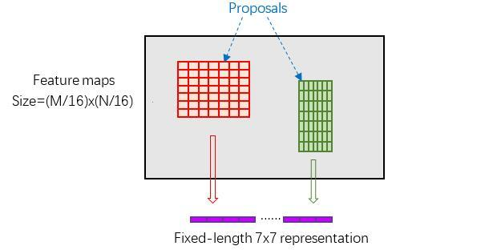

### 5、Classification
Classification部分利用已经获得的proposal feature maps，通过full connect层与softmax计算每个proposal具体属于那个类别（如人，车，电视等），输出cls_prob概率向量；同时再次利用bounding box regression获得每个proposal的位置偏移量bbox_pred，用于回归更加精确的目标检测框。Classification部分网络结构如图16。

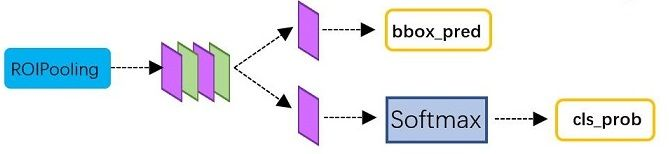

从RoI Pooling获取到 7x7=49 大小的proposal feature maps后，送入后续网络，可以看到做了如下2件事：

1. 通过全连接和softmax对proposals进行分类，这实际上已经是识别的范畴了
2. 再次对proposals进行bounding box regression，获取更高精度的rect box

这里来看看全连接层InnerProduct layers，简单的示意图如图17：


其计算公式如下：
```mathjax!
$$
\begin{pmatrix} x_1 & x_2 & x_3 \end{pmatrix} \begin{pmatrix} w_{11} & w_{12} \\ w_{21} & w_{22} \\ w_{31} & w_{32} \end{pmatrix} + \begin{pmatrix} b_1 & b_2 \end{pmatrix} = \begin{pmatrix} y_1 & y_2 \end{pmatrix}
$$
```
其中 W 和 bias B 都是预先训练好的，即大小是固定的，当然输入 X 和输出 Y 也就是固定大小。所以，这也就印证了之前Roi Pooling的必要性。到这里，我想其他内容已经很容易理解，不在赘述了。

### 6、Faster R-CNN训练
Faster R-CNN的训练，是在已经训练好的model（如VGG_CNN_M_1024，VGG，ZF）的基础上继续进行训练。实际中训练过程分为6个步骤：

1. 在已经训练好的model上，训练RPN网络，对应stage1_rpn_train.pt
2. 利用步骤1中训练好的RPN网络，收集proposals，对应rpn_test.pt
3. 第一次训练Fast RCNN网络，对应stage1_fast_rcnn_train.pt
4. 第二训练RPN网络，对应stage2_rpn_train.pt
5. 再次利用步骤4中训练好的RPN网络，收集proposals，对应rpn_test.pt
6. 第二次训练Fast RCNN网络，对应stage2_fast_rcnn_train.pt

可以看到训练过程类似于一种“迭代”的过程，不过只循环了2次。至于只循环了2次的原因是应为作者提到："A similar alternating training can be run for more iterations, but we have observed negligible improvements"，即循环更多次没有提升了。接下来本章以上述6个步骤讲解训练过程。

下面是一张训练过程流程图，应该更加清晰（图来源）。

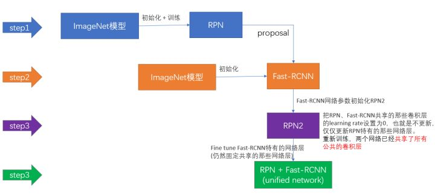

#### 6.1、训练RPN网络
在该步骤中，首先读取RBG提供的预训练好的model（本文使用VGG），开始迭代训练。来看看stage1_rpn_train.pt网络结构，如图19。


与检测网络类似的是，依然使用Conv Layers提取feature maps。整个网络使用的Loss如下：
```mathjax!
$$
L({p_i},{t_i}) = \frac{1}{N_{cls}}\sum_i L_{cls}(p_i,p_i^*) + \lambda \frac{1}{N_{reg}}\sum_i p_i^* L_{reg}(t_i,t_i^*)
$$
```
上述公式中 `!$i$` 表示anchors index， `!$p_i$` 表示positive softmax probability，`!$p_I^*$` 代表对应的GT predict概率（即当第i个anchor与GT间IoU>0.7，认为是该anchor是positive，`!$p_i^* = 1$`；反之IoU<0.3时，认为是该anchor是negative，`!$p_i^* = 0$`；至于那些0.3<IoU<0.7的anchor则不参与训练）；`!$t$` 代表predict bounding box，`!$t^*$` 代表对应positive anchor对应的GT box。可以看到，整个Loss分为2部分：

1. cls loss，即rpn_cls_loss层计算的softmax loss，用于分类anchors为positive与negative的网络训练
2. reg loss，即rpn_loss_bbox层计算的soomth L1 loss，用于bounding box regression网络训练。注意在该loss中乘了 `!$p_I^*$` ，相当于只关心positive anchors的回归（其实在回归中也完全没必要去关心negative）。

由于在实际过程中，`!$N_{cls}$` 和 `!$N_{reg}$` 差距过大，用参数 `!$\lambda$` 平衡二者（如 `!$N_{cls}=256$`，`!$N_{reg}=2400$` 时设置 `!$\lambda = \frac{N_{reg}}{N_{cls}}\approx 10$`），使总的网络Loss计算过程中能够均匀考虑2种Loss。这里比较重要是 `!$L_{reg}$` 使用的soomth L1 loss，计算公式如下：
```mathjax!
$$
L_{reg}(t_i,t_i^*) = \sum_{i \in {x,y,w,h}} smooth_{L1}(t_i - t_i^*) \\
soomth_{L1}(x) = \begin{cases} 0.5x^2 & if |x|\le 1 \\ |x| - 0.5 & otherwise \end{cases}
$$
```
了解数学原理后，反过来看图18：

1. 在RPN训练阶段，rpn-data（python AnchorTargetLayer）层会按照和test阶段Proposal层完全一样的方式生成Anchors用于训练
2. ，输入的rpn_cls_scors_reshape和rpn_labels分别对应 `!$p$` 与 `!$p^*$` ，`!$N_{cls}$` 参数隐含在`!$p$` 与 `!$p^*$` 的caffe blob的大小中
3. 对于rpn_loss_bbox，输入的rpn_bbox_pred和rpn_bbox_targets分别对应 `!$t$` 与 `!$t^*$` ，rpn_bbox_inside_weigths对应 `!$p^*$`，rpn_bbox_outside_weigths未用到（从soomth_L1_Loss layer代码中可以看到），而 `!$N_{reg}$` 同样隐含在caffe blob大小中

这样，公式与代码就完全对应了。特别需要注意的是，在训练和检测阶段生成和存储anchors的顺序完全一样，这样训练结果才能被用于检测！

#### 6.2、通过训练好的RPN网络收集proposals
在该步骤中，利用之前的RPN网络，获取proposal rois，同时获取positive softmax probability，如图20，然后将获取的信息保存在python pickle文件中。该网络本质上和检测中的RPN网络一样，没有什么区别。

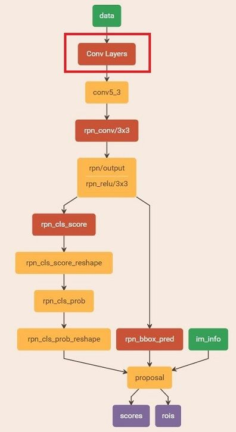

#### 6.3、训练Faster RCNN网络
读取之前保存的pickle文件，获取proposals与positive probability。从data层输入网络。然后：

1. 将提取的proposals作为rois传入网络，如图21蓝框
2. 计算bbox_inside_weights+bbox_outside_weights，作用与RPN一样，传入soomth_L1_loss layer，如图21绿框

这样就可以训练最后的识别softmax与最终的bounding box regression了。

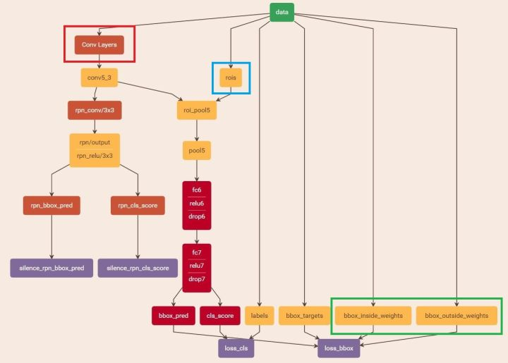

之后的stage2训练都是大同小异，不再赘述了。Faster R-CNN还有一种end-to-end的训练方式，可以一次完成train，有兴趣请自己看作者GitHub吧。

### 7、Questions and Answer
#### 7.1、为什么Anchor坐标中有负数
回顾anchor生成步骤：首先生成9个base anchor，然后通过坐标偏移在 `!$50*38$` 大小的 `!$\frac{1}{16}$` 下采样FeatureMap每个点都放上这9个base anchor，就形成了 `!$50*38*k$` 个anhcors。至于这9个base anchor坐标是什么其实并不重要，不同代码实现也许不同。

显然这里面有一部分边缘anchors会超出图像边界，而真实中不会有超出图像的目标，所以会有clip anchor步骤。

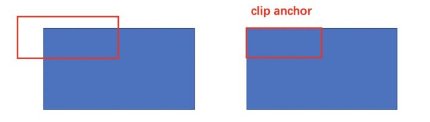

#### 7.2、Anchor到底与网络输出如何对应
VGG输出 `!$50*38*512$` 的特征，对应设置 `!$50*38*k$` 个anchors，而RPN输出 `!$50*38*2k$` 的分类特征矩阵和 `!$50*38*4k$` 的坐标回归特征矩阵。

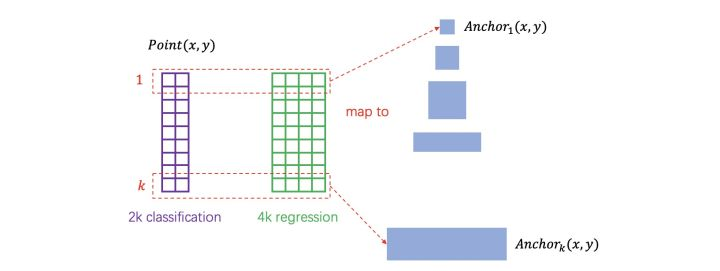

其实在实现过程中，每个点的 `!$2k$` 个分类特征与 `!$4k$` 回归特征，与 `!$k$` 个anchor逐个对应即可，这实际是一种“人为设置的逻辑映射”。当然，也可以不这样设置，但是无论如何都需要保证在训练和测试过程中映射方式必须一致。

#### 7.3、为何有ROI Pooling还要把输入图片resize到固定大小的MxN

由于引入ROI Pooling，从原理上说Faster R-CNN确实能够检测任意大小的图片。但是由于在训练的时候需要使用大batch训练网络，而不同大小输入拼batch在实现的时候代码较为复杂，而且当时以Caffe为代表的第一代深度学习框架也不如Tensorflow和PyTorch灵活，所以作者选择了把输入图片resize到固定大小的800x600。这应该算是历史遗留问题。

### 8、整体结构


# 总结

|     |  使用方法   |   缺点  |  改进   |
| --- | --- | --- | --- |
|  R-CNN(Region-based Convolutional Neural Networks)   |  1、SS提取RP；2、CNN提取特征；3、SVM分类；4、BB盒回归。   |   1、 训练步骤繁琐（微调网络+训练SVM+训练bbox）；2、 训练、测试均速度慢 ；3、 训练占空间  |   1、 从DPM HSC的34.3%直接提升到了66%（mAP）；2、 引入RP+CNN  |
|  Fast R-CNN(Fast Region-based Convolutional Neural Networks)   |  1、SS提取RP；2、CNN提取特征；3、softmax分类；4、多任务损失函数边框回归。   |  1、 依旧用SS提取RP(耗时2-3s，特征提取耗时0.32s)；2、 无法满足实时应用，没有真正实现端到端训练测试；3、 利用了GPU，但是区域建议方法是在CPU上实现的。   |  1、 由66.9%提升到70%；2、 每张图像耗时约为3s。   |
|  Faster R-CNN(Fast Region-based Convolutional Neural Networks)   |  1、RPN提取RP；2、CNN提取特征；3、softmax分类；4、多任务损失函数边框回归。   |   1、 还是无法达到实时检测目标；2、 获取region proposal，再对每个proposal分类计算量还是比较大。  |   1、 提高了检测精度和速度；2、  真正实现端到端的目标检测框架；3、  生成建议框仅需约10ms。  |

# 四、Mask R-CNN