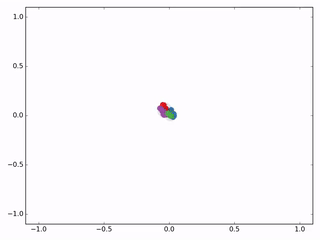
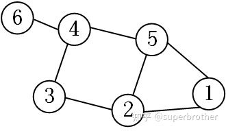
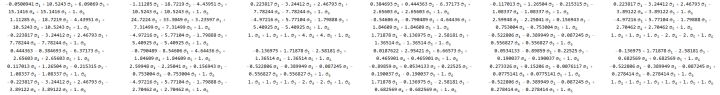
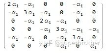
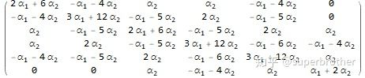
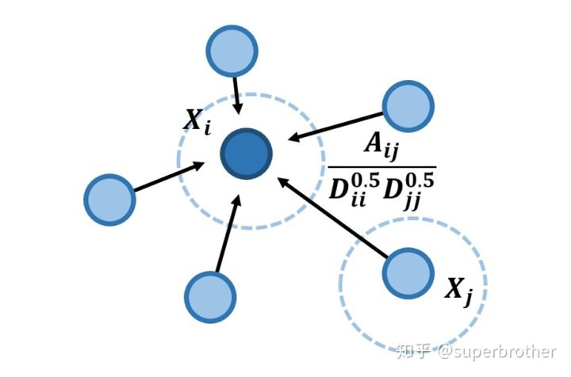

[TOC]

### 1、GCN（Graph Convalutional Network）
##### 1.1、为什么要研究GCN?
　　CNN处理的图像或视频数据中的像素点是排列成很整齐的矩阵，也就是很多论文中提到的（Euclidean Structure），而很多时候我们需要处理的是Non Euclidean Structure的数据，比如社交网络。
  

  


　　这种网络结构在图论中被抽象成图谱图。
  
  **CNN的【平移不变性】在【非矩阵结构】数据上不适用**

- 平移不变性（translation invariance）：比较好理解，在用基础的分类结构比如ResNet、Inception给一只猫分类时，无论猫怎么扭曲、平移，最终识别出来的都是猫，输入怎么变形输出都不变这就是平移不变性，网络的层次越深这个特性会越明显。
- 平移可变性（translation variance）：针对目标检测的，比如一只猫从图片左侧移到了右侧，检测出的猫的坐标会发生变化就称为平移可变性。当卷积网络变深后最后一层卷积输出的feature map变小，物体在输入上的小偏移，经过N多层pooling后在最后的小feature map上会感知不到，这就是为什么R-FCN原文会说网络变深平移可变性变差。

离散卷积本质就是一种加权求和。CNN中的卷积就是一种离散卷积，本质上就是利用一个共享参数的过滤器（kernel），通过计算中心像素点以及相邻像素点的加权和来构成feature map实现空间特征的提取，当然加权系数就是卷积核的权重系数(W)。

那么卷积核的系数如何确定的呢？是随机化初值，然后根据误差函数通过反向传播梯度下降进行迭代优化。这是一个关键点，卷积核的参数通过优化求出才能实现特征提取的作用，**GCN的理论很大一部分工作就是为了引入可以优化的卷积参数。**

图数据中的空间特征具有以下特点：
1. 节点特征：每个节点有自己的特征；（体现在点上）
2. 结构特征：图数据中的每个节点具有结构特征，即节点与节点存在一定的联系。（体现在边上）

总地来说，图数据既要考虑节点信息，也要考虑结构信息，图卷积神经网络就可以自动化地既学习节点特征，又能学习节点与节点之间的关联信息。**GCN是要为除CV、NLP之外的任务提供一种处理、研究的模型。图卷积的核心思想是利用『边的信息』对『节点信息』进行『聚合』从而生成新的『节点表示』。**

##### 1.2、提取拓扑图中空间特征的两种方式

**GCN的本质目的就是用来提取拓扑图的空间特征。** 而图卷积神经网络主要有两类，一类是基于空间域或顶点域vertex domain(spatial domain)的，另一类则是基于频域或谱域spectral domain的。通俗点解释，空域可以类比到直接在图片的像素点上进行卷积，而频域可以类比到对图片进行傅里叶变换后，再进行卷积。

**１、Vertex domain(spatial domain)**：本质是提取拓扑图上每个顶点相邻的neighbors。
解决两个问题：
　　(1)、根据什么条件去找中心vertex的neighbors，也就是如何确定receptive field？
　　(2)、给定了receptive field，按照什么方式处理包含不同数目neighbours的特征？
  
这种方式很明显要对单个顶点做计算处理，提取的图的空间特征相当于对每个顶点的处理结果的集合。
	   
**２、Spectral domain**：这是GCN的理论基础，本质是借助图论的相关理论来实现拓扑图上的卷积操作。从整个研究的时间进程来看：首先研究GSP（graph signal processing）的学者定义了graph上的Fourier Transformation，进而定义了graph上的convolution，最后与深度学习结合提出了Graph Convolutional Network。
理论基础：
　　(1)、谱图理论(Spectral Graph Theory)：借助图的拉普拉斯矩阵的特征值和特征向量研究图的性质。
　　(2)、Graph上的傅里叶变换(Fourier Transformation)
　　(3)、GSP(graph signal processing)
  
### 2、 图的拉普拉斯矩阵

**拉普拉斯矩阵(Laplacian matrix) 也叫做导纳矩阵、基尔霍夫矩阵或离散拉普拉斯算子，主要应用在图论中，作为一个图的矩阵表示。** 对于图 `!$G=(V,E)$`，其Laplacian 矩阵的定义为 `!$L=D-A$`，其中 L 是Laplacian 矩阵， `!$D=diag(d)$` 是顶点的度矩阵（对角矩阵）,`!$d=rowSum(A)$`，对角线上元素依次为各个顶点的度， A 是图的邻接矩阵。

Graph Fourier Transformation及Graph Convolution的定义都用到图的拉普拉斯矩阵。**频域卷积的前提条件是图必须是无向图，只考虑无向图，那么L就是对称矩阵。**

##### 2.1、常见的拉普拉斯矩阵

对于图 `!$G=(V,E)$` ，常见的拉普拉斯矩阵有：

**No.1 Combinatorial Laplacian(组合拉普拉斯)：`!$L=D-A$`**
其中 `!$L$` 是Laplacian矩阵，`!$D$` 是顶点的度矩阵，是一个对角矩阵，对角上的元素依次为各个顶点的度，`!$A$` 是图的邻接矩阵，计算方法示例如图：


其中 `!$L$` 由下列公式给出：
```mathjax!
$$
L_{i,j}:=
\begin{cases}
deg(v_i) &  & {if \ i = j}                                  \\
-1       &  & {if\ i\neq j\ and\ v_i\ is\ adjacent\ to\ v_j} \\
0        &  & {otherwise}
\end{cases}
$$
```
其中`!$deg(v_i)$` 是顶点`!$i$` 的度。

 **No.2 Symmetric normalized Laplacian(对称归一化拉普拉斯)：`!$L^{sys}:=D^{-1/2}LD^{-1/2}=I-D^{-1/2}AD^{-1/2}$`**
	   其中 `!$L_{i,j}^{sym}$` 由下列公式给出：
```mathjax!
$$
L_{i,j}^{sym}:=
\begin{cases}
1        &  & {if \ i = j}\ and\ deg(v_i)\neq 0                 \\
-\frac{1}{\sqrt{deg(v_i)deg(v_j)}} & & {if\ i\neq j\ and\ v_i\ is\ adjacent\ to\ v_j} \\
0        &  & {otherwise}
\end{cases}
$$
```
我们可以看看 `!$D^{-1/2}AD^{-1/2}$`发生了什么，`!$D$` 为只有主对角线上元素非０的对角阵，`!$A$`中记录顶点间的邻接信息，  `!$D^{-1/2}AD^{-1/2}$`　使得`!$A$`中第`!$i$`行和第`!$i$`列的值都除以`!$\sqrt{D_{ii}}$`。

 **No.3 Random walk normalized Laplacian(随机游走归一化拉普拉斯)：`!$L^{rw}:=D^{-1}L=I-D^{-1}A$`**
	   其中 `!$L_{i,j}^{rw}$` 可以由下列方式计算：
```mathjax!
$$
L_{i,j}^{sym}:=
\begin{cases}
1        &  & {if \ i = j}\ and\ deg(v_i)\neq 0                 \\
-\frac{1}{deg(v_i)} & & {if\ i\neq j\ and\ v_i\ is\ adjacent\ to\ v_j} \\
0        &  & {otherwise}
\end{cases}
$$
```
 **No.4 Generalized Laplacian(泛化的拉普拉斯)：**
 
泛化的拉普拉斯(用得少)定义为:
```mathjax!
$$
\begin{cases}
Q_{i,j}&lt;0 &amp; i \ \neq \ j \ and \ diag(v_i) \ \neq \ 0\\
Q_{i,j}=0 &amp; i \neq j \ and \  v_i \  is\  adjacent \  to \  v_j\\
any number &amp; otherwise
\end{cases}
$$
```
一个拉普拉斯矩阵的计算例子（图 3）：
```mathjax!
$$
A=\left\{
 \begin{matrix}
   0 &amp; 1 &amp; 0 &amp; 0 &amp; 1 &amp; 0\\
   1 &amp; 0 &amp; 1 &amp; 0 &amp; 1 &amp; 0\\
   0 &amp; 1 &amp; 0 &amp; 1 &amp; 0 &amp; 0\\
   0 &amp; 0 &amp; 1 &amp; 0 &amp; 1 &amp; 1\\
   1 &amp; 1 &amp; 0 &amp; 1 &amp; 0 &amp; 0\\
   0 &amp; 0 &amp; 0 &amp; 1 &amp; 0 &amp; 0
  \end{matrix}
  \right\}
  ，
  D=
  \left\{
 \begin{matrix}
   2 &amp; 0 &amp; 0 &amp; 0 &amp; 0 &amp; 0\\
   0 &amp; 3 &amp; 0 &amp; 0 &amp; 0 &amp; 0\\
   0 &amp; 0 &amp; 2 &amp; 0 &amp; 0 &amp; 0\\
   0 &amp; 0 &amp; 0 &amp; 3 &amp; 0 &amp; 0\\
   0 &amp; 0 &amp; 0 &amp; 0 &amp; 3 &amp; 0\\
   0 &amp; 0 &amp; 0 &amp; 0 &amp; 0 &amp; 1
  \end{matrix}
  \right\}, \\
  L=D-A=
  \left\{
 \begin{matrix}
   2 &amp; -1 &amp; 0 &amp; 0 &amp; -1 &amp; 0\\
   -1 &amp; 3 &amp; -1 &amp; 0 &amp; -1 &amp; 0\\
   0 &amp; -1 &amp; 2 &amp; -1 &amp; 0 &amp; 0\\
   0 &amp; 0 &amp; -1 &amp; 3 &amp; -1 &amp; -1\\
   -1 &amp; -1 &amp; 0 &amp; -1 &amp; 3 &amp; 0\\
   0 &amp; 0 &amp; 0 &amp; -1 &amp; 0 &amp; 1
  \end{matrix}
  \right\} 
 $$
 ```
可以看出，标准归一化的拉普拉斯矩阵还是对称的，并且符合前面的公式定义。

Graph Convolution与Diffusion相似之处：从Random walk normalized Laplacian就能看出了两者确有相似之处（其实两者只差一个相似矩阵的变换，可参考Diffusion-Convolutional Neural Networks)

##### 2.2、对于拉普拉斯矩阵定义的理解
　　１、先从拉普拉斯算子说起，拉普拉斯算子数学定义是这样的： 
```mathjax!
$$\triangle = \sum_i\frac {\partial^2} {\partial x_i^2}\\$$
```
其含义很明确，是非混合二阶偏导数的和！

　　２、再看图像处理上是怎么近似的：
　　图像是一种离散数据，那么其拉普拉斯算子必然要进行离散化。由导数定义：
```mathjax!
$$
\begin{aligned} f'(x) &= \frac {\partial f(x)}{\partial x}\\ & = \lim_{\delta \to 0} \frac{f(x+\delta)-f(x)}{\delta}\\ & \approx^{离散化}
f(x+１)-f(x)\end{aligned}\\
$$
```
　　得出：
```mathjax!
$$
\begin{aligned} \frac {\delta^2 f(x)}{\delta x^2} &= f''(x) \\ &\approx f'(x)-f'(x-1) \\ &\approx f(x+1)-f(x) - (f(x) - f(x-1))\\ &=f(x+1)+f(x-1)-2f(x) \end{aligned}\\ 
$$
```
**结论1：二阶导数近似等于其二阶差分。
结论2：二阶导数等于其在所有自由度上微扰之后获得的增益。**

　　一维函数其自由度可以理解为 `!$2$`，分别是 `!$+1$` 和 `!$-1$` 两个方向。对于二维的图像来说，其有两个方向（`!$4$` 个自由度）可以变化，即如果对 `!$(x,y)$` 处的像素进行扰动，其可以变为四种状态 `!$(x+1,y)，(x-1,y)，(x,y+1)，(x,y-1)$`。当然了，如果将对角线方向也认为是一个自由度的话，会再增加几种状态 `!$(x+1,y+1)，(x+1,y-1)，(x-1,y+1)，(x-1,y-1)$`，事实上图像处理正是这种原理。
　　同理，将拉普拉斯算子离散化：
```mathjax!
$$
\begin{aligned} \triangle &=\frac {\delta^2 f(x,y)}{\delta x^2} + \frac {\delta^2 f(x,y)}{\delta y^2} \\ &\approx f(x+1,y)+f(x-1,y)-2f(x,y) + [f(x,y+1)+f(x,y-1)-2f(x,y)]\\ &= f(x+1,y)+f(x-1,y)+f(x,y+1)+f(x,y-1)-4f(x,y) \end{aligned}\\
$$
```
　　上式可以理解为，在图像上某一点，其拉普拉斯算子的值，即为对其进行扰动，使其变化到相邻像素后得到的增益。这给我们一种形象的结论：拉普拉斯算子就是在所有自由度上进行微小变化后获得的增益。
　　推广到Graph，对于有 `!$N$` 个节点的Graph，就设节点为 `!$1,...,N$` 吧，且其邻接矩阵为 `!$A$`。这个Graph的自由度最多为 `!$N$`。因为如果该图是一个完全图，即任意两个节点之间都有一条边，那么对一个节点进行微扰，它可能变成任意一个节点。那么上面的函数 `!$f$` 就理所当然是一个 `!$N$` 维的向量，即：
```mathjax!
$$f = (f_1,...,f_N)$$
```
　　其中 `!$f_i$` 即表示函数 `!$f$` 在节点 `!$i$` 的值。类比 `!$f(x,y)$` 即为 `!$f$` 在 `!$(x,y)$` 处的值。对于任意节点 `!$i$` 进行微扰，它可能变为任意一个与他相邻的节点 `!$j\in\mathcal{N_i}$` ，其中 `!$\mathcal{N_i}$` 表示节点 `!$i$` 的一阶邻域节点。
　　对于Graph，从节点 `!$i$` 变化到节点 `!$j$` 增益是多少呢？即 `!$f_j-f_i$` 是多少？最容易想到就是和他们之间的边权相关。此处用 `!$A_{ij}$` 表示。那么，对于节点 `!$i$` 来说，其变化的增益:
```mathjax!
$$\sum_{j\in\mathcal{N}_i}A_{ij}[f_j-f_i]$$
```
　　所以，对于Graph来说，其拉普拉斯算子如下：
```mathjax!
$$
\begin{aligned} (\triangle f)_i &=\sum_i \frac {\delta^2 f} {\delta i^2}\\ &\approx \sum_{j\in\mathcal{N}_i}A_{ij}[f_j-f_i] \end{aligned}\\
$$
```
　　上式 `!$j\in\mathcal{N}_i$` 可以去掉，因为节点 `!$i$` 和 `!$j$` 不直接相邻的话， `!$A_{ij} = 0$`；
　　继续化简一下：
```mathjax!
$$
\begin{aligned} \sum_{j\in\mathcal{N}_i}A_{ij}[f_j-f_i]&=\sum_{j}A_{ij}f_j - \sum_{j}A_{ij}f_i\\ &=(Af)_i - (Df)_i \\ &=[(A-D)f]_i \end{aligned}\\
$$
```
　　即:
```mathjax!
$$(\triangle f)_i =[(A-D)f]_i$$
```
　　对于任意的 `!$i$` 成立，那么也就是：
```mathjax!
$$\triangle f \equiv(A-D)f $$
```
　　因此图上的拉普拉斯算子应该定义为 `!$A-D$`。
##### 2.3、拉普拉斯矩阵的性质

1. 拉普拉斯矩阵是对称矩阵，可以进行特征分解（谱分解），这就是GCN的spectral domain所依据的。
2. 拉普拉斯矩阵只在中心顶点和一阶相连的顶点上（1-hop neighbor）有非0元素，其余之处均为0。
3. 拉普拉斯矩阵存在一个为零的特征值（秩为 `!$|V|-1$`），其余特征值大于零，因此为半正定矩阵。
4. 特征值中0出现的次数就是图连通区域的个数。
5. 最小特征值是0，因为拉普拉斯矩阵（普通形式：`!$L=D−A$`）每一行的和均为0，并且最小特征值对应的特征向量是每个值全为1的向量；
6. 最小非零特征值是图的代数连通度。

**拉普拉斯矩阵的半正定性证明如下：**
要证明拉普拉斯矩阵是半正定的，只需要证明其二次型 `!$f^TLf \ge 0$`：
```mathjax!
$$
\begin{aligned}
f^TLf &amp; =f^TDf-f^TAf \\
&amp; = f^T*diag(d)*f-f^TAf \\
&amp; =\sum_{i=1}^m d_i f_i^2-\sum_{j=1}^m[\sum_{i=1}^m f_j*a_{ij}]f_j \\
&amp; =\sum_{i=1}^m d_i f_i^2-\sum_{i,j=1}^m f_i*f_j*a_{ij} \\
&amp; =\frac{1}{2} [ \sum_{i=1}^md_if_i^2-2\sum_{i,j=1}^m f_i f_j a_{ij}+\sum_{j=1}^m d_j f_j^2 ] \\
&amp; = \frac{1}{2}\sum_{i,j=1}^m a_{ij}(f_i-f_j)^2 \\
\end{aligned}
$$
```
所以，对于任意一个属于实向量 `!$\mathbb{R}^m$` ( `!$f$` 为 `!$m\times 1$` 的实数列向量 )，都有此公式成立

```mathjax!
$$f^TLf = \frac{1}{2}\sum_{i,j=1}^m a_{ij}(f_i-f_j)^2$$
```

##### 2.4、拉普拉斯矩阵的谱分解
　　首先说明的是，矩阵的特征分解、谱分解、对角化是同一个概念。GCN的核心基于拉普拉斯矩阵的谱分解。
  
　　特征分解（Eigendecomposition），又称谱分解（Spectral decomposition）是将矩阵分解为由其特征值和特征向量表示的矩阵之积的方法。矩阵可以特征分解的充要条件为n阶方阵存在n个线性无关的特征向量，即可对角化。但是拉普拉斯矩阵是半正定对称矩阵（半正定矩阵本身就是对称矩阵），有如下三个性质：
 - 对称矩阵一定n个线性无关的特征向量
 - 半正定矩阵的特征值一定非负
 - 对阵矩阵的特征向量相互正交，即所有特征向量构成的矩阵为正交矩阵。

由上可以知道拉普拉斯矩阵一定可以谱分解，且分解后有特殊的形式。
对于拉普拉斯矩阵，起谱分解为：
```mathjax!
    $$
	L=U\begin{pmatrix}
    \lambda_1 & & \\
                         &\ddots & \\
                         & &\lambda_n \\
    \end{pmatrix}U^{-1}
	$$
```
其中 `!$U=(\vec{u_1},\vec{u_2},\cdots,\vec{u_n}) $`是列向量为单位特征向量的矩阵，也就说 `!$\vec{u_l}$` 是列向量。
```mathjax!
    $$
	\begin{pmatrix}
    \lambda_1 & & \\
                         &\ddots & \\
                         & &\lambda_n \\
    \end{pmatrix}
	$$
```
是 n 个特征值构成的对角阵。
由于 `!$U$` 是正交矩阵，即 `!$UU^{T}=E$`， 所以特征分解又可以写成：
```mathjax!
    $$
	L=U\begin{pmatrix}
    \lambda_1 & & \\
                         &\ddots & \\
                         & &\lambda_n \\
    \end{pmatrix}U^{T}
	$$
```
注意的是特征分解最右边的是特征矩阵的逆，只是拉普拉斯矩阵的性质才可以写成特征矩阵的转置。

##### 2.5、拉普拉斯算子

定义：拉普拉斯算子是 n 维欧几里德空间中的一个二阶微分算子，定义为梯度 `!$\nabla f$` 的散度（`!$\nabla \cdot f$`，即 `!$\nabla f\cdot f$`）。因此如果 `!$f$` 是二阶可微的实函数，则 `!$f$` 的拉普拉斯算子 `!$\Delta$` 定义为：
```mathjax!
$$
\Delta f=\nabla^2 f=\nabla \cdot \nabla f
$$
```
`!$f$` 的拉普拉斯算子也是笛卡尔坐标系 `!$x_i$` 中的所有非混合二阶偏导数：
```mathjax!
$$
\Delta f=\sum_{i=1}^n \frac{\partial^2f}{\partial x_i^2}
$$
```

函数 `!$f$` 的拉普拉斯算子也是该函数的海塞矩阵(是一个多元函数的二阶偏导数构成的方阵)的迹：
```mathjax!
$$
\Delta f=tr(H(f))
$$
```

拉普拉斯算子(Laplacian operator) 的物理意义是空间二阶导，准确定义是：标量梯度场中的散度，一般可用于描述物理量的流入流出。比如说在二维空间中的温度传播规律，一般可以用拉普拉斯算子来描述。

**拉普拉斯矩阵也叫做离散的拉普拉斯算子。**

##### 2.6、为什么GCN要用拉普拉斯矩阵？
- 拉普拉斯矩阵是对称矩阵，可以进行特征分解（谱分解）
- 由于卷积在傅里叶域的计算相对简单，为了在graph上做傅里叶变换，需要找到graph的连续的正交基对应于傅里叶变换的基，因此要使用拉普拉斯矩阵的特征向量。

### 3、 傅里叶变换

##### 3.1、连续形式的傅立叶变换

任意函数可以分解为奇偶函数之和：
```mathjax!
$$
f(x)=\frac{f(x)+f(-x)}{2} + \frac{f(x)-f(-x)}{2}=f_{even}+f_{odd}
$$
```
任意一个周期函数可以由若干个正交函数（由 `!$sin,cos$` 构成）的线性组合构成，写出傅里叶级数的形式如下：
```mathjax!
$$
\displaystyle f(x)=a_0+\sum _{{n=1}}^{\infty}\left(a_{n}cos({\frac{2\pi n}{T}x})+b_{n}sin({\frac{2\pi n}{T}x})\right),a_0\in\mathbb{R}
$$
```
利用欧拉公式 `!$e^{ix}=\cos x+i \sin x$` （这里的指复数中的 `!$i$`），`!$cos x,sin x$`可表示成：
```mathjax!
$$
\cos x=\frac{e^{ix} +e^{-ix}}{2} ,\sin x=\frac{e^{ix} -e^{-ix}}{2i} 
$$
```
在时间t轴上，把 `!$e^{it}$`向量的虚部（也就是纵坐标）记录下来，得到的就是 `!$sin(t)$`：


在时间 `!$t$` 轴上，把 `!$e^{i2t}$` 向量的虚部记录下来，得到的就是 `!$sin(2t)$`：


如果在时间t轴上，把 `!$e^{it}$` 的实部（横坐标）记录下来，得到的就是 `!$cos(t)$` 的曲线：


更一般的,具有两种看待 `!$sin,cos$` 的角度：
```mathjax!
$$
e^{i\omega t}\iff \begin{cases}sin(\omega t)\\cos(\omega t)\end{cases}
$$
```
这两种角度，一个可以观察到旋转的频率，所以称为频域；一个可以看到流逝的时间，所以称为时域：


所以，任意周期函数可以以 `!$e^{i\omega t}$` 为基函数用傅里叶级数的指数形式表示。即，对于一个周期函数`!$f(x)$` 以傅里叶级数的指数形式表示为：
```mathjax!
$$
f(x)=\sum ^{\infty }_{n=-\infty }\underbrace{c_{n}}_{\text{基的坐标}} \cdot \underbrace{e^{i\tfrac{2\pi nx}{T}}}_{\text{正交基}}
$$
```
但是对于非周期函数，并不能用傅里叶级数的形式表示。但是还是用某个周期函数 `!$f_T(x)$` 当 `!$T \rightarrow \infty$` 来逼近，即 `!$\lim_{T \rightarrow \infty} f_T(x)=f(x)$`，用积分的形式可以表示为：
```mathjax!
$$
f(x) = \int_{-\infty}^\infty [\int ^{+\infty }_{-\infty } f(x)e^{-i\omega x} dx]\ e^{i\omega x}\,d\omega=\int_{-\infty}^\infty F(\omega)\ e^{i\omega x}\,d\omega
$$
```
其中，`!$F( \omega )$` 就是 `!$f(x)$` 的连续形式的傅里叶变换：
```mathjax!
$$
F( \omega ) =\mathcal{F}[f(x)]=\int ^{+\infty }_{-\infty } f(x)e^{-i\omega x} dx
$$
```
可以看出，`!$f(x)$`  和 `!$F( \omega )$` 可以通过指定的积分运算相互表达。

当然，也可以利用欧拉公式通过 `!$cos$` 和 `!$sin$` 函数表示为 `!$F(u)$`：
```mathjax!
$$
F(u)=\int_{-\infty}^{+\infty}f(x)\left[cos(2\pi xu)-i sin(2\pi xu)\right]dx
$$
```
所以，对函数 `!$f(x)$` 的傅里叶变换 `!$\mathcal{F}$` 和傅里叶的逆变换 `!$\mathcal{F}^{-1}$` 记作：
```mathjax!
$$
F( \omega )=\mathcal{F}[f(x)],f(x)=\mathcal{F}^{-1}[F(\omega)] \\
$$
```

- `!$F(ω)$` 叫做 `!$f(x)$` 的象函数或傅里叶变换，即通过傅里叶变换后关于频率的函数，函数图像就是频谱图，`!$\omega$` 就是 `!$f$` 对应在频域中的频率。
- `!$f(x)$` 叫做 `!$F(\omega)$` 的原象函数。

其实可以发现这个对信号 `!$f(x)$` 的傅立叶变换 `!$F(\omega)$` 形式上是 `!$f(x)$` 与基函数 `!$e^{-i\omega x}$`  的积分，本质上将函数 `!$f(x)$` 映射到了以 `!$e^{-i\omega x}$` 为基向量的空间中。

##### 3.2、频域（frequency domain）和时域（time domain）的理解

**时域：真实量到的信号的时间轴，代表真实世界。
频域：为了做信号分析用的一种数学手段。**

要理解时域和频域只需要看下面两张动图就可以了：


上图来自于维基百科，图中红色部分就是原函数f(x)在时域里面的曲线图，此函数经过傅里叶变换后可以分解成很多如右图中的曲线。在左图中的的蓝色线就是对应的频域中的频谱图。


频谱图里的竖线分别代表了不同频率的正弦波函数，也就是之前的基，而高度则代表在这个频率上的振幅，也就是这个基上的坐标分量。

很多在时域看似不可能做到的数学操作，在频域相反很容易。这就是需要傅里叶变换的地方。尤其是从某条曲线中去除一些特定的频率成分，这在工程上称为滤波，是信号处理最重要的概念之一，只有在频域才能轻松的做到。

**看一个傅里叶变换去噪的例子：**
在傅里叶变换前，图像上有一些规律的条纹，直接在原图上去掉条纹有点困难，但我们可以将图片通过傅里叶变换变到频谱图中，频谱图中那些规律的点就是原图中的背景条纹。


只要在频谱图中擦除这些点，就可以将背景条纹去掉，得到下图右侧的结果。


##### 3.3、周期性离散傅里叶变换（Discrete Fourier Transform, DFT）
傅里叶变换有连续时间非周期傅里叶变换，连续时间周期性傅里叶变换，离散时间非周期傅里叶变换和离散时间周期性傅里叶变换，鉴于计算机主要处理离散周期性信号，本文主要介绍周期性离散时间傅里叶变换（DFT）。信号 `!$x_n$` 的傅里叶变换 `!$X_k$` 为：
```mathjax!
$$
X_k=\sum_{n=0}^{N-1}x_n e^{-i \frac{2\pi}{N}kn}
$$
```
信号 `!$x_n$` 用其傅里叶变换  `!$X_k$` 表示为：
`!$x_n$` 的傅里叶变换 `!$X_k$` 为：
```mathjax!
$$
x_n=\sum_{n=0}^{N-1}X_k e^{i \frac{2\pi}{N}kn}
$$
```
其中，`!$N$` 表示傅里叶变换的点数，`!$k$` 表示傅里叶变换的第 `!$k$` 个频谱

### 4、 Graph上的傅里叶变换

**把传统的傅里叶变换以及卷积迁移到Graph上来，核心工作其实就是把拉普拉斯算子的特征函数 `!$e^{-i\omega t}$` 变为Graph对应的拉普拉斯矩阵的特征向量。**

傅立叶变换与拉普拉斯矩阵的关系：**传统傅立叶变换的基，就是拉普拉斯矩阵的一组特征向量。**

##### 4.1、傅里叶变换
 ```mathjax!
 $$
 F(\omega)=\mathcal{F}[f(t)]=\int_{}^{}f(t)e^{-i\omega t} dt
 $$
 ```
传统的傅里叶变换定义为信号 `!$f(t)$` 与基函数 `!$e^{-i\omega t}$` 的积分，那么为什么要找 `!$e^{-i\omega t}$` 作为基函数呢？从数学上看， `!$e^{-i\omega t}$` 是拉普拉斯算子的特征函数（满足特征方程），`!$ \omega $` 就和特征值有关。
 广义的特征方程定义为：
```mathjax!
$$A V=\lambda V$$
```
其中 A 是一种变换， V 是特征向量或者特征函数（无穷维的向量），`!$ \lambda $` 是特征值。
`!$e^{-i\omega t} $` 满足：
```mathjax!
$$
 \Delta e^{-i\omega t}=\frac{\partial^{2}}{\partial t^{2}} e^{-i\omega t}=-\omega^{2} e^{-i\omega t}\
 $$
 ```
当然 `!$e^{-i\omega t} $` 就是变换 `!$\Delta$` 的特征函数， `!$\omega$` 和特征值密切相关。
在处理Graph问题的时候，用到拉普拉斯矩阵（拉普拉斯矩阵就是离散拉普拉斯算子），对其进行特征分解，`!$L$` 是拉普拉斯矩阵， `!$V$` 是其特征向量，自然满足特征方程：
```mathjax!
$$LV=\lambda V $$
```

前面讲到可以用一组正交函数 `!$cos$` 和 `!$sin$` (或 `!$e^{-i\omega t}$` 表示任意函数，且傅里叶变换是连续形式的，在处理Graph时，用到的是傅里叶变换的离散形式。由于拉普拉斯矩阵进行谱分解以后，可以得到 `!$n$` 个线性无关的特征向量，构成空间中的一组正交基，因此归一化拉普拉斯矩阵算子的特征向量构成了图傅里叶变换的基。图傅里叶变换将输入图的信号投影到了正交空间，相当于把图上定义的任意向量，表示成了拉普拉斯矩阵特征向量的线性组合。


离散积分就是一种内积形式，仿上定义Graph上的傅里叶变换：
```mathjax!
$$
F(\lambda_l)=\hat{f}(\lambda_l)=\sum_{i=1}^{N}{f(i) u_l^*(i)}
$$
```
`!$f$` 是Graph上的 `!$N$` 维向量，`!$f(i)$` 与Graph的顶点一一对应， `!$u_l(i)$` 表示第 `!$l$` 个特征向量的第 `!$i$` 个分量。那么特征值（频率） `!$\lambda_l$` 下的，`!$f$` 的Graph傅里叶变换就是与 `!$\lambda_l$` 对应的特征向量 `!$u_l(i)$` 进行内积运算。
注：上述的内积运算是在复数空间中定义的，所以采用了`!$u_l^*$`，也就是特征向量 `!$u_l$` 的共轭。

**利用矩阵乘法将Graph上的傅里叶变换推广到矩阵形式：**
```mathjax!
$$
\left(\begin{matrix} \hat{f}(\lambda_1)\\ \hat{f}(\lambda_2) \\ \vdots \\\hat{f}(\lambda_N) \end{matrix}\right)=\left(\begin{matrix}\ u_1(1) &u_1(2)& \dots &u_1(N) \\u_2(1) &u_2(2)& \dots &u_2(N)\\ \vdots &\vdots &\ddots & \vdots\\ u_N(1) &u_N(2)& \dots &u_N(N) \end{matrix}\right)\left(\begin{matrix}f(1)\\ f(2) \\ \vdots \\f(N) \end{matrix}\right)
$$
```
即 `!$f$` 在Graph上傅里叶变换的矩阵形式为：`!$\hat{f}=U^{-1}f \qquad(a)$`， 式中 `!$U^{-1}$` 等于 `!$U^T$`。

##### 4.2、傅里叶逆变换
传统的傅里叶逆变换是对频率 `!$\omega $` 求积分：
```mathjax!
$$
\mathcal{F}^{-1}[F(\omega)]=\frac{1}{2\Pi}\int_{}^{}F(\omega)e^{i\omega t} d\omega
$$
```
迁移到Graph上变为对特征值 `!$\lambda_l$` 求和：
```mathjax!
$$f(i)=\sum_{l=1}^{N}{\hat{f}(\lambda_l) u_l(i)}$$
```
**利用矩阵乘法将Graph上的傅里叶逆变换推广到矩阵形式：**
```mathjax!
$$
\left(\begin{matrix}f(1)\\ f(2) \\ \vdots \\f(N) \end{matrix}\right)= \left(\begin{matrix}\ u_1(1) &u_2(1)& \dots &u_N(1) \\u_1(2) &u_2(2)& \dots &u_N(2)\\ \vdots &\vdots &\ddots & \vdots\\ u_1(N) &u_2(N)& \dots &u_N(N) \end{matrix}\right) \left(\begin{matrix} \hat{f}(\lambda_1)\\ \hat{f}(\lambda_2) \\ \vdots \\\hat{f}(\lambda_N) \end{matrix}\right)
$$
```
即 `!$f$` 在Graph上傅里叶逆变换的矩阵形式为：`!$f=U\hat{f} \qquad(b)$`。

### 5、 Graph上的卷积
　　卷积定理：函数卷积的傅里叶变换是函数傅立叶变换的乘积，即对于函数 `!$f(t)$` 与 `!$h(t)$` 两者的卷积是其函数傅立叶变换乘积的逆变换：
  ```mathjax!
  $$
f*h=\mathcal{F}^{-1}\left[ \hat{f}(\omega)\hat{h}(\omega) \right]=\frac{1}{2\Pi}\int_{}^{} \hat{f}(\omega)\hat{h}(\omega)e^{i\omega t} d\omega
$$
```
利用卷积定理类比来将卷积运算，推广到Graph上，并把傅里叶变换的定义带入，`!$f$` 与卷积核 `!$h$` 在Graph上的卷积可按下列步骤求出：
`!$f$` 的傅里叶变换为 `!$\hat{f}=U^Tf$`，卷积核 `!$h$` 的傅里叶变换写成对角矩阵的形式即为：
```mathjax!
$$
\left(\begin{matrix}\hat h(\lambda_1) & \\&\ddots \\ &&\hat h(\lambda_n) \end{matrix}\right)
$$
```
`!$\hat{h}(\lambda_l)=\sum_{i=1}^{N}{h(i) u_l^*(i)}$` 是根据需要设计的卷积核 `!$h$`在Graph上的傅里叶变换。
两者的傅立叶变换乘积即为：
```mathjax!
$$
\left(\begin{matrix}\hat h(\lambda_1) & \\&\ddots \\ &&\hat h(\lambda_n) \end{matrix}\right)U^Tf
$$
```
再乘以 `!$U$` 求两者傅立叶变换乘积的逆变换，则求出卷积：
```mathjax!
$$
(f*h)_G= U\left(\begin{matrix}\hat h(\lambda_1) & \\&\ddots \\ &&\hat h(\lambda_n) \end{matrix}\right) U^Tf \qquad(1)
$$
```
式中： `!$U$`及 `!$U^{T}$` 的定义与前面的相同。
注：很多论文中的Graph卷积公式为：
```mathjax!
$$(f*h)_G=U((U^Th)\odot(U^Tf)) \qquad(2)$$
```
`!$\odot $` 表示hadamard product（哈达马积），对于两个向量，就是进行内积运算；对于维度相同的两个矩阵，就是对应元素的乘积运算。
其实式(2)与式(1)是完全相同的。因为
```mathjax!
$$\left(\begin{matrix}\hat h(\lambda_1) & \\&\ddots \\ &&\hat h(\lambda_n) \end{matrix}\right)$$
```
与 `!$U^Th$` 都是 `!$h$` 在Graph上的傅里叶变换。
而根据矩阵乘法的运算规则：对角矩阵
```mathjax!
$$\left(\begin{matrix}\hat h(\lambda_1) & \\&\ddots \\ &&\hat h(\lambda_n) \end{matrix}\right)$$
```
与 `!$U^Th$` 的乘积和 `!$U^Th$` 与 `!$U^Tf$` 进行对应元素的乘积运算是完全相同的。

### 6、 拉普拉斯矩阵与傅里叶变换的关系

##### 6.1、为什么拉普拉斯矩阵的特征向量可以作为傅里叶变换的基？
傅里叶变换一个本质理解就是：把任意一个函数表示成了若干个**正交函数**（由sin,cos 构成）的线性组合。


通过第5节中(b)式可以看出，graph傅里叶变换把graph上定义的任意向量 `!$f$` ，表示成了拉普拉斯矩阵特征向量的线性组合，即：
```mathjax!
$$
f=\hat{f}(\lambda_1)u_1+\hat{f}(\lambda_2)u_2+\cdots +\hat{f}(\lambda_n)u_n
$$
```
那么：为什么graph上任意的向量 `!$f$` 都可以表示成这样的线性组合？
原因在于 `!$(\vec{u_1},\vec{u_2},\cdots,\vec{u_n})$` 是graph上 `!$n$` 维空间中的 `!$n$` 个线性无关的正交向量，由线性代数的知识可以知道： `!$n$` 维空间中  `!$n$` 个线性无关的向量可以构成空间的一组基，而且拉普拉斯矩阵的特征向量是一组正交基。

##### 6.2、怎么理解拉普拉斯矩阵的特征值表示频率？
将拉普拉斯矩阵 `!$L$` （半正定矩阵）的 `!$n$` 个非负实特征值，从小到大排列为 `!$\lambda_1 \le \lambda_2 \le \cdots \le \lambda_n$`，而且最小的特征值 `!$\lambda_1=0$`，因为 `!$n$` 维的全 1 特征**strong text**向量对应的特征值为 0（由 L 的定义就可以得出）：
```mathjax!
$$L \left(\begin{matrix}1\\ 1 \\ \vdots \\1 \end{matrix}\right)=0$$
```
从特征方程
```mathjax!
$$Lu=\lambda u $$
```
的数学理解来看，在由Graph确定的 `!$n$` 维空间中，越小的特征值 `!$\lambda_l $` 表明：拉普拉斯矩阵 `!$L$` 其所对应的基 `!$u_l $`上的分量、“信息”越少，当然就是可以忽略的低频部分。其实图像压缩就是这个原理，把像素矩阵特征分解后，把小的特征值（低频部分）全部变成 0，PCA（principal component analysis ( 主成分分析)）降维也是同样的，把协方差矩阵特征分解后，按从大到小取出前 K 个特征值对应的特征向量作为新的“坐标轴”。


**Graph Convolution的理论到这里可以告一段落。**


### 7、 GCN(Graph Convolutional Network)

Deep learning 中的Graph Convolution直接看上去会和第5节推导出的图卷积公式有很大的不同，但是万变不离其宗，都是根据下式来推导的：
```mathjax!
$$
g_\theta * x = Ug_\theta U^Tx =U\left(\begin{matrix}\hat g(\lambda_1) &amp; \\&amp;\ddots \\ &amp;&amp;\hat g(\lambda_n) \end{matrix}\right) U^T x  \tag{3}
$$
```
上式计算量很大，因为特征向量矩阵 `!$U$` 的复杂度是 `!$O(N^2)$`。此外，对于大型图来说，L特征值分解的计算量也很大。
  
##### 7.1、GCN的演变——卷积参数

Deep learning 中的 Convolution 就是要设计含有 trainable 共享参数的kernel，从上式看很直观：graph convolution 中的卷积参数就是 `!$diag(\hat h(\lambda_l) )$`（对角阵）。
  
**1、第一代的GCN(Spectral Networks and Deep Locally Connected Networks on Graph)简单粗暴地把 `!$diag(\hat h(\lambda_l) )$` 变成了卷积核 `!$diag(\theta_l )$`，也就是：**
```mathjax!
$$
y_{output}=\sigma \left(U g_\theta(\Lambda)U^T x \right) \tag{4}
$$
```
（为避免混淆，本文中称 `!$g_\theta(\Lambda)$` 是卷积核， `!$Ug_\theta(\Lambda)U^T$` 的运算结果为卷积运算矩阵）
```mathjax!
$$
g_\theta(\Lambda) = \left(\begin{matrix}\theta_1 &\\&\ddots \\ &&\theta_n \end{matrix}\right)
$$
```

式（4）就是标准的第一代GCN中的layer了，其中 `!$\sigma(\cdot)$` 是激活函数，`!$\Theta=({\theta_1},{\theta_2},\cdots,{\theta_n})$` 就跟三层神经网络中的 weight 一样是任意的参数，通过初始化赋值然后利用误差反向传播进行调整， x 就是graph上对应于每个顶点的 feature vector（由特数据集提取特征构成的向量）。
　　1）这里的spectral graph convolution指的是
```mathjax!
$$
X_{t+1}=U\ diag(\theta_i)\ U^T X_t  \tag{5}
$$
```
其中 `!$X$` 表示每个节点上的特征，`!$U$` 是该graph的Laplacian矩阵的特征向量，`!$diag(\theta_i)$` 是一个对角阵，也可以看做是对特征值 `!$\Lambda$` 的调整 。
　　2）为什么这里可以对应于卷积：`!$U^TX$` 将节点投影到了频率域，`!$drag(\theta_i)\ U^TX$`表示频率域的乘积，频率域乘积对应于空间域的卷积。最后再乘以 `!$U$` 将频率域变换回到空间域。
　　3）为什么 `!$U^TX$` 就是频率域变换：我们可以这么理解： Laplacian 矩阵的定义是 `!$L=D-A$`。把 `!$L$` 的特征值按从小到大排列，那么对应的特征向量，正好对应于图上的从低频到高频基。 就像我们对一维函数做傅里叶变换，就是将不同频率的基( `!$sin(m\theta)cos(m\theta$`) )与该函数进行內积（这里就是积分）一样，这里我们也对图上每个节点的值与该图的不同频率的基（特征向量）进行內积。
　　**弊端：**
　　１、每一次前向传播，都要计算 `!$U$`，`!$diag(\theta_l )$` 及 `!$U^T$` 三者的乘积，特别是对于大规模的graph，计算的代价较高， 计算复杂度为`!$\mathcal{O}(n^2)$`。
　　２、卷积核需要 n 个参数。相当于每个卷积核都跟图像一样大。
　　３、卷积核的spatial localization不好，这是相对第二代卷积核而言的。
  
**2、第二代的GCN(Convolutional Neural Networks on Graphs With Fast Localized Spectral Filtering)把 `!$\hat h(\lambda_l)$` 巧妙地设计成了 `!$\sum_{j=0}^K \alpha_j \lambda^j_l$` ，也就是：**
```mathjax!
$$
 y_{output}=\sigma \left(U g_\theta(\Lambda)U^T x \right) \tag{6}
$$
```

```mathjax!
$$
g_\theta(\Lambda) = \left(\begin{matrix}\sum_{j=0}^K \alpha_j \lambda^j_1 &\\&\ddots \\ && \sum_{j=0}^K \alpha_j \lambda^j_n \end{matrix}\right)
$$
```
利用矩阵乘法进行变换：
```mathjax!
$$
 \left(\begin{matrix}\sum_{j=0}^K \alpha_j \lambda^j_1 &\\&\ddots \\ && \sum_{j=0}^K \alpha_j \lambda^j_n \end{matrix}\right)=\sum_{j=0}^K \alpha_j \Lambda^j
$$
```
因为 `!$L^2=U \Lambda U^TU \Lambda U^T=U \Lambda^2 U^T $` 且 `!$U^T U=E$`，进而可以导出：
```mathjax!
$$
U \sum_{j=0}^K \alpha_j \Lambda^j U^T =\sum_{j=0}^K \alpha_j U\Lambda^j U^T = \sum_{j=0}^K \alpha_j L^j
$$
```
因此，(6)式可以写成：
```mathjax!
$$
y_{output}=\sigma \left( \sum_{j=0}^K \alpha_j L^j x \right) \tag{7}
$$
```
其中 `!$({\alpha_1},{\alpha_2},\cdots,{\alpha_K}) $` 是任意的参数，通过初始化赋值然后利用误差反向传播进行调整（训练的过程）。
　　
式(7)所设计的卷积核其优点在于：
1. 卷积核只有 K 个参数，一般 K 远小于 n。
2. 矩阵变换后，不需要做特征分解，直接用拉普拉斯矩阵 L 进行变换，计算复杂度变成了 `!$\mathcal{O}(n)$`。
3. 卷积核具有很好的 spatial localization，特别地，K 就是卷积核的receptive field，也就是说每次卷积会将中心顶点 K-hop neighbor上的 feature 进行加权求和，权系数就是 `!$\alpha_k$`。更直观地看， K=1 就是对每个顶点上一阶neighbor的feature进行加权求和，如下图所示：
  


　　同理，K=2的情形如下图所示：
  


**注：上图只是以一个顶点作为实例，GCN每一次卷积对所有的顶点都完成了图示的操作。**


**3、利用Chebyshev多项式递归计算卷积核**

在第二代GCN中，`!$L$` 是 `!$n\times n$` 的矩阵，所以 `!$L^j$` 的计算还是 `!$\mathcal{O}(n^2)$` 复杂的，[Wavelets on graphs via spectral graph theory](https://link.zhihu.com/?target=https%3A//www.sciencedirect.com/science/article/pii/S1063520310000552) 提出了利用Chebyshev多项式拟合卷积核的方法，来降低计算复杂度。卷积核 `!$g_{\theta}(\Lambda)$` 可以利用截断（truncated）的shifted Chebyshev多项式来逼近。（这里本质上应该寻找Minimax Polynomial Approximation，但是作者说直接利用Chebyshev Polynomial的效果也很好）
```mathjax!
$$
g_{\theta}(\Lambda) = \sum_{k = 0}^{K - 1} \beta_k T_k (\tilde \Lambda)
$$
```
`!$\beta_k$` 是Chebyshev多项式的系数。`!$T_k(\tilde \Lambda)$` 是取 `!$\tilde \Lambda = 2\Lambda / \lambda_{max} - I$` 的Chebyshev多项式，进行这个shift变换的原因是Chebyshev多项式的输入要在 `!$\left[ -1,1\right]$` 之间。

由Chebyshev多项式的性质，可以得到如下的递推公式：
```mathjax!
$$
T_k (\tilde{\Lambda})x = 2\tilde{\Lambda}T_{k-1} (\tilde{\Lambda})x-T_{k-2} (\tilde{\Lambda})x \tag{8}   \\
T_{0} (\tilde{\Lambda}) = I,T_{1} (\tilde{\Lambda}) = \tilde{\Lambda}
$$
```
其中, `!$x$` 的定义同上，是 `!$n$` 维的由每个顶点的特征构成的向量（当然，也可以是 `!$n\times m$` 的特征矩阵，这时每个顶点都有 `!$m$` 个特征，但是 `!$m$` 通常远小于 `!$n$` ）。

**这个时候不难发现：式（8）的运算不再有矩阵乘积了，只需要计算矩阵与向量的乘积即可。计算一次 `!$T_k (\tilde{\Lambda})x$` 的复杂度是 `!$\mathcal{O}(\left| E \right|)$` ， `!$E$` 是图中边的集合，则整个运算的复杂度是 `!$\mathcal{O}(K\left  | E \right|)$` 。当graph是稀疏图的时候，计算加速尤为明显，这个时候复杂度远低于 `!$\mathcal{O}(n^2)$` 。**

上面的讲述是GCN最基础的思路，很多论文中的GCN结构是在上述思路的基础上进行了一些简单数学变换。理解了上述内容，就可以做到“万变不离其宗”。

##### 7.2、GCN的演变——重要论文

基于上面最原始的卷积公式（公式 3），深度学习中的GCN主要是从下面几篇文章演变而来的（引用次数都很高），后面一一进行简单介绍：

【1】Bruna, Joan, et al. “Spectral networks and locally connected networks on graphs.” 源于ICLR 2014
【2】Defferrard, Michaël, Xavier Bresson, and Pierre Vandergheynst. “Convolutional neural networks on graphs with fast localized spectral filtering.” 源于NIPS 2016
【3】Hammond, David K., Pierre Vandergheynst, and Rémi Gribonval. “Wavelets on graphs via spectral graph theory.” Applied and Computational Harmonic Analysis 30.2 (2011)
【4】Kipf, Thomas N., and Max Welling. “Semi-supervised classification with graph convolutional networks.” 源于ICML 2017

###### 7.2.1、Spectral CNN
谱CNN源于论文[(J. Bruna, W. Zaremba, A. Szlam, and Y. LeCun, “Spectral networks and locally connected networks on graphs,” in Proceedings of International Conference on Learning Representations, 2014)](https://arxiv.org/abs/1312.6203)，Bruna等人，第一次提出谱卷积神经网络。他们简单地把 `!$g_\theta$` 看作是一个可学习参数的集合：`!$g_\theta=\Theta_{i,j}^k$`。并且假设图信号是多维的，图卷积层定义为：
```mathjax!
$$
X_{:,j}^{k+1} = \sigma(\sum_{i=1}^{f_{k-1}}U\Theta_{i,j}^kU^TX_{:,i}^{k})\quad \quad \quad (j=1,2,\cdots,f_k)
$$
```
- `!$X^k\in \mathbb{R}^{N\times f_{k-1}}$` 是输入图信号,对应图上就是点的输入特征
- `!$N$` 是节点数量
- `!$f_{k-1}$` 是输入通道的数量
- `!$f_{k}$` 是输出通道的数量
- `!$\Theta_{i,j}^k$` 是一个可学习参数的对角矩阵,就跟三层神经网络中的weight一样是任意的参数，通过初始化赋值然后利用误差反向传播进行调整
- `!$\sigma(\cdot)$` 是激活函数

第一代的参数方法存在着一些弊端，主要在于：

（1）**计算复杂：** 如果一个样本一个图，那么每个样本都需要进行图的拉普拉斯矩阵的特征分解求U矩阵计算复杂；每一次前向传播，都要计算 `!$U,diag(\theta_l )$` 及 `!$U^T$` 三者的乘积，特别是对于大规模的graph，计算的代价较高，需要 `!$\mathcal{O}(n^2)$` 的计算复杂度
（2）是非局部性连接的
（3）卷积核需要N个参数，当图中的节点N很大时是不可取的

由于以上的缺点第二代的卷积核设计应运而生。
 
###### 7.2.2、Chebyshev谱CNN（ChebNet）

Chebyshev谱CNN源于论文([M. Defferrard, X. Bresson, and P. Vandergheynst, “Convolutional neural networks on graphs with fast localized spectral filtering,”in Advances in Neural Information Processing Systems, 2016](http://papers.nips.cc/paper/6081-convolutional-neural-networks-on-graphs-with-fast-localized-spectral-filtering))。Defferrard等人提出ChebNet，定义特征向量对角矩阵的切比雪夫多项式为滤波器，也就是：
```mathjax!
$$
g_\theta =g_\theta(\Lambda) \approx \sum^{K-1}_{i=0} \theta_i T_k(\tilde \Lambda) 
$$
```
其实，就是利用Chebyshev多项式拟合卷积核的方法，来降低计算复杂度。

**推导过程如下：**
考虑信号 `!$x\in \mathbb{R}^N$`(x就是graph上对应于每个顶点的feathure vector，即由数据集提取特征构成的向量，而不是和线性代数中常说的特征向量，注意区别）与以参数为 `!$\theta \in \mathbb{R}^N$` 的滤波器 `!$g_θ=diag(θ)$` 在傅里叶域的谱卷积。
```mathjax!
$$
g_\theta * x = Ug_\theta U^Tx \qquad (9)
$$
```
其中

- U 是对称归一化的拉普拉斯(normalized graph Laplacian)算子 `!$L=I_N−D^{−1/2}AD^{−1/2}=UΛU^T$`的特征向量矩阵，`!$\Lambda$` 是由 `!$L$` 的特征向量构成的对角矩阵。
```mathjax!
$$
\begin{aligned}
    L &amp;= D^{-\frac{1}{2}}(D - A)D^{-\frac{1}{2}} \\
      &amp;= D^{-\frac{1}{2}} D D^{-\frac{1}{2}} -
         D^{-\frac{1}{2}} A D^{-\frac{1}{2}} \\
      &amp;= I_N - D^{-\frac{1}{2}} A D^{-\frac{1}{2}}
\end{aligned}	
$$
```
由于normalized graph Laplacian矩阵L是实对称矩阵, 因此其特征向量矩阵U是正交矩阵,即 `!$UU^T=I_N$`。

- `!$U^Tx$` 是x的傅里叶变换。
- `!$g_\theta $`是由参数 `!$\theta$` 构成的对角矩阵 `!$diag(\theta)$`。由于参数 `!$\theta$` 的确定与 L 的特征值有关,作者认为 `!$g_θ$` 是特征值 `!$\Lambda$` 的一个函数，即令：
```mathjax!
$$
g_\theta=g_\theta(\Lambda)
$$
```

式9的计算量很大，因为特征向量矩阵U 的复杂度是 `!$O(N^2)$`。此外，对于大型图来说，L特征值分解的计算量也很大。

为了解决这个问题，[Hammond et al.(2011) ：Wavelets on graphs via spectral graph theory](https://hal.inria.fr/inria-00541855/document)指出 `!$g_\theta(\Lambda) $` 可以很好的通过Chebyshev多项式 `!$T_k(x)$` 的 `!$K^{th}$` 阶截断展开来拟合，并对 `!$\Lambda$` 进行scale使其元素位于\[−1,1]：
```mathjax!
$$
g_{\theta}(\Lambda) \approx \sum^{K}_{k=0} \theta_k T_K(\tilde \Lambda) \qquad (10)
$$
```
其中
- `!$\tilde \Lambda = 2\Lambda / \lambda_{max}− I_N$` (为缩放后的特征向量矩阵,缩放后范围是\[−1,1]，单位矩阵的特征值是n重1)，缩放的目的是为了满足Chebyshev多项式 `!$T_k(x)$` 的 `!$K^{th}$` 阶截断展开的条件：自变量范围需要在\[−1,1]之间。
- `!$\lambda_{max}$` 是 L 的最大特征值，也叫谱半径。
- `!$\theta \in \mathbb{R}^K$` 是切比雪夫系数的向量
- Chebyshev多项式递归定义为 `!$T_k(x) = 2xT_{k−1}(x) − T_{k−2}(x)$` ， 其中 `!$T_0(x)=1， T_1(x)=x$`

回到对信号x与滤波器 `!$g_{\theta}$` 的卷积的定义，现在有：
```mathjax!
$$
g_{\theta} * x = \sum^{K}_{k=0} \theta_kT_K(\tilde L)x \qquad (11)
$$
```
其中
- `!$\tilde L= 2L / \lambda_{max}− I_N=U \tilde \Lambda U^T$`
- 易证 `!$(U\Lambda U^T)^k=U\Lambda^kU^T$`

现在，相比于第一种Spectral CNN：

1. 此表达式现在是K-localized，具有局部连接性，因为它是拉普拉斯算子中的 `!$K^{th}$` 阶多项式，即它仅取决于离中央节点(`!$K^{th}$` 阶邻域)最大 K 步的节点
2. `!$T_K(\tilde L)x$` 的复杂度是 `!$O(|E|)$`，即与边数 E 呈线性关系，整个运算的复杂度是 `!$O(K|E|)$`。当graph是稀疏图的时候，计算加速尤为明显，这个时候复杂度远低于 `!$O(n^2)$`

<br /><br />

>**公式10到公式11的补充证明：**

（1）先用数学归纳法证明
```mathjax!
$$
U T_k (\tilde{\Lambda}) U^T = T_k (U \tilde{\Lambda} U^T)
$$
```
数学归纳法思路：当 `!$n=1$` 时显然成立，假设 `!$n=k$` 时成立，只需证 `!$n=k+1$` 时成立

证明：
根据切比雪夫多项式的定义, 已知
```mathjax!
$$
\begin{aligned}
&amp;U T_0(\tilde{\Lambda}) U^T = UU^T =1 = T_0(U \tilde{\Lambda} U^T) \\
&amp;U T_1(\tilde{\Lambda}) U^T = U\tilde{\Lambda}U^T = T_1(U \tilde{\Lambda} U^T)
\end{aligned}
$$
```
假设对于任意 `!$k>1$`, 满足
```mathjax!
$$
U T_{k-2} (\tilde{\Lambda}) U^T= T_{k-2} (U \tilde{\Lambda} U^T)
$$
```
与
```mathjax!
$$
U T_{k-1} (\tilde{\Lambda}) U^T= T_{k-1} (U \tilde{\Lambda} U^T)
$$
```
则
```mathjax!
$$
\begin{aligned}
U T_k (\tilde{\Lambda}) U^T 
&amp;= 2U \tilde{\Lambda} T_{k-1}(\tilde{\Lambda})U^T - 
   U T_{k-1}(\tilde{\Lambda}) U^T \\
&amp;= 2 (U \tilde{\Lambda} U^T) \left[U T_{k-1}(\tilde{\Lambda})U^T \right] - 
   U T_{k-1}(\tilde{\Lambda}) U^T \\
&amp;= 2 (U \tilde{\Lambda} U^T) T_{k-1} (U \tilde{\Lambda} U^T) - 
  T_{k-1} (U \tilde{\Lambda} U^T) \\
&amp;= T_k (U \tilde{\Lambda} U^T)
\end{aligned} 
$$
```
因此,根据数学归纳法, 证毕。

（2）已知
```mathjax!
$$
\tilde L= U  \tilde{\Lambda} U^T
$$
```
（3）将（1）、（2）两式带入卷积公式：
```mathjax!
$$
\begin{aligned}
g_\theta * x 
&amp; = Ug_\theta U^Tx \\
&amp; = U g_{\theta}(\Lambda) U^Tx \\
&amp; =U (\sum^{K}_{k=0} \theta_kT_K(\tilde \Lambda)) U^Tx \\
&amp; =  (\sum^{K}_{k=0} \theta_kT_K(U\tilde \Lambda U^T)) x  \\
&amp; = \sum^{K}_{k=0} \theta_k T_K(\tilde L) x \qquad (12)
\end{aligned}
$$
```

###### 7.2.3、一阶ChebNet（1stChebNet）-GCN

一阶ChebNet源于论文（[T. N. Kipf and M.Welling, “Semi-supervised classification with graph convolutional networks,” in Proceedings of the International Conference on Learning Representations, 2017](https://arxiv.org/pdf/1609.02907)）。这篇论文基于前面的工作，正式成为GCN的开山之作，后面很多变种都是基于这篇文章的。

该篇论文贡献有两点：

1. 作者对于直接操作于图结构数据的网络模型根据频谱图卷积(Hammond等人于2011年提出的Wavelets on graphs via spectral graph theory)使用一阶近似简化计算的方法，提出了一种简单有效的层式传播方法。
2. 作者验证了图结构神经网络模型可用于快速可扩展式的处理图数据中节点半监督分类问题，作者通过在一些公有数据集上验证了自己的方法的效率和准确率能够媲美现有的顶级半监督方法。

下面介绍ChebNet的一阶近似方法：
Kipf等人引入了一种一阶近似ChebNet。假设 `!$K=1,\lambda_{max}=2$`，则ChebNet卷积公式简化近似为：
```mathjax!
$$
x*g_\theta = \theta_0 x - \theta_1 D^{− 1 /2} AD^{− 1 /2}x
$$
```
为了抑制参数数量防止过拟合，1stChebNet假设 `!$\theta=\theta_0=-\theta_1$`，图卷积的定义就近似为（这是简单的一阶模型）：
```mathjax!
$$
g_\theta * x = \theta (I_N + D^{− 1 /2} AD^{− 1 /2} ) x
$$
```
其中
-  `!$I_N+D^{−1/2}AD^{−1/2}$` 是有范围\[0,2]的特征值。因此，如果在深度神经网络模型中使用该算子，则反复应用该算子会导致数值不稳定（发散）和梯度爆炸 / 消失。

为了解决该问题, 引入了一个renormalization trick（归一化技巧）：
```mathjax!
$$
I_N+D^{−1/2}AD^{−1/2}  \stackrel{\tilde A=A+I_N}{\longrightarrow} \tilde D^{−1/2} \tilde A \tilde D^{−1/2}
$$
```
其中
- `!$\tilde A=A+I_N,\tilde D_{ii}=∑_j \tilde A_{ij}$` ，即图中加上自环

再加上一个激活函数，最后就可以得到了论文中的快速卷积公式：
```mathjax!
$$
H ^{(l+1)} =f(H^l,A)=\sigma (\tilde D^{-1/2} \tilde A \tilde D^{ − 1/2} H^{(l)}W^{(l)} )
$$
```
- `!$W$` 就是参数 `!$\theta$` 参数矩阵

>**推广：特征映射公式**

可以将这个定义推广到具有C个输入通道（即每个节点的C维特征向量）的信号 `!$X\in \mathbb{R}^{N×C}$` 和 F 个滤波器或特征映射如下：
```mathjax!
$$
Z = \tilde D^{− 1 /2} \tilde A \tilde D^{− 1/ 2} X\Theta
$$
```
其中
-  `!$\Theta \in \mathbb{R}^{C×F}$` 是一个滤波器参数矩阵，其实就是参数矩阵W
-  `!$Z\in \mathbb{R}^{N×F}$` 是一次卷积的输出矩阵。

这个滤波操作复杂度是 `!$O（|E|FC）$`（其中E为边数，C为特征向量维度，F为卷积核数量），并且 `!$\tilde{A}X$` 可以有效地实现为密集矩阵和稀疏矩阵的乘积。（在源代码中使用了稀疏矩阵和稠密矩阵乘法）

带一阶滤波器的多层图卷积网络（GCN）的结构图如下图所示。

**Input：** Feature matrix `!$X \in \mathbb{R}^{N \times D}$`, preprocessed adjacency matrix `!$\tilde A$`


在看了上面的公式以及论文中的训练方法之后，并没有觉得GCN有多么特别，无非就是一个设计巧妙的公式，也许不用这么复杂的公式，多加一点训练数据或者把模型做深，也可能达到媲美的效果呢。

最后论文的附录里提到“even an untrained GCN model with random weights can serve as a powerful feature extractor for nodes in a graph”，可见即使不训练，完全使用随机初始化的参数W，GCN提取出来的特征就已经十分优秀了！这跟CNN不训练是完全不一样的，CNN不训练是根本得不到什么有效特征的。

然后作者做了一个实验，使用一个俱乐部会员的关系网络，使用随机初始化的GCN进行特征提取，得到各个node的embedding，然后可视化：


可以发现，在原数据中同类别的node，经过GCN的提取出的embedding，已经在空间上自动聚类了。

而这种聚类结果，可以和DeepWalk、node2vec这种经过复杂训练得到的node embedding的效果媲美了。

作者接着给每一类的node，提供仅仅一个标注样本，然后去训练，得到的可视化效果如下：




##### 7.3、GCN的一些特点

1. **权值共享，参数共享**，从 `!$AXW$` 可以看出每一个节点的参数矩阵都是 W，权值共享。
2. **具有局部性Local Connectivity**，也就是局部连接的，因为每次聚合的只是一阶邻居。

上述两个特征也是CNN中进行参数减少的核心思想

3. **感受野正比于卷积层层数**，第一层的节点只包含与直接相邻节点有关的信息，第二层以后，每个节点还包含相邻节点的相邻节点的信息，这样的话，参与运算的信息就会变多。层数越多，感受野越大，参与运算的信息量越充分。也就是说随着卷积层的增加，从远处邻居的信息也会逐渐聚集过来。
4. **复杂度大大降低**，不用再计算拉普拉斯矩阵，特征分解。


### 8、 GCN中的Local Connectivity和Parameter Sharing

 **CNN中有两大核心思想：网络局部连接，卷积核参数共享。**
 
 这两点在GCN中是怎样的呢？以下图的graph结构为例来探究一下：
 


##### 8.1、GCN中的Local Connectivity

(a)如果利用第一代GCN，根据式（3）卷积运算矩阵（ `!$U g_\theta(\Lambda)U^T$` ） 即为



这个时候，可以发现这个卷积核没有local的性质，因为该卷积核得到的运算矩阵在所有位置上都有非0元素。以第一个顶点为例，如果考虑一阶local关系的话，那么卷积核中第一行应该只有\[1,1],\[1,2],\[1,5]这三个位置的元素非0。换句话说，这是一个global全连接的卷积核。

(b)如果是第二代GCN，根据式（5）当 `!$K = 1$` 卷积运算矩阵即为



当 `!$K = 2$` 卷积运算矩阵即为：



看一下图的邻接结构，卷积运算矩阵的非0元素都在localize的位置上。

##### 8.2、GCN中的Parameter Sharing

Parameter Sharing对于卷积运算来讲也是至关重要，因为如何sharing直接决定了参数的数量。在GCN可能更尤为重要了，因为graph上每个顶点的度都不一样，所以不能按照CNN的方式来进行sharing。

这里介绍三种目前较为流行的GCN模型。

**1 Defferrard, M., Bresson, X., & Vandergheynst, P. (2016)**

这里的GCN运算可以写成如下公式：
```mathjax!
$$
y = \sigma (U g_\theta(\Lambda)U^T x)  \\
g_\theta(\Lambda) = \sum^K_{j = 1}\alpha_j \Lambda^j
$$
```
以上的运算等价于：
```mathjax!
$$
y = \sigma (\sum^K_{j = 1}\alpha_j L^j x) 
$$
```
很明显 `!$\alpha_j$` 是可学习的参数，可以看到 `!$\alpha_j$` 与 `!$L^j$` 保持一致，我们知道 `!$L^j$` 对应着 `!$j$`阶neighbor，这意味着在同阶的邻居上参数共享（可以学习的参数相同），不同阶的邻居上参数不共享（可以学习的参数不同）。

如图 17和18：

我们可以看到，当 `!$K = 1$` ，只有一个参数，即所有一阶neighbor上学习的卷积系数都由共享的`!$\alpha_1$` 控制，更高阶的neighbor也没有参与运算。

当 `!$K = 2$` ，可以注意到所有一阶neighbor上学习的卷积系数都由 `!$\alpha_1$` 和 `!$\alpha_2$` 控制，所有二阶neighbor上学习的卷积系数都仅由 `!$\alpha_2$` 控制。

**优点：**

- 这样的共享方式是有“物理意义”的，因为我们知道graph通常本身是有local stationary性质的。也就是说随着neighbor阶数的增加，顶点间的相关性递减（相当于距离近的邻域内相关性强）。这种共享方式，本质上可以很容易实现上述性质。
- 参数很少，如果是超大规模的图，可以利用这种方式。

**缺点：**

- 参数太少了，只有 `!$K$` 个，使得模型无法很好地实现在同阶的邻域上分配不同的权重给不同的邻居（也就是GAT论文里说的 enable specifying different weights to different nodes in a neighborhood）

**2 Kipf, T. N., & Welling, M. (2016)**

作者的blog可谓让GCN一鸣惊人，其运算公式如下：
```mathjax!
$$
H^{l + 1} = \sigma(\hat{D}^{-\frac 1 2}\hat{A}\hat{D}^{-\frac 1 2}H^lW^l)  \\
H^0 = x
$$
```
其中 `!$A$` 是graph的邻接矩阵， `!$\hat{A} = A + I$` 是为了实现self-accessible， `!$\hat{D}$` 是 `!$\hat{A}$` 中每个顶点的度矩阵。

运算 `!$\hat{D}^{-\frac 1 2}\hat{A}\hat{D}^{-\frac 1 2}$` 是为了对 `!$\hat{A}$` 进行归一化，防止在运算中出现数值不稳定的情况。

这个版本中，记 `!$Y^l = \hat{D}^{-\frac 1 2}\hat{A}\hat{D}^{-\frac 1 2}H^l$` ，这个运算可以理解为实现了空间信息的聚合，类似于下图。其中第0层的输入，是原始的特征，以后每增加一层，就会多聚合一阶neighbor上的信息（ `!$l$` 层就对每个顶点融合了 `!$l$` 阶邻域的信息）。



很显然模型可学习的参数是 `!$W^l$` ，`!$Y^lW^l$` 进行了线性变换，我个人认为是实现了feature augment。也就是说模型在每一层共享了用于特征增强的参数变化矩阵。矩阵 `!$W^l$` 的两个维度分别是 （ `!$H^l$` 的第二个维度，根据特征增强需要设计的维度（是超参数））。很显然，这个矩阵维度与顶点数目或者每个顶点的度无关，于是说这是一个在同层内顶点上共享的参数矩阵。


**优点：**

- 这样的共享方式， `!$W^l$` 的维度是可以进行调节的，与顶点的数目无关，使得模型可以用于大规模的graph数据集。另一方面这个模型可以完成图结构train在test上不一样的任务。

**缺点：**

- 这个模型对于同阶的邻域上分配给不同的邻居的权重是完全相同的（也就是GAT论文里说的无法 enable specifying different weights to different nodes in a neighborhood）。这一点限制了模型对于空间信息的相关性的捕捉能力，这也是在很多任务上不如GAT的根本原因。

**3 Zhang, Z., Li, M., Lin, X., Wang, Y., & He, F. (2019)**

（[Multistep speed prediction on traffic networks: A deep learning approach considering spatio-temporal dependencies](https://link.zhihu.com/?target=https%3A//www.sciencedirect.com/science/article/pii/S0968090X18315389%3Fdgcid%3Dcoauthor)）

我使用的GCN其实是一种不共享参数的形式，其计算具体如下：
```mathjax!
$$
A_{GC}^K = C_i\{(A + I)^K\}  \\
y = (A_{GC}^K\bigodot W_{GC}) \cdot x
$$
```

`!$(A + I)^K$` 是为了构建一个 `!$K$` 阶可达的类邻接矩阵， `!$C_i(\cdot)$` 是归一化的算子，防止出现数值不稳定的情况。 `!$W_{GC}$` 是一个和graph邻接矩阵维度相同的参数矩阵。

`!$A_{GC}^K\bigodot W_{GC}$` 是一个逐位乘法，其作用相当于添加了一个mask矩阵，使得参数矩阵只在 `!$K$` 阶neighbor的位置上有参数，其余位置均为0。

**优点：**

- 这样的共享方式，在规模较小的graph数据集上极大地提高了对于空间相关性的刻画能力，可以实现对于任意的邻居分配任意的权重系数，也就是和GAT一样可以enable specifying different weights to different nodes in a neighborhood。
- 学习完的参数矩阵具有可解释性，这一点和GAT的相关系数 `!$e_{i,j}$` 类似，通过分析 `!$W_{GC}[i,j]$` 对于模型刻画的空间相关性进行分析，然后再与真实的物理条件进行对比。我在论文中对于交通场景中的理解进行了较为细致的分析，大家感兴趣可以参考。

**缺点：**

- 参数量与图的规模有关，也就是说对于对于顶点数目为 `!$N$` 的图，其参数量为 `!$N * N$` ，可以想象在大规模的数据集上，内存很可能会溢出。当然也无法在train和test阶段graph结构不一样的任务上应用。


### 9、 从空间角度理解GCN

前面介绍了GCN谱方法的推导以及背后的思路等，这是一种比较严谨和理论的方法。但是，其实可以发现，在傅立叶域上定义出来的GCN操作，其实也可以在空间域上进行理解，其就是所谓的消息传递机制，或者说每次从邻居中聚集信息然后对中心节点进行更新。

如下图所示，红色节点S1的邻居正是蓝色节点B1,B2,B3，这些邻居节点根据一定的规则将信息，也就是特征，汇总到红色节点上。


通常来说，会加入一个线性变换矩阵W，以作为汇聚节点特征的特征维度转换（或者说是映射），于是有
```mathjax!
$$
\sum_{u \in \mathcal{N}(v)} H^{(l)}(u)) W^{(l)}
$$
```
加入激活函数后有：
```mathjax!
$$
\sigma(\sum_{u \in \mathcal{N}(v)} H^{(l)}(u)) W^{(l)})
$$
```
上式用更为紧致的矩阵形式表达：
```mathjax!
$$
H ^{(l+1)}=(H^{(l)},A)=σ(A H^{(l)}W^{(l)})
$$
```
不难发现，其实HW的结果乘上邻接矩阵A的目的其实在于选在一阶邻居节点，其实本质就是在于邻居节点的信息传递。但是上式还可以进行一些改进，比如信息聚合时没有考虑节点自己的信息，因此可以在图中加入一个自环，邻接矩阵变为：
```mathjax!
$$
\tilde A=A+I_N
$$
```
度矩阵变为：
```mathjax!
$$
\tilde D_{ii}=\sum_j \tilde A_{ij}
$$
```
为了标准化（或归一化）邻接矩阵A使得每行之和为1，可以令：
```mathjax!
$$
\tilde A=\tilde D^{-1}  \tilde A
$$
```
这样就行归一化以后，对邻居的聚合就不是求和了而是求平均值。

还是考虑此图：


```mathjax!
$$
A=\left\{
 \begin{matrix}
   0 &amp; 1 &amp; 0 &amp; 0 &amp; 1 &amp; 0\\
   1 &amp; 0 &amp; 1 &amp; 0 &amp; 1 &amp; 0\\
   0 &amp; 1 &amp; 0 &amp; 1 &amp; 0 &amp; 0\\
   0 &amp; 0 &amp; 1 &amp; 0 &amp; 1 &amp; 1\\
   1 &amp; 1 &amp; 0 &amp; 1 &amp; 0 &amp; 0\\
   0 &amp; 0 &amp; 0 &amp; 1 &amp; 0 &amp; 0
  \end{matrix}
  \right\}
，
D=
  \left\{
 \begin{matrix}
   2 &amp; 0 &amp; 0 &amp; 0 &amp; 0 &amp; 0\\
   0 &amp; 3 &amp; 0 &amp; 0 &amp; 0 &amp; 0\\
   0 &amp; 0 &amp; 2 &amp; 0 &amp; 0 &amp; 0\\
   0 &amp; 0 &amp; 0 &amp; 3 &amp; 0 &amp; 0\\
   0 &amp; 0 &amp; 0 &amp; 0 &amp; 3 &amp; 0\\
   0 &amp; 0 &amp; 0 &amp; 0 &amp; 0 &amp; 1
  \end{matrix}
  \right\}   \\
  
\tilde A=A+I_N=\left\{
 \begin{matrix}
   1 &amp; 1 &amp; 0 &amp; 0 &amp; 1 &amp; 0\\
   1 &amp; 1 &amp; 1 &amp; 0 &amp; 1 &amp; 0\\
   0 &amp; 1 &amp; 1 &amp; 1 &amp; 0 &amp; 0\\
   0 &amp; 0 &amp; 1 &amp; 1 &amp; 1 &amp; 1\\
   1 &amp; 1 &amp; 0 &amp; 1 &amp; 1 &amp; 0\\
   0 &amp; 0 &amp; 0 &amp; 1 &amp; 0 &amp; 1
  \end{matrix}
  \right\}   \\
\tilde D=∑_j \tilde A_{ij}=D+I_N=
  \left\{
 \begin{matrix}
   3 &amp; 0 &amp; 0 &amp; 0 &amp; 0 &amp; 0\\
   0 &amp; 4 &amp; 0 &amp; 0 &amp; 0 &amp; 0\\
   0 &amp; 0 &amp; 3 &amp; 0 &amp; 0 &amp; 0\\
   0 &amp; 0 &amp; 0 &amp; 4 &amp; 0 &amp; 0\\
   0 &amp; 0 &amp; 0 &amp; 0 &amp; 4 &amp; 0\\
   0 &amp; 0 &amp; 0 &amp; 0 &amp; 0 &amp; 2
  \end{matrix}
  \right\}
$$
```
则归一化以后为：
```mathjax!
$$
\tilde D^{-1} \tilde A=
  \left\{
 \begin{matrix}
   1/3 &amp; 0 &amp; 0 &amp; 0 &amp; 0 &amp; 0\\
   0 &amp; 1/4 &amp; 0 &amp; 0 &amp; 0 &amp; 0\\
   0 &amp; 0 &amp; 1/3 &amp; 0 &amp; 0 &amp; 0\\
   0 &amp; 0 &amp; 0 &amp; 1/4 &amp; 0 &amp; 0\\
   0 &amp; 0 &amp; 0 &amp; 0 &amp; 1/4 &amp; 0\\
   0 &amp; 0 &amp; 0 &amp; 0 &amp; 0 &amp; 1/2
  \end{matrix}
  \right\}
  \cdot
\left\{
 \begin{matrix}
   1 &amp; 1 &amp; 0 &amp; 0 &amp; 1 &amp; 0\\
   1 &amp; 1 &amp; 1 &amp; 0 &amp; 1 &amp; 0\\
   0 &amp; 1 &amp; 1 &amp; 1 &amp; 0 &amp; 0\\
   0 &amp; 0 &amp; 1 &amp; 1 &amp; 1 &amp; 1\\
   1 &amp; 1 &amp; 0 &amp; 1 &amp; 1 &amp; 0\\
   0 &amp; 0 &amp; 0 &amp; 1 &amp; 0 &amp; 1
  \end{matrix}
  \right\}=
\left\{
 \begin{matrix}
   1/3 &amp; 1/3 &amp; 0   &amp; 0   &amp; 1/3   &amp; 0\\
   1/4 &amp; 1/4 &amp; 1/4 &amp; 0   &amp; 1/4 &amp; 0\\
   0 &amp; 1/3 &amp; 1/3 &amp; 1/3 &amp; 0 &amp; 0\\
   0 &amp; 0 &amp; 1/4 &amp; 1/4 &amp; 1/4 &amp; 1/4\\
   1/4 &amp; 1/4 &amp; 0 &amp; 1/4 &amp; 1/4 &amp; 0\\
   0 &amp; 0 &amp; 0 &amp; 1/2 &amp; 0 &amp; 1/2
  \end{matrix}
  \right\}
$$
```
上式对邻接矩阵进行了标准化，这个标准化称之为random walk normalization。然而，在实际中，动态特性更为重要，因此经常使用的是symmetric normalization（对称归一化）：
```mathjax!
$$
\tilde A=\tilde  D^{− 1 /2} \tilde A D^{− 1 /2} \\
$$
```

```mathjax!
$$
\tilde D^{-1/2}=
  \left\{
 \begin{matrix}
   \frac{1}{\sqrt{3}} &amp; 0 &amp; 0 &amp; 0 &amp; 0 &amp; 0\\
   0 &amp; \frac{1}{\sqrt{4}} &amp; 0 &amp; 0 &amp; 0 &amp; 0\\
   0 &amp; 0 &amp; \frac{1}{\sqrt{3}} &amp; 0 &amp; 0 &amp; 0\\
   0 &amp; 0 &amp; 0 &amp; \frac{1}{\sqrt{4}} &amp; 0 &amp; 0\\
   0 &amp; 0 &amp; 0 &amp; 0 &amp; \frac{1}{\sqrt{4}} &amp; 0\\
   0 &amp; 0 &amp; 0 &amp; 0 &amp; 0 &amp; \frac{1}{\sqrt{2}}
  \end{matrix}
  \right\}
$$
```

```mathjax!
$$
\tilde A=\tilde  D^{− 1 /2} \tilde A D^{− 1 /2}=
  \left\{
 \begin{matrix}
   \frac{1}{\sqrt{3}} &amp; 0 &amp; 0 &amp; 0 &amp; 0 &amp; 0\\
   0 &amp; \frac{1}{\sqrt{4}} &amp; 0 &amp; 0 &amp; 0 &amp; 0\\
   0 &amp; 0 &amp; \frac{1}{\sqrt{3}} &amp; 0 &amp; 0 &amp; 0\\
   0 &amp; 0 &amp; 0 &amp; \frac{1}{\sqrt{4}} &amp; 0 &amp; 0\\
   0 &amp; 0 &amp; 0 &amp; 0 &amp; \frac{1}{\sqrt{4}} &amp; 0\\
   0 &amp; 0 &amp; 0 &amp; 0 &amp; 0 &amp; \frac{1}{\sqrt{2}}
  \end{matrix}
  \right\}
    \cdot
\left\{
 \begin{matrix}
   1 &amp; 1 &amp; 0 &amp; 0 &amp; 1 &amp; 0\\
   1 &amp; 1 &amp; 1 &amp; 0 &amp; 1 &amp; 0\\
   0 &amp; 1 &amp; 1 &amp; 1 &amp; 0 &amp; 0\\
   0 &amp; 0 &amp; 1 &amp; 1 &amp; 1 &amp; 1\\
   1 &amp; 1 &amp; 0 &amp; 1 &amp; 1 &amp; 0\\
   0 &amp; 0 &amp; 0 &amp; 1 &amp; 0 &amp; 1
  \end{matrix}
  \right\}
  \cdot
    \left\{
 \begin{matrix}
   \frac{1}{\sqrt{3}} &amp; 0 &amp; 0 &amp; 0 &amp; 0 &amp; 0\\
   0 &amp; \frac{1}{\sqrt{4}} &amp; 0 &amp; 0 &amp; 0 &amp; 0\\
   0 &amp; 0 &amp; \frac{1}{\sqrt{3}} &amp; 0 &amp; 0 &amp; 0\\
   0 &amp; 0 &amp; 0 &amp; \frac{1}{\sqrt{4}} &amp; 0 &amp; 0\\
   0 &amp; 0 &amp; 0 &amp; 0 &amp; \frac{1}{\sqrt{4}} &amp; 0\\
   0 &amp; 0 &amp; 0 &amp; 0 &amp; 0 &amp; \frac{1}{\sqrt{2}}
  \end{matrix}
  \right\}
  =\\
 \left\{
 \begin{matrix}
   \frac{1}{\sqrt{9}} &amp; \frac{1}{\sqrt{12}} &amp; 0 &amp; 0 &amp; \frac{1}{\sqrt{12}} &amp; 0\\
   \frac{1}{\sqrt{12}} &amp; \frac{1}{\sqrt{16}} &amp; \frac{1}{\sqrt{12}} &amp; 0 &amp; \frac{1}{\sqrt{16}} &amp; 0\\
   0 &amp; \frac{1}{\sqrt{12}} &amp; \frac{1}{\sqrt{9}} &amp; \frac{1}{\sqrt{12}} &amp; 0 &amp; 0\\
   0 &amp; 0 &amp; \frac{1}{\sqrt{12}} &amp; \frac{1}{\sqrt{16}} &amp; \frac{1}{\sqrt{16}} &amp; \frac{1}{\sqrt{8}}\\
   \frac{1}{\sqrt{12}} &amp; \frac{1}{\sqrt{16}} &amp; 0 &amp; \frac{1}{\sqrt{16}} &amp; \frac{1}{\sqrt{16}} &amp; 0\\
   0 &amp; 0 &amp; 0 &amp; \frac{1}{\sqrt{8}} &amp; 0 &amp; \frac{1}{\sqrt{4}}
  \end{matrix}
  \right\}
$$
```
对拉普拉斯矩阵进行对称标准化，有：
```mathjax!
$$
L^{sym} := D^{− 1 /2} L D^{− 1 /2} =D^{− 1 /2} (D-A) D^{− 1 /2} =I_n - D^{− 1 /2} A D^{− 1 /2} 
$$
```
这就是在GCN谱方法推导中中提到的拉普拉斯矩阵要这样标准化的原因了。

经过邻接矩阵添加自环，已经对称标准化之后，可以得到：
```mathjax!
$$
H ^{(l+1)} =f(H^l,A)=\sigma (\tilde D^{-1/2} \tilde A \tilde D^{ − 1/2} H^{(l)}W^{(l)} ) 
$$
```
这就是GCN用谱方法推导出来的公式，这样就可以从空间结构的角度理解一阶ChebNet（GCN）了。

虽然从空间的角度理解似乎更简单，但是，知其然，还要知其所以然嘛。了解了GCN的谱方法的推导相信可以更深刻的理解GCN，也有利于做一些其他的研究。

### 10、GCN处理不同类型的图

**1、关于带权图问题**
GCN论文里的针对的是无权的无向图，并且采用的是平均聚合的方法，邻居之间没有权重。但是，现实生活中更多的是带权图。不过GCN还是可以直接处理带权图，原来的邻居矩阵取值只能是0和1，现在可以取更多的权值。

**2、关于有向图问题**
前面的都是针对于无向图的问题，所有拉普拉斯矩阵是对称矩阵，但是在有向图中，就不能定义拉普拉斯矩阵了。目前的两种解决思路：
（a）要想保持理论上的完美，就需要重新定义图的邻接关系，保持对称性。比如这篇文章[MotifNet: a motif-based Graph Convolutional Network for directed graphs](https://arxiv.org/abs/1802.01572) 提出利用Graph Motifs定义图的邻接矩阵。

（b）如果只是为了应用，有其他形式的GCN或者GAT可以处理有向图

值得说明的是：GAT作者写道“It is worth noting that, as Kipf & Welling (2017) and Atwood & Towsley (2016), our work can also be reformulated as a particular instance of MoNet (Monti et al., 2016). ”

也就是说本质上这些模型都可以认为是在重新定义了图的邻接关系后，再进行基本的卷积运算。

**3、节点没有特征的图**
对于很多网络，可能没有节点的特征，这个时候也是可以使用GCN的，如论文中作者对那个俱乐部网络，采用的方法就是用单位矩阵 I 替换特征矩阵 X。


**参考：**

[1]. Defferrard, M., Bresson, X., & Vandergheynst, P. (2016). Convolutional neural networks on graphs with fast localized spectral filtering. InAdvances in neural information processing systems(pp. 3844-3852).

[2]. Kipf, T. N., & Welling, M. (2016). Semi-supervised classification with graph convolutional networks.arXiv preprint arXiv:1609.02907.

[3]. https://zhuanlan.zhihu.com/p/72373094

[4]. [Diffusion-Convolutional Neural Networks](https://arxiv.org/abs/1511.02136)

[5]. [J. Bruna, W. Zaremba, A. Szlam, and Y. LeCun, “Spectral networks and locally connected networks on graphs,” in Proceedings of International Conference on Learning Representations, 2014](https://arxiv.org/abs/1312.6203)

[6]. https://www.zhihu.com/question/54504471/answer/332657604

[7]. https://www.cnblogs.com/SivilTaram/p/graph_neural_network_2.html

[8]. https://blog.csdn.net/yyl424525/article/details/100058264

[9]. https://zhuanlan.zhihu.com/p/54505069

