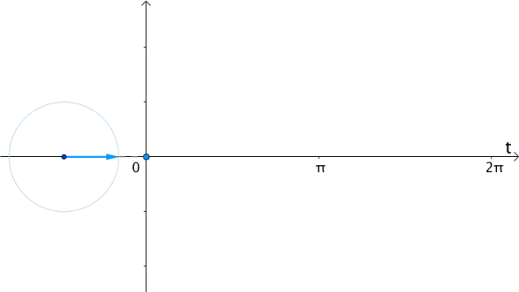
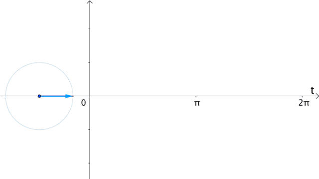
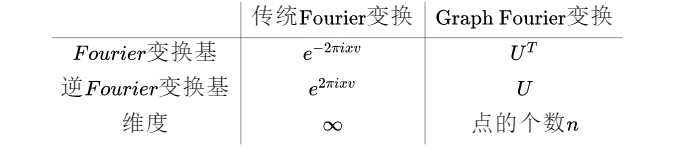

[TOC]

### 1、GCN（Graph Convalutional Network）
##### 1.1、为什么要研究GCN?
　　CNN处理的图像或视频数据中的像素点是排列成很整齐的矩阵，也就是很多论文中提到的（Euclidean Structure），而很多时候我们需要处理的是Non Euclidean Structure的数据，比如社交网络。
  

  


　　这种网络结构在图论中被抽象成图谱图。
  
  **CNN的【平移不变性】在【非矩阵结构】数据上不适用**

- 平移不变性（translation invariance）：比较好理解，在用基础的分类结构比如ResNet、Inception给一只猫分类时，无论猫怎么扭曲、平移，最终识别出来的都是猫，输入怎么变形输出都不变这就是平移不变性，网络的层次越深这个特性会越明显。
- 平移可变性（translation variance）：针对目标检测的，比如一只猫从图片左侧移到了右侧，检测出的猫的坐标会发生变化就称为平移可变性。当卷积网络变深后最后一层卷积输出的feature map变小，物体在输入上的小偏移，经过N多层pooling后在最后的小feature map上会感知不到，这就是为什么R-FCN原文会说网络变深平移可变性变差。

离散卷积本质就是一种加权求和。CNN中的卷积就是一种离散卷积，本质上就是利用一个共享参数的过滤器（kernel），通过计算中心像素点以及相邻像素点的加权和来构成feature map实现空间特征的提取，当然加权系数就是卷积核的权重系数(W)。

那么卷积核的系数如何确定的呢？是随机化初值，然后根据误差函数通过反向传播梯度下降进行迭代优化。这是一个关键点，卷积核的参数通过优化求出才能实现特征提取的作用，**GCN的理论很大一部分工作就是为了引入可以优化的卷积参数。**

图数据中的空间特征具有以下特点：
1. 节点特征：每个节点有自己的特征；（体现在点上）
2. 结构特征：图数据中的每个节点具有结构特征，即节点与节点存在一定的联系。（体现在边上）

总地来说，图数据既要考虑节点信息，也要考虑结构信息，图卷积神经网络就可以自动化地既学习节点特征，又能学习节点与节点之间的关联信息。**GCN是要为除CV、NLP之外的任务提供一种处理、研究的模型。图卷积的核心思想是利用『边的信息』对『节点信息』进行『聚合』从而生成新的『节点表示』。**

##### 1.2、提取拓扑图中空间特征的两种方式

**GCN的本质目的就是用来提取拓扑图的空间特征。** 而图卷积神经网络主要有两类，一类是基于空间域或顶点域vertex domain(spatial domain)的，另一类则是基于频域或谱域spectral domain的。通俗点解释，空域可以类比到直接在图片的像素点上进行卷积，而频域可以类比到对图片进行傅里叶变换后，再进行卷积。

**１、Vertex domain(spatial domain)**：本质是提取拓扑图上每个顶点相邻的neighbors。
解决两个问题：
　　(1)、根据什么条件去找中心vertex的neighbors，也就是如何确定receptive field？
　　(2)、给定了receptive field，按照什么方式处理包含不同数目neighbours的特征？
  
这种方式很明显要对单个顶点做计算处理，提取的图的空间特征相当于对每个顶点的处理结果的集合。
	   
**２、Spectral domain**：这是GCN的理论基础，本质是借助图论的相关理论来实现拓扑图上的卷积操作。从整个研究的时间进程来看：首先研究GSP（graph signal processing）的学者定义了graph上的Fourier Transformation，进而定义了graph上的convolution，最后与深度学习结合提出了Graph Convolutional Network。
理论基础：
　　(1)、谱图理论(Spectral Graph Theory)：借助图的拉普拉斯矩阵的特征值和特征向量研究图的性质。
　　(2)、Graph上的傅里叶变换(Fourier Transformation)
　　(3)、GSP(graph signal processing)
  
### 2、 图的拉普拉斯矩阵

**拉普拉斯矩阵(Laplacian matrix) 也叫做导纳矩阵、基尔霍夫矩阵或离散拉普拉斯算子，主要应用在图论中，作为一个图的矩阵表示。** 对于图 `!$G=(V,E)$`，其Laplacian 矩阵的定义为 `!$L=D-A$`，其中 L 是Laplacian 矩阵， `!$D=diag(d)$` 是顶点的度矩阵（对角矩阵）,`!$d=rowSum(A)$`，对角线上元素依次为各个顶点的度， A 是图的邻接矩阵。

Graph Fourier Transformation及Graph Convolution的定义都用到图的拉普拉斯矩阵。**频域卷积的前提条件是图必须是无向图，只考虑无向图，那么L就是对称矩阵。**

##### 2.1、常见的拉普拉斯矩阵

对于图 `!$G=(V,E)$` ，常见的拉普拉斯矩阵有：

**No.1 Combinatorial Laplacian(组合拉普拉斯)：`!$L=D-A$`**
其中 `!$L$` 是Laplacian矩阵，`!$D$` 是顶点的度矩阵，是一个对角矩阵，对角上的元素依次为各个顶点的度，`!$A$` 是图的邻接矩阵，计算方法示例如图：


其中 `!$L$` 由下列公式给出：
```mathjax!
$$
L_{i,j}:=
\begin{cases}
deg(v_i) &  & {if \ i = j}                                  \\
-1       &  & {if\ i\neq j\ and\ v_i\ is\ adjacent\ to\ v_j} \\
0        &  & {otherwise}
\end{cases}
$$
```
其中`!$deg(v_i)$` 是顶点`!$i$` 的度。

 **No.2 Symmetric normalized Laplacian(对称归一化拉普拉斯)：`!$L^{sys}:=D^{-1/2}LD^{-1/2}=I-D^{-1/2}AD^{-1/2}$`**
	   其中 `!$L_{i,j}^{sym}$` 由下列公式给出：
```mathjax!
$$
L_{i,j}^{sym}:=
\begin{cases}
1        &  & {if \ i = j}\ and\ deg(v_i)\neq 0                 \\
-\frac{1}{\sqrt{deg(v_i)deg(v_j)}} & & {if\ i\neq j\ and\ v_i\ is\ adjacent\ to\ v_j} \\
0        &  & {otherwise}
\end{cases}
$$
```
我们可以看看 `!$D^{-1/2}AD^{-1/2}$`发生了什么，`!$D$` 为只有主对角线上元素非０的对角阵，`!$A$`中记录顶点间的邻接信息，  `!$D^{-1/2}AD^{-1/2}$`　使得`!$A$`中第`!$i$`行和第`!$i$`列的值都除以`!$\sqrt{D_{ii}}$`。

 **No.3 Random walk normalized Laplacian(随机游走归一化拉普拉斯)：`!$L^{rw}:=D^{-1}L=I-D^{-1}A$`**
	   其中 `!$L_{i,j}^{rw}$` 可以由下列方式计算：
```mathjax!
$$
L_{i,j}^{sym}:=
\begin{cases}
1        &  & {if \ i = j}\ and\ deg(v_i)\neq 0                 \\
-\frac{1}{deg(v_i)} & & {if\ i\neq j\ and\ v_i\ is\ adjacent\ to\ v_j} \\
0        &  & {otherwise}
\end{cases}
$$
```
 **No.4 Generalized Laplacian(泛化的拉普拉斯)：**
 
泛化的拉普拉斯(用得少)定义为:
```mathjax!
$$
\begin{cases}
Q_{i,j}&lt;0 &amp; i \ \neq \ j \ and \ diag(v_i) \ \neq \ 0\\
Q_{i,j}=0 &amp; i \neq j \ and \  v_i \  is\  adjacent \  to \  v_j\\
any number &amp; otherwise
\end{cases}
$$
```
一个拉普拉斯矩阵的计算例子（图 3）：
```mathjax!
$$
A=\left\{
 \begin{matrix}
   0 &amp; 1 &amp; 0 &amp; 0 &amp; 1 &amp; 0\\
   1 &amp; 0 &amp; 1 &amp; 0 &amp; 1 &amp; 0\\
   0 &amp; 1 &amp; 0 &amp; 1 &amp; 0 &amp; 0\\
   0 &amp; 0 &amp; 1 &amp; 0 &amp; 1 &amp; 1\\
   1 &amp; 1 &amp; 0 &amp; 1 &amp; 0 &amp; 0\\
   0 &amp; 0 &amp; 0 &amp; 1 &amp; 0 &amp; 0
  \end{matrix}
  \right\}
  ，
  D=
  \left\{
 \begin{matrix}
   2 &amp; 0 &amp; 0 &amp; 0 &amp; 0 &amp; 0\\
   0 &amp; 3 &amp; 0 &amp; 0 &amp; 0 &amp; 0\\
   0 &amp; 0 &amp; 2 &amp; 0 &amp; 0 &amp; 0\\
   0 &amp; 0 &amp; 0 &amp; 3 &amp; 0 &amp; 0\\
   0 &amp; 0 &amp; 0 &amp; 0 &amp; 3 &amp; 0\\
   0 &amp; 0 &amp; 0 &amp; 0 &amp; 0 &amp; 1
  \end{matrix}
  \right\}, \\
  L=D-A=
  \left\{
 \begin{matrix}
   2 &amp; -1 &amp; 0 &amp; 0 &amp; -1 &amp; 0\\
   -1 &amp; 3 &amp; -1 &amp; 0 &amp; -1 &amp; 0\\
   0 &amp; -1 &amp; 2 &amp; -1 &amp; 0 &amp; 0\\
   0 &amp; 0 &amp; -1 &amp; 3 &amp; -1 &amp; -1\\
   -1 &amp; -1 &amp; 0 &amp; -1 &amp; 3 &amp; 0\\
   0 &amp; 0 &amp; 0 &amp; -1 &amp; 0 &amp; 1
  \end{matrix}
  \right\} 
 $$
 ```
可以看出，标准归一化的拉普拉斯矩阵还是对称的，并且符合前面的公式定义。

Graph Convolution与Diffusion相似之处：从Random walk normalized Laplacian就能看出了两者确有相似之处（其实两者只差一个相似矩阵的变换，可参考Diffusion-Convolutional Neural Networks)

##### 2.2、对于拉普拉斯矩阵定义的理解
　　１、先从拉普拉斯算子说起，拉普拉斯算子数学定义是这样的： 
```mathjax!
$$\triangle = \sum_i\frac {\partial^2} {\partial x_i^2}\\$$
```
其含义很明确，是非混合二阶偏导数的和！

　　２、再看图像处理上是怎么近似的：
　　图像是一种离散数据，那么其拉普拉斯算子必然要进行离散化。由导数定义：
```mathjax!
$$
\begin{aligned} f'(x) &= \frac {\partial f(x)}{\partial x}\\ & = \lim_{\delta \to 0} \frac{f(x+\delta)-f(x)}{\delta}\\ & \approx^{离散化}
f(x+１)-f(x)\end{aligned}\\
$$
```
　　得出：
```mathjax!
$$
\begin{aligned} \frac {\delta^2 f(x)}{\delta x^2} &= f''(x) \\ &\approx f'(x)-f'(x-1) \\ &\approx f(x+1)-f(x) - (f(x) - f(x-1))\\ &=f(x+1)+f(x-1)-2f(x) \end{aligned}\\ 
$$
```
**结论1：二阶导数近似等于其二阶差分。
结论2：二阶导数等于其在所有自由度上微扰之后获得的增益。**

　　一维函数其自由度可以理解为 `!$2$`，分别是 `!$+1$` 和 `!$-1$` 两个方向。对于二维的图像来说，其有两个方向（`!$4$` 个自由度）可以变化，即如果对 `!$(x,y)$` 处的像素进行扰动，其可以变为四种状态 `!$(x+1,y)，(x-1,y)，(x,y+1)，(x,y-1)$`。当然了，如果将对角线方向也认为是一个自由度的话，会再增加几种状态 `!$(x+1,y+1)，(x+1,y-1)，(x-1,y+1)，(x-1,y-1)$`，事实上图像处理正是这种原理。
　　同理，将拉普拉斯算子离散化：
```mathjax!
$$
\begin{aligned} \triangle &=\frac {\delta^2 f(x,y)}{\delta x^2} + \frac {\delta^2 f(x,y)}{\delta y^2} \\ &\approx f(x+1,y)+f(x-1,y)-2f(x,y) + [f(x,y+1)+f(x,y-1)-2f(x,y)]\\ &= f(x+1,y)+f(x-1,y)+f(x,y+1)+f(x,y-1)-4f(x,y) \end{aligned}\\
$$
```
　　上式可以理解为，在图像上某一点，其拉普拉斯算子的值，即为对其进行扰动，使其变化到相邻像素后得到的增益。这给我们一种形象的结论：拉普拉斯算子就是在所有自由度上进行微小变化后获得的增益。
　　推广到Graph，对于有 `!$N$` 个节点的Graph，就设节点为 `!$1,...,N$` 吧，且其邻接矩阵为 `!$A$`。这个Graph的自由度最多为 `!$N$`。因为如果该图是一个完全图，即任意两个节点之间都有一条边，那么对一个节点进行微扰，它可能变成任意一个节点。那么上面的函数 `!$f$` 就理所当然是一个 `!$N$` 维的向量，即：
```mathjax!
$$f = (f_1,...,f_N)$$
```
　　其中 `!$f_i$` 即表示函数 `!$f$` 在节点 `!$i$` 的值。类比 `!$f(x,y)$` 即为 `!$f$` 在 `!$(x,y)$` 处的值。对于任意节点 `!$i$` 进行微扰，它可能变为任意一个与他相邻的节点 `!$j\in\mathcal{N_i}$` ，其中 `!$\mathcal{N_i}$` 表示节点 `!$i$` 的一阶邻域节点。
　　对于Graph，从节点 `!$i$` 变化到节点 `!$j$` 增益是多少呢？即 `!$f_j-f_i$` 是多少？最容易想到就是和他们之间的边权相关。此处用 `!$A_{ij}$` 表示。那么，对于节点 `!$i$` 来说，其变化的增益:
```mathjax!
$$\sum_{j\in\mathcal{N}_i}A_{ij}[f_j-f_i]$$
```
　　所以，对于Graph来说，其拉普拉斯算子如下：
```mathjax!
$$
\begin{aligned} (\triangle f)_i &=\sum_i \frac {\delta^2 f} {\delta i^2}\\ &\approx \sum_{j\in\mathcal{N}_i}A_{ij}[f_j-f_i] \end{aligned}\\
$$
```
　　上式 `!$j\in\mathcal{N}_i$` 可以去掉，因为节点 `!$i$` 和 `!$j$` 不直接相邻的话， `!$A_{ij} = 0$`；
　　继续化简一下：
```mathjax!
$$
\begin{aligned} \sum_{j\in\mathcal{N}_i}A_{ij}[f_j-f_i]&=\sum_{j}A_{ij}f_j - \sum_{j}A_{ij}f_i\\ &=(Af)_i - (Df)_i \\ &=[(A-D)f]_i \end{aligned}\\
$$
```
　　即:
```mathjax!
$$(\triangle f)_i =[(A-D)f]_i$$
```
　　对于任意的 `!$i$` 成立，那么也就是：
```mathjax!
$$\triangle f \equiv(A-D)f $$
```
　　因此图上的拉普拉斯算子应该定义为 `!$A-D$`。
##### 2.3、拉普拉斯矩阵的性质

1. 拉普拉斯矩阵是对称矩阵，可以进行特征分解（谱分解），这就是GCN的spectral domain所依据的。
2. 拉普拉斯矩阵只在中心顶点和一阶相连的顶点上（1-hop neighbor）有非0元素，其余之处均为0。
3. 拉普拉斯矩阵存在一个为零的特征值（秩为 `!$|V|-1$`），其余特征值大于零，因此为半正定矩阵。
4. 特征值中0出现的次数就是图连通区域的个数。
5. 最小特征值是0，因为拉普拉斯矩阵（普通形式：`!$L=D−A$`）每一行的和均为0，并且最小特征值对应的特征向量是每个值全为1的向量；
6. 最小非零特征值是图的代数连通度。

**拉普拉斯矩阵的半正定性证明如下：**
要证明拉普拉斯矩阵是半正定的，只需要证明其二次型 `!$f^TLf \ge 0$`：
```mathjax!
$$
\begin{aligned}
f^TLf &amp; =f^TDf-f^TAf \\
&amp; = f^T*diag(d)*f-f^TAf \\
&amp; =\sum_{i=1}^m d_i f_i^2-\sum_{j=1}^m[\sum_{i=1}^m f_j*a_{ij}]f_j \\
&amp; =\sum_{i=1}^m d_i f_i^2-\sum_{i,j=1}^m f_i*f_j*a_{ij} \\
&amp; =\frac{1}{2} [ \sum_{i=1}^md_if_i^2-2\sum_{i,j=1}^m f_i f_j a_{ij}+\sum_{j=1}^m d_j f_j^2 ] \\
&amp; = \frac{1}{2}\sum_{i,j=1}^m a_{ij}(f_i-f_j)^2 \\
\end{aligned}
$$
```
所以，对于任意一个属于实向量 `!$\mathbb{R}^m$` ( `!$f$` 为 `!$m\times 1$` 的实数列向量 )，都有此公式成立

```mathjax!
$$f^TLf = \frac{1}{2}\sum_{i,j=1}^m a_{ij}(f_i-f_j)^2$$
```

##### 2.4、拉普拉斯矩阵的谱分解
　　首先说明的是，矩阵的特征分解、谱分解、对角化是同一个概念。GCN的核心基于拉普拉斯矩阵的谱分解。
  
　　特征分解（Eigendecomposition），又称谱分解（Spectral decomposition）是将矩阵分解为由其特征值和特征向量表示的矩阵之积的方法。矩阵可以特征分解的充要条件为n阶方阵存在n个线性无关的特征向量，即可对角化。但是拉普拉斯矩阵是半正定对称矩阵（半正定矩阵本身就是对称矩阵），有如下三个性质：
 - 对称矩阵一定n个线性无关的特征向量
 - 半正定矩阵的特征值一定非负
 - 对阵矩阵的特征向量相互正交，即所有特征向量构成的矩阵为正交矩阵。

由上可以知道拉普拉斯矩阵一定可以谱分解，且分解后有特殊的形式。
对于拉普拉斯矩阵，起谱分解为：
```mathjax!
    $$
	L=U\begin{pmatrix}
    \lambda_1 & & \\
                         &\ddots & \\
                         & &\lambda_n \\
    \end{pmatrix}U^{-1}
	$$
```
其中 `!$U=(\vec{u_1},\vec{u_2},\cdots,\vec{u_n}) $`是列向量为单位特征向量的矩阵，也就说 `!$\vec{u_l}$` 是列向量。
```mathjax!
    $$
	\begin{pmatrix}
    \lambda_1 & & \\
                         &\ddots & \\
                         & &\lambda_n \\
    \end{pmatrix}
	$$
```
是 n 个特征值构成的对角阵。
由于 `!$U$` 是正交矩阵，即 `!$UU^{T}=E$`， 所以特征分解又可以写成：
```mathjax!
    $$
	L=U\begin{pmatrix}
    \lambda_1 & & \\
                         &\ddots & \\
                         & &\lambda_n \\
    \end{pmatrix}U^{T}
	$$
```
注意的是特征分解最右边的是特征矩阵的逆，只是拉普拉斯矩阵的性质才可以写成特征矩阵的转置。

##### 2.5、拉普拉斯算子

定义：拉普拉斯算子是 n 维欧几里德空间中的一个二阶微分算子，定义为梯度 `!$\nabla f$` 的散度（`!$\nabla \cdot f$`，即 `!$\nabla f\cdot f$`）。因此如果 `!$f$` 是二阶可微的实函数，则 `!$f$` 的拉普拉斯算子 `!$\Delta$` 定义为：
```mathjax!
$$
\Delta f=\nabla^2 f=\nabla \cdot \nabla f
$$
```
`!$f$` 的拉普拉斯算子也是笛卡尔坐标系 `!$x_i$` 中的所有非混合二阶偏导数：
```mathjax!
$$
\Delta f=\sum_{i=1}^n \frac{\partial^2f}{\partial x_i^2}
$$
```

函数 `!$f$` 的拉普拉斯算子也是该函数的海塞矩阵(是一个多元函数的二阶偏导数构成的方阵)的迹：
```mathjax!
$$
\Delta f=tr(H(f))
$$
```

拉普拉斯算子(Laplacian operator) 的物理意义是空间二阶导，准确定义是：标量梯度场中的散度，一般可用于描述物理量的流入流出。比如说在二维空间中的温度传播规律，一般可以用拉普拉斯算子来描述。

**拉普拉斯矩阵也叫做离散的拉普拉斯算子。**

##### 2.6、为什么GCN要用拉普拉斯矩阵？
- 拉普拉斯矩阵是对称矩阵，可以进行特征分解（谱分解）
- 由于卷积在傅里叶域的计算相对简单，为了在graph上做傅里叶变换，需要找到graph的连续的正交基对应于傅里叶变换的基，因此要使用拉普拉斯矩阵的特征向量。

### 3、 傅里叶变换

##### 3.1、连续形式的傅立叶变换

任意函数可以分解为奇偶函数之和：
```mathjax!
$$
f(x)=\frac{f(x)+f(-x)}{2} + \frac{f(x)-f(-x)}{2}=f_{even}+f_{odd}
$$
```
任意一个周期函数可以由若干个正交函数（由 `!$sin,cos$` 构成）的线性组合构成，写出傅里叶级数的形式如下：
```mathjax!
$$
\displaystyle f(x)=a_0+\sum _{{n=1}}^{\infty}\left(a_{n}cos({\frac{2\pi n}{T}x})+b_{n}sin({\frac{2\pi n}{T}x})\right),a_0\in\mathbb{R}
$$
```
利用欧拉公式 `!$e^{ix}=\cos x+i \sin x$` （这里的指复数中的 `!$i$`），`!$cos x,sin x$`可表示成：
```mathjax!
$$
\cos x=\frac{e^{ix} +e^{-ix}}{2} ,\sin x=\frac{e^{ix} -e^{-ix}}{2i} 
$$
```
在时间t轴上，把 `!$e^{it}$`向量的虚部（也就是纵坐标）记录下来，得到的就是 `!$sin(t)$`：


在时间 `!$t$` 轴上，把 `!$e^{i2t}$` 向量的虚部记录下来，得到的就是 `!$sin(2t)$`：



如果在时间t轴上，把 `!$e^{it}$` 的实部（横坐标）记录下来，得到的就是 `!$cos(t)$` 的曲线：



更一般的,具有两种看待 `!$sin,cos$` 的角度：
```mathjax!
$$
e^{i\omega t}\iff \begin{cases}sin(\omega t)\\cos(\omega t)\end{cases}
$$
```
这两种角度，一个可以观察到旋转的频率，所以称为频域；一个可以看到流逝的时间，所以称为时域：


所以，任意周期函数可以以 `!$e^{i\omega t}$` 为基函数用傅里叶级数的指数形式表示。即，对于一个周期函数`!$f(x)$` 以傅里叶级数的指数形式表示为：
```mathjax!
$$
f(x)=\sum ^{\infty }_{n=-\infty }\underbrace{c_{n}}_{\text{基的坐标}} \cdot \underbrace{e^{i\tfrac{2\pi nx}{T}}}_{\text{正交基}}
$$
```
但是对于非周期函数，并不能用傅里叶级数的形式表示。但是还是用某个周期函数 `!$f_T(x)$` 当 `!$T \rightarrow \infty$` 来逼近，即 `!$\lim_{T \rightarrow \infty} f_T(x)=f(x)$`，用积分的形式可以表示为：
```mathjax!
$$
f(x) = \int_{-\infty}^\infty [\int ^{+\infty }_{-\infty } f(x)e^{-i\omega x} dx]\ e^{i\omega x}\,d\omega=\int_{-\infty}^\infty F(\omega)\ e^{i\omega x}\,d\omega
$$
```
其中，`!$F( \omega )$` 就是 `!$f(x)$` 的连续形式的傅里叶变换：
```mathjax!
$$
F( \omega ) =\mathcal{F}[f(x)]=\int ^{+\infty }_{-\infty } f(x)e^{-i\omega x} dx
$$
```
可以看出，`!$f(x)$`  和 `!$F( \omega )$` 可以通过指定的积分运算相互表达。

当然，也可以利用欧拉公式通过 `!$cos$` 和 `!$sin$` 函数表示为 `!$F(u)$`：
```mathjax!
$$
F(u)=\int_{-\infty}^{+\infty}f(x)\left[cos(2\pi xu)-i sin(2\pi xu)\right]dx
$$
```
所以，对函数 `!$f(x)$` 的傅里叶变换 `!$\mathcal{F}$` 和傅里叶的逆变换 `!$\mathcal{F}^{-1}$` 记作：
```mathjax!
$$
F( \omega )=\mathcal{F}[f(x)],f(x)=\mathcal{F}^{-1}[F(\omega)] \\
$$
```

- `!$F(ω)$` 叫做 `!$f(x)$` 的象函数或傅里叶变换，即通过傅里叶变换后关于频率的函数，函数图像就是频谱图，`!$\omega$` 就是 `!$f$` 对应在频域中的频率。
- `!$f(x)$` 叫做 `!$F(\omega)$` 的原象函数。

其实可以发现这个对信号 `!$f(x)$` 的傅立叶变换 `!$F(\omega)$` 形式上是 `!$f(x)$` 与基函数 `!$e^{-i\omega x}$`  的积分，本质上将函数 `!$f(x)$` 映射到了以 `!$e^{-i\omega x}$` 为基向量的空间中。

##### 3.2、频域（frequency domain）和时域（time domain）的理解

**时域：真实量到的信号的时间轴，代表真实世界。
频域：为了做信号分析用的一种数学手段。**

要理解时域和频域只需要看下面两张动图就可以了：


上图来自于维基百科，图中红色部分就是原函数f(x)在时域里面的曲线图，此函数经过傅里叶变换后可以分解成很多如右图中的曲线。在左图中的的蓝色线就是对应的频域中的频谱图。


频谱图里的竖线分别代表了不同频率的正弦波函数，也就是之前的基，而高度则代表在这个频率上的振幅，也就是这个基上的坐标分量。

很多在时域看似不可能做到的数学操作，在频域相反很容易。这就是需要傅里叶变换的地方。尤其是从某条曲线中去除一些特定的频率成分，这在工程上称为滤波，是信号处理最重要的概念之一，只有在频域才能轻松的做到。

**看一个傅里叶变换去噪的例子：**
在傅里叶变换前，图像上有一些规律的条纹，直接在原图上去掉条纹有点困难，但我们可以将图片通过傅里叶变换变到频谱图中，频谱图中那些规律的点就是原图中的背景条纹。


只要在频谱图中擦除这些点，就可以将背景条纹去掉，得到下图右侧的结果。


##### 3.3、周期性离散傅里叶变换（Discrete Fourier Transform, DFT）
傅里叶变换有连续时间非周期傅里叶变换，连续时间周期性傅里叶变换，离散时间非周期傅里叶变换和离散时间周期性傅里叶变换，鉴于计算机主要处理离散周期性信号，本文主要介绍周期性离散时间傅里叶变换（DFT）。信号 `!$x_n$` 的傅里叶变换 `!$X_k$` 为：
```mathjax!
$$
X_k=\sum_{n=0}^{N-1}x_n e^{-i \frac{2\pi}{N}kn}
$$
```
信号 `!$x_n$` 用其傅里叶变换  `!$X_k$` 表示为：
`!$x_n$` 的傅里叶变换 `!$X_k$` 为：
```mathjax!
$$
x_n=\sum_{n=0}^{N-1}X_k e^{i \frac{2\pi}{N}kn}
$$
```
其中，`!$N$` 表示傅里叶变换的点数，`!$k$` 表示傅里叶变换的第 `!$k$` 个频谱

### 4、 Graph上的傅里叶变换

**把传统的傅里叶变换以及卷积迁移到Graph上来，核心工作其实就是把拉普拉斯算子的特征函数 `!$e^{-i\omega t}$` 变为Graph对应的拉普拉斯矩阵的特征向量。**

傅立叶变换与拉普拉斯矩阵的关系：**传统傅立叶变换的基，就是拉普拉斯矩阵的一组特征向量。**

##### 4.1、傅里叶变换
 ```mathjax!
 $$
 F(\omega)=\mathcal{F}[f(t)]=\int_{}^{}f(t)e^{-i\omega t} dt
 $$
 ```
传统的傅里叶变换定义为信号 `!$f(t)$` 与基函数 `!$e^{-i\omega t}$` 的积分，那么为什么要找 `!$e^{-i\omega t}$` 作为基函数呢？从数学上看， `!$e^{-i\omega t}$` 是拉普拉斯算子的特征函数（满足特征方程），`!$ \omega $` 就和特征值有关。
 广义的特征方程定义为：
```mathjax!
$$A V=\lambda V$$
```
其中 A 是一种变换， V 是特征向量或者特征函数（无穷维的向量），`!$ \lambda $` 是特征值。
`!$e^{-i\omega t} $` 满足：
```mathjax!
$$
 \Delta e^{-i\omega t}=\frac{\partial^{2}}{\partial t^{2}} e^{-i\omega t}=-\omega^{2} e^{-i\omega t}\
 $$
 ```
当然 `!$e^{-i\omega t} $` 就是变换 `!$\Delta$` 的特征函数， `!$\omega$` 和特征值密切相关。
在处理Graph问题的时候，用到拉普拉斯矩阵（拉普拉斯矩阵就是离散拉普拉斯算子），对其进行特征分解，`!$L$` 是拉普拉斯矩阵， `!$V$` 是其特征向量，自然满足特征方程：
```mathjax!
$$LV=\lambda V $$
```

前面讲到可以用一组正交函数 `!$cos$` 和 `!$sin$` (或 `!$e^{-i\omega t}$` 表示任意函数，且傅里叶变换是连续形式的，在处理Graph时，用到的是傅里叶变换的离散形式。由于拉普拉斯矩阵进行谱分解以后，可以得到 `!$n$` 个线性无关的特征向量，构成空间中的一组正交基，因此归一化拉普拉斯矩阵算子的特征向量构成了图傅里叶变换的基。图傅里叶变换将输入图的信号投影到了正交空间，相当于把图上定义的任意向量，表示成了拉普拉斯矩阵特征向量的线性组合。



离散积分就是一种内积形式，仿上定义Graph上的傅里叶变换：
```mathjax!
$$
F(\lambda_l)=\hat{f}(\lambda_l)=\sum_{i=1}^{N}{f(i) u_l^*(i)}
$$
```
`!$f$` 是Graph上的 `!$N$` 维向量，`!$f(i)$` 与Graph的顶点一一对应， `!$u_l(i)$` 表示第 `!$l$` 个特征向量的第 `!$i$` 个分量。那么特征值（频率） `!$\lambda_l$` 下的，`!$f$` 的Graph傅里叶变换就是与 `!$\lambda_l$` 对应的特征向量 `!$u_l(i)$` 进行内积运算。
注：上述的内积运算是在复数空间中定义的，所以采用了`!$u_l^*$`，也就是特征向量 `!$u_l$` 的共轭。

**利用矩阵乘法将Graph上的傅里叶变换推广到矩阵形式：**
```mathjax!
$$
\left(\begin{matrix} \hat{f}(\lambda_1)\\ \hat{f}(\lambda_2) \\ \vdots \\\hat{f}(\lambda_N) \end{matrix}\right)=\left(\begin{matrix}\ u_1(1) &u_1(2)& \dots &u_1(N) \\u_2(1) &u_2(2)& \dots &u_2(N)\\ \vdots &\vdots &\ddots & \vdots\\ u_N(1) &u_N(2)& \dots &u_N(N) \end{matrix}\right)\left(\begin{matrix}f(1)\\ f(2) \\ \vdots \\f(N) \end{matrix}\right)
$$
```
即 `!$f$` 在Graph上傅里叶变换的矩阵形式为：`!$\hat{f}=U^{-1}f \qquad(a)$`， 式中 `!$U^{-1}$` 等于 `!$U^T$`。

##### 4.2、傅里叶逆变换
传统的傅里叶逆变换是对频率 `!$\omega $` 求积分：
```mathjax!
$$
\mathcal{F}^{-1}[F(\omega)]=\frac{1}{2\Pi}\int_{}^{}F(\omega)e^{i\omega t} d\omega
$$
```
迁移到Graph上变为对特征值 `!$\lambda_l$` 求和：
```mathjax!
$$f(i)=\sum_{l=1}^{N}{\hat{f}(\lambda_l) u_l(i)}$$
```
**利用矩阵乘法将Graph上的傅里叶逆变换推广到矩阵形式：**
```mathjax!
$$
\left(\begin{matrix}f(1)\\ f(2) \\ \vdots \\f(N) \end{matrix}\right)= \left(\begin{matrix}\ u_1(1) &u_2(1)& \dots &u_N(1) \\u_1(2) &u_2(2)& \dots &u_N(2)\\ \vdots &\vdots &\ddots & \vdots\\ u_1(N) &u_2(N)& \dots &u_N(N) \end{matrix}\right) \left(\begin{matrix} \hat{f}(\lambda_1)\\ \hat{f}(\lambda_2) \\ \vdots \\\hat{f}(\lambda_N) \end{matrix}\right)
$$
```
即 `!$f$` 在Graph上傅里叶逆变换的矩阵形式为：`!$f=U\hat{f} \qquad(b)$`。

### 5、 Graph上的卷积
　　卷积定理：函数卷积的傅里叶变换是函数傅立叶变换的乘积，即对于函数 `!$f(t)$` 与 `!$h(t)$` 两者的卷积是其函数傅立叶变换乘积的逆变换：
  ```mathjax!
  $$
f*h=\mathcal{F}^{-1}\left[ \hat{f}(\omega)\hat{h}(\omega) \right]=\frac{1}{2\Pi}\int_{}^{} \hat{f}(\omega)\hat{h}(\omega)e^{i\omega t} d\omega
$$
```
利用卷积定理类比来将卷积运算，推广到Graph上，并把傅里叶变换的定义带入，`!$f$` 与卷积核 `!$h$` 在Graph上的卷积可按下列步骤求出：
`!$f$` 的傅里叶变换为 `!$\hat{f}=U^Tf$`，卷积核 `!$h$` 的傅里叶变换写成对角矩阵的形式即为：
```mathjax!
$$
\left(\begin{matrix}\hat h(\lambda_1) & \\&\ddots \\ &&\hat h(\lambda_n) \end{matrix}\right)
$$
```
`!$\hat{h}(\lambda_l)=\sum_{i=1}^{N}{h(i) u_l^*(i)}$` 是根据需要设计的卷积核 `!$h$`在Graph上的傅里叶变换。
两者的傅立叶变换乘积即为：
```mathjax!
$$
\left(\begin{matrix}\hat h(\lambda_1) & \\&\ddots \\ &&\hat h(\lambda_n) \end{matrix}\right)U^Tf
$$
```
再乘以 `!$U$` 求两者傅立叶变换乘积的逆变换，则求出卷积：
```mathjax!
$$
(f*h)_G= U\left(\begin{matrix}\hat h(\lambda_1) & \\&\ddots \\ &&\hat h(\lambda_n) \end{matrix}\right) U^Tf \qquad(1)
$$
```
式中： `!$U$`及 `!$U^{T}$` 的定义与前面的相同。
注：很多论文中的Graph卷积公式为：
```mathjax!
$$(f*h)_G=U((U^Th)\odot(U^Tf)) \qquad(2)$$
```
`!$\odot $` 表示hadamard product（哈达马积），对于两个向量，就是进行内积运算；对于维度相同的两个矩阵，就是对应元素的乘积运算。
其实式(2)与式(1)是完全相同的。因为
```mathjax!
$$\left(\begin{matrix}\hat h(\lambda_1) & \\&\ddots \\ &&\hat h(\lambda_n) \end{matrix}\right)$$
```
与 `!$U^Th$` 都是 `!$h$` 在Graph上的傅里叶变换。
而根据矩阵乘法的运算规则：对角矩阵
```mathjax!
$$\left(\begin{matrix}\hat h(\lambda_1) & \\&\ddots \\ &&\hat h(\lambda_n) \end{matrix}\right)$$
```
与 `!$U^Th$` 的乘积和 `!$U^Th$` 与 `!$U^Tf$` 进行对应元素的乘积运算是完全相同的。

### 6、 拉普拉斯矩阵与傅里叶变换的关系

##### 6.1、为什么拉普拉斯矩阵的特征向量可以作为傅里叶变换的基？
傅里叶变换一个本质理解就是：把任意一个函数表示成了若干个**正交函数**（由sin,cos 构成）的线性组合。


通过第5节中(b)式可以看出，graph傅里叶变换把graph上定义的任意向量 `!$f$` ，表示成了拉普拉斯矩阵特征向量的线性组合，即：
```mathjax!
$$
f=\hat{f}(\lambda_1)u_1+\hat{f}(\lambda_2)u_2+\cdots +\hat{f}(\lambda_n)u_n
$$
```
那么：为什么graph上任意的向量 `!$f$` 都可以表示成这样的线性组合？
原因在于 `!$(\vec{u_1},\vec{u_2},\cdots,\vec{u_n})$` 是graph上 `!$n$` 维空间中的 `!$n$` 个线性无关的正交向量，由线性代数的知识可以知道： `!$n$` 维空间中  `!$n$` 个线性无关的向量可以构成空间的一组基，而且拉普拉斯矩阵的特征向量是一组正交基。

##### 6.2、怎么理解拉普拉斯矩阵的特征值表示频率？
将拉普拉斯矩阵 `!$L$` （半正定矩阵）的 `!$n$` 个非负实特征值，从小到大排列为 `!$\lambda_1 \le \lambda_2 \le \cdots \le \lambda_n$`，而且最小的特征值 `!$\lambda_1=0$`，因为 `!$n$` 维的全 1 特征**strong text**向量对应的特征值为 0（由 L 的定义就可以得出）：
```mathjax!
$$L \left(\begin{matrix}1\\ 1 \\ \vdots \\1 \end{matrix}\right)=0$$
```
从特征方程
```mathjax!
$$Lu=\lambda u $$
```
的数学理解来看，在由Graph确定的 `!$n$` 维空间中，越小的特征值 `!$\lambda_l $` 表明：拉普拉斯矩阵 `!$L$` 其所对应的基 `!$u_l $`上的分量、“信息”越少，当然就是可以忽略的低频部分。其实图像压缩就是这个原理，把像素矩阵特征分解后，把小的特征值（低频部分）全部变成 0，PCA（principal component analysis ( 主成分分析)）降维也是同样的，把协方差矩阵特征分解后，按从大到小取出前 K 个特征值对应的特征向量作为新的“坐标轴”。


**Graph Convolution的理论到这里可以告一段落。**


**参考：**

[1]. [Diffusion-Convolutional Neural Networks](https://arxiv.org/abs/1511.02136)

[2]. [J. Bruna, W. Zaremba, A. Szlam, and Y. LeCun, “Spectral networks and locally connected networks on graphs,” in Proceedings of International Conference on Learning Representations, 2014](https://arxiv.org/abs/1312.6203)

[3]. https://www.zhihu.com/question/54504471/answer/332657604

[4]. https://www.cnblogs.com/SivilTaram/p/graph_neural_network_2.html

[5]. https://blog.csdn.net/yyl424525/article/details/100058264

[6]. https://zhuanlan.zhihu.com/p/54505069