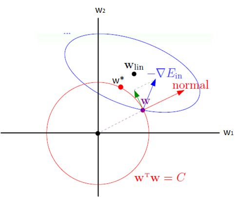
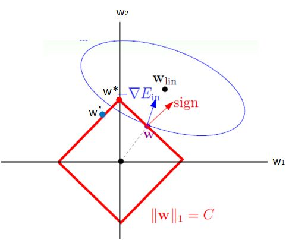
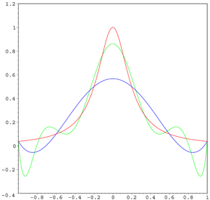
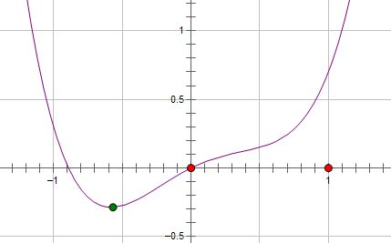
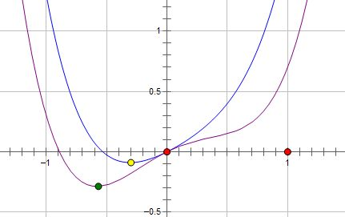
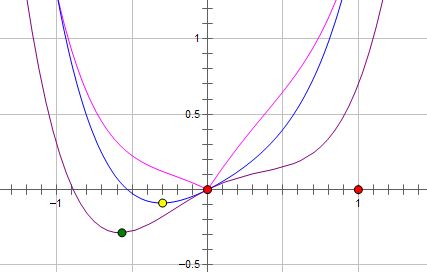
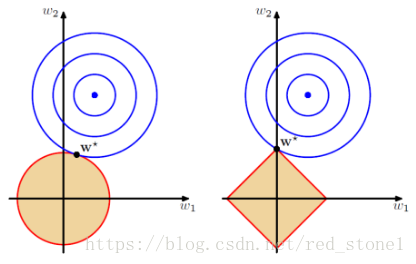
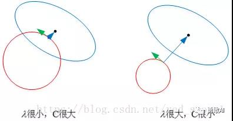

[TOC]

## 1、模型过拟合

#### 1.1、什么是模型的过拟合

训练的模型过拟合，根据方差+偏差的分解，则说明“方差”很大，直观的含义就是，模型的稳定性不强，表现在某一个特征输入数据“稍有波动”，模型的效果会变差。因为在测试集上面的很多数据都是没有见过的，相比于训练数据，难免会有差别，故而如果用一个过拟合的模型，在测试集上面的表现自然不好。就是过度学习训练集的特征导致在训练集上表现好而在测试机上表现差。

我们称这样的模型“太过复杂”了（注意是引号），复杂的体现在于，模型中求出的参数在训练的时候为了“迎合”误差的减少，很多参数很大（过分强调一些特征），很多参数有很小（一些微小的特征），这样就会导致模型会有一种“偏爱”。自然，因为模型的这点偏爱，导致的结果就是，测试集的数据稍有波动，表现就不好了，即所谓的过拟合。与其说是“复杂”，倒不如说是“畸形”更恰当。

#### 1.2、过拟合的解决办法

自然，我们希望遇到更“简单”的模型，“简单”的方式有以下几种：
1. 获取更多的样本
2. 丢弃一部分特征，增强模型的容错能力（比如PCA降维，神经网络的dropout机制）
3. 不丢其特征，保留所有的特征，但是减少参数的大小（magnitude）。确保所有的特征对于预测都有所贡献，而不是“偏爱”某几种特征。

当每一个特征 `!$X_i$` 对 `!$y$` 都有贡献的时候，这样的模型是比较健康稳定的，可以良好地工作，这就是正则化的目的，可以用来解决过拟合。

<p style="color:red">正则化策略：以增大训练误差为代价，来减少测试误差（如果在训练误差上很小，可能出现过拟合的情况）；</p>

这里有一个理解层面的不同：

1. 有的将 L1,L2 称之为正则化，因为这是最普遍的用法，此正则化减少模型的“复杂度”是通过让模型的参数不那么“畸形”实现的，并没有减少参数的个数。
2. 有的将dropout技术也称之为正则化，因为它通过丢弃参数，也达到了减轻模型“复杂度”的目的。
3. 有的甚至更加笼统，只要是能够较轻模型“过拟合”的技术，全部称之为“正则化”毕竟正则化是以增大偏差为代价，减少模型的方差。所以只要是能够防止过拟合的手段，都可以称之为正则化，包括L1,L2（范数约束）,dropout、 drop connect、早停法、数据增强与扩充等等都统称正则法。


## 2、L1、L2正则化

#### 2.1、数学基础

##### 2.1.1. 范数
范数是衡量某个向量空间（或矩阵）中的每个向量的长度或大小。范数的一般化定义：
对实数 `!$p\ge 1$`， 范数定义如下：
```mathjax!
$$
||x||_p := (\sum_{i = 1}^n |x_i|^p)^{\frac{1}{p}}
$$
```

- **L1范数**
当p=1时，是L1范数，其表示某个向量中所有元素绝对值的和。
- **L2范数**
当p=2时，是L2范数， 表示某个向量中所有元素平方和再开根， 也就是欧几里得距离公式。

##### 2.1.2. 拉普拉斯分布
如果随机变量的概率密度函数分布为:
```mathjax!
$$
f(x|\mu,b) = \frac{1}{2b} exp(- \frac{|x-\mu|}{b}) \\
= \frac{1}{2b} \begin{cases} exp(- \frac{\mu - x}{b}), & \text{if } x < \mu \\ exp(- \frac{x - \mu}{b}), & \text{if } x\ge \mu \end{cases}
$$
```

那么它就是拉普拉斯分布。其中，`!$\mu$` 是数学期望，`!$b > 0$` 是振幅。如果 `!$\mu = 0$`，那么，正半部分恰好是尺度为 `!$1/2$` 的指数分布。


##### 2.1.3. 高斯分布
又叫正态分布，若随机变量 X 服从一个数学期望为 `!$\mu$`、标准方差为 `!$\sigma^2$` 的高斯分布，记为：`!$X∼N(\mu,\sigma^2)$`，其概率密度函数为:
```mathjax!
$$
f(x) = \frac{1}{\sigma \sqrt{2\pi}}e^{-\frac{(x - \mu)^2}{2 \sigma^2}}
$$
```

其概率密度函数为正态分布的期望值 `!$\mu$` 决定了其位置，其标准差 `!$\sigma$` 决定了分布的幅度。当 `!$\mu = 0,\sigma = 1$` 时的正态分布是标准正态分布。


#### 2.2、正则化

Regularization：正则化是机器学习中常用的一种技术，主要目的是：**控制模型复杂度，减小过拟合。**

最基本的正则化方法是在原目标（代价）函数的基础上加上一个正则项，对复杂度高的模型进行“惩罚”，数学表达式为：
```mathjax!
$$
\tilde{J}(w;X,y) = J(w;X,y) + \alpha \Omega(w)  \tag{2.1}
$$
```

其中:

`!$X$`：训练样本

`!$y$`：训练样本对应的标签

`!$w$`：权重系数

`!$J()$`：目标函数

`!$\Omega (w)$`：为惩罚项，可以理解为模型“规模”的一种度量

`!$\alpha$`：控制正则化的强弱

不同的 `!$\Omega$` 对不同的权重w有着不同的“偏好”，因而会产生不同的效果

最常用的 `!$\Omega$` 有两种：L1范数和L2范数，带入之后得到：
```mathjax!
$$
l_1 : \Omega(w) = ||w||_1 = \sum_i |w_i| \\
l_2 : \Omega(w) = ||w||_2^2 = \sum_i w_i^2
$$
```

##### 2.2.1、L1/L2正则化来源推导

###### 2.2.1.1、正则化理解之基于约束条件的最优化

对于模型权重系数 `!$w$` 的求解释通过最小化目标函数实现的，也就是求解：
```mathjax!
$$
\underset{w}{min} J(w;X,y)  \tag{2.2}
$$
```
首先，模型的复杂度可以用VC来衡量。通常情况下，模型VC维与系数 `!$w$` 的个数成线性关系：即：**w数量越多，VC越大，模型越复杂**

为了限制模型的复杂度，我们要降低VC，自然的思路就是降低w的数量，即：让 `!$w$` 向量中的一些元素为0或者说限制 `!$w$` 中非零元素的个数。我们可以在原优化问题上加入一些优化条件：
```mathjax!
$$
\underset{w}{min} J(w;X,y) \ \ \ \ \   s.t.||w||_0 \le C   \tag{2.3}
$$
```
其中约束条件中的 `!$||w||_0$` 是指L0范数，表示的是向量 w 中非零元素的个数，让非零元素的个数小于某一个C，就能有效地控制模型中的非零元素的个数，但是这是一个NP问题，不好解，于是我们需要做一定的“松弛”。为了达到我们想要的效果（权重向量w中尽可能少的非零项），我们不再严格要求某些权重 `!$w$` 为0，而是要求权重 w 向量中某些维度的非零参数尽可能接近于0，尽可能的小，这里我们可以使用L1、L2范数来代替L0范数，即：
```mathjax!
$$
\underset{w}{min} J(w;X,y) \ \ \ \ \   s.t.||w||_1 \le C \\
\text{或 } \ \ \ \underset{w}{min} J(w;X,y) \ \ \ \ \   s.t.||w||_2 \le C  \tag{2.4}
$$
```
使用 L2 范数时，为方便后续处理，可对 `1$||w||_2$` 进行平方，此时只需调整 C 的取值即可。利用拉格朗日算子法，我们可将上述带约束条件的最优化问题转换为不带约束项的优化问题，构造拉格朗日函数：
```mathjax!
$$
L(w,\alpha) = J(w;X,y) + \alpha(||w||_1 - C) \\
\text{或 } \ \ \ L(w,\alpha) = J(w;X,y) + \alpha(||w||_2^2 - C)     \tag{2.5}
$$
```
其中`!$\alpha > 0$` ，我们假设 `!$\alpha$` 的最优解为 `!$\alpha^*$`，则对拉格朗日函数求最小化等价于：
```mathjax!
$$
\underset{w}{min}J(w;X,y) + \alpha^* ||w||_1 \\
\text{或 } \ \ \ \underset{w}{min} J(w;X,y) + \alpha^* ||w||_2^2     \tag{2.6}
$$
```

可以看出，上式与 `!$\underset{w}{min}\tilde{J}(w;X,y)$` 等价。

故此，我们得到对 L1 、 L2 正则化的第一种理解：

- L1: 正则化等价于在原优化目标函数中增加约束条件 `!$||w||_1 \le C$`
- L2: 正则化等价于在原优化目标函数中增加约束条件 `!$||w||_2^2 \le C$`

###### 2.2.1.2、正则化理解之最大后验概率估计

在最大似然估计中，是假设权重 `!$w$` 是未知的参数，从而求得对数似然函数：
```mathjax!
$$
l(w) = log[P(y|X;w)] = log\Big[\prod_i P(y^i | x^i;w)\Big]   \tag{2.7}
$$
```
通过假设 `!$y^i$` 的概率分布，即可得到不同的模型。例如若假设 `!$y^i \sim N(w^Tx^i,\sigma^2)$` 的高斯分布，则有：
```mathjax!
$$
\begin{aligned} 
l(w) &= log\Bigg[\prod_i \frac{1}{\sqrt{2\pi}\sigma}e^{-\frac{(y^i - w^Tx^i)^2}{2\sigma^2}}\Bigg] \\ &= -\frac{1}{2\sigma^2} \sum_i(y^i - w^Tx^i)^2 + C 
\end{aligned}  \tag{2.8}
$$
```
式中 `!$C$` 为常数项，由于常数项和系数项不影响 `!$max\ l(w)$` 的解，因而可令 `!$J(w;X,y) = -l(w)$` 即可得到线性回归的代价函数。

在最大后验概率估计中，则将权重 w 看作随机变量，也具有某种分布，从而有：
```mathjax!
$$
P(w|X,y) = \frac{P(w,X,y)}{P(X,y)} = \frac{P(X,y|w)P(w)}{P(X,y)} \propto P(y|X,w)P(w)  \tag{2.9}
$$
```
同样取对数有：
```mathjax!
$$
MAP = log P(w,X,y)P(w) = log P(y|X,w) + log P(w)   \tag{2.10}
$$
```
可以看出后验概率函数为在似然函数的基础上增加了一项 `!$log P(w)$`。`!$P(w)$` 的意义是对权重系数 `!$w$` 的概率分布的先验假设，在收集到训练样本 `!$\{X,y\}$` 后，则可根据 w 在  `!$\{X,y\}$` 下的后验概率对 `!$w$` 进行修正，从而做出对 `!$w$` 更好地估计。

若假设 `!$w_j$` 的先验分布为0均值的高斯分布，即 `!$w_j \sim N(0,\sigma^2)$`，则有：
```mathjax!
$$
\begin{aligned} 
log P(w) &= log \prod_j P(w_j) \\
&= log \prod_j \Bigg[\frac{1}{\sqrt{2\pi}\sigma}e^{-\frac{(w_j)^2}{2\sigma^2}}\Bigg] \\
&= - \frac{1}{2\sigma^2}\sum_j w_j^2 + C' 
\end{aligned}  \tag{2.11}
$$
```
可以看到，在高斯分布下 `!$log P(w)$` 的效果等价于在代价函数中增加 L2 正则项。

若假设 `!$w_j$` 服从均值为 0、参数为 `!$a$` 的拉普拉斯分布，即：
```mathjax!
$$
P(w_j) = \frac{1}{\sqrt{2\pi}\sigma}e^{-\frac{|w_j|}{2\sigma^2}}  \tag{2.12}
$$
```
则有：
```mathjax!
$$
log P(w) = log \prod_j \frac{1}{\sqrt{2\pi}\sigma}e^{-\frac{|w_j|}{2\sigma^2}} = - \frac{1}{a} \sum_j|w_j| + C'  \tag{2.13}
$$
```
可以看到，在拉普拉斯分布下 `!$log P(w)$` 的效果等价于在代价函数中增加 L1 正则项。

故此，我们得到对于 L1 、L2 正则化的第二种理解：

- L1: 正则化可通过假设权重 `!$w$` 的先验分布为拉普拉斯分布，由最大后验概率估计导出；
- L2: 正则化可通过假设权重 `!$w$` 的先验分布为高斯分布，由最大后验概率估计导出。

##### 2.2.2、L1/L2正则化效果分析

###### 2.2.2.1、直观分析

考虑带约束条件的优化解释，对 L2 正则化为：
```mathjax!
$$
\underset{w}{min} J(w;X,y) \ \ \ \ \  s.t. ||w||_2 \le C
$$
```



图中椭圆为原目标函数 `!$J(w)$` 的一条等高线，圆为半径 `!$\sqrt{C}$` 的 L2 范数球。由于约束条件的限制， `!$w$` 必须位于 L2 范数球内。考虑边界上的一点 `!$w$` ，图中蓝色箭头为 `!$J(w)$` 在该处的梯度方向 `!$\nabla J(w)$` ，红色箭头为 L2 范数球在该处的法线方向。由于 `!$w$` 不能离开边界（否则违反约束条件），因而在使用梯度下降法更新 `!$w$` 时，只能朝 `!$\nabla J(w)$` 在 范数球上`!$w$` 处的切线方向更新，即图中绿色箭头的方向。如此 `!$w$` 将沿着边界移动，当 `!$\nabla J(w)$` 与范数球上 `!$w$` 处的法线平行时，此时 `!$\nabla J(w)$` 在切线方向的分量为 0，`!$w$` 将无法继续移动，从而达到最优解 `!$w^*$`（图中红色点所示）。

对于 L1 正则化：
```mathjax!
$$
\underset{w}{min} J(w;X,y) \ \ \ \ \  s.t. ||w||_1 \le C
$$
```



其主要差别在于 L1 、 L2  范数球的形状差异。由于此时每条边界上 `!$w$` 的切线和法线方向保持不变，在图中 `!$w$` 将一直朝着 `!$\nabla J(w)$` 在切线方向的分量沿着边界向左上移动。当 `!$w$` 跨过顶点到达 `!$w'$` 时， `!$\nabla J(w)$` 在切线方向的分量变为右上方，因而 `!$w$` 将朝右上方移动。最终， `!$w$` 将稳定在顶点处，达到最优解 `!$w^*$` 。此时，可以看到 `!$w_1 = 0$` ，这也就是采用 L1 范数会使 `!$w$` 产生稀疏性的原因。

以上分析虽是基于二维的情况，但不难将其推广到多维情况，其主要目的是为了直观地说明 L1 、 L2 正则化最优解的差异，以及L1 范数为什么为产生稀疏性。

###### 2.2.2.2、龙格现象

在数值分析领域中，龙格现象是在一组等间插值点上使用具有高次多项式的多项式插值时出现的区间边缘处的振荡问题。 它是由卡尔·龙格（Runge）在探索使用多项式插值逼近某些函数时的错误行为时发现的。这一发现非常重要，因为它表明使用高次多项式插值并不总能提高准确性。 该现象与傅里叶级数近似中的吉布斯现象相似。



**解决方法：**

使用切比雪夫节点代替等距点可以减小震荡，在这种情况下，随着多项式阶次的增加最大误差逐渐减小。这个现象表明高阶多项式通常不适合用于插值。使用分段多项式样条可以避免这个问题。如果要减小插值误差，那么可以增加构成样条的多项式的数目，而不必是增加多项式的阶次。

###### 2.2.2.3、理论分析
假设原目标函数 `!$\nabla J(w)$` 的最优解为 `!$w^*$` ，并假设其为二阶可导，将 `!$\nabla J(w)$`在 `!$w^*$` 处进行二阶泰勒展开有：
```mathjax!
$$
\hat{J}(w) = J(w^*) + \frac{1}{2}(w - w^*)^T H(w - w^*)
$$
```
式中 `!$H$` 为 `!$J(w)$` 在 `!$w^*$` 处的Hessian矩阵，注意 `!$w^*$` 为 `!$J(w)$` 的最优解，其一阶导数为0，因而式中无一阶导数项。  `!$\hat{J}(w)$` 取得最小值时有：
```mathjax!
$$
\nabla_w\hat{J}(w) = H(w - w^*) = 0
$$
```
由于 L2 正则化的目标函数为在 `!$J(w)$` 中添加
```mathjax!
$$
\Omega(w) = \frac{1}{2}\alpha ||w||_2^2 = \frac{1}{2}\alpha w^Tw
$$
```
因而有：
```mathjax!
$$
\nabla_w\tilde{J}(w) = \nabla_w\hat{J}(w) + \nabla_w\Omega(w) = H(w - w^*) + \alpha w
$$
```
设其最优解为 `!$\tilde{w}$`，则有：
```mathjax!
$$
H(\tilde{w} - w^*) + \alpha \tilde{w} = 0 \\
\tilde{w} = (H + \alpha I)^{-1}Hw^*
$$
```
由于 `!$H$` 是对称矩阵，可对其作特征值分解，即 `!$H = QAQ^T$` ，其中 `!$Q$` 为正交矩阵，且每一列为 `!$H$` 的特征向量，代入上式有：
```mathjax!
$$
\tilde{w} = Q(\Lambda + \alpha I)^{-1}\Lambda Q^T w^*
$$
```
`!$\Lambda$` 为对角矩阵，且对角线元素为 `!$H$` 的特征值 `!$\lambda_j$` 。

`!$w^*$` 可在 `!$Q$` 为正交基上作线性展开，由上式可知 `!$\tilde{w}$` 为 `!$w^*$` 在 `!$H$` 的每个特征向量上的分量以 `!$\frac{\lambda_j}{\lambda_j + \alpha}$` 比例放缩得到。若 `!$\lambda_j \gg \alpha$` ，则 `!$w^*_j$` 受正则化的影响较小；若 `!$\lambda_j \ll \alpha$` ，则 `!$w^*_j$` 受正则化的影响较大，将收缩到接近于0的值。同时，若 `!$w^*_j \neq 0$` ，则 `!$\tilde{w}_j \neq 0$` ，因而 L2 正则化不会产生稀疏性的效果。

对于 L1 正则化，只需将 `!$\Omega(w)$` 替换为 `!$w$` 的 L1 范数，同理可以得到：
```mathjax!
$$
\nabla_w\tilde{J}(w) = \nabla_w\hat{J}(w) + \nabla_w\Omega(w) = H(w - w^*) + \alpha\ sign(w)
$$
```
其最优解满足：
```mathjax!
$$
H(\tilde{w} - w^*) + \alpha\ sign(\tilde{w}) = 0
$$
```
为了简化讨论，我们假设 `!$H$` 为对角阵，即 `!$H = diag[H_{11},H_{22},\ldots,H_{nn}]$` ， `!$H_{jj} > 0$`。此时 `!$w$` 的不同分量之间没有相关性，该假设可通过对输入特征进行预处理（例如使用PCA）得到，此时 `!$\tilde{w}$` 的解为：
```mathjax!
$$
\tilde{w}_j = sign(w^*_j)\ max\Big\{|w^*_j| - \frac{\alpha}{H_{jj}},0\Big\}
$$
```
当 `!$|w^*_j| \le \frac{\alpha}{H_{jj}}$` 时，可知 `!$\tilde{w}_j = 0$` ，因而 L1 正则化会使最优解的某些元素为0，从而产生稀疏性； `!$|w^*_j| > \frac{\alpha}{H_{jj}}$` 时，  `!$\tilde{w}_j$` 会在原有最优解上偏移一个常数值。

综上， L2 正则化的效果是对原最优解的每个元素进行不同比例的放缩； L1正则化则会使原最优解的元素产生不同量的偏移，并使某些元素为 0，从而产生稀疏性。


##### 2.2.3、解的推导

在没有偏置的条件下，我们可以得到 L1 正则化的目标函数：
```mathjax!
$$
\tilde{J}(w; X, y) = J(w; X, y) + \alpha\|w\|_1  \tag{2.14}
$$
```
我们的目的是求得使目标函数取最小值的 `!$w^∗$`，上式对 `!$w$` 求导可得：
```mathjax!
$$
\nabla_w \tilde{J}(w; X, y) = \nabla_w J(w; X, y) + \alpha \cdot sign(w) \tag{2.15}
$$
```
其中若 `!$w>0$`，则 `!$sign(w)=1$`；若 `!$w<0$`，则 `!$sign(w)=−1$`；若 `!$w=0$`，则 `!$sign(w)=0$`。当 `!$\alpha=0$`，假设我们得到最优的目标解是 `!$w^∗$`，用秦勤公式在 `!$w^∗$` 处展开可以得到（要注意的`!$\nabla \tilde{J}(w^∗)=0$`）：
```mathjax!
$$
\tilde{J}(w; X, y) = \tilde{J}(w^*; X, y) + \frac{1}{2}(w - w^*)H(w-w^*) \tag{2.16}
$$
```
其中 `!$H$` 是关于 `!$w$` 的Hessian矩阵，为了得到更直观的解，我们简化 `!$H$`，假设 `!$H$` 这对角矩阵，则有：
```mathjax!
$$
H = diag([H_{1,1},H_{2,2}...H_{n,n}])  \tag{2.17}
$$
```
将上式代入到式(2.14)中可以得到，我们简化后的目标函数可以写成这样：
```mathjax!
$$
\tilde{J}(w;X,y)=\tilde{J}(w^*;X,y)+\sum_i\left[\frac{1}{2}H_{i,i}(w_i-w_i^*)^2 + \alpha_i|w_i| \right] \tag{2.18}
$$
```
从上式可以看出，`!$w$` 各个方向的导数是不相关的，所以可以分别独立求导并使之为 0，可得：
```mathjax!
$$
H_{i,i}(w_i-w_i^*)+\alpha \cdot sign(w_i)=0  \tag{2.19}
$$
```
先直接给出上式的解，再来看推导过程：
```mathjax!
$$
w_i = sign(w^*) \max\left\{ |w_i^*| - \frac{\alpha}{H_{i,i}},0 \right\}  \tag{2.20}
$$
```
从式(2.18)与式(2.19)可以得到两点：
1. 可以看到式(2.18)中的二次函数是关于 `!$w^∗$` 对称的，所以若要使式(2.18)最小，那么必有：`!$|w_i|<|w^*|$`，因为在二次函数值不变的程序下，这样可以使得 `!$\alpha|w_i|$` 更小。
2. `!$sign(w_i)=sign(w_i^*)$` 或 `!$w_i=0$`，因为在 `!$\alpha|w_i|$` 不变的情况下，`!$sign(w_i)=sign(w_i^*)$` 或 `!$w_i=0$`可以使式(2.18)更小。
由式(2.19)与上述的第2点：`!$sign(w_i)=sign(w_i^*)$` 可以得到：
```mathjax!
$$
\begin{split}
0 &= H_{i,i}(w_i-w_i^*)+\alpha \cdot sign(w_i^*) \cr
w_i &= w_i^* - \frac{\alpha}{H_{i,i}}sign(w_i^*) \cr
w_i &= sign(w_i^*)|w_i^*| - \frac{\alpha}{H_{i,i}}sign(w_i^*)\cr
 &=sign(w_i^*)(|w_i^*| - \frac{\alpha}{H_{i,i}}) \cr
\end{split}  \tag{2.21}
$$
```
我们再来看一下第2点：`!$sign(w_i)=sign(w_i^*)$` 或 `!$w_i=0$`，若 `!$|w_i^*| < \frac{\alpha}{H_{i,i}}$`，那么有 `!$sign(w_i)\neq sign(w_i^*)$`，所以这时有 `!$w1=0$`，由于可以直接得到解式(2.20)。
从这个解可以得到两个可能的结果：
1. 若 `!$|w^*_i| \le \frac{\alpha}{H_{i,i}}$` ，正则化后目标中的 `!$w_i$` 的最优解是 `!$w_i=0$`。因为这个方向上 `!$J(w;X,y)$` 的影响被正则化的抵消了。
2. 若 `!$|w^*_i| > \frac{\alpha}{H_{i,i}}$` ，正则化不会推最优解推向0，而是在这个方面上向原点移动了 `!$\frac{\alpha}{H_{i,i}}$` 的距离。

#### 2.3、L1和L2正则化的解释

##### 2.3.1、优化角度分析

##### 2.3.2、梯度角度分析
##### 2.3.3、先验概率角度分析
##### 2.3.4、图形角度分析
##### 2.3.5、限制条件角度分析
##### 2.3.6、PRML的图形角度分析

#### 2.4、平顺性和稀疏性

##### 2.4.1、一个参数 `!$w$` 的解释

假设费用函数 L 与某个参数 `!$w$` 的关系如图所示：



则最优的 `!$w$` 在绿点处，`!$w$` 非零。
现在施加 L2 regularization，新的代价函数如图中蓝线所示：



最优的 `!$w$` 在黄点处，`!$w$` 的绝对值减小了，但依然非零。
而如果施加 L1 regularization，则新的代价函数如图中粉线所示：



最优的 w 就变成了 0。这里利用的就是绝对值函数的尖峰(形象理解很重要)。

两种 regularization 能不能把最优的 `!$w$` 变成 0，取决于原先的费用函数在 0 点处的导数。如果本来导数不为 0，那么施加 L2 regularization 后导数依然不为 0，最优的 `!$w$` 也不会变成 0。而施加 L1 regularization 时，只要regularization 项的系数 C 大于原先费用函数在0 点处的导数的绝对值，`!$x = 0$` 就会变成一个极小值点。上面只分析了一个参数 `!$w$`。事实上 L1 regularization 会使得许多参数的最优值变成 0，这样模型就稀疏了。

##### 2.4.2、两个参数  `!$w_1$` `!$w_2$`的解释



以二维情况讨论，上图左边是 L2 正则化，右边是 L1 正则化。从另一个方面来看，满足正则化条件，实际上是求解蓝色区域与黄色区域的交点，即同时满足限定条件和  `!$J(w;X,y)$` 最小化。对于 L2 来说，限定区域是圆，这样，得到的解 `!$w_1$` 或 `!$w_2$` 为 0 的概率很小，很大概率是非零的。

对于 L1 来说，限定区域是正方形，方形与蓝色区域相交的交点是顶点的概率很大，这从视觉和常识上来看是很容易理解的。也就是说，方形的凸点会更接近  `!$J(w;X,y)$` 最优解对应的位置，而凸点处必有 `!$w_1$` 或 `!$w_2$` 为 0，因为每一个尖尖的位置是在 `!$w_i$` 的坐标轴上。这样，得到的解 `!$w_1$` 或 `!$w_2$` 为零的概率就很大了。所以，L1 正则化的解具有稀疏性。

扩展到高维，同样的道理，L2 的限定区域是平滑的，与中心点等距；所以每一个平滑的位置和  `!$J(w;X,y)$` 相交的机会是差不多大的，而 L1 的限定区域是包含很多个凸点的，尖锐的。很明显，这些凸出去的尖尖肯定更加接近  `!$J(w;X,y)$` 的最优点。而在这些凸点上，很多 `!$w_i$` 为 0。这就是关于 L1 更容易得到稀疏解的原因。

我们可以这样理解，L2正则化是一个规则的平滑的图形，它在向  `!$J(w;X,y)$` 移动的过程中，任何一个地方靠近最优点的概率差不多，因为他很平滑，但是L1正则化有非常多的“尖尖”，在向  `!$J(w;X,y)$` 移动的过程中，很大概率上是“尖尖”部分靠近最优点，而尖尖部分就是 `!$w_i$` 为0的时候。

**总结：** 正则化减少模型的复杂度，L1减少了参数的数量（轻量化模型——稀疏解），因为有很多的0参数，L2减少了参数的差距，它使得参数更“**平顺，平滑**”。

L2正则化使用得更多，也是sklearn默认的正则化方式。

L1正则化主要有以下几个用途：
（1） 特征选择。L1会让参数里面元素为0的尽量多，因此可以排除那些对模型结果没什么影响的特征，从而简化问题，降低模型复杂度。所以 L1 减轻过拟合实际上是较少特征数量。
（2） 可解释性。模型参数向量系数化之后，只会留下那些重要的特征，这样就很容易解释模型结果与哪些因素之间的因果关系，具备更加清楚的解释性。

#### 2.5、正则化系数 `!$\lambda$` 的影响

正则化是结构风险最小化的一种策略实现，能够有效降低过拟合。损失函数实际上包含了两个方面：一个是训练样本误差。一个是正则化项。其中，参数 `!$\lambda$` 起到了权衡的作用。



以L2 为例，若 `!$\lambda$` 很小，对应**图 3**和**图 4**中的 C 值就很大。这时候，圆形区域很大，能够让 `!$w$` 更接近 `!$J(w;X,y)$` 最优解的位置。若  `!$\lambda$` 近似为 0，相当于圆形区域覆盖了最优解位置，这时候，正则化失效，容易造成过拟合。相反，若  `!$\lambda$` 很大，对应上文中的 C 值就很小。这时候，圆形区域很小，`!$w$` 离 `!$J(w;X,y)$` 最优解的位置较远。`!$w$` 被限制在一个很小的区域内变化，`!$w$` 普遍较小且接近 0，起到了正则化的效果。但是，`!$\lambda$` 过大容易造成欠拟合。欠拟合和过拟合是两种对立的状态。

**一句话： `!$\lambda$` 过大容易造成欠拟合， `!$\lambda$` 过小容易造成过拟合。**

## 3、Dropout

## 4、其他正则化方法


 


**参考：**

[1]. https://www.cnblogs.com/heguanyou/archive/2017/09/23/7582578.html

[2]. https://zhuanlan.zhihu.com/p/29360425

[3]. https://mp.weixin.qq.com/s/OWQU9jM-ZItcy1antSwZxw

[4]. https://mp.weixin.qq.com/s/WwtaqfHlimkhVce7hnyxng