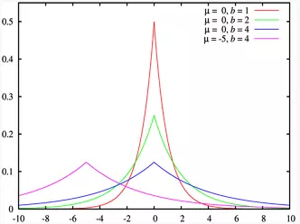
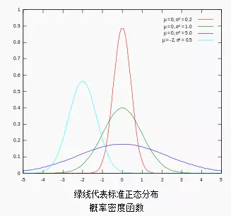
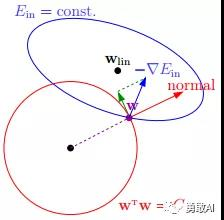
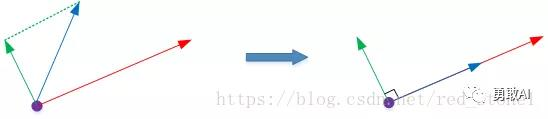
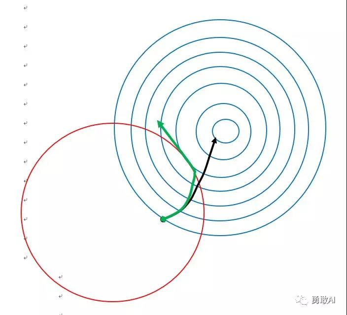
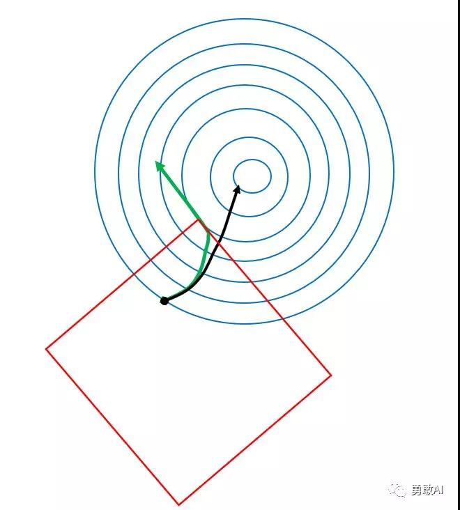

### 1、模型过拟合

#### 1.1、什么是模型的过拟合

训练的模型过拟合，根据方差+偏差的分解，则说明“方差”很大，直观的含义就是，模型的稳定性不强，表现在某一个特征输入数据“稍有波动”，模型的效果会变差。因为在测试集上面的很多数据都是没有见过的，相比于训练数据，难免会有差别，故而如果用一个过拟合的模型，在测试集上面的表现自然不好。就是过度学习训练集的特征导致在训练集上表现好而在测试机上表现差。

我们称这样的模型“太过复杂”了（注意是引号），复杂的体现在于，模型中求出的参数在训练的时候为了“迎合”误差的减少，很多参数很大（过分强调一些特征），很多参数有很小（一些微小的特征），这样就会导致模型会有一种“偏爱”。自然，因为模型的这点偏爱，导致的结果就是，测试集的数据稍有波动，表现就不好了，即所谓的过拟合。与其说是“复杂”，倒不如说是“畸形”更恰当。

#### 1.2、过拟合的解决办法

自然，我们希望遇到更“简单”的模型，“简单”的方式有以下几种：
1. 获取更多的样本
2. 丢弃一部分特征，增强模型的容错能力（比如PCA降维，神经网络的dropout机制）
3. 不丢其特征，保留所有的特征，但是减少参数的大小（magnitude）。确保所有的特征对于预测都有所贡献，而不是“偏爱”某几种特征。

当每一个特征 `!$X_i$` 对 `!$y$` 都有贡献的时候，这样的模型是比较健康稳定的，可以良好地工作，这就是正则化的目的，可以用来解决过拟合。

<p style="color:red">正则化策略：以增大训练误差为代价，来减少测试误差（如果在训练误差上很小，可能出现过拟合的情况）；</p>

这里有一个理解层面的不同：

1. 有的将 L1,L2 称之为正则化，因为这是最普遍的用法，此正则化减少模型的“复杂度”是通过让模型的参数不那么“畸形”实现的，并没有减少参数的个数。
2. 有的将dropout技术也称之为正则化，因为它通过丢弃参数，也达到了减轻模型“复杂度”的目的。
3. 有的甚至更加笼统，只要是能够较轻模型“过拟合”的技术，全部称之为“正则化”毕竟正则化是以增大偏差为代价，减少模型的方差。所以只要是能够防止过拟合的手段，都可以称之为正则化，包括L1,L2（范数约束）,dropout、 drop connect、早停法、数据增强与扩充等等都统称正则法。


### 2、L1、L2正则化

#### 2.1、数学基础

#### 2.1.1. 范数
范数是衡量某个向量空间（或矩阵）中的每个向量的长度或大小。范数的一般化定义：
对实数 `!$p\ge 1$`， 范数定义如下：
```mathjax!
$$
||x||_p := (\sum_{i = 1}^n |x_i|^p)^{\frac{1}{p}}
$$
```

- **L1范数**
当p=1时，是L1范数，其表示某个向量中所有元素绝对值的和。
- **L2范数**
当p=2时，是L2范数， 表示某个向量中所有元素平方和再开根， 也就是欧几里得距离公式。

#### 2.1.2. 拉普拉斯分布
如果随机变量的概率密度函数分布为:
```mathjax!
$$
f(x|\mu,b) = \frac{1}{2b} exp(- \frac{|x-\mu|}{b}) \\
= \frac{1}{2b} \begin{cases} exp(- \frac{\mu - x}{b}), & \text{if } x < \mu \\ exp(- \frac{x - \mu}{b}), & \text{if } x\ge \mu \end{cases}
$$
```

那么它就是拉普拉斯分布。其中，`!$\mu$` 是数学期望，`!$b > 0$` 是振幅。如果 `!$\mu = 0$`，那么，正半部分恰好是尺度为 `!$1/2$` 的指数分布。



#### 2.1.3. 高斯分布
又叫正态分布，若随机变量 X 服从一个数学期望为 `!$\mu$`、标准方差为 `!$\sigma^2$` 的高斯分布，记为：`!$X∼N(\mu,\sigma^2)$`，其概率密度函数为:
```mathjax!
$$
f(x) = \frac{1}{\sigma \sqrt{2\pi}}e^{-\frac{(x - \mu)^2}{2 \sigma^2}}
$$
```

其概率密度函数为正态分布的期望值 `!$\mu$` 决定了其位置，其标准差 `!$\sigma$` 决定了分布的幅度。当 `!$\mu = 0,\sigma = 1$` 时的正态分布是标准正态分布。



#### 2.1、L2正则化

L2 正则化公式非常简单，直接在原来的损失函数基础上加上权重参数的平方和：
```mathjax!
$$
Cost(w) = cos t(f - y) + \lambda \sum_{i = 1}^n w_i^2
$$
```
其中，`!$cos t(f-y)$` 是未包含正则化项的训练样本误差，`!$\lambda$` 是正则化参数，是可以调节的。

###### 物理意义：

正则化的目的是限制参数过多或者过大，避免模型更加复杂。例如，使用多项式模型，如果使用 10 阶多项式，模型可能过于复杂，容易发生过拟合。所以，为了防止过拟合，我们可以将其高阶部分的权重 w 限制为 0，这样，就相当于从高阶的形式转换为低阶。

为了达到这一目的，最直观的方法就是限制 w 的个数，但是这类条件属于 NP-hard 问题，求解非常困难。所以，只能选择另一个方法，限制参数w的大小，一般的做法是寻找更宽松的限定条件：
```mathjax!
$$
\sum_{i = 1}^n w_i^2 \le C
$$
```
上式是对 w 的平方和做数值上界限定，即所有w 的平方和不超过参数 C。这时候，我们的目标就转换为：最小化训练样本误差 `!$cost（f-y）$`，但是要遵循 w 平方和小于 C 的条件。也可以理解为，在所有参数的平方和不超过 C 的前提条件下，还使得样本的训练误差最小。

 下面这张图可以说明如何在限定条件下，对  `!$cost（f-y）$` 进行最小化的优化：
 
 
 
 **注意：** 因为图片是来自于一位网友的博客，所以图中的字母和文中使用的稍有区别，这个地方仅有两个参数 `!$w_1$`，`!$w_2$`，所以正则化约束为：
```mathjax!
$$
w_1^2 + w_2^2 \le C
$$
```

在图像上展示就是一个圆而 `!$cos t(f - y) = f(x_1,x_2,w_1,w_2) - y$`

当然，这里的 `!$x_1,x_2,w_1,w_2$` 之间的关系的可能是一个较为复杂的函数关系，注意，这里的蓝色范围本质上是一个三维图的俯视图范围，因为 `!$X$` 轴为 `!$w_1$`，`!$Y$` 轴为 `!$w_2$`，`!$Z$` 轴为 `!$f(x_1,x_2,w_1,w_2)$`。本质上，`!$cost(f-y)=f(x1,x2,w1,w2)-y$` 和 `!$regularity = w_1^2 + w_2^2$` 都是参数 `!$w_1$`、`!$w_2$` 的函数。

如上图所示，蓝色椭圆区域是最小化 `!$cost(f-y)$` 区域，红色圆圈是 参数 w 的限定条件区域。在没有限定条件的情况下，一般使用梯度下降算法，在蓝色椭圆区域内会一直沿着 w 梯度的反方向前进，直到找到全局最优值即可。例如空间中有一点 w（图中紫色点），此时 w 会沿着 `!$-\nabla E_{in}$` 的方向移动，如图中蓝色箭头(梯度方向)所示。但是，由于存在限定条件，w 不能离开红色圆形区域，最多只能位于圆上边缘位置，沿着切线方向。w 的方向如图中红色箭头所示。

那么问题来了，存在限定条件，w 最终会在什么位置取得最优解呢？也就是说在满足限定条件的基础上，尽量让 `!$cost(f-y)$` 最小。



从上面可以得知，如果不考虑正则化范围，运动的方向为“蓝色箭头”，但根据向量的分解，分解为红色箭头（逐渐朝正则化范围边界移动）和绿色剪头，那什么时候停止呢？因为有红色箭头分量的存在，迟早会到达边界，当在正则化项的边界相切的时候，就停止更新参数，我们经常看见这样一句话：代价函数在“模型代价”和“正则化约束”两项规则的综合作用下，正则化后的模型参数应该收敛在“误差等值线”与“正则项等值线”的相切的位置。下面会解释它的含义。

<div style="text-align: center;">
<div style="width: 500px;height: 500px;display: inline-block;">


</div>
</div>

如上图所示：红色表示的是“正则项等值线”，蓝色的表示的是 `!$cost(f-y)$` 的等值线，不一定是圆，这里用圆表示。在没有正则化项时，黑色箭头是梯度的下降方向，在有了正则化项以后，相当于给运动的箭头施加了约束，一方面，我不能逃离红色箭头的约束范围，另一方面，又要保证箭头要向着梯度减小的方向运动，故而运动的曲线是图中的绿色剪头。当红色箭头和绿色剪头相切的时候，不能够再继续向下运动了，因为它就逃离了红色范围的约束。
 
现在可以解释正则化“惩罚”二字的含义了。**它惩罚的是总的“成本函数”**，因为从图中可以看出，黑色箭头到达终点后的“代价函数”很明显是低于绿色剪头所到达的终点处的代价函数，即增加正则化项之后，代价适当增大了，即模型收到了“惩罚”。根据方差-偏差分解原则，偏差增大，方差会减小，方差减小，防止过拟合的能力增强。（注意：因为L2正则化会让参数趋于“平滑”，所以，有时候也说，惩罚大的参数，即让大的参数变小）

#### 2.2、L1正则化

L1正则化的原理与L2正则化类似，它的定义如下：
```mathjax!
$$
Cost(w) = cos t(f - y) + \lambda \sum_{i = 1}^n |w_i|
$$
```

根据 L2 的定义方式，则有：
```mathjax!
$$
\sum_{i = 1}^n |w_i| \le C
$$
```

此处依然以两个参数 `!$w_1$`，`!$w_2$` 为例，则有：
```mathjax!
$$
|w_1| + |w_2| \le C
$$
```

它的图形为一个正方形，如下所示：

<div style="text-align: center;">
<div style="width: 460px;height: 500px;display: inline-block;">


</div>
</div>

`!$cos t(f-y)$` 优化算法不变，L1 正则化限定了 w 的有效区域是一个正方形，且满足 `!$|w| < C$`。空间中的点 w 沿着 `!$cost(f-y)$` 的方向移动。但是，与此同时 w 不能离开红色正方形区域，最多只能位于正方形边缘位置。其推导过程与 L2 类似，就不再重复说明了。

### 3、正则化的数学理解

（正则化与一些贝叶斯先验本质上是一致的，比如L2正则化与高斯先验是一致的、L1正则化与拉普拉斯先验是一致的）

#### 3.1、L2正则化的数学推导

我们前面从图形的角度，用了一些形象的描述去解释了L1、L2正则化的原理，那么怎么从数学角度的层面去解释为什么正则化可以解决过拟合呢？  
下面以L2正则化为例：
**成本函数为：**

```mathjax!
$$
Cost(w) = \frac{1}{2m}[\sum_{j = 1}^m f_w(x^{(j)}) - y^{(j)}]^2 + \lambda \sum_{i = 1}^n w_i^2
$$
```

在上面的式子中，m 表示的的是样本数，n 表示的是参数个数，不能混淆。从这里可以看出，此时的成本函数 Cost 不再仅仅由模型预测值和真实值之间的差别决定了，还可参数 w的取值有关。后面的正则化项是为了施加约束，现在要达到减小成本函数这一目的，就不能够随意的取w参数值了，为什么？

比如，某一很大的w确实能够使得成本函数前面的部分的取值很小，但是因为 `!$w_i^2$` 会很大，而最终组合起来的成本函数并不小，反而很大。这样，要使得总的成本函数很小，参数 w 就不能随意取多大的值了，不让 w 取太大的值，这不就是正则化的一种约束吗？需要约束 w 本身的大小，与此同时还要使得原来部分的误差减小，这就是 L2 达到的效果，这其实也就是 L2 正则项为什么使得参数w相对较平滑（即参数 w 大小相差不会太大），后面还会解释“平滑”二字的原因。

比如对于参数 `!$w_i$`，求偏导数，则有如下：
```mathjax!
$$
\frac{\partial Cost(w)}{\partial w_i} = \frac{1}{m} \sum_{j = 1}^m[(f(x^{(j)}) - y^{(j)})x_i^{(j)} + \frac{\lambda}{m}w_i]
$$
```

`!$\lambda$` 为正则项系数，所以有：
```mathjax!
$$

$$
```