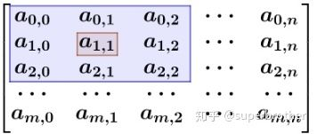
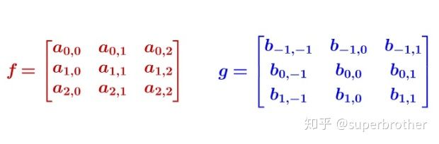

### 一、CNN的网络结构

#### （一）、输入层

#### （二）、卷积层

##### 1、 数学中的卷积
###### （1）、卷积的定义
　　1、一维卷积：我们称 `!$(f*g)(n)$` 为函数 `!$f,g$` 的卷积，其连续的定义为：
```mathjax!
$$(f*g)(n)=\int_{-\infty}^\infty{f(\tau)g(n-\tau)}$$
```
，其离散的定义为：
```mathjax!
$$(f*g)(n)=\sum_{\tau=-\infty}^\infty{f(\tau)g(n-\tau)}$$
```
这两个式子有一个共同的特征：`!$n=\tau+(n-\tau)$`
我们令　`!$x=\tau,y=n-\tau$`，那么　`!$x+y=n$` 表示斜率为`!$-1$` 的一组平行线。`!$(f*g)(m)$` 则表示直线 `!$x+y=m$` 上函数值的积分。
　　2、二维离散卷积：
```mathjax!
$$(f*g)(m,n)=\sum_i\sum_j{f(i,j)g(m-i,n-j)}$$
```
　　计算过程：`!$f$`是一个`!$m*n$`的矩阵:
  


  `!$g$`是一个定义好的３＊３的卷积核，计算`!$(f*g)(1,1)$`:
  


  注意卷积核的下标和矩阵`!$f$`是不相同的：
  


  然后加权求和就得到结果，可以看出，卷积核和原始的矩阵乘积，是围绕中心元素进行180度旋转后再加权求和。
	   
###### （2）、卷积的本质
　　**卷积的本质就是把二元函数 `!$U(x,y)=f(x)g(y)$` 卷成一元函数 `!$V(t)$`，俗称降维打击**。Convolute本身就有使卷绕、使盘旋的意思，在卷积积分
  ```mathjax!
  $$V(t)=\int{h(\tau)g(t-\tau)}{\rm d}t$$
  ```
中指代函数 `!$g(\tau)$` 翻转成 `!$g(t-\tau)$` 的操作。
　　怎么卷积：
　　考虑到函数 `!$f$` 和 `!$g$` 应该地位平等，或者说变量 `!$x$` 和 `!$y$` 应该地位平等，一种可取的办法就是沿着直线 `!$x+y=t$` 卷起来：
  ```mathjax!
  $$V(t)=\int_{x+y=t}{U(x,y)}{\rm d}t$$
  ```
###### （3）、卷积的例子
　　１、离散卷积：有两枚骰子，把这两枚骰子都抛出去，求两枚骰子点数加起来为４的概率是多少?
我们把骰子各个点数出现的概率表示出来：


  那么，两枚骰子点数加起来为４的情况有：
  
　　
 
  因此，两枚骰子点数加起来为４的概率：`!$f(1)g(3)+f(2)g(2)+f(3)g(1)$` ，写成标准的形式为：
  ```mathjax!
  $$(f*g)(4)=\sum_{m=1}^3{f(4-m)g(m)}$$
  ```
　　２、连续卷积：楼下早点铺子生意太好了，供不应求，就买了一台机器，不断的生产馒头。假设馒头的生产速度是 `!$f(t)$`，那么一天后生产出来的馒头总量为：
  ```mathjax!
  $$\int_0^{24}{f(t)}{\rm d}t$$
  ```
  馒头生产出来之后，就会慢慢腐败，假设腐败函数为 `!$g(t)$`，可想而知，第一个小时生产出来的馒头，一天后会经历24小时的腐败，第二个小时生产出来的馒头，一天后会经历23小时的腐败。如此，一天后，馒头总共腐败了：
  ```mathjax!
  $$\int_0^{24}{f(t)g(24-t)}{\rm d}t$$
  ```
##### 2、 深度学习（CNN）中的卷积
###### （1）、卷积核
　　卷积核的系数是如何确定的呢？是随机化初值，然后根据误差函数通过反向传播梯度下降进行迭代优化，这本身就是训练学习的过程。卷积核的采纳数通过优化求出才能是吸纳特征提取的作用，GCN的理论很大一部分工作就是为了引入可以优化的卷积核。
###### （2）、卷积的实质
　　离散卷积本质是一种加权求和，CNN中的卷积本质上就是利用一个共享参数的过滤器（kernel）,通过计算中心像素点及其相邻像素点的加权和来构成feature map实现空间特征的提取，加权系数就是卷积核的权重参数。这里的卷积与数学中定义的卷积运算严格意义上是有区别的，其本质上是一种互相关函数计算，所以说CNN是在提取图像的每个局部范围和卷积核的互相关函数。
###### （3）、卷积的过程


#### （三）、池化层

#### （四）、全连接层


### 二、CNN的训练过程

为什么神经网络越深效果越好？

因为神经网络越深表达能力越强，能处理的训练数据也更多，抽象程度越高。比如你输入一张周迅的脸，通过特征提取（即卷积过程），提取出了眼睛，鼻子，嘴巴等。接着进行第二轮的特征提取，得到明眸大眼，高鼻子，蜜桃小嘴。然后不断抽象，最后这些特征组成了周迅。所以要么网络足够深，要么单层神经元个数足够多。但是网络太深，因为其中的权重线性相乘，很容易导致梯度爆炸或者梯度消失。但是如果你选择了单层网络来代替深层网络，那么计算量又会太大，因为三个的感受野和一个的感受野是等价的，但是,，计算量相差两倍，因此选择更深的网络而不是更宽的网络。

同样很深的XGBOOST为什么效果没有神经网络好？

神经网络引入了两个先验知识：1.特征可以拆分。2.可以迭代拆分。
因为可以迭代拆分，因此网络可以学习到底层特征之间的共享关系。因此深度学习的先验可以总结为特征可拆分和特征可共享，特征可共享就意味着需要引入特征变换，因为在原有的特征空间是学不出来的，需要引入特征变换。而基于树的模型都在原始特征空间折腾，没有进行任何特征背后factor的探索。但是在浅层特征数据中，深度学习就没有什么优势了。