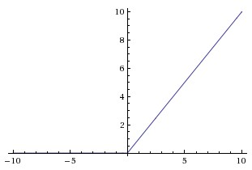
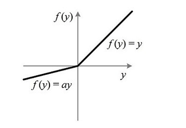
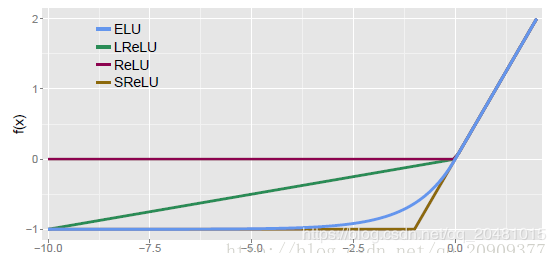

#### 为什么使用激活函数？
如果不用激励函数，每一层输出都是上层输入的线性函数，无论神经网络有多少层，输出都是输入的线性组合。激活函数给神经元引入了非线性因素，使得神经网络可以任意逼近任何非线性函数，这样神经网络就可以应用到众多的非线性模型中。加入非线性激励函数后，神经网络就有可能学习到平滑的曲线来分割平面，而不是用复杂的线性组合逼近平滑曲线来分割平面，使神经网络的表示能力更强了，能够更好的拟合目标函数。

#### 常用激活函数
##### 什么是饱和激活函数？

假设`!$h(x)$`是个激活函数：
 1. 当 n 趋近于正无穷时，激活函数 `!$h(x)$` 的导数趋近于0，我们称之为右饱和。
 2. 当 n 趋近于负无穷时，激活函数 `!$h(x)$` 的倒数趋近于0，我们称之为左饱和。

当`!$h(x)$`即满足左饱和又满足右饱和的时候，称之为饱和函数。

Sigmoid和Tanh是“饱和激活函数”，而ReLU及其变体则是“非饱和激活函数”。使用“非饱和激活函数”的优势在于两点：

 1. "非饱和激活函数”能解决所谓的“梯度消失”问题。 
 2. 能加快收敛速度。

##### 一、Sigmoid函数
###### 1、函数定义：
```mathjax!
$$
f(x)=\frac {1}{1+e^{−x}}
$$
```
###### 2、函数图像


###### 3、特点

 1. 这个函数在`!$x>5$`或者`!$x<5$`的时候，曲线斜率几乎为零，导致 gradient=0，这导致gradient flow被kill掉。
 2. 该函数的输出并不是zero-centered（关于原点中心对称）。因为如果输入都是正数的话（如`!$x>0$`），那么关于 w 的梯度在反向传播过程中，要么全是正数，要么全是负数（具体依据整个表达式`!$f(x)$`而定），这意味着当我们更新w参数的时候，所有的 w 都会朝着相同的方向运动，这就是zig zag行为，这种条件下模型的学习能力并不高效。
 3. 指数的计算量比较大。

##### 二、tanh函数
###### 1、函数定义
```mathjax!
$$
tanh(z)=\frac{e^z-e^{−z}}{e^z+e^{−z}}
$$
```
###### 2、函数图像


###### 3、特点
tanh函数相比于Sigmoid函数往往更具有优越性，这主要是因为Sigmoid函数在输入处于`!$[-1,1]$`之间时，函数值变化敏感，一旦接近或者超出区间就失去敏感性，处于饱和状态。（gradient saturation梯度消失）
##### 三、ReLU大家族
###### 1、ReLU(线性整流函数（Rectified Linear Unit, ReLU）)

1、函数定义
```mathjax!
$$
f(x)=max(0,x)
$$
```
2、函数图像



3、特点
 优点：
（1）ReLU解决了梯度消失的问题，至少 x 在正区间内，神经元不会饱和；（2）由于 ReLU 线性、非饱和的形式，在SGD中能够快速收敛；
（3）算速度要快很多。ReLU函数只有线性关系，不需要指数计算，不管在前向传播还是反向传播，计算速度都比sigmoid和tanh快
 缺点：
 （1）ReLU的输出不是“零为中心”(Notzero-centered output)。
 （2）随着训练的进行，可能会出现神经元死亡，权重无法更新的情况。这种神经元的死亡是不可逆转的死亡
 总结：
 训练神经网络的时候，一旦学习率没有设置好，第一次更新权重的时候，输入是负值，那么这个含有ReLU的神经节点就会死亡，再也不会被激活。因为：ReLU的导数在x>0的时候是1，在x<=0的时候是0。如果x<=0，那么ReLU的输出是0，那么反向传播中梯度也是0，权重就不会被更新，导致神经元不再学习。也就是说，这个ReLU激活函数在训练中将不可逆转的死亡，导致了训练数据多样化的丢失。在实际训练中，如果学习率设置的太高，可能会发现网络中40%的神经元都会死掉，且在整个训练集中这些神经元都不会被激活。所以，设置一个合适的较小的学习率，会降低这种情况的发生。所以必须设置一个合理的学习率。为了解决神经元节点死亡的情况，有人提出了Leaky ReLU、P-ReLu、R-ReLU、ELU等激活函数。

###### 2、Leaky ReLU
1、函数定义
```mathjax!
$$
f(x)=
\begin{cases}
x & \text{if}\ x>0  \\
0.01x & \text{otherwise}
\end{cases}
$$
```
2、函数图像


3、特点
优点：
（1）.神经元不会出现死亡的情况。
（2）.对于所有的输入，不管是大于等于 0 还是小于 0，神经元不会饱和。
（3）.由于Leaky ReLU线性、非饱和的形式，在SGD中能够快速收敛。
（4）.计算速度要快很多。Leaky ReLU函数只有线性关系，不需要指数计算，不管在前向传播还是反向传播，计算速度都比sigmoid和tanh快。
缺点：
（1).Leaky ReLU函数中的 `!$\alpha$`，需要通过先验知识人工赋值。

总结：
Leaky ReLU很好的解决了“dead ReLU”的问题。因为Leaky ReLU保留了 x 小于 0 时的梯度，在 x 小于 0 时，不会出现神经元死亡的问题。对于Leaky ReLU给出了一个很小的负数梯度值 `!$\alpha$`，这个值是很小的常数。比如：0.01。这样即修正了数据分布，又保留了一些负轴的值，使得负轴信息不会全部丢失。但是这个 `!$\alpha$` 通常是通过先验知识人工赋值的。

###### 3、RReLU （随机纠正线性单元：Randomized Leaky ReLU）
1、函数定义
```mathjax!
$$
y_{ji}=
\begin{cases}
x_{ji} & \text{if}\ x_{ji}\ge 0  \\
a_{ji}x_{ji} & \text{if}\ x_{ji}< 0
\end{cases}
\ \ \ \text{while}\ a_{ji}\sim U(l,u),l< u\ and \ l,u \in [0,1)
$$
```
RReLU的核心思想是，在训练过程中，a 是从一个高斯分布中随机出来的值，然后再在测试过程中进行修正。在测试阶段，把训练过程中所有的值取平均值。

2、函数图像


3、特点
（1）.RReLU是Leaky ReLU的random版本，在训练过程中，a 是从一个高斯分布中随机出来的，然后再测试过程中进行修正。
（2）.数学形式与PReLU类似，但RReLU是一种非确定性激活函数，其参数是随机的。

###### 4、PReLU（Parametric Rectified Linear Unit，带参数的ReLU）
1、函数定义
```mathjax!
$$
f(x_i)=
\begin{cases}
x_i & \text{if}\ x_i>0  \\
a_ix_i & \text{if}\ x_i\le 0
\end{cases}
$$
```
`!$i$` 表示不同的通道。

2、函数图像



3、特点

 1. 如果 `!$a_i=0$`，那么PReLU退化为ReLU；如果ai是一个很小的固定值(如 `!$a_i=0.01$`)，则PReLU退化为Leaky ReLU(LReLU)。

 2. PReLU只增加了极少量的参数，也就意味着网络的计算量以及过拟合的危险性都只增加了一点点。特别的，当不同channels使用相同的ai时，参数就更少了。

 3. BP更新 `!$a_i$` 时，采用的是带动量的更新方式，如下：
```mathjax!
$$
\Delta a_i:=\mu \Delta a_i + \epsilon \frac{\partial \xi }{\partial a_i}
$$
```

###### 5、ELU（Exponential Linear Units，指数线性单元）
1、函数定义
```mathjax!
$$
f(x)=
\begin{cases}
x & \text{if}\ x>0  \\
\alpha (exp(x)-1) & \text{otherwise}
\end{cases}
$$
```
```mathjax!
$$
f^,(x)=
\begin{cases}
1 & \text{if}\ x>0  \\
f(x) + \alpha & \text{otherwise}
\end{cases}
$$
```
2、函数图像


3、特点
优点：
（1）ELU包含了ReLU的所有优点。
（2）神经元不会出现死亡的情况。
（3）ELU激活函数的输出均值是接近于零的。
 缺点：
  计算的时候是需要计算指数的，计算效率低。
  
###### 6、SELU
1、函数定义
```mathjax!
$$
f(x)=\lambda
\begin{cases}
x & \text{if}\ x>0  \\
\alpha e^x - \alpha & \text{if}\ x \le 0
\end{cases}
$$
```

2、函数图像



3、特点
经过该激活函数后使得样本分布自动归一化到0均值和单位方差(自归一化，保证训练过程中梯度不会爆炸或消失，效果比Batch Normalization 要好) 。SELU其实就是ELU乘了个lambda，关键在于这个 lambda 是大于 1 的。relu，prelu，elu这些激活函数，都是在负半轴坡度平缓，这样在 activation 的方差过大的时候可以让它减小，防止了梯度爆炸，但是正半轴坡度简单的设成了 1。而selu的正半轴大于 1，在方差过小的的时候可以让它增大，同时防止了梯度消失。这样激活函数就有一个不动点，网络深了以后每一层的输出都是均值为 0 方差为 1。

##### 四、Swish
###### 1、函数定义
Swish是Google提出的一种新型激活函数，其原始公式为:`!$f(x)=x * sigmod(x)$`，变形Swish-B激活函数的公式则为:`!$f(x)=x * sigmod(b * x)$`，其拥有不饱和，光滑，非单调性的特征，而Google在论文中的多项测试表明Swish以及Swish-B激活函数的性能极佳,在不同的数据集上都表现出了要优于当前最佳激活函数的性能。

###### 2、函数图像


##### 五、Maxout
###### 1、函数定义
Maxout “Neuron” 是由Goodfellow等人在2013年提出的一种很有特点的神经元，它的激活函数、计算的变量、计算方式和普通的神经元完全不同，并有两组权重。先得到两个超平面，再进行最大值计算。激活函数是对ReLU和Leaky ReLU的一般化归纳，没有ReLU函数的缺点，不会出现激活函数饱和神经元死亡的情况。

Maxout公式如下：
```mathjax!
$$
f_i(x)=max_{j \in [1,k]}\ z_{ij}
$$
```
其中，`!$z_{ij} = x^TW \ldots _{ij} + b_{ij}$`，假设W是2维的，可以得出：
```mathjax!
$$
f(x)=max（w^T_1 x + b_1 , w^T_2 x + b_2 ） \ \ \   \text{(1)}
$$
```
分析公式(1)可以注意到，ReLU和Leaky ReLU都是它的一个变形。Maxout的拟合能力非常强，它可以拟合任意的凸函数。Goodfellow在论文中从数学的角度上也证明了这个结论，只需要 2 个Maxout节点就可以拟合任意的凸函数，前提是“隐含层”节点的个数足够多。

###### 2、特点
优点：
（1）Maxout具有ReLU的所有优点，线性、不饱和性。
（2）同时没有ReLU的一些缺点。如：神经元的死亡。
缺点：
  从这个激活函数的公式14中可以看出，每个neuron将有两组 w，那么参数就增加了一倍。这就导致了整体参数的数量激增。