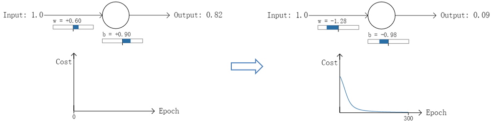
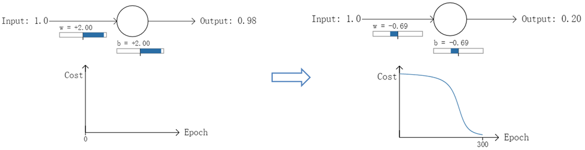
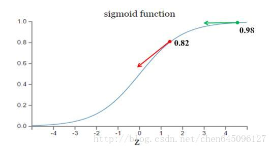

[TOC]

#### 1、基本概念

 1. 损失函数（Loss Function ）是定义在单个样本上的，计算的是一个样本的误差。它是用来估量你模型的预测值 `!$f(x)$`
    与真实值 Y 的不一致程度，通常用 `!$L(Y,f(x))$` 来表示。  
 2. 代价函数（Cost Function ）是定义在整个训练集上的，是所有样本误差的平均，也就是损失函数的平均。  
 3. 目标函数（Object Function）定义为：最终需要优化的函数。等于经验风险+结构风险（也就是Cost Function +正则化项）。

#### 2、代价函数
假设有训练样本 `!$(x, y)$`，模型为 `!$h$`，参数为 `!$θ$`。`!$h(θ) = θ^Tx$`（`!$θ^T$` 表示 `!$θ$` 的转置）。

（1）概况来讲，任何能够衡量模型预测出来的值 `!$h(θ)$` 与真实值 `!$y$` 之间的差异的函数都可以叫做代价函数 `!$C(θ)$`，如果有多个样本，则可以将所有代价函数的取值求均值，记做 `!$J(θ)$`。因此很容易就可以得出以下关于代价函数的性质：

 1. 对于每种算法来说，代价函数不是唯一的；
    
 2. 代价函数是参数 `!$θ$` 的函数；
    
 3. 总的代价函数 `!$J(θ)$` 可以用来评价模型的好坏，代价函数越小说明模型和参数越符合训练样本`!$(x, y)$`；
    
 4. `!$J(θ)$` 是一个标量；

（2）当我们确定了模型 `!$h$`，后面做的所有事情就是训练模型的参数 `!$θ$`。那么什么时候模型的训练才能结束呢？这时候也涉及到代价函数，由于代价函数是用来衡量模型好坏的，我们的目标当然是得到最好的模型（也就是最符合训练样本 `!$(x, y)$` 的模型）。因此训练参数的过程就是不断改变 `!$θ$`，从而得到更小的 `!$J(θ)$` 的过程。理想情况下，当我们取到代价函数 `!$J$` 的最小值时，就得到了最优的参数 `!$θ$`，记为：
```mathjax!
$$
min_{\theta} J(\theta)
$$
```
例如，`!$J(θ) = 0$`，表示我们的模型完美的拟合了观察的数据，没有任何误差。

（3）在优化参数 `!$θ$` 的过程中，最常用的方法是梯度下降，这里的梯度就是代价函数 `!$J(θ)$` 对`!$θ_1, θ_2, ..., θ_n$` 的偏导数。由于需要求偏导，我们可以得到另一个关于代价函数的性质：

 - 选择代价函数时，最好挑选对参数 `!$θ$` 可微的函数（全微分存在，偏导数一定存在）

___

#### 3、二次代价函数(quadratic cost)
　　我们希望：ANN在训练时，如果预测值与实际值的误差越大，那么在反向传播训练的过程中，各种参数调整的幅度就要更大，从而使训练更快收敛。然而，如果使用二次代价函数训练ANN，看到的实际效果是，如果误差越大，参数调整的幅度可能更小，训练更缓慢。

　　以一个神经元的二类分类训练为例，进行两次实验（ANN常用的激活函数为sigmoid函数，该实验也采用该函数）：输入一个相同的样本数据 `!$x=1.0$`（该样本对应的实际分类 `!$y=0$`）；两次实验各自随机初始化参数，从而在各自的第一次前向传播后得到不同的输出值，形成不同的代价（误差）：
  




在实验1中，随机初始化参数，使得第一次输出值为0.82（该样本对应的实际值为0）；经过300次迭代训练后，输出值由0.82降到0.09，逼近实际值。而在实验2中，第一次输出值为0.98，同样经过300迭代训练，输出值只降到了0.20。 从两次实验的代价曲线中可以看出：实验1的代价随着训练次数增加而快速降低，但实验2的代价在一开始下降得非常缓慢；直观上看，初始的误差越大，收敛得越缓慢。

其实，误差大导致训练缓慢的原因在于使用了二次代价函数。二次代价函数的公式如下：
```mathjax!
$$
C = \frac{1}{2n} \sum_x ||y(x) - a^L(x)||^2
$$
```
其中，`!$C$` 表示代价函数，`!$x$` 表示样本，`!$y$` 表示实际值，`!$a$`表示输出值，`!$n$` 表示样本的总数。为简单起见，使用一个样本为例进行说明，此时二次代价函数为：
```mathjax!
$$
C = \frac{(y - a)^2}{2}
$$
```
假如我们使用梯度下降法(Gradient descent)来调整权值参数的大小，权值 `!$w$` 和偏置 `!$b$` 的梯度推导如下：
```mathjax!
$$
\frac{\partial C}{\partial w} = (a - y)\sigma' (z)x
\ \ \  \frac{\partial C}{\partial b} = (a - y)\sigma' (z)
$$
```
其中，`!$z$` 表示神经元的输入，`!$\sigma$` 表示激活函数。`!$w$` 和 `!$b$`的梯度跟激活函数的梯度成正比，激活函数的梯度越大，`!$w$` 和 `!$b$` 的大小调整得越快，训练收敛得就越快。假设我们的激活函数是sigmoid函数：



如图 3 所示，实验2的初始输出值（0.98）对应的梯度明显小于实验1的输出值（0.82），因此实验2的参数梯度下降得比实验1慢。这就是初始的代价（误差）越大，导致训练越慢的原因。与我们的期望不符，即：不能像人一样，错误越大，改正的幅度越大，从而学习得越快。

#### 4、交叉熵代价函数(cross-entropy)
交叉熵代价函数定义如下：
```mathjax!
$$
C = -\frac{1}{n} \sum_x[y ln a + (1 - y)ln(1 - a)]
$$
```
其中，`!$x$`表示样本，`!$n$` 表示样本的总数。那么，重新计算参数 `!$w$` 的梯度：
```mathjax!
$$
\begin{aligned}
\frac{\partial C}{\partial w_j} &= - \frac{1}{n} \sum_x \left(\frac{y}{\sigma(z)} - \frac{1 - y}{1 - \sigma(z)} \right) \frac{\partial{\sigma}}{\partial w_j} \\ &= - \frac{1}{n} \sum_x \left(\frac{y}{\sigma(z)} - \frac{1 - y}{1 - \sigma(z)} \right)\sigma'(z)x_j \\ &= \frac{1}{n} \sum_x \frac{\sigma'(z)x_j}{\sigma(z)(1 - \sigma(z))} (\sigma(z) - y) \\ &= \frac{1}{n} \sum_x x_j(\sigma(z) - y)
\end{aligned}
$$
```
其中，`!$\sigma(z)$` 为Sigmoid激活函数，则有：
```mathjax!
$$
\sigma'(z) = \sigma(z)(a - \sigma(z))
$$
```
因此，`!$w$` 的梯度公式中原来的 `!$\sigma'(z)$` 被消掉了；另外，该梯度公式中的 `!$\sigma(z) - y$` 表示输出值与实际值之间的误差。所以，当误差越大，梯度就越大，参数 `!$w$` 调整得越快，训练速度也就越快。同理可得，`!$b$` 的梯度为：
```mathjax!
$$
\frac{\partial C}{\partial b} = \frac{1}{n} \sum_x (\sigma(z) - y)
$$
```
实际情况证明，交叉熵代价函数带来的训练效果往往比二次代价函数要好。

##### 4.1、交叉熵代价函数是如何产生的？
以偏置 `!$b$` 的梯度计算为例，推导出交叉熵代价函数：
```mathjax!
$$
\begin{aligned}
\frac{\partial C}{\partial b} &= \frac{\partial C}{\partial a}\cdot \frac{\partial a}{\partial z}\cdot \frac{\partial z}{\partial b} \\ &= \frac{\partial C}{\partial a}\cdot \sigma'(z)\cdot \frac{\partial (wx + b)}{\partial b} \\ &= \frac{\partial C}{\partial a}\cdot \sigma'(z) \\ &= \frac{\partial C}{\partial a}\cdot a(1 - a)
\end{aligned}
$$
```
在第1小节中，由二次代价函数推导出来的 `!$b$` 的梯度公式为：
```mathjax!
$$
\frac{\partial C}{\partial b}= (a - y) \sigma'(z)
$$
```
为了消掉该公式中的 `!$\sigma'(z)$`，我们想找到一个代价函数使得：
```mathjax!
$$
\frac{\partial C}{\partial b}= a - y
$$
```
即：
```mathjax!
$$
\frac{\partial C}{\partial a}\cdot a(1 - a) = a - y
$$
```
对两侧求积分，可得交叉熵代价函数：
```mathjax!
$$
C = -[y ln a + (1 - y)ln(1 - a)] + constant
$$
```

#### 5、对数似然代价函数(log-likelihood cost)
　　对数释然函数常用来作为softmax回归的代价函数，然后输出层神经元是sigmoid函数，可以采用交叉熵代价函数。而深度学习中更普遍的做法是将softmax作为最后一层，此时常用的代价函数是对数释然代价函数。对数似然代价函数与softmax的组合和交叉熵与sigmoid函数的组合非常相似。对数释然代价函数在二分类时可以化简为交叉熵代价函数的形式。

　　二次代价函数在训练ANN时可能会导致训练速度变慢的问题。那就是，初始的输出值离真实值越远，训练速度就越慢。这个问题可以通过采用交叉熵代价函数来解决。其实，这个问题也可以采用另外一种方法解决，那就是采用softmax激活函数，并采用log似然代价函数（log-likelihood cost function）来解决。log似然代价函数的公式为：
```mathjax!
$$
C = -\sum_k y_k log a_k
$$
```
其中，`!$a_k$` 表示第`!$k$` 个神经元的输出值，`!$y_k$` 表示第  `!$k$` 个神经元对应的真是值，取值为 0 或 1 。

　　 我们来简单理解一下这个代价函数的含义。在ANN中输入一个样本，那么只有一个神经元对应了该样本的正确类别；若这个神经元输出的概率值越高，则按照以上的代价函数公式，其产生的代价就越小；反之，则产生的代价就越高。

　　为了检验softmax和这个代价函数也可以解决上述所说的训练速度变慢问题，接下来的重点就是推导ANN的权重 `!$w$` 和偏置 `!$b$` 的梯度公式。以偏置 `!$b$` 为例：
```mathjax!
$$
\begin{aligned}
\frac{\partial C}{\partial b_j} &= \frac{\partial C}{\partial z_j} \cdot \frac{\partial z_j}{\partial b_j} \\ &= \frac{\partial C}{\partial z_j} \cdot \frac{\partial{(w_{jk} a_k + b_j)}}{\partial b_j} \\ &= \frac{\partial}{\partial z_j} \left( -\sum_k y_k log a_k \right) \\ &= -\sum_k y_k \frac{1}{a_k} \cdot \frac{\partial a_k}{\partial z_j} \\ & \text{(use softmax derivative)} \\&= -y_j \frac{1}{a_j} \cdot \frac{\partial a_j}{\partial z_j} - \sum_{k \neq j} y_k \frac{1}{a_k} \cdot \frac{\partial a_k}{\partial z_j} \\ &= -y_j \frac{1}{a_j} \cdot a_j(1 - a_j) - \sum_{k \neq j} y_k \frac{1}{a_k} \cdot (-a_j a_k) \\ &= -y_j + y_ja_j + \sum_{k \neq j}y_ka_j \\ &= -y_j + a_j \sum_k y_k \\ &= a_j - y_j
\end{aligned}
$$
```
同理可得：
```mathjax!
$$
\frac{\partial C}{\partial w_{jk}} = a_k^{L - 1}(a_j^L - y_j)
$$
```
从上述梯度公式可知，softmax函数配合log似然代价函数可以很好地训练ANN，不存在学习速度变慢的问题。

softmax的函数公式如下：
```mathjax!
$$
a_j^L = \frac{e^{z_k^L}}{\sum_k e^{z_k^L}}
$$
```
其中，`!$e^{z_k^L}$` 表示第 `!$L$` 层（通常是最后一层）第 `!$j$` 个神经元的输入，`!$e^{a_k^L}$` 表示第 `!$L$` 层第 `!$j$` 个神经元的输出，表示自然常数。注意看，`!$\sum_k e^{z_k^L}$` 表示了第 `!$L$` 层所有神经元的输入之和。

**softmax函数最明显的特点在于：它把每个神经元的输入占当前层所有神经元输入之和的比值，当作该神经元的输出。这使得输出更容易被解释：神经元的输出值越大，则该神经元对应的类别是真实类别的可能性更高。**

另外，softmax不仅把神经元输出构造成概率分布，而且还起到了归一化的作用，适用于很多需要进行归一化处理的分类问题。由于softmax在ANN算法中的求导结果比较特别，分为两种情况。求导过程如下所示：
```mathjax!
$$
\begin{aligned}
\text{if  }j = i: \\ 
\frac{\partial a_j}{\partial z_i} &= \frac{\partial}{\partial z_i}(\frac{e^{z_j}}{\sum_k e^{z_k}}) \\ &= \frac{(e^{z_j})' \cdot \sum_k e^{z_k} - e^{z_j} \cdot e^{z_j}}{(\sum_k e^{z_k})^2} \\ &= \frac{e^{z_j}}{\sum_k e^{z_k}} - \frac{e^{z_j}}{\sum_k e^{z_k}}\cdot \frac{e^{z_j}}{\sum_k e^{z_k}} \\ &= a_j(1 - a_j) \\
\text{if  }j \neq i: \\ 
\frac{\partial a_j}{\partial z_i} &= \frac{\partial}{\partial z_i}(\frac{e^{z_j}}{\sum_k e^{z_k}}) \\ &= \frac{0 \cdot \sum_k e^{z_k} - e^{z_j} \cdot e^{z_i}}{(\sum_k e^{z_k})^2} \\ &= - \frac{e^{z_j}}{\sum_k e^{z_k}}\cdot \frac{e^{z_i}}{\sum_k e^{z_k}} \\ &= -a_j a_i
\end{aligned}
$$
```

