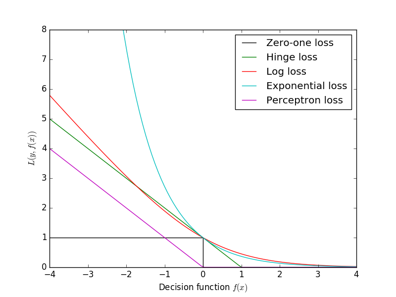
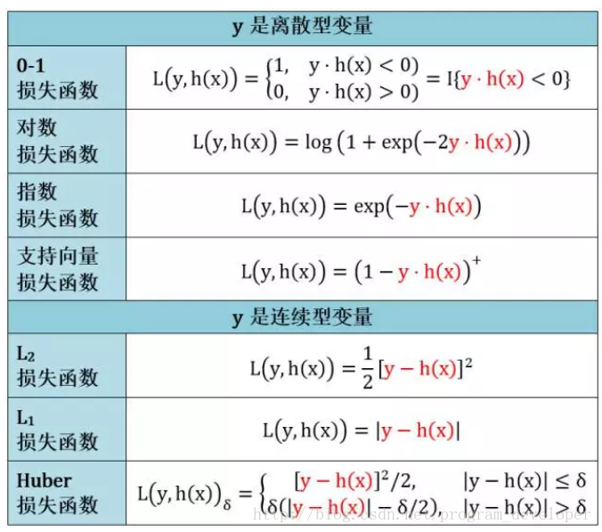
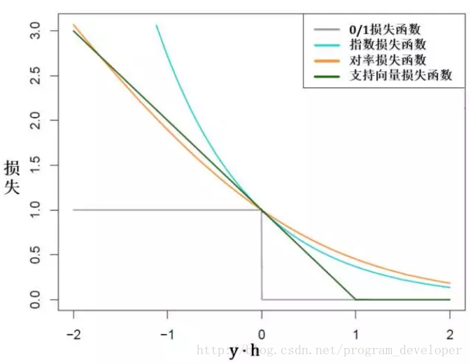
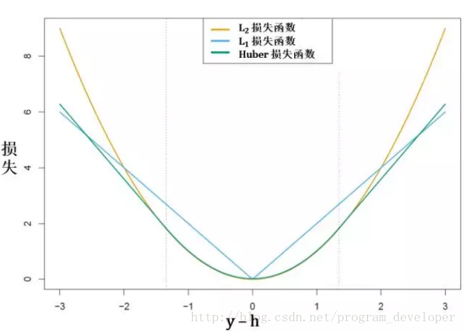

[TOC]

**损失函数（目标函数）越小，模型的鲁棒性就越好。**

#### 1、分类算法中的损失函数
　　**通常机器学习每一个算法中都会有一个目标函数，算法的求解过程是通过对这个目标函数优化的过程。** 在分类或者回归问题中，通常使用**损失函数（代价函数）作为其目标函数**。损失函数用来评价模型的预测值和真实值不一样的程度，损失函数越好，通常模型的性能越好。不同的算法使用的损失函数不一样。

　　**损失函数分为经验风险损失函数和结构风险损失函数（目标函数）。** 经验风险损失函数指预测结果和实际结果的差别，结构风险损失函数是指经验风险损失函数加上正则项（regularizer）（或惩罚项（penalty term））。即有如下的形式：
```mathjax!
$$
J(w) = \sum_i L(m_i(w)) + \lambda R(w)
$$
```
其中，`!$L$` 为损失项，`!$R$` 为正则项。`!$m_i$` 的具体形式如下：
```mathjax!
$$
m_i = y^{(i)} f_w(x^{(i)}) \ \ \  y^{(i)}\in \{-1,1\} \ \ \  f_w(x^{(i)}) = w^Tx^{(i)}
$$
```

#### 2、常用的损失函数
1. 0-1损失函数
2. Log损失函数
3. 铰链损失函数（Hinge Loss）：主要用于支持向量机（SVM） 中；
4. 指数损失函数（Exponential Loss） ：主要用于Adaboost 集成学习算法中；
5. 感知损失函数
6. 互熵（ 交叉熵 ）损失 （Cross Entropy Loss，Softmax Loss）
7. 其他损失函数
___

#### 3、0-1 损失函数
在分类问题中，可以使用函数的正负号来进行模式判断，函数值本身的大小并不是很重要，0-1 损失函数比较的是预测值 `!$f_w$` 与真实值 `!$y$` 的符号是否相同，0-1 损失的具体形式如下：
```mathjax!
$$
L_{01}(m) = \begin{cases} 0, & \text{if} \ m \ge 0 \\ 1, & \text{if} \ m < 0 \end{cases}
$$
```
以上的函数等价于下述的函数：
```mathjax!
$$
\frac{1}{2} (1 - sign(m))
$$
```
0-1损失并不依赖 `!$m$` 值的大小，只取决于 `!$m$` 的正负号。0-1 损失是一个非凸的函数，在求解的过程中，存在很多的不足，通常在实际的使用中将 0-1 损失函数作为一个标准，选择 0-1 损失函数的代理函数作为损失函数。可以看出上述的定义太过严格，如果真实值为 1，预测值为 0.999，那么预测应该正确，但是上述定义显然是判定为预测错误。

___

#### 4、Log损失函数
Log损失是 0-1 损失函数的一种代理函数，Log损失的具体形式如下：
```mathjax!
$$
log(1 + exp(-m))
$$
```
运用Log损失的典型分类器是Logistic回归算法。对于Logistic回归算法，分类器可以表示为：
```mathjax!
$$
p(y | x;w) = \sigma (w^Tx)^y (1 - \sigma (w^Tx))^{(1 - y)}
$$
```
其中，`!$y∈{0，1}$`。为了求解其中的参数w，通常使用极大似然估计的方法，具体的过程如下：
1、似然函数
```mathjax!
$$
L(w) = \prod_{i = 1}^n \sigma {(w^Tx^{(i)})}^{y^{(i)}} {(1 - \sigma(w^Tx^{(i)}))}^{1 - y^{(i)}}
$$
```
其中，
```mathjax!
$$
\sigma(x) = \frac{1}{1 + exp(-x)}
$$
```
2、log似然
```mathjax!
$$
logL(w) = \sum_{i = 1}^n (y^{(i)} log(\sigma(w^Tx^{(i)})) + (1 - y^{(i)})log(1 - \sigma(w^Tx^{(i)})) )
$$
```
3、需要求解的是使得log似然取得最大值的 `!$w$`，可以转换为求最小值：
```mathjax!
$$
-logL(w) = - \sum_{i = 1}^n (y^{(i)} log(\sigma(w^Tx^{(i)})) + (1 - y^{(i)})log(1 - \sigma(w^Tx^{(i)})) )
$$
```
这便是交叉熵的具体形式。

<p style="font-size:140%"><b>两者的等价：</b></p>

由于Log损失的具体形式为：
```mathjax!
$$
log(1 + exp(-m))
$$
```
其中，`!$m=y \times f_{w,y} \in \{-1，1\}$`，Log损失函数的具体形式为：
```mathjax!
$$
min_w \sum_{i = 1}^n log\{1 + exp(-y^{(i)}w^Tx^{(i)})\}
$$
```
Logistic回归与Log损失具有相同的形式，故两者是等价的。Log损失与 0-1 损失的关系可见下图。

___

#### 5、Hinge损失函数
Hinge损失是0-1损失函数的一种代理函数，Hinge损失的具体形式如下：
```mathjax!
$$
max(0,1 - m)
$$
```
运用Hinge损失的典型分类器是SVM算法。对于软间隔支持向量机，允许在间隔的计算中出现少许的误差 `!$\xi = (xi_1,\cdots ,\xi_n)$`，其优化的目标为：
```mathjax!
$$
min_{w,\gamma ,\xi} \left[ \frac{1}{2} ||w||^2 + C\sum_{i = 1}^n \xi_i  \right]
$$
```
约束条件为：
```mathjax!
$$
(w^Tx^{(i)} + \gamma)y^{(i)} \ge 1 - \xi_i, \ \ \xi_i \ge 0
$$
```

<p style="font-size:140%"><b>两者的等价：</b></p>

对于Hinge损失：
```mathjax!
$$
max(0,1 - m)
$$
```
优化的目标是要求：
```mathjax!
$$
min_{w} \left[\sum_{i = 1}^n max(0,1 - f_w(x^{(i)})y^{(i)})  \right]
$$
```
在上述的函数 `!$f_w$` 中引入截距 `!$\gamma$`，即：
```mathjax!
$$
f_{w,\gamma} (x^{(i)}) = w^Tx^{(i)} + \gamma
$$
```
并在上述的最优化问题中增加 `!$L2$` 正则，即变成：
```mathjax!
$$
min_{w,\gamma} \left[C\sum_{i = 1}^n max(0,1 - f_{w,\gamma}(x^{(i)})y^{(i)}) + \frac{1}{2} ||w||^2  \right]
$$
```
至此，令下面的不等式成立：
```mathjax!
$$
max(0,1 - f_{w,\gamma}(x)y) = min_{\xi} \xi
$$
```
约束条件为：
```mathjax!
$$
\xi \ge 1 - f_{w,\gamma}(x)y; \ \  \xi \ge 0
$$
```
则Hinge最小化问题变成：

约束条件为：
```mathjax!
$$
\xi_i \ge 1 - (w^Tx^{(i)} + \gamma)y^{(i)}; \ \  \xi_i \ge 0
$$
```
这与软间隔的SVM是一致的，说明软间隔SVM是在Hinge损失的基础上增加了 `!$L2$` 正则。

##### 5.1、Hinge loss（SVM） 与 Softmax loss（Softmax）
SVM 和 Softmax 分类器是最常用的两个分类器。 SVM将输出 `!$f(x_i,W)$` 作为每个分类的评分；与SVM 不同，Softmax 分类器可以理解为逻辑回归分类器面对多个分类的一般话归纳。其输出为归一化的分类概率，更加直观，且可以从概率上解释。

在Softmax分类器中，函数映射 `!$f(x_i,W)$` 保持不变，但将这些评分值看做每个分类未归一化的对数概率，且将铰链损失（hinge loss）替换为 交叉熵损失(cross-entropy loss)，公式如下：
```mathjax!
$$
L_i = -log(\frac{e^{f_{y_i}}}{\sum_j e^{f_j}} )
$$
```
或等价的：
```mathjax!
$$
L_i = -f_{y_i} + log(\sum_j f_j)
$$
```
`!$f_j$` 表示分类评分向量 `!$f$` 中的第 `!$i$` 个元素，和SVM一样，整个数据集的损失值是数据集中所有样本数据的损失值 `!$L_i$` 的均值和正则化损失之和。

概率论解释: 
```mathjax!
$$
P(y_i|x_i,W) = \frac{e^{f_{y_i}}}{\sum_j e^{f_j}}
$$
```
解释为给定数据 `!$x_i$` 和 `!$W$` 参数，分配给正确分类标签 `!$y_i$` 的归一化概率。

实际操作注意事项——**数值稳定**: 编程实现softmax函数计算的时候,中间项 `!$e^{f_{y_i}}$` 和  `!$\sum_j e^{f_j}$` 因为存在指数函数，所以数值可能非常大，除以大数值可能导致数值计算的不稳定，所以得学会归一化技巧。若在公式的分子和分母同时乘以一个常数 `!$C$`，并把它变换到求和之中，就能得到一个等价公式：
```mathjax!
$$
P(y_i | x_i,W) = \frac{Ce^{f_{y_i}}}{C\sum_j e^{f_j}} = \frac{e^{f_{y_i} + logC}}{\sum_j e^{f_j + logC}}
$$
```
C的值可自由选择，不会影响计算结果，通过这个技巧可以提高计算中的数值稳定性。通常将C设为：
```mathjax!
$$
logC = -max f_j
$$
```
该技巧就是将向量f中的数值进行平移，使得最大值为 0。

准确地说，SVM分类器使用的是铰链损失（hinge loss），有时候又被称为最大边界损失（max-margin loss）。Softmax分类器使用的是交叉熵损失（corss-entropy loss）。Softmax分类器的命名是从softmax函数那里得来的，Softmax函数将原始分类评分变成正的归一化数值，所有数值和为 1，这样处理后交叉熵损失才能应用。

___

#### 6、指数损失函数
指数损失是 0-1 损失函数的一种代理函数，指数损失的具体形式如下：
```mathjax!
$$
exp(-m)
$$
```
运用指数损失的典型分类器是AdaBoost算法。AdaBoost算法是对每一个弱分类器以及每一个样本都分配了权重，对于弱分类器 `!$\phi $` 的权重为：
```mathjax!
$$
\theta_j = \frac{1}{2} log \frac{1 - R(\phi_j)}{R(\phi_j)}
$$
```
其中，`!$R(\phi)$` 表示的是误分类率。对于每一个样本的权重为：
```mathjax!
$$
w_i = \frac{exp(-f(x^{(i)}y^{(i)}))}{\sum_n [exp(-f(x^{(i)}y^{(i)}))]}
$$
```
最终通过对所有分类器加权得到最终的输出。

<p style="font-size:140%"><b>两者的等价：</b></p>

对于指数损失函数：
```mathjax!
$$
exp(-m)
$$
```
可以得到需要优化的损失函数：
```mathjax!
$$
min_{\theta} \left[ \sum_{i = 1}^n exp(-f_{\theta}(x^{(i)})y^{(i)}) \right]
$$
```
假设 `!$f\sim$` 表示已经学习好的函数，则有：
```mathjax!
$$
min_{\theta , \phi} \left[ \sum_{i = 1}^n exp(- \{\tilde{f}_{\theta} (x^{(i)}) + \theta_{\phi}(x^{(i)}) \} y^{(i)}) \right]  \\ = min_{\theta , \phi} \left[ \sum_{i = 1}^n \tilde{w}_i exp(-\theta_{\phi}(x^{(i)}) y^{(i)}) \right] 
$$
```
而：
```mathjax!
$$
\sum_{i = 1}^n \tilde{w}_i exp(-\theta_{\phi}(x^{(i)}) y^{(i)}) \\ = \{exp(\theta) - exp(-\theta) \} \sum_{i = 1}^n \frac{\tilde{w_i}}{2} (1 - \phi(x^{(i)})y^{(i)}) + exp(-\theta) \sum_{i = 1}^n \tilde{w_i}
$$
```
通过最小化 `!$\phi$`，可以得到：
```mathjax!
$$
\hat{\phi} = arg min_{\phi} \sum_{i = 1}^n \frac{\tilde{w_i}}{2} (1 - \phi(x^{(i)})y^{(i)})
$$
```
将其代入上式，进而对 `!$\theta$` 求最优解，得：
```mathjax!
$$
\hat{\theta} = \frac{1}{2} log\frac{1 - \hat{R}}{\hat{R}}
$$
```
其中：
```mathjax!
$$
\hat{R} = \left\{\sum_{i = 1}^n \frac{\tilde{w_i}}{2} (1 - \phi(x^{(i)})y^{(i)})\right\} / \left\{\sum_{i = 1}^n \tilde{w_i}\right\}
$$
```
可以发现，其与AdaBoost是等价的。

___

#### 7、感知损失
感知损失是Hinge损失的一个变种，感知损失的具体形式如下：
```mathjax!
$$
max(0, -m)
$$
```
运用感知损失的典型分类器是感知机算法。感知机算法只需要对每个样本判断其是否分类正确，只记录分类错误的样本，其损失函数为：
```mathjax!
$$
min_{w,b} \left[-\sum_{i = 1}^n y^{(i)} (w^Tx^{(i)} + b) \right]
$$
```

<p style="font-size:140%"><b>两者的等价：</b></p>

对于感知损失：
```mathjax!
$$
max(0, -m)
$$
```
优化的目标为：
```mathjax!
$$
min_w \left[-\sum_{i = 1}^n max(0,-f_w (x^{(i)})y^{(i)} )\right]
$$
```
在上述的函数 `!$f_w$` 中引入截距 `!$b$`，即：
```mathjax!
$$
f_{w,\gamma} (x^{(i)}) = w^Tx^{(i)} + b
$$
```
上述的形式转变为：
```mathjax!
$$
min_{w,b} \left[-\sum_{i = 1}^n max(0,-(w^Tx^{(i)} + b)y^{(i)} )\right]
$$
```
对于max函数中的内容，可知：
```mathjax!
$$
max(0,-(w^Tx^{(i)} + b)y^{(i)} ) \ge 0
$$
```
对于错误的样本，有：
```mathjax!
$$
max(0,-(w^Tx^{(i)} + b)y^{(i)} ) = -(w^Tx^{(i)} + b)y^{(i)}
$$
```
类似于Hinge损失，令下式成立：
```mathjax!
$$
max(0,-f_{w,b}(x)y ) = min_{\xi} \xi
$$
```
约束条件为：
```mathjax!
$$
\xi \ge -f_{w,b} (x)y
$$
```
则感知损失变成：
```mathjax!
$$
min_{\xi} \left[\sum_{i = 1}^n \xi_i \right]
$$
```
即为：
```mathjax!
$$
min_{w,b} \left[- \sum_{i = 1}^n y^{(i)}(w^Tx^{(i)} + b) \right]
$$
```
Hinge损失对于判定边界附近的点的惩罚力度较高，而感知损失只要样本的类别判定正确即可，而不需要其离判定边界的距离，这样的变化使得其比Hinge损失简单，但是泛化能力没有Hinge损失强。

___




----------

#### 8、互熵（ 交叉熵 ）损失 （Cross Entropy Loss，Softmax Loss）
平方损失函数可以通过线性回归在假设样本是高斯分布的条件下推导得到，而逻辑回归得到的并不是平方损失。

在逻辑回归的推导中，它假设样本服从伯努利分布（`!$0-1$` 分布），然后求得满足该分布的似然函数，接着取对数求极值等等。而逻辑回归并没有求似然函数的极值，而是把极大化当做是一种思想，进而推导出它的经验风险函数为：最小化负似然函数（Negative Likelihood (LL)）（即`!$maxF(y,f(x))→min−F(y,f(x)))$`。从损失函数的视角来看，它就成了Softmax 损失函数了。互熵损失函数的通用的标准形式： 
```mathjax!
$$
L(Y,P(Y|X)) = -logP(Y|X)
$$
```
取对数是为了方便计算极大似然估计，因为在MLE中，直接求导比较困难，所以通常都是先取对数再求导找极值点。损失函数 `!$L(Y,P(Y|X))$` 表达的是样本 `!$X$` 在分类 `!$Y$` 的情况下，使概率 `!$P(Y|X)$` 达到最大值（换言之，就是利用已知的样本分布，找到最有可能（即最大概率）导致这种分布的参数值；或者说什么样的参数才能使我们观测到目前这组数据的概率最大）。因为log函数是单调递增的，所以 `!$logP(Y|X)$` 也会达到最大值，因此在前面加上负号之后，最大化 `!$P(Y|X)$` 就等价于最小化 `!$LL$` 了。

逻辑回归的 `!$P(Y=y|x)$` 表达式如下（为了将类别标签y统一为 1 和 0 ）：
```mathjax!
$$
\begin{aligned}
P(y = 1 | x;\theta) = h_{\theta}(x)  \\
P(y = 0 | x;\theta) = 1 - h_{\theta}(x)
\end{aligned} \ \ \ \ \ \ \  h_{\theta}(x) = \frac{1}{1 + exp(-f(x))}
$$
```
写成一般形式：
```mathjax!
$$
P(y | x;\theta) = (h_{\theta}(x))^y(1 - h_{\theta}(x))^{1 - y}
$$
```
得到下面的Loss函数：
```mathjax!
$$
\begin{aligned} L(\theta) & = p(\vec y | X;\theta) \\ & = \prod_{i = 1}^m p(y^{(i)} | x^{(i)};\theta) \\ & = \prod_{i = 1}^m (h_{\theta}{(x^{(i)}))}^{y^{(i)}} (1 - h_{\theta}{(x^{(i)}))}^{1 - y^{(i)}} \end{aligned}
$$
```
最大化下面的log似然函数：
```mathjax!
$$
\begin{aligned}
l(\theta) & = logL(\theta) \\ & = \sum_{i = 1}^m ( y^{(i)} logh(x^{(i)}) + (1 - y^{(i)})log(1 - h(x^{(i)})) )
\end{aligned}
$$
```

**从上面的推导过程可以得出：互熵损失 （Cross Entropy Loss，Softmax Loss）的本质是最大似然估计 `!$MLE$`。**


----------


#### 9、其他损失函数

##### 9.1、平方损失
最小二乘法是线性回归的一种，OLS将问题转化成了一个凸优化问题。在线性回归中，它假设样本和噪声都服从高斯分布（中心极限定理），最后通过极大似然估计（MLE）可以推导出最小二乘式子。最小二乘的基本原则是：最优拟合直线应该是使各点到回归直线的距离和最小的直线，即平方和最小。平方损失（Square loss）通用的标准形式如下： 
```mathjax!
$$
L(Y,f(X)) = (Y - f(X))^2
$$
```
当样本个数为 `!$n$` 时，此时的代价函数为：
```mathjax!
$$
L(Y,f(X)) = \sum_{i = 1}^n (Y - f(X))^2
$$
```
`!$Y−f(X)$` 表示残差，整个式子表示的是残差平方和 ，我们的目标就是最小化这个目标函数值，即最小化残差的平方和。

在实际应用中，我们使用均方差（MSE：mean square error）作为一项衡量指标，公式如下：
```mathjax!
$$
MSE = \frac 1 n \sum_{i = 1}^n (\hat Y_i - Y_i)^2
$$
```

**从上面的推导过程可以得出：平方损失（Square Loss）的本质也是最大似然估计MLE。**

>面试中被问到的MSE和CE问题：
><br />
>训练神经网络时，你经常用哪一个？
><br />
>先要区分问题是分类还是回归！如果是回归问题，用MSE，如果是分类问题，一般用CE。
><br />
>为什么呢？
><br />
>因为MSE容易发生梯度消失问题，而CE消去了导致梯度错误消失的因子，则不易发生梯度消失。

##### 9.2、绝对值损失

```mathjax!
$$
L(Y,f(X)) = |Y - f(X)|
$$
``` 

----------

#### 10、损失函数的分类
损失函数 (loss function) 是用来估量在一个样本点上模型的预测值 `!$h(x)$` 与真实值 `!$y$` 的不一致程度。它是一个非负实值函数，通常使用 `!$L(y, h(x))$` 来表示。损失函数可由 `!$y$` 的类型来分类。



(1)当 `!$y$` 是离散性变量时对应的问题都是分类问题：



 - 真实值 `!$y$` 和预测值 `!$sign(h)$` 都规定只能取正负 1
 - 损失函数里面都有 `!$y\times h$` 这一项而且函数是它的减函数。在这里我们用 1 表示正类，-1 表示反类，那么 `!$y\times h > 0$` 代表预测结果和真实结果一致，因而损失值低些；反之 `!$y\times h < 0$` 代表预测结果和真实结果不一致，因而损失值高些

(2)当 `!$y$` 是连续性变量时对应的问题都是回归问题：



 - 真实值 `!$y$` 和预测值 `!$h(x)$` 可以取任意实数
 - 损失函数里面都有 `!$|y – h(x)|$` 这一项而且函数是它的增函数。当真实值 `!$y$` 和预测值 `!$h(x)$` 之间差别越大(小)，损失值越高(低)