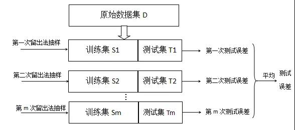
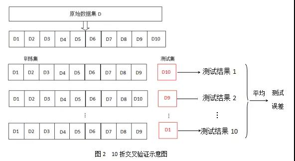
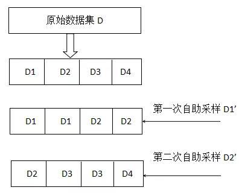
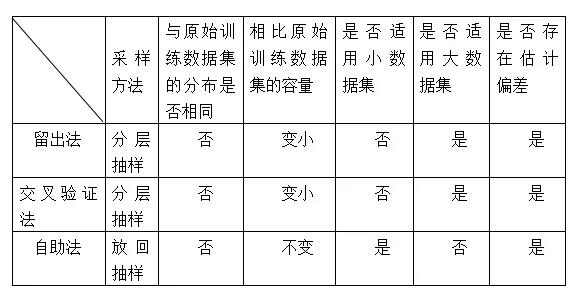

### 1 、经验误差与过拟合

首先介绍几个概念：

 1. 错误率（error rate）：分类错误的样本占总样本的比率
 2. 精度（accuracy）：分类正确的样本占总样本的比率
 3. 误差（error）：学习器的实际预测输出与样本的真实输出之间的差距（指误差期望）
 4. 训练误差（training error）或经验误差（empirical error）：学习器在训练集上的误差
 5. 泛化误差（generalization error）：在新样本上的误差

我们希望得到泛化误差小，在新样本上表现好的学习器。我们应该从训练样本中尽可能学出适用于所有潜在样本的"普遍规律"，这样才能在遇到新样本时做出正确的判别。然而，实际能做的是努力使经验误差最小化。在很多情况下，我们可以学得一个经验误差很小、在训练集上表现很好的学习器，在训练集上表现很好，在测试集上表现很差，这就是过拟合，过拟合无法避免，只能缓解。

 - 过拟合（overfitting）：学习器学习能力太好，把训练样本自身的一些特点（训练样本所包含的不太一般的性质）当作了所有潜在样本都会具有的一般性质，这样就会导致泛化性能下
 - 欠拟合（underfitting）：学习器学习能力太低下训练样本的一般特点都没有学好。解决方法有：在决策树学习中扩展分支、在神经网络学习中增加训练轮数epoch

### 2、模型评估方法

实际的机器学习项目中，我们往往只知道包含 `!$m$` 个样例的数据集 `!$D$`， `!$D={(x_1,y_1),(x_2,y_2),(x_3,y_3),...,(x_m,y_m)}$`，通过对数据集 `!$D$` 进行适当的处理，划分为训练集和测试集，训练集构建模型，然后用该模型计算测试数据集的测试误差，最后以测试集的测试误差近似为模型的泛化能力，根据泛化能力来评价模型的优劣。

我们在构建最优机器模型的前提是假设数据集 `!$D$` 是独立同分布的，用抽样的观点来解释就是我们从真实的总体样本中随机抽样 `!$m$`次，得到抽样样本集 `!$D$`，机器学习模型评估方法是讨论如何划分为训练集和测试集的方法，我们可以通过概率学的角度来理解评估方法。

#### 2.1、数据集的概率分布

假设总体样本服从某一分布 `!$P(X)$`，数据集 `!$D$` 是从总体样本中独立随机抽样 `!$m$` 次获取的，数据集 `!$D={(x_1,y_1),(x_2,y_2),(x_3,y_3),...,(x_m,y_m)}$`。
数据集 `!$D$` 的概率分布：
```mathjax!
$$
P(D) = P(x_1) \times P(x_2) \times \ldots \times P(x_m)
$$
```
若再次从总体样本随机抽样 `!$m$` 次得到数据集 `!$D_1$`，数据集 `!$D_1 = {(x_1’,y_1'),(x_2’,y_2'),(x_3’,y_3'),...,(x_m’,y_m')}$`，若数据集不同，那么用数据集构建的最优模型也有所不同。

#### 2.2、模型评估方法

模型评估方法是对数据集 `!$D$` 如何划分为训练集 `!$S$` 和测试集 `!$T$` 的方法，目前常见的做法有留出法、交叉验证法和自助法。

##### 2.2.1 留出法

“留出法”（hold-out）直接将数据集D划分为两个互斥集合，其中一个集合为训练集S，另一个作为测试集T，即：
```mathjax!
$$
D = S \cup T,\ \ S \cap T = \phi
$$
```
**训练集S具体划分为训练集和验证集，训练集构建模型，验证集对该模型进行参数择优，选择最优模型，测试集T测试最优模型的泛化能力。**

**训练集和测试集的划分要尽可能保持数据分布的一致性，避免因数据划分过程引入额外的偏差而对最终结果产生影响。** 如数据集D包含500个正样本，500个负样本，数据集D划分为70%样本的训练集和30%样本的测试集，为了保证训练和测试正负样本的比例与数据D比例相同，采用分层抽样的方法，先从500个正样本随机抽取350次，500个负样本随机抽取350次，然后剩下的样本集作为测试集，**分层抽样保证了训练集的正负样本的比例与数据集D的正负样本比例相同。**

**留出法的另一个问题是训练集S和测试集T是从数据集D随机抽样得到的，因此偶然因素较大，需要多次进行留出法计算每次的测试误差率，然后对每次的测试误差求平均（如下图），减小偶然因素。**



初始数据集D的概率分布：
```mathjax!
$$
P(D) = P(S1)\times P(T1)
$$
```
第一次留出法抽样的训练集的概率分布：`!$P(S1)$`

留出法的训练集只包含了一定比例的初始数据集，留出法训练数据集S1 和初始数据集D 的概率分布不一样，因此用留出法估计的模型存在估计偏差。

##### 2.2.2、交叉验证法

“交叉验证法”（cross validation）先将数据集D划分为k个大小相似的互斥子集：
```mathjax!
$$
D = D1 \cup D2 \cup D3 \ldots \cup Dk, \ \  Di \cap Dj = \phi(i \neq j)
$$
```
每个子集Di通过分层采样得到（如上节所述，为了保证正负样本的比例与数据集D的比例相同），然后用k-1个子集的并集作为训练集，余下的子集作为测试集；这样就获得k组训练/测试集，从而进行k次训练和测试，最终返回的是这k个测试结果的均值。通常把交叉验证法称为”k折交叉验证法“，k最常用的取值是10，此时称为10折交叉验证。下图为10折交叉验证的示意图：



初始数据集的概率分布：
```mathjax!
$$
P(D) = P(D1)\times P(D2) \times \ldots \times P(D10)
$$
```

十折交叉验证的第一折的训练集的概率分布：
```mathjax!
$$
P(D') = P(D1)\times P(D2) \times \ldots \times P(D9)
$$
```

**十折交叉验证的训练集只包含了初始数据集的90%，训练数据集D’和初始数据集D的概率分布不一样，因此用十折交叉验证估计的模型存在估计偏差。**

若数据集D包含m个样本，先将数据集D划分为m个大小相似的子集，每个子集只有一个样本数据，则得到了交叉验证法的一个特例，留一法（Leave-One-Out，简称LOO）。因为留一法的训练数据集相比原始样本数据集D只少了一个样本，因此留一法的评估结果比较准确。但是留一法在训练数据比较大时，训练m个模型的计算开销可能是难以忍受的（例如数据集包含1百万个样本，则需训练1百万个模型），若考虑模型参数优化的情况下，计算量则会成倍的增加。

##### 2.2.3、自助法

我们希望评估的是用原始数据集D训练出的模型，但是留出法和交叉验证法训练的数据集比原始的数据集D小，这必然会引入因训练数据集不同导致的估计偏差，留一法受训练样本规模变化的影响较小，但是计算复杂度太高。

”自助法“（bootstrapping）是有放回抽样，给定包含m个样本的数据集D，我们对它进行采样产生数据集D’：每次随机从D中挑选一个样本，将该样本拷贝放入D’，然后再将该样本放回初始数据集D中，下次抽样时仍有可能被采到；重复执行m次该过程，我们就得到了包含m个样本数据集D’，这就是自助采样的结果。初始数据集D中有一部分样本会在数据集D’中多次出现，也有一部分样本不会在数据集D’中出现。

样本在m次采样中始终不被采到的概率是：
```mathjax!
$$
P(一次都未采集) = (1 - \frac{1}{m})^m
$$
```
对m取极限得到：
```mathjax!
$$
$$
```

上式可知，通过自助采样，初始数据集D中约有36.8%的样本未出现在采样数据集D’，于是我们可将D’用作训练集，实际评估的模型与期望评估的模型都使用m个训练样本，我们仍有数据总量约1/3的、没在训练集中出现的样本作为测试集用于测试，这样的测试结果，**亦称”包外估计“（out-of-bag estimate）**。

自助法在数据集较小、难以有效划分训练/测试集时很有用；此外，自助法能从初始数据集中产生多个不同的训练集，这对集成学习（强学习分类器）等方法有很大的好处，然而，自助法产生数据集改变了初始数据集的分布，这会引入估计偏差（如下图）。

数据集D分为D1，D2，D3，D4数据集，假设知道自助采样的数据集结果，比较自助法采样产生的数据集分布和初始数据集的分布。



初始数据集 `!$D$` 的概率分布：
```mathjax!
$$
P(D) = P(D1) \times P(D2) \times P(D3) \times P(D4)
$$
```
第一次自主采样 `!$D1'$` 的概率分布：
```mathjax!
$$
P(D) = P(D1) \times P(D1) \times P(D2) \times P(D2)
$$
```
第二次自主采样 `!$D2'$` 的概率分布：
```mathjax!
$$
P(D) = P(D2) \times P(D3) \times P(D3) \times P(D4)
$$
```

由上述表达式可知道，初始数据集与自助采样数据集D1’、自助采样数据集D2’的概率分布不一样，且自助法采样的数据集正负类别比例与原始数据集不同，因此用自助法采样的数据集代替初始数据集来构建模型存在估计偏差。

#### 2.3、总结

留出法和交叉验证法虽然通过分层抽样的方法没有改变初始数据集正负类比的比例，但是训练数据集的样本数少于原始数据集，训练数据集的概率分布与原始数据集的概率分布不一样，因此留出法和交叉验证法在构建模型时存在估计偏差；自助法虽然样本容量和初始数据集一样，但是改变了初始数据集的分布和正负类别比例，用自助法抽样的数据集分布来代替初始数据集的分布，同样存在估计偏差。

因此，若对于小样本的数据集，个人建议采用自助法抽样的方法，然后用强训练分类器构建模型；若对于大一点的样本数据集则建议采用十折交叉验证法，超大样本数据及则建议采用留出法构建模型。

