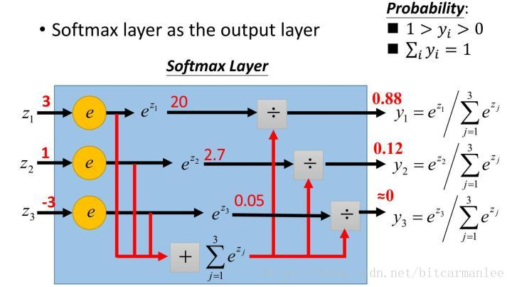
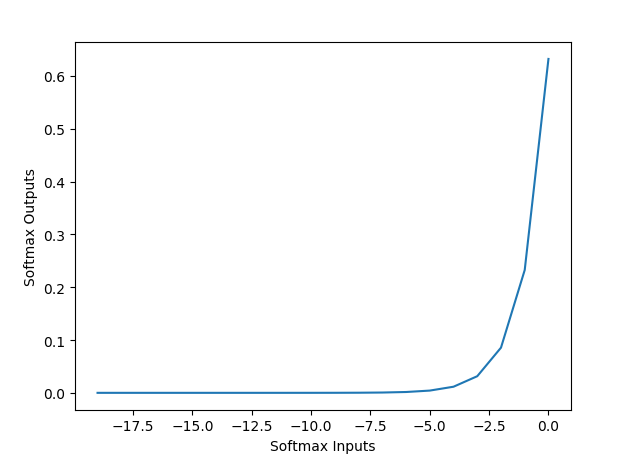
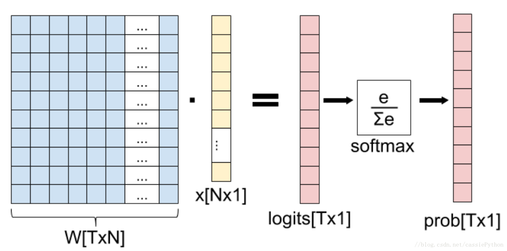

#### 1、定义
在数学，尤其是概率论和相关领域中，Softmax函数（或称归一化指数函数）是逻辑函数的一种推广。它能将一个含任意实数的 N 维的向量 z “压缩”到另一个 N 维实向量 `!$\sigma(z)$` 中，使得每一个元素的范围都在 (0,1) 之间，并且所有元素的和为 1。

Softmax函数的输入是 N 维的随机真值向量，输出是另一个 N 维的真值向量。即映射：`!$S(a) = \Bbb {R}^N \rightarrow \Bbb {R}^N$`:
```mathjax!
$$
S(a) : \begin{bmatrix} a_1 \\ a_2 \\ \cdots \\ a_N \end{bmatrix} \rightarrow \begin{bmatrix} S_1 \\ S_2 \\ \cdots \\ S_N \end{bmatrix}
$$
```

###### 概率解释
softmax的性质(所有输出的值范围是(0, 1)且和为 1 )使其在机器学习的概率解释中广泛使用。尤其是在多类别分类任务中，我们总是给输出结果对应的类别附上一个概率，即如果我们的输出类别有 N 种，我们就输出一个 N 维的概率向量且和为 1。每一维的值对应一种类别的概率。我们可以将softmax解释如下：
```mathjax!
$$
S_j = P(y = j | a)
$$
```
其中，`!$y$` 是输出的 N 个类别中的某个(取值为 `!$1...N$`)。`!$a$` 是任意一个 N 维向量。最常见的例子是多类别的逻杰斯谛回归，输入的向量 `!$x$` 乘以一个权重矩阵 `!$W$`，且该结果输入softmax函数以产生概率。事实证明，从概率的角度来看，softmax对于模型参数的最大似然估计是最优的。**(在代价函数的笔记中会详细说明)**
 
#### 2、公式
Softmax是一种形如下式的函数：
```mathjax!
$$
P(i) = \frac{exp(\theta_i^T x)}{\sum_{k = 1}^K exp(\theta_k^T x)} \tag{2.1}
$$
```
其中 `!$\theta_i $` 和 `!$ x $` 是列向量，`!$\theta_i^T x$` 可能被换成关于 `!$ x $` 的函数 `!$f_i(x)$`。

显然 `!$P(i)$` 总是正的(因为指数)；因为所有的 `!$P(i)$` 的和为 1，使得 `!$P(i)$` 的范围在 `!$[0,1]$` 之间。在回归和分类问题中，函数的输入是从 `!$K$` 个不同的线性函数得到的结果，而  `!$P(i)$` 表示样本向量 `!$x$` 属于第  `!$i$` 个分类的概率，<span style="font-size:100%;color:red">通常 `!$\theta$` 是待求参数，通过寻找使得 `!$P(i)$` 最大的 `!$\theta_i$` 作为最佳参数。</span>

和logistic函数一样，softmax函数加入了 `!$e$` 的幂函数正是为了两极化：正样本的结果将趋近于 1，而负样本的结果趋近于0。这样为多类别分类提供了方便（可以把  `!$P(i)$` 看作是样本属于类别 `!$i$` 的概率）。可以说，Softmax函数是logistic函数的一种泛化。

**计算示例：**


 
#### 3、推导

虽然Softmax函数得到的是一个 `!$[0,1]$` 之间的值，且 `!$\sum_{i = 1}^{K} P(i) = 1$` ，但是这个softmax求出的概率是否就是真正的概率？换句话说，**这个概率是否严格等于期望呢？**

**为此在这里进行推导：**
假设现在有 `!$K$` 个类，样本属于类别 `!$i$` 的概率为 `!$\phi(i),i=1,\ldots ,K$`，由于 `!$\sum_{i = 1}^K \phi(i) = 1$` ，所以只需要前 `!$K-1$` 个参数即可：
```mathjax!
$$
\phi i = P(y = i,\phi),i = 1,\ldots ,K-1.\ \ \ \ \  \phi(K)=1 - \sum_{i = 1}^{K - 1} \phi i
$$
```
引入 `!$K - 1$` 个 K 维列向量（即参数） `!$T(y),y=1,\ldots ,K-1$`，样本属于第 `!$i$` 类则第 `!$i$` 行元素为1，其余为0，即：`!$(T(y))_i = 1$`。
因为 `!$y$` 只能属于 1 类，故( `!$y$` 不等于 `!$K$` 时) `!$T(y)$`只有一个元素为 1，其余元素都为 0，则 `!$y$` 的期望为：
```mathjax!
$$
E(T(y))_i = P(y = i) = \phi_i,i \neq K  \tag{3.1}
$$
```
令 `!$\beta_i = ln \frac{\phi_i}{\phi_K},i=1,\ldots ,K$`，则有：
```mathjax!
$$
e^{\beta_i} = \frac{\phi_i}{\phi_K} \Rightarrow \phi_K = \frac{\phi_i}{e^{\beta_i}} \Rightarrow \phi_K \sum_i^K e^{\beta_i} = \sum_i^K \phi_i = 1  \tag{3.2}
$$
```
所以
```mathjax!
$$
\phi_K = \frac{1}{\sum_{i = 1}^K e^{\beta_i}} \tag{3.3}
$$
```
 将 `!$\phi_K = \frac{\phi_i}{e^{\beta_i}}$` 代入，有
 ```mathjax!
$$
\phi_i = \frac{e^{\beta_i}}{\sum_{i = 1}^K e^{\beta_i}} \tag{3.4}
$$
```
由于分母中是求和操作，可以将 `!$i$` 换成 `!$k$`，得
 ```mathjax!
$$
\phi_i = \frac{e^{\beta_i}}{\sum_{k = 1}^K e^{\beta_k}} \tag{3.5}
$$
```

<span style="font-size:100%;color:red">所以实际的期望是具有softmax函数的形式的，当 `!$f_i(x) = \beta_i = ln \frac{\phi_i}{\phi_K}$` 时实际期望与softmax函数严格相等，所求概率为真实值。</span>

在回归和分类问题中，我们假设 `!$\beta_i$` 与样本 `!$x$` 正相关，即 `!$\beta_i = \theta_i^T x$`。由于是估计值，并不是严格意义上的期望，所以用 `!$P(i)$` 代替 `!$\phi_i$`。代入 $(3.5)$ 得
 ```mathjax!
$$
P(i) = \frac{exp(\theta_i^T x)}{\sum_{k = 1}^K exp(\theta_k^T x)} \tag{3.6}
$$
```
此外Softmax函数同样可用于非线性估计，此时参数 `!$\theta $` 可根据现实意义使用其他列向量替代。在词矢量的计算中，计算基于Skip-gram的当前词 `!$W_i$` 下输出词 `!$W_o$` 出现的概率为：
 ```mathjax!
$$
p(W_o|W_i) = \frac{exp(v_wo'^Tv_w)}{\sum_{w = 1}^W exp({v'}_w^Tv_w)}
$$
```
`!$v_wo'$` 为根据当前词矢量 `!$v_w$` 估计出的上下文词矢量。使用softmax函数求得的概率最大值为实际上与当前词矢量在维度空间上最接近的词。

#### 4、图像



#### 5、求导
我们正在寻找的偏导数是：`!$\frac{\partial S_i}{\partial a_j}$`，这是第 `!$i$` 个输出关于第 `!$j$` 个输入的偏导数。我们使用一个更简洁的式子来表示：`!$D_jS_i$`。

因为softmax函数是一个 `!$\Bbb {R}^N \rightarrow \Bbb {R}^N$` 的函数，所以我们计算得到的导数是一个雅可比矩阵：
```mathjax!
$$
DS = \begin{bmatrix} D_1S_1 & \cdots & D_NS_1 \\ \vdots & \ddots & \vdots \\ D_1S_N & \cdots & D_NS_N  \end{bmatrix}  \tag{5.1}
$$
```
对任意的 `!$i$` 和 `!$j$` ，让我们来计算 `!$D_jS_i$`： 
```mathjax!
$$
D_jD_i = \frac{\partial S_i}{\partial a_j} = \frac{\partial (e^{a_i} / \sum_{k=1}^N e^{a_k})}{\partial a_j} \tag{5.2}
$$
```
使用链式法则得：
```mathjax!
$$
g_i = e^{a_i} \ \ \ h_i = \sum_{k = 1}^N e^{a_k} \tag{5.3}
$$
```
注意对于 `!$h_i$`，无论求其关于哪个 `!$a_j$` 的导数，结果都是 `!$e^{a_j}$`，但是对于 `!$g_i$` 就不同了。  `!$g_i$` 关于 `!$a_j$` 的导数是 `!$e^{a_j}$` 当且仅当 `!$i = j$`；否则结果为 0。
（一）让我们回到 `!$D_jS_i$`；我们先考虑 `!$i = j$` 的情况。根据链式法则我们有：
```mathjax!
$$
\frac{\partial (e^{a_i} / \sum_{k=1}^N e^{a_k})}{\partial a_j} = \frac{e^{a_i}\sum - e^{a_j}e^{a_i}}{\sum^2} \tag{5.4}
$$
```
简单起见，我们使用 `!$\sum $` 表示 `!$\sum_{k = 1}^N e^{a_k}$`。继续化简下：
```mathjax!
$$
\begin{aligned} \frac{\partial (e^{a_i} / \sum_{k=1}^N e^{a_k})}{\partial a_j} & = \frac{e^{a_i}\sum - e^{a_j}e^{a_i}}{\sum^2} \\ & = \frac{e^{a_i}}{\sum} \frac{\sum - e^{a_j}}{\sum} \\ & = S_i(1 - S_j) \end{aligned} \tag{5.5}
$$
```
最后的公式使用其自身来表示( `!$S_i$` 和 `!$S_j$` )，这在包含指数函数时是一个常用的技巧。
（二）类似的，考虑 `!$i \neq j$` 的情况：
```mathjax!
$$
\begin{aligned} \frac{\partial (e^{a_i} / \sum_{k=1}^N e^{a_k})}{\partial a_j} & = \frac{0 - e^{a_j}e^{a_i}}{\sum^2} \\ & = - \frac{e^{a_i}}{\sum} \frac{e^{a_j}}{\sum} \\ & = - S_iS_j \end{aligned} \tag{5.6}
$$
```
总结如下： 
```mathjax!
$$
D_jS_i = \begin{cases} S_i(1 - S_j) & i = j \\ - S_jS_i & i \neq j \end{cases} \tag{5.7}
$$
```
在文献中我们常常会见到各种各样的”浓缩的”公式，一个常见的例子是使用克罗内克函数：
```mathjax!
$$
\delta_{ij} = \begin{cases} 1 & i = j \\ 0 & i \neq j \end{cases}
$$
```
于是我们有：
```mathjax!
$$
D_jS_i = S_i(\delta_{ij} - S_j) \tag{5.8}
$$
```
在文献中也有一些其它的表述：

 1. 在雅可比矩阵中使用单位矩阵 `!$I$` 来替换 `!$\delta $`， `!$I$`使用元素的矩阵形式表示了 `!$\delta $`。 
 2. 使用 ”1” 作为函数名而不是克罗内克  `!$\delta $`，如下所示：`!$D_jS_i = S_i(1(i = j) − S_j)$`。这里 `!$1(i=j)$` 意味着当 `!$i=j$` 时值为 1，否则为 0。

当我们想要计算依赖于softmax导数的更复杂的导数时，“浓缩”符号会很有用; 否则我们必须在任何地方完整的写出公式。

----

###### 5.1、计算softmax和数值稳定性
对于一个给定的向量，使用Python来计算softmax的简单方法是：
``` python
def softmax(x):
    """Compute the softmax of vector x."""
    exps = np.exp(x)
    return exps / np.sum(exps)
```
使用前面定义的softmax函数计算一个三维的向量：
``` python
In [146]: softmax([1, 2, 3])
Out[146]: array([ 0.09003057, 0.24472847,  0.66524096])
```
然而当我们使用该函数计算较大的值时(或者大的负数时)，会出现一个问题：
``` python
In [148]: softmax([1000, 2000, 3000])
Out[148]: array([ nan,  nan,  nan])
```
Numpy使用的浮点数的数值范围是有限的。对于float64，最大可表示数字的大小为 `!$10^{308}$`。 softmax函数中的求幂运算可以轻松超过这个数字，即使是相当适中的输入。避免这个问题的一个好方法是通过规范输入使其不要太大或者太小，通过观察我们可以使用任意的常量C，如下所示：
```mathjax!
$$
S_j = \frac{e^{a_j}}{\sum_{k = 1}^N e^{a_k}} = \frac{Ce^{a_j}}{\sum_{k = 1}^N Ce^{a_k}}
$$
```
然后将这个变量转换到指数上： 
```mathjax!
$$
S_j = \frac{e^{a_j + log(C)}}{\sum_{k = 1}^N e^{a_k + log(C)}}
$$
```
因为C是一个随机的常量，所以我们可以写为：
```mathjax!
$$
S_j = \frac{e^{a_j + D}}{\sum_{k = 1}^N e^{a_k + D}}
$$
```
D也是一个任意常量。对任意D，这个公式等价于前面的式子，这让我们能够更好的进行计算。对于D，一个比较好的选择是所有输入的最大值的负数： 
```mathjax!
$$
D = - max(a_1,a_2,\ldots ,a_n)
$$
```
假定输入本身彼此相差不大，这会使输入转换到接近于0的范围。最重要的是，它将所有的输入转换为负数(除最大值外，最大值变为0)。很大的负指数结果会趋于0而不是无穷，这就让我们很好的避免了出现NaN的结果。
``` python
def stablesoftmax(x):
    """Compute the softmax of vector x in a numerically
    stable way."""
    shiftx = x - np.max(x)
    exps = np.exp(shiftx)
    return exps / np.sum(exps)
```
现在我们有：
``` python
In [150]: stablesoftmax([1000, 2000, 3000])
Out[150]: array([ 0.,  0.,  1.])
```
请注意，这仍然是不完美的，因为数学上softmax永远不会真的产生零，但这比NaN好得多，且由于输入之间的距离非常大，所以无论如何都会得到非常接近于零的结果。

___

###### 5.2、softmax层及其导数
softmax常用于机器学习中，特别是逻辑斯特回归：softmax层，其中我们将softmax应用于全连接层(矩阵乘法)的输出，如图所示：



在这个图中，我们有一个具有N个特征的输入 `!$x$` 和 `!$T$` 个可能的输出类别。权重矩阵`!$W$` 用于将 `!$x$` 转换成具有 `!$T$` 元素的向量(在机器学习的文献中称为“logits”)，并且softmax函数用于将logits转换成表示属于某一类别的概率。我们如何计算这个“softmax层”的导数，当然是使用链式规则！

在我们开始之前的一个重要的观点：你可能会认为x是计算其导数的自然变量(natural variable)。但事实并非如此。实际上，在机器学习中，我们通常希望找到最佳的权重矩阵`!$W$`，因此我们希望用梯度下降的每一步来更新权重。因此，我们将计算该层的关于 `!$W$` 的导数。

我们首先将这个图改写为向量函数的组合。首先我们定义矩阵乘法 `!$g(W)$`，即映射：`!$\Bbb {R}^{NT} \rightarrow \Bbb {R}^T$`。因为输入(矩阵 `!$W$`)`!$N×T$` 个元素，输出有 `!$T$` 个元素。

接下来我们来考虑softmax，如果我们定义logits的向量是 `!$λ$`，我们有：`!$\Bbb {R}^{T} \rightarrow \Bbb {R}^T$`。总体来说，我们有： 
```mathjax!
$$
P(W) = S(g(W)) = (S \circ g)(W)
$$
```
使用多变量的链式法则，得到 `!$P(W)$` 的雅可比矩阵：
```mathjax!
$$
DP(W) = D(S \circ g)(W) = DS(g(W))\bullet Dg(W)
$$
```
我们之前已经计算过雅可比矩阵；只不过此时是对 `!$g(W)$` 求解。因此 `!$g$` 是一个非常简单的函数，因此计算雅可比矩阵很简单。唯一要注意的是正确计算相应的索引。因为 `!$g(W) : \Bbb {R}^{NT} \rightarrow \Bbb {R}^T$`，所以它的雅可比矩阵是 `!$T$` 行，`!$NT$` 列：
```mathjax!
$$
Dg = \begin{bmatrix} D_1g_1 & \cdots & D_{NT}g_1 \\ \vdots & \ddots & \vdots \\ D_1g_N & \cdots & D_{NT}g_T  \end{bmatrix}
$$
```
在某种意义上，权重矩阵 `!$W$`被“线性化”为长度为 `!$NT$` 的向量。 如果您熟悉多维数组的内存布局，应该很容易理解它是如何完成的。 在我们的例子中，我们可以做的一件事就是按照行主次序对其进行线性化处理，第一行是连续的，接着是第二行，等等。`!$W_{ij}$` 在雅可比矩阵中的列号是 `!$(i−1)N+j$`。为了计算 `!$Dg$`，让我们回顾 `!$g_1$`：
```mathjax!
$$
g_1 = W_{11}x_1 + W_{12}x_2 + \cdots + W_{1N}x_N
$$
```
因此：
```mathjax!
$$
\begin{equation*}
\begin{split}
D_1g_1=x_1 \\
D_2g_1=x_2 \\
\cdots \\
D_Ng_1=x_N \\
D_{N+1}g_1=0 \\
\cdots \\
D_{NT}g_1=0
\end{split}
\end{equation*}
$$
```
我们使用同样的策略来计算 `!$g_2⋯g_T$`，我们可以得到雅可比矩阵：
```mathjax!
$$
\begin{equation*}
Dg=
\begin{bmatrix}
x_1    &x_1     &\cdots  &x_N     &\cdots  &0       &0       &0       &0 \\
\vdots &\ddots  &\ddots  &\ddots  &\ddots  &\ddots  &\ddots  &\ddots  &\vdots \\
0      &0       &\cdots  &0       &\cdots  &x_1     &x_2     &\cdots  &x_N
\end{bmatrix}
\end{equation*}
$$
```
最后从另一个角度来这个问题，如果我们将 `!$W$` 的索引分解为 `!$i$` 和 `!$j$`，可以得到：
```mathjax!
$$
\begin{equation*}
\begin{split}
D_{ij}g_t=\frac{\partial (W_{t1}x_1+W_{t2}x_2+\cdots+W_{tN}x_N)}{\partial W_{ij}}\\
=
\left\{\begin{matrix}
x_j & i=t\\
0   & i\neq t
\end{matrix}\right.
\end{split}
\end{equation*}
$$
```
在雅可比矩阵中表示第 `!$t$` 行，`!$(i−1)N+j$` 列。 

最后，为了计算softmax层的完整的雅可比矩阵，我们只需要计算 `!$DS$` 和 `!$Dg$` 间的乘积。注意 `!$P(W) : \mathbb{R}^{NT}\rightarrow \mathbb{R}^T$` ，因此雅可比矩阵的维度可以确定。因此 `!$DS$` 是 `!$T\times T$`，`!$Dg$` 是 `!$T\times NT$` 的，它们的乘积 `!$DP$` 是 `!$T\times NT$` 的。 

在文献中，你会看到softmax层的导数大大减少了。因为涉及的两个函数很简单而且很常用。 如果我们仔细计算 `!$DS$` 的行和 `!$Dg$` 的列之间的乘积： 
```mathjax!
$$
\begin{equation*}
D_{ij}P_t=\sum_{k=1}^{T}D_kS_t\cdot D_{ij}g_k
\end{equation*}
$$
```
`!$Dg$` 大多数为 `!$0$`，所以最终的结果很简单，仅当 `!$i=k$` 时 `!$D_{ij}g_k$` 不为 `!$0$`；然后它等于 `!$x_j$`。因此： 
```mathjax!
$$
\begin{equation*}
D_{ij}P_t=D_iS_tx_j=S_t(\delta_{ti}-S_i)x_j
\end{equation*}
$$
```
因此完全可以在没有实际雅可比矩阵乘法的情况下计算softmax层的导数；这很好，因为矩阵乘法很耗时！由于全连接层的雅可比矩阵是稀疏的，我们可以避免大多数计算。

#### 6、应用
 softmax函数经常用在神经网络的最后一层，作为输出层，进行多分类。此外，softmax在增强学习领域内，softmax经常被用作将某个值转化为激活概率，这类情况下，softmax的公式如下：
  ```mathjax!
$$
P_t(a) = \frac{e^{(q_t(i) / T)}}{\sum_{i = 1}^n e^{(q_t(i) / T)}}
$$
```
 其中，T 被称为是温度参数（temperature parameter）。当T很大时，即趋于正无穷时，所有的激活值对应的激活概率趋近于相同（激活概率差异性较小）；而当 T 很低时，即趋于 0 时，不同的激活值对应的激活概率差异也就越大。这个结论很重要，Hinton在2015年的一篇paper中重点阐释了如何根据温度参数来soften神经网络的输出，从而提出了distillation的思想和方法。
 
#### 7、Softmax与logistic函数的关系
###### 7.1、分类问题
logistic具体针对的是二分类问题，而softmax解决的是多分类问题，因此从这个角度也可以理解logistic函数是softmax函数的一个特例。具体的推导过程如下：

当分类数为 2 时，softmax回归的假设函数表示如下：
```mathjax!
$$
h_{\theta}(x) =\frac {1}{e^{\theta_1^T x} + e^{\theta_2^T x^{(i)}}} \begin{bmatrix} e^{\theta_1^T x}  \\  e^{\theta_2^T x} \\ \end{bmatrix}
$$
```
利用softmax回归参数冗余的特点，从两个参数向量中都减去向量 `!$\theta_1$`，得到：
```mathjax!
$$
\begin{align} h(x) & =\frac {1}{e^{{\vec 0}^T x} + e^{(\theta_2 - \theta_1)^T x^{(i)}}} \begin{bmatrix} e^{{\vec 0}^T x}  \\  e^{(\theta_2 - \theta_1)^T x} \\ \end{bmatrix} \\ & = \begin{bmatrix} \frac{1}{1 + e^{(\theta_2 - \theta_1)^T x^{(i)}}}  \\  \frac{e^{(\theta_2 - \theta_1)^T x}}{1 + e^{(\theta_2 - \theta_1)^T x^{(i)}}} \\ \end{bmatrix} \\ & = \begin{bmatrix} \frac{1}{1 + e^{(\theta_2 - \theta_1)^T x^{(i)}}}  \\  1 - \frac{1}{1 + e^{(\theta_2 - \theta_1)^T x^{(i)}}} \\ \end{bmatrix} \end{align}
$$
```
最后，用 `!$\theta ′$` 来表示 `!$\theta_2−\theta_1$`，上述公式可以表示为softmax回归器预测其中一个类别的概率为
```mathjax!
$$
\frac{1}{1 + e^{\theta 'Tx^i}}
$$
```
另一个类别的概率为
回归器预测其中一个类别的概率为
```mathjax!
$$
1 - \frac{1}{1 + e^{\theta 'Tx^i}}
$$
```
这与logistic回归是完全一致的。

###### 7.2、从概率角度来看logistic和softmax函数的区别。
softmax建模使用的分布是多项式分布，而logistic则基于伯努利分布。
  
###### 7.3、softmax回归和多个logistic回归的关系。
softmax回归进行的多分类，类与类之间是互斥的，即一个输入只能被归为一类；多个logistic回归进行多分类，输出的类别并不是互斥的，即"苹果"这个词语既属于"水果"类也属于"3C"类别。

#### 8、Softmax和交叉熵损失