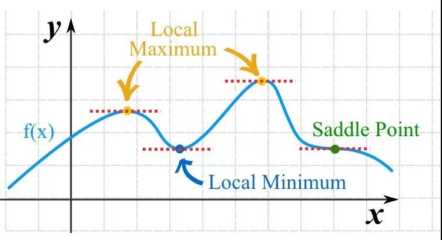
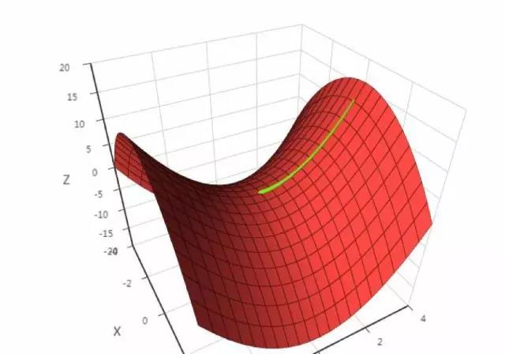

[TOC]



#### 一、最优化问题

最优化问题是求解函数极值的问题，包括极大值和极小值。在机器学习之类的实际应用中，我们一般将最优化问题统一表述为求解函数的极小值问题，即：
```mathjax!
$$
min_xf(x)
$$
```
其中 `!$x$` 称为优化变量，`!$f$` 称为目标函数。极大值问题可以转换成极小值问题来求解，只需要将目标函数加上负号即可：
```mathjax!
$$
max_xf(x) \Leftrightarrow -min_xf(x)
$$
```
有些时候会对优化变量 `!$x$` 有约束，包括等式约束和不等式约束，它们定义了优化变量的可行域，即满足约束条件的点构成的集合。在这里我们先不考虑带约束条件的问题。

一个优化问题的全局极小值 `!$ x^{*} $`  是指对于可行域里所有的 `!$x$`，有：
```mathjax!
$$
f(x^{*}) \le f(x)
$$
```
即全局极小值点处的函数值不大于任意一点处的函数值。局部极小值 `!$ x^{*} $` 定义为存在一个`!$\delta $`  邻域，对于在邻域内：
```mathjax!
$$
||x - x^{*}|| \le \delta
$$
```
并且在可行域内的所有 `!$x$`，有：
```mathjax!
$$
f(x^{*}) \le f(x)
$$
```
即局部极小值点处的函数值比一个局部范围内所有点的函数值都小。在这里，我们的目标是找到全局极小值。不幸的是，有些函数可能有多个局部极小值点，因此即使找到了导数等于 0 的所有点，还需要比较这些点处的函数值。

#### 二、导数和梯度
实际应用中一般都是多元函数，梯度是导数对多元函数的推广，它是多元函数对各个自变量偏导数形成的向量。多元函数的梯度定义为：
```mathjax!
$$
\nabla f(x) = \left( \frac{\partial f}{\partial x_1},\ldots ,\frac{\partial f}{\partial x_n} \right)^T
$$
```
其中 `!$\nabla $` 称为梯度算子，它作用于一个多元函数，得到一个向量。下面是计算函数梯度的一个例子：
```mathjax!
$$
\nabla(x^2 + xy - y^2) = (2x + y,x - 2y)^T
$$
```
可导函数在某一点处取得极值的必要条件是梯度为 0，梯度为 0 的点称为函数的驻点，这是疑似极值点。需要注意的是，梯度为 0 只是函数取极值的必要条件而不是充分条件，即梯度为0的点可能不是极值点。

至于是极大值还是极小值，要看二阶导数 / Hessian矩阵，这是由函数的二阶偏导数构成的矩阵。这分为下面几种情况：

 - 如果Hessian矩阵正定，函数有极小值
 - 如果Hessian矩阵负定，函数有极大值
 - 如果Hessian矩阵不定，则需要进一步讨论

这和一元函数的结果类似，Hessian矩阵可以看做是一元函数的二阶导数对多元函数的推广。一元函数的极值判别法为，假设在某点处导数等于 0，则：

 - 如果二阶导数大于0，函数有极小值
 - 如果二阶导数小于0，函数有极大值
 - 如果二阶导数等于0，情况不定

直接求函数的导数 / 梯度，然后令导数 / 梯度为 0，解方程，问题不就解决了吗？事实上没这么简单，因为这个方程可能很难解。比如下面的函数：
```mathjax!
$$
f(x,y) = x^3 - 2x^2 + e^{xy} - y^3 + 10y^2 + 100sin(xy)
$$
```
我们分别对 x 和 y 求偏导数，并令它们为 0，得到下面的方程组：
```mathjax!
$$
\left\{ \begin{array}{c} 3x^2 - 4x + ye^{xy} + 100y cos(xy) = 0 \\ xe^{xy} - 3y^2 + 20y + x cos(xy) = 0 \end{array} \right.
$$
```
这个方程非常难以求解，对于有指数函数，对数函数，三角函数的方程，我们称为超越方程，求解的难度并不比求极值本身小。
 
精确的求解不太可能，因此只能求近似解，这称为数值计算。工程上实现时通常采用的是迭代法，它从一个初始点 `!$x_{0}$`  开始，反复使用某种规则从 `!$ x_{k}$`  移动到下一个点 `!$x_{k+1}$`  ，构造这样一个数列，直到收敛到梯度为 0 的点处。即有下面的极限成立：
```mathjax!
$$
lim_{k \rightarrow +\infty}\nabla f(x_k) = 0
$$
```
这些规则一般会利用一阶导数信息即梯度；或者二阶导数信息即Hessian矩阵。这样迭代法的核心是得到这样的由上一个点确定下一个点的迭代公式：
```mathjax!
$$
x_{k + 1} = h(x_k)
$$
```

#### 三、推导过程
首先我们来看一元函数的泰勒展开，以便于更好的理解多元函数的泰勒展开。如果一个一元函数 `!$n$` 阶可导，它的泰勒展开公式为：
```mathjax!
$$
f(x + \Delta x) = f(x) + f^{'}(x)\Delta x + \frac{1}{2} f^{''}{(\Delta x)}^2 + \cdots + \frac{1}{n!} f^{(n)}(x)(\Delta x)^n \ \ldots
$$
```
如果在某一点处导数值大于 0（+），则函数在此处是增函数，加大 x 的值函数值会增加，减小 x 的值函数值会减小。相反的，如果在某一点处导数值小于 0（-），则函数是减函数，增加 x 的值函数值会减小，减小 x 的值函数值会增加。因此我们可以得出一个结论：**如果 x 的变化很小，并且变化值与导数值反号**，则函数值下降。对于一元函数，x 的变化只有两个方向，要么朝左，要么朝右。

下面我们把这一结论推广到多元函数的情况。多元函数 `!$f(x) $`  在 x 点处的泰勒展开为：
```mathjax!
$$
f(x + \Delta x) = f(x) + (\nabla f(x))^T \Delta x + \omicron(\Delta x)
$$
```
这里我们忽略了二次及更高的项。其中，一次项是梯度向量 `!$\nabla f(x)$` 与自变量增量 `!$ \Delta x $` 的内积 `!$(\nabla f(x))^T \Delta x$`，这等价于一元函数的 `!$ f^{'}(x_{0})\Delta x $`  。这样，函数的增量与自变量的增量 `!$\Delta x$`、函数梯度的关系可以表示为：
```mathjax!
$$
f(x + \Delta x) - f(x) = (\nabla f(x))^T \Delta x + \omicron(\Delta x)
$$
```
如果 `!$\Delta x$`  足够小，在 x 的某一邻域内，则我们可以忽略二次及以上的项，有：
```mathjax!
$$
f(x + \Delta x) - f(x) \approx (\nabla f(x))^T \Delta x
$$
```
这里的情况比一元函数复杂多了， `!$ \Delta x $` 是一个向量，`!$\Delta x$` 有无穷多种方向，该往哪个方向走呢？如果能保证：
```mathjax!
$$
(\nabla f(x))^T \Delta x < 0
$$
```
则有：
```mathjax!
$$
f(x + \Delta x) < f(x)
$$
```
即函数值递减，这就是下山的正确方向。因为有：
```mathjax!
$$
(\nabla f(x))^T \Delta x = ||\nabla f(x)||\  ||\Delta x|| cos\theta
$$
```
在这里，`!$||·||$` 表示向量的模，`!$\theta $` 是向量 `!$\nabla f(x)$` 和 `!$\Delta x $` 的夹角。因为向量的模一定大于等于 0，如果：
```mathjax!
$$
cos \theta \le 0
$$
```
则能保证：
```mathjax!
$$
(\nabla f(x))^T \Delta x < 0
$$
```
即选择合适的增量 `!$ \Delta x $`，就能保证函数值下降，要达到这一目的，只要保证梯度和 `!$\Delta x $` 的夹角的余弦值小于等于 0 就可以了。由于有：
```mathjax!
$$
cos \theta \ge -1
$$
```
只有当：
```mathjax!
$$
\theta = \pi
$$
```
时 `!$cos\theta $` 有极小值 -1，此时梯度和 `!$\Delta x $` 反向，即夹角为 180 度。因此当向量`!$\Delta x $` 的模大小一定时，当：
```mathjax!
$$
\Delta x = - \alpha \nabla f(x)
$$
```
即在梯度相反的方向函数值下降的最快。此时有：
```mathjax!
$$
cos\theta = -1
$$
```
函数的下降值为：
```mathjax!
$$
{(\nabla f(x))}^T \Delta x = - ||\nabla f(x)|| \ ||\Delta x|| = -\alpha{||\nabla f(x)||}^2
$$
```
只要梯度不为 0，往梯度的反方向走函数值一定是下降的。直接用 `!$\Delta x = - \nabla f(x)$` 可能会有问题，因为 `!$x + \Delta x $` 可能会超出 x 的邻域范围之外，此时是不能忽略泰勒展开中的二次及以上的项的，因此步伐不能太大。一般设：
```mathjax!
$$
\Delta x = -\alpha \nabla f(x)
$$
```
其中 `!$\alpha $` 为一个接近于 0 的正数，称为步长，由人工设定，用于保证  `!$x + \Delta x $` 在 x 的邻域内，从而可以忽略泰勒展开中二次及更高的项，则有：
```mathjax!
$$
{(\nabla f(x))}^T \Delta x = -\alpha {(\nabla f(x))}^T (\nabla f(x)) \le 0
$$
```
从初始点 `!$x_{0}$` 开始，使用如下迭代公式：
```mathjax!
$$
x_{k + 1} = x_k - \alpha \nabla f(x_k)
$$
```
只要没有到达梯度为 0 的点，则函数值会沿着序列 `!$ x_{k}$` 递减，最终会收敛到梯度为 0 的点，这就是梯度下降法。迭代终止的条件是函数的梯度值为 0（实际实现时是接近于0），此时认为已经达到极值点。注意我们找到的是梯度为 0 的点，这不一定就是极值点，后面会说明。梯度下降法只需要计算函数在某些点处的梯度，实现简单，计算量小。

#### 四、实现细节问题
###### 初始值的设定

一般的，对于不带约束条件的优化问题，我们可以将初始值设置为 0，或者设置为随机数，对于神经网络的训练，一般设置为随机数，这对算法的收敛至关重要。

###### 学习率的设定

学习率设置为多少，也是实现时需要考虑的问题。最简单的，我们可以将学习率设置为一个很小的正数，如 0.001。另外，可以采用更复杂的策略，在迭代的过程中动态的调整学习率的值。比如前 1 万次迭代为 0.001，接下来 1 万次迭代时设置为 0.0001。

#### 五、面临的问题
在实现时，梯度下降法可能会遇到一些问题，典型的是局部极小值和鞍点问题。

###### 局部极小值
有些函数可能有多个局部极小值点，下面是一个例子：


这张图中的函数有3个局部极值点，分别是A，B和C，但只有A才是全局极小值，梯度下降法可能迭代到B或者C点处就终止。

###### 鞍点 
鞍点是指梯度为0，Hessian矩阵既不是正定也不是负定，即不定的点。下面是鞍点的一个例子，假设有函数：
```mathjax!
$$
x^2 - y^2
$$
```
显然在(0, 0)这点处不是极值点，但梯度为0，下面是梯度下降法的运行结果：



在这里，梯度下降法遇到了鞍点，认为已经找到了极值点，从而终止迭代过程，而这根本不是极值点。

#### 六、变种
梯度下降法有大量的变种，它们都只利用之前迭代时的梯度信息来构造每次的更新值。

###### 1、动量
最直接的改进是为迭代公式加上动量项，动量项累积了之前的权重更新值，加上此项之后的参数更新公式为：
```mathjax!
$$
x_{t + 1}  = x_t + v_{t + 1}
$$
```
其中 `!$v_{t +1} $` 是动量项，它取代了之前的梯度项。动量项的计算公式为：
```mathjax!
$$
v_{t + 1} = - \alpha \nabla f(x_t) + \mu v_t
$$
```
动量项累积了之前的梯度信息，类似于保持行走时的惯性，以避免来回震荡，加快收敛速度。 

###### 2、AdaGrad
AdaGrad 为自适应梯度，即 adaptive gradient 算法，是梯度下降法最直接的改进。唯 一不同的是，AdaGrad 根据前几轮迭代时的历史梯度值来调整学习率，参数更新公式为：
```mathjax!
$$
(x_{t + 1})_i = (x_t)_i - \alpha \frac{(g_t)_i}{\sqrt{\sum_{j = 1}^t((g_j)_i)^2 + \epsilon}}
$$
```
其中 `!$\alpha$` 是学习因子， `!$g_t$` 是第 `!$t$` 次迭代时的参数梯度向量， `!$\epsilon$` 是一个很小的正数，为了 避免除 0 操作，下标 `!$i$` 表示向量的分量。和标准梯度下降法唯一不同的是多了分母中的这一 项，它累积了到本次迭代为止梯度的历史值信息用于生成梯度下降的系数值。 

###### 3、AdaDelta
AdaDelta 算法也是梯度下降法的变种，在每次迭代时也利用梯度值构造参数的更新 值。假设要优化的参数为 `!$x$`，梯度下降法第 `!$t$` 次迭代时计算出来的参数梯度值为 `!$g_t$` 。算法首先初始化如下两个向量为 0 向量：
```mathjax!
$$
E[g^2]_0 = 0  \\
E[\Delta x^2]_0 = 0
$$
```
其中 `!$E[g^2]$` 是梯度平方（对每个分量分别平分）的累计值，更新公式为：
```mathjax!
$$
E[g^2]_t = \rho E[g^2]_{t-1} + (1 - \rho)g^2_t
$$
```
在这里 `!$g^2$` 是向量每个元素分别计算平方，后面所有的计算公式都是对向量的每个分量 进行。接下来计算如下 RMS 量：
```mathjax!
$$
 RMS[g]_t = \sqrt{E[g^2]_t + \epsilon}
 $$
 ```
 这也是一个向量，计算时分别对向量的每个分量进行。然后计算参数的更新值：
 ```mathjax!
$$
\Delta x_t = - \frac{RMS[\Delta x]_{t-1}}{RMS[g]_t} \times g_t
$$
```
`!$RMS[\Delta x]_{t-1}$` 的计算公式和这个类似。这个更新值同样通过梯度来构造，只不过学习率是通过梯度的历史值确定的。更新公式为：
```mathjax!
$$
E[\Delta x^2]_t = \rho E[\Delta x^2]_{t - 1} + (1 - \beta)\Delta x^2_t
$$
```
参数更新的迭代公式为：
```mathjax!
$$
x_{t+1} = x_t + \Delta x_t
$$
```
和带动量项的梯度下降法不同的是这里用历史梯度值来构造学习率，包括了梯度的平方值。 

###### 4、Adam
Adam 算法全称为 adaptive moment estimation，它由梯度项构造了两个向量 `!$m$` 和 `!$v$`， 它们的初始值为 0，更新公式为：
```mathjax!
$$
(m_t)_i = \beta_1 (m_{t - 1})_i + (1 - \beta_1)(g_t)_i   \\
(v_t)_i = \beta_2 (v_{t - 1})_i + (1 - \beta_2)(g_t)_i^2
$$
```
其中 `!$\beta_1$`, `!$\beta_2$` 是人工指定的参数，`!$i$` 为向量的分量下标。依靠这两个值构造参数的更新值， 参数的更新公式为：
```mathjax!
$$
(x_{x+1})_i = (x_t)_i - \alpha \frac{\sqrt{1 - (\beta_2)_i^t}}{1 - (\beta_1)_i^t} \frac{(m_t)_i}{\sqrt{(v_t)_i} + \epsilon}
$$
```
在这里，用 `!$m $` 代替梯度，用 `!$v$` 来构造学习率。

###### 5、NAG
NAG 算法是一种凸优化方法，由 Nesterov 提出。和标准梯度下降法的权重更新公式类 似，NAG 算法构造一个向量 `!$v$`，初始值为 0。`!$v$` 的更新公式为：
```mathjax!
$$
v_{t+1} = \mu v_t - \alpha \nabla L(x_t + \mu v_t)
$$
```
参数更新的公式为：
```mathjax!
$$
x_{t+1} = x_t + v_{t+1}
$$
```
与带动量项的 SGD 相比 NAG 只是计算梯度时用的参数值不同，NAG 计算误差梯度时考 虑了动量项，使用的是 `!$x_t + \mu v_t$`，其他都是一样的。

###### 6、RMSProp
RMSProp 算法也是标准梯度下降法的变种，它由梯度值构造一个向量 MS，初始化为 0，更新公式为：
```mathjax!
$$
MS((x_t)_i) = \delta MS((x_{t-1})_i) + (1 - \delta)(g_t)_i^2
$$
```
参数更新公式为：
```mathjax!
$$
(x_{t+1})_i = (x_t)_i - \alpha \frac{(g_t)_i}{\sqrt{MS((x_t)_i)}}
$$
```
其中 `!$\delta$` 是人工设定的参数。这种方法通过梯度的历史信息来生成参数更新值的权重系数。

#### 七、随机梯度下降法 
对于有些机器学习问题，我们的目标函数是对样本的损失函数。假设训练样本集有 N 个样本，训练时优化的目标是这个数据集上的平均损失函数：
```mathjax!
$$
L(w) = \frac 1 N \sum_{i = 1}^N L(w,x_i,y_i)
$$
```
其中 `!$L(w,x_i,y_i)$` 是对单个训练样本 `!$(x_i, y_i)$` 的损失函数，`!$w $` 是需要学习的参数。如果训练时每次都用所有样本计算梯度并更新，成本太高，作为改进可以在每次迭代时选取一批样本，将损失函数定义在这些样本上。 批量随机梯度下降法在每次迭代中使用上面目标函数的随机逼近值，即只使用 `!$M\in N$` 个样本来近似计算损失函数。在每次迭代时要优化的目标函数变为：
```mathjax!
$$
L(w) = \frac 1 M \sum_{i = 1}^M L(w,x_i,y_i)
$$
```
已经证明，随机梯度下降法在数学期望的意义下收敛，即随机采样产生的梯度的期望值是 真实的梯度。因为每次迭代时的目标函数实际上是不一样的，因此随机梯度下降法并不能保证 每次迭代时函数值一定下降。 