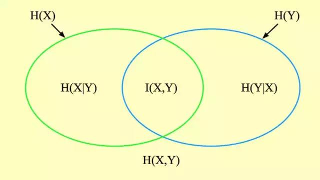

[TOC]




#### 1、熵（信息熵）
熵（entropy）是信息论中最基本、最核心的一个概念，它衡量了一个概率分布的随机程度，或者说包含的信息量的大小。首先来看离散型随机变量。考虑随机变量取某一个特定值时包含的信息量的大小。假设随机变量取值为 x，对应的概率为 p(x)。直观来看，取这个值的可能性越小，而它又发生了，则包含的信息量就越大。因此如果定义一个函数 h(x) 来描述随机变量取值为的信息量的大小的话，则 h(x) 应该是 p(x) 的单调减函数。例如，一年之内人类登陆火星，包含的信息量显然比广州明天要下雨大，因为前者的概率明显小于后者。

满足单调递减要求的函数太多了，我们该选择哪个函数呢？接着考虑。假设有两个**相互独立的随机变量**，它们的取值分别为和，取该值的概率为p(x)和p(y)。根据随机变量的独立性，它们的联合概率为：
```mathjax!
$$
p(x,y) = p(x)p(y)
$$
```
由于这两个随机变量是相互独立的，因此它们各自取某一值时包含的信息量应该是两个随机变量分别取这些值的时候包含的信息量之和：
```mathjax!
$$
h(x,y) = h(x) + h(y)
$$
```
这要求 h(x) 能把 p(x) 的乘法转化为加法，在数学上，满足此要求的是对数函数。因此，可以把**信息量**定义为：
```mathjax!
$$
h(x) = -log\ p(x)
$$
```
这个对数的底数是多少并没有太大关系，根据换底公式，最后计算出来的结果就差了一个倍数，信息论中通常以 2 为底，在机器学习中通常以 e 为底，在后面的计算中为了方便起见我们用 10 为底。需要强调的对数函数前面加上了负号，这是因为对数函数是增函数，而我们要求 h(x) 是 p(x) 的减函数。另外，由于`!$0\le p(x)\le 1$`，因此 `!$logp(x)<0$`，加上负号之后刚好可以保证这个信息量为正。

**总结：**
1. “信息量”和“概率”呈反比；
2. 值域：
```mathjax!
$$
\because p(x)\in [0,1],\therefore \frac{1}{p(x)}\in [1,\infty],\therefore log\frac{1}{p(x)}\in [0,\infty]
$$
```


上面只是考虑了随机变量取某一个值时包含的信息量，而随机变量的取值是随机的，有各种可能，那又怎么计算它取所有各种取值时所包含的信息量呢？既然随机变量取值有各种情况，而且取每个值有一个概率，那我们计算它取各个值时的信息量的均值即数学期望即可，这个信息量的均值，就是熵。

对于离散型随机变量，熵定义为：
```mathjax!
$$
H(p) = E_x[-log\ p(x)] = -\sum_i p_i \ log p_i
$$
```
这里约定 `!$P_i = P(x_i)$`。

下面用实际例子来说明离散型随机变量熵的计算。对于下表定义的概率分布：

|   x  |   1  |  2   |   3  |  4   |
| --- | --- | --- | --- | --- |
|  p   |  0.25  |   0.25  |   0.25  |  0.25   |

它的熵为：
```mathjax!
$$
\begin{aligned}
H(p) &= -0.25 \times log 0.25 - 0.25 \times log 0.25 - 0.25 \times log 0.25 - 0.25 \times log 0.25 \\
&=log 4   \\
&= 0.6
\end{aligned}
$$
```
再来看另外一个概率分布：

|   x  |   1  |  2   |   3  |  4   |
| --- | --- | --- | --- | --- |
|  p   |  0.9   |   0.05  |   0.02  |  0.03   |

它的熵为：
```mathjax!
$$
\begin{aligned}
H(p) &= -0.9 \times log 0.9 - 0.05 \times log 0.05 - 0.02 \times log 0.02 - 0.03 \times log 0.03 \\
&=0.041 + 0.065 + 0.034 + 0.046   \\
&= 0.186
\end{aligned}
$$
```
从上面两个结果可以看出一个现象。第一个概率分布非常均匀，随机变量取每个值的概率相等；第二个不均匀，以极大的概率取值为 1，取值为 2-4 的概率非常小。第一个概率分布的熵明显的大于第二个概率分布，即随机变量越均匀（随机），熵越大，反之越小。

下面考虑连续型随机变量。对于连续型随机变量，熵（微分熵）定义为：
```mathjax!
$$
H(p) = - \int_{-\infty}^{+\infty} p(x) log p(x)dx
$$
```
这里将求和换成了广义积分。
 
根据熵的定义，随机变量取各个值的概率相等（均匀分布）时有极大值，在取某一个值的概率为 1，取其他所有值的概率为 0 时有极小值（此时随机变量退化成某一必然事件或者说确定的变量）。下面证明这一结论。

对于离散型随机变量，熵定义的是如下函数：
```mathjax!
$$
H(p) = -\sum_{i=1}^n x_i log x_i
$$
```
其中 `!$x_i$` 为随机变量取第 i 个值的概率。约束条件为：
```mathjax!
$$
\sum_{i=1}^n x_i = 1 \ \ \ \  x_i \ge 0
$$
```
由于对数函数的定义域是非负的，因此可以去掉不等式约束。构造拉格朗日乘子函数：
```mathjax!
$$
L(x,\lambda) = - \sum_{i = 1}^n x_i log x_i + \lambda (\sum_{i=1}^n x_i - 1)
$$
```
对 `!$x_i$` 求偏导并令其为 0，可以得到：
```mathjax!
$$
\frac{\partial L}{\partial x_i} = - log x_i - 1 + \lambda = 0
$$
```
这意味着在极值点处所有的 `!$x_i$`  必须相等。对 `!$\lambda$` 求偏导数并令其为 0，可以得到
```mathjax!
$$
\sum_{i=1}^n x_i = 1
$$
```
因此当 `!$x_i = 1/n$` 时函数取得极值。此时熵的值为：
```mathjax!
$$
H(p) = - \sum_{i = 1}^n \frac 1 n log \frac 1 n = log n
$$
```
进一步的可以证明该值是极大值。熵的二阶偏导数为：
```mathjax!
$$
\frac{\partial^2 H}{\partial x_i^2} = - \frac{1}{x_i} \\
\frac{\partial^2 H}{\partial x_i^2} = 0
$$
```
因此 Hessian 矩阵为：
```mathjax!
$$
\begin{bmatrix}
-1/x_1 & \ldots & 0 \\ \ldots & \ldots & \ldots \\ 0 & \ldots & -1/x_n
\end{bmatrix}
$$
```
由于 `!$x_i > 0$`，该矩阵负定，熵是凹函数，有极大值。因此当 `!$x_i =1/n$` 时熵有极大值。如果定义
```mathjax!
$$
0\ log\ 0 = 0
$$
```
显然它与下面的极限是一致的：
```mathjax!
$$
lim_{x \to 0}\ x log x = 0
$$
```
则当某一个 `!$x_i = 1$`，其他 `!$x_j =0$`, 的时熵有极小值 0：
```mathjax!
$$
H = 0 log 0 + \ldots + 1 log 1 + \ldots + 0 log 0 = 0
$$
```
除此情况之外，只要满足 `!$0 < x_i < 1$`，则 `!$log x_i < 0$`，因此 
```mathjax!
$$
- x_i log x_i > 0
$$
```
上面这些结果说明熵是非负的，当且仅当随机变量取某一值的概率为 1，取其他值的概率为 0 时熵有极小值 0。此时随机变量退化成普通的变量，取值固定。而当随机变量取所有值的概率相等时即均匀分布时熵有极大值。故熵的范围为：
```mathjax!
$$
0 \le H(p) \le log\ n
$$
```
下面举例说明熵在机器学习中的应用，以决策树为例。用于对分类问题，决策树在训练每个非叶子节点时要寻找最佳分裂，将样本进行划分成尽可能纯的子集。此时熵的作用是度量数据集的“纯度”值。样本集 D 的熵不纯度定义为：
```mathjax!
$$
E(D) = -\sum_i p_i log_2 p_i
$$
```
当样本只属于某一类时熵有最小值，当样本均匀的分布于所有类中时熵有最大值。找到一个分裂让熵最小化，它就是最佳分裂。


#### 2、条件熵

#### 3、联合熵

#### 4、互信息

#### 5、相对熵


#### 6、交叉熵
交叉熵的定义与熵类似，不同的是定义在两个概率分布而不是一个概率分布之上。对于离散型随机变量，交叉熵定义为：
```mathjax!
$$
H(p,q) = -\sum_x p(x) log\ q(x)
$$
```
其中x为离散型随机变量，`!$p(x)$` 和 `!$q(x)$` 是它的两个概率分布。交叉熵衡量了两个概率分布的差异。其值越大，两个概率分布相差越大；其值越小，则两个概率分布的差异越小。
 
下面通过实际例子来说明交叉熵的计算。对于下表的两个概率分布：

|   x  |  1  |  2   |  3   |  4   |
| --- | --- | --- | --- | --- |
|   p  |  0.4   |  0.4   |  0.1   |  0.1   |
|  q   |  0.4   |  0.4   |  0.1   |  0.1   |

其交叉熵为：
```mathjax!
$$
H(p,q) = -0.4 \times log 0.4 -0.4 \times log 0.4 -0.1 \times log 0.1 -0.1 \times log 0.1 = 0.518
$$
```

对于下表的两个概率分布：
|   x  |  1  |  2   |  3   |  4   |
| --- | --- | --- | --- | --- |
|   p  |  0.4   |  0.4   |  0.1   |  0.1   |
|  q   |  0.1   |  0.1   |  0.4   |  0.4   |

其交叉熵为：
```mathjax!
$$
H(p,q) = -0.1 \times log 0.4 -0.1 \times log 0.4 -0.4 \times log 0.1 -0.4 \times log 0.1 = 0.88
$$
```

第一个表格中两个概率分布完全相等，第二个则差异很大。第二个的熵比第一个大。
 
对于连续型概率分布，交叉熵定义为：
```mathjax!
$$
\int_x p(x)log q(x)dx = E_p[-log q]
$$
```

**如果两个概率分布完全相等，则交叉熵退化成熵。**
 
可以证明，当两个分布相等的时候，交叉熵有极小值。假设第一个概率分布固定即 `!$p(x)$` 为常数，此时交叉熵为如下形式的函数：
```mathjax!
$$
H(x) = -\sum^n_{i = 1}a_i log x_i
$$
```
约束条件为：
```mathjax!
$$
\sum^n_{i = 1}x_i = 1
$$
```
构造拉格朗日乘子函数：
```mathjax!
$$
L(x,\lambda) = -\sum^n_{i = 1}a_i log x_i + \lambda(\sum^n_{i = 1}x_i - 1)
$$
```
对所有变量求偏导数，并令偏导数为0，有：
```mathjax!
$$
\begin{aligned}
-\frac{a_i}{x_i} + \lambda = 0 \\
\sum^n_{i = 1}x_i = 1 \\
\sum^n_{i = 1}a_i = 1
\end{aligned}
$$
```
最后可以解得：`!$\lambda = 1,\ \ x_i = a_i$`。
交叉熵函数的Hessian矩阵为：
```mathjax!
$$
\begin{bmatrix} a_1 / x_1^2 & \ldots & 0 \\ \ldots & \ldots & \ldots \\ 0 & \ldots & a_n / x_n^2 \end{bmatrix}
$$
```
该矩阵正定，因此交叉熵损失函数是凸函数，上面的极值点是极小值点。