### 1、IMP：Scene Graph Generation by Iterative Message Passing(CVPR2017)

#### 1.1、主要思想
>The model solves the scene graph inference problem using standard RNNs and learns  to iteratively improves its predictions via message passing.

利用标准的RNNs解决了场景图推理问题，学会了通过消息传递迭代地改进预测。

#### 1.2、网络模型

为了能够构建关系图，通常解决方案是采用CRF来建模，推断节点和边的关系。文章参考CRFasRNN的方案，将graph的推断迭代问题建模为RNN方式，利用`message passing`提高精度。关于`message passing`的理解，CRF利用平均场方法来解，可以认为图是由顶点和边构成二分结构，利用平均场，所有对某个定点的影响是由其所连接的所有边造成的，反过来对于边也可解释。这样二分结构，通过动态规划迭代的方式求解，点对外的影响传递给边，同理边对外的影响传递给点，message就这样在点与边中交叉迭代的传递。

##### 1.2.1、特征
- edge feature: 主语和宾语box的并集组成rel-rois，从特征图上扣
- node feature: 检测出的所有的rois（propo）

##### 1.2.2、模型
**问题描述：** 
`scene graph`的生成可以形式化为后验概率的极大似然，如下式所示。其中整个图的后验概率可以拆分为点和边组合的后验概率。能够利用的信息只有图片和经过RPN提取的proposal，要推断的是对应region的object（即node）和relationship(即edge)。

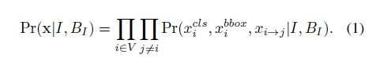

**利用rnn来推断：**  
利用mean field来对graph做近似逼近，将点和边分开解耦，那么主要就是要求Q(x|.)，公式如下图所示：

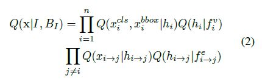

上式中的第一项是针对点的，可以利用RNN来建模，第二项是针对边的，也可以利用RNN来建模。$f^v$ 表示某个bbox所对应的feature，$f^e$ 表示两个相互交叠的bbox重合部分的feature。这里使用一个GRU单元对所有node进行建模，使用一个GRU对所有edge进行建模，并且每个node和edge是并行送入GRU做推断，整体推断流程如下图所示：

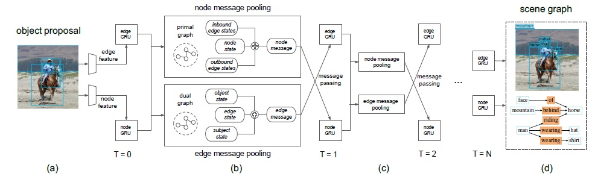

**对偶更新和Message Pooling:**  
区别于`dense connected graph`，这里的node和edge满足二分图拓扑结构。可以分为`node-centric`和`edge-centric`，图的推断可以利用二者通过`message passing`方式迭代求解。考虑到平均场的message融合问题，本文采用attention方式来融合，认为效果好于max或avg这两种方式，公式如下：

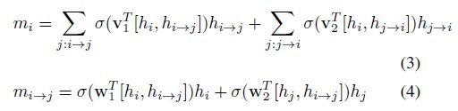

将上述公式与下式对比，可以看到用了类似于concat attention的机制:

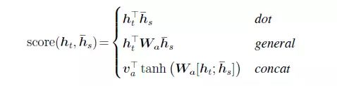

```python
# vertext: 点 (#num_rois, feature_dim)
vert_unary = self.get_output('vert_unary')
# edge: 边 (#num_rels, feature_dim)
edge_unary = self.get_output('edge_unary')
# (#num_rois, hidder_dim)
vert_factor = self._vert_rnn_forward(vert_unary, reuse=False)
# (#num_rels, hidder_dim)
edge_factor = self._edge_rnn_forward(edge_unary, reuse=False)

for i in xrange(self.n_iter):
    reuse = i > 0
    # compute edge states  edge状态融合
    # 或用hard就是直接取max或者mean
    # 或用soft就是算权重，类似attention
    edge_ctx = self._compute_edge_context(vert_factor, edge_factor, reuse=reuse)
    edge_factor = self._edge_rnn_forward(edge_ctx, reuse=True)

    # compute vert states
    vert_ctx = self._compute_vert_context(edge_factor, vert_factor, reuse=reuse)
    vert_factor = self._vert_rnn_forward(vert_ctx, reuse=True)
    vert_in = vert_factor
    edge_in = edge_factor
```

#### 1.2、实验

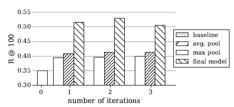

baseline就是0次迭代，没有message passing ，可以看到随着迭代次数的增加，predcls在增加，而且本文提出的动态权重调整的融合策略比两个naive的融合如avg/max要好很多。

------

### 2、Pixels to Graphs by Associative Embedding(NIPS2017)

#### 2.1、主要思想

唯一一篇不基于Faster-RCNN的文章，而是引入了associative embedding的想法。

现在做关系检测往往都是分为物体检测和关系识别两个步骤，可是这样的话，在第二步的时候往往会损失很多信息，本文希望从原图的像素信息一步同时得到物体和关系。

#### 2.2、网络模型

本文的方法其实也是两步，首先检测最后要得到的场景图的每个元素，包括节点和边，然后对这些元素进行组合。第一步其实就是检测物体以及关系在图上的bbox，第二步就是决定每条边应该和哪两个点相连。
  
**Detecting graph elements：**

&nbsp;&nbsp;&nbsp;&nbsp;最终场景图的每个元素（点和边）在原图片上都有一个对应的位置，目标检测得到的bounding box的中心坐标就是场景图中点对应的位置，边的位置则是其两个关联的bounding box的中心坐标的均值。利用这样的思路，我们可以使用一个神经网络能够产生一个高分辨率的特征图，特征图上每个像素与原图像素一一对应。而每个位置的 vector 则表示这个位置是否存在一个节点或者边，如果是存在的就用该 vector 来预测这个元素的属性。

&nbsp;&nbsp;&nbsp;&nbsp;卷积神经网络可以用来处理图像并产生一个 $h\times w\times f$ 的特征tensor。所有对确定某个位置的点和边有必要的信息都被encode到了一个长度为 f 的vector里了。但是有个问题，多个边或者点可能在相同的位置，本论文也考虑了相应的对策。特征tensor的产生使用堆叠的 hourglass 网络。因为hourglass网络的特点是可以结合局部和全局的信息在整张图片上推理从而产生高质量的逐像素的预测。这个在人体骨骼关键点检测中用得比较多，但其实该论文也有这样的需求，因为既希望保留每个像素点和feature中的对应关系，又希望用到其它的信息。

&nbsp;&nbsp;&nbsp;&nbsp;作为网络设计的一种选择，其实并不非得要求输出feature与输入分辨率完全匹配，当然这是能做到的，但另一方面输出分辨率越小，越容易发生重叠。如果重叠了，就说明这个点的长度为 f 的vector应该能encode所有这些重叠的elements所必要的信息，这是很难的。但是提高分辨率是能提高定位准确性的。

&nbsp;&nbsp;&nbsp;&nbsp;在由hourglass网络得到的特征tensor上使用 $1\times 1$ 卷积和非线性激活函数得到两个heatmap分别对应点和边。heatmap的每个像素值表示原图的该位置上有一个点或者边存在的似然，因此监督信号是一个和输出一样分辨率的0，1矩阵，损失函数直接使用交叉熵即可。

&nbsp;&nbsp;&nbsp;&nbsp;得到了存在的似然后就需要对具体的属性进行预测，比如类别还有object的bounding box。为了预测某个位置的检测结果的属性，本文的方法是直接将该位置对应的vector输入一个全连接网络。当然，点和边需要两个不同的网络。

总结：第一步：将图片通过堆叠的hourglass网络得到逐像素的特征tensor，之后会分为两条路，一条利用该tensor产生存在的似然，另一条对似然较高的vector利用全连接进行属性的判断。

**Connecting elements with associative embedding：**

&nbsp;&nbsp;&nbsp;&nbsp;为了能将第一步的检测结果进行组合得到完整的关系图，每个检测结果还需要有一个属性，对于每个点来说应该有一个唯一的标志（形式也是vector），对于每个边，应该能知道与之关联的两个点的标志。很关键的是，网络必须保证不同点的标志应该是不一样的，但指向相同物体的点的标志应该是相同的。作者应该也考虑过使用edge位置应该是vertex位置的平均处，但问题有两个，一是无法区分sub和obj，而是在结果多了的时候无法处理平均点相同的vertex对。
  
&nbsp;&nbsp;&nbsp;&nbsp;假设每个节点的标志embedding为 $h_i$，所有与之相连的边中它的embedding是 $h_{ik}(k=1,…,K_i)$，$K_i$ 是与之相连的总的边数。为了匹配点和边，需要一个“pull together”损失：

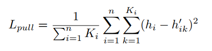

另一方面为了区分不同的点，需要一个“push apart”损失：

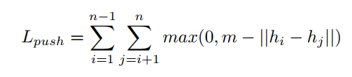

论文中使用的margin=8，embedding的维度为8，和论文associative embedding中1维比起来，收敛得快很多。

**Support for overlapping detections：**

&nbsp;&nbsp;&nbsp;&nbsp;一个很简单的重叠的例子就是human wearing shirt，human和shirt的中心点很可能就重叠到一个像素点上了。一个简单的想法是利用类似于anchor的机制，引入一个新的维度，这样就可以放多个检测结果，并且这个维度上每个位置的检测结果是与其视觉特征有关的，但问题是，如果是物体的话，这样的方式是可行的，但是对于关系则不是。

&nbsp;&nbsp;&nbsp;&nbsp;paper中还是采用了增加一个维度来解决重叠的问题，但是并没有强制特征与检测结果在该维度的位置的关系，即会强制检测结果的像素位置，但允许它出现在该位置的新维度上的任何地方。举个例子，原本某个点应该有两个检测结果，那么没有新维度的话，该点的监督信号就是 1，引入新维度并且对特征与该维度的位置进行强制的话，可能就变成了 \[1 1 0 0]（4维），没有强制的话就是 \[1 1 0 0 ] 或者 \[1 0 1 0] 什么都可以，只要里面有两个就ok。但是这样的话，由于事先不知道网络到底会把检测结果放在新维度的什么位置，因此在训练时就必须要一个额外的步骤来确定可能的位置，这样才能计算损失。

&nbsp;&nbsp;&nbsp;&nbsp;用于物体和关系的新维度分别为 $s_o$ 和 $s_r$，这样的话，每个像素点对应的vector就要用来产生 $s_o$ 个物体（类别，bounding box，embedding）和 $s_r$ 个关系（类别，sub_embedding，obj_embedding）。还有需要注意的是，这种情况下采用了s_o+s_r个不同的全连接网络，分别对新维度上每个位置的物体和关系进行预测。此外，原本的两副heatmap也应该增加到新的维度。

&nbsp;&nbsp;&nbsp;&nbsp;对于物体，网络在每个像素点产生 $s_o$ 个结果，我们将ground truth的类别one-hot编码以及bounding box与每个预测结果进行比较，选择最match的来求损失函数，此处使用了匈牙利算法来寻找一个最优match，而且要注意两个ground truth不能与相同的位置match。对于关系也是是类似的，只不过用于match的向量成了类别one-hot码以及两个关联物体的标志embedding的拼接而已。match只是在训练时需要，推理时就不用了。

#### 2.3、实验

&nbsp;&nbsp;&nbsp;&nbsp;论文中的hourglass网络输入分辨率为 $512\times 512\times 3$，输出为 $64\times 64\times 256$，即vector长度为 256。几部分损失函数：分类、回归、embedding的权重都一样。设定 $s_o=3$ 且 $s_r=6$，实验表明这已经足够覆盖绝大部分检测结果了。

&nbsp;&nbsp;&nbsp;&nbsp;为了提高关系识别的准确度，用其他算法得到的检测proposal可以作为先验使用，在predcls任务中，甚至可以使用ground truth。为了使用这些先验知识，可以扩展object detection的heatmap的通道数为 2，一个通道表示检测结果的中心，一个通道作为bounding box的mask。如果有许多先验的object的话，一个通道就不够了，这时就可以用多个通道，这些通道可以代表类别或者尺寸

&nbsp;&nbsp;&nbsp;&nbsp;在Visual Genome上进行了实验，采用的划分和message passing和neural-motifs一样（150类物体，50类关系），任务也还是neural-motifs里面那三种，结果如下:

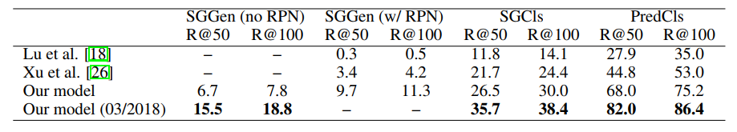


有一点要说的是，在predcls任务中，看起来pix2graph优于neural-motifs的结果，但实际不是这样的，因为每个位置可能有 $s_t=6$ 个关系，所以其实pix2graph产生的结果中，有的object pair会有多个关系，其实就是neural-motifs中所说的的without graph constrain。

  
------

### 3、Neural Motifs: Scene Graph Parsing with Global Context(CVPR2018)

**略**

------

### 4、LinkNet: Relational Embedding for Scene Graph(NIPS2018)

#### 4.1、主要思想

>explicitly modeling inter-dependency among the entire object instances can improve a model’s  ability to infer their pairwise relationships.

#### 4.2、网络模型

论文主要是对于scene graph generating任务设计了一个relational embedding module，可以利用图片中所有的物体的特征对某个物体的特征进行更新，此外还提出了Global context encoding module来encode全局的context信息，和geometric layout encoding module来显式使用几何布局的信息。

##### 4.2.1、物体分类

###### 4.2.1.1、物体特征

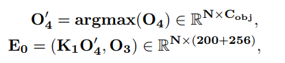

- 视觉特征：tROI-aligned feature $f_i^{RoI} \in R^{4096}$ 
- 语义特征：embedded object label distribution $K_0l_i \in R^{200}$
- 全局特征：global context $c \in r^{512}$ 用 Global Context Encoding Module 搞出来的特征，所有物体共享这个512维特征

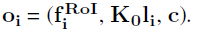

###### 4.2.1.2、网络结构

**Global Context Encoding Module：**
将整张图片的信息encode成一个特征，concat到每一个物体的特征后面。而整张图的信息则是通过一个对图片进行多分类的任务得到的，直接取多分类的FC层前一层的AvgPool的结果作为global context。注意一张图上的所有物体都用的是这个global context。

**Object-Relational Emebedding Module：**

该模块可以进行多次叠加，作者认为通过叠加该模块可以实现“多次跳跃”的信息传递，但随着该模块数量增加，模型效果会出现先提升后衰减的现象。本文使用了两次叠加的效果比较好。

该模块使用了注意力机制来对上下文信息进行编码和解码，具体计算方法如下：

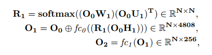

其中O是 $N\times 4808$ 的物体特征矩阵，表示N个物体，特征维度为4808（类别概率分布，roialign和global context），W，U和H则是降维变换，于是 $R_1$可以看做一个物体之间的关联矩阵，矩阵第i行元素代表第二个式子中更新第i个物体特征时N个物体特征每个占的权重。其实这个和图卷积差不多。

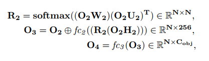

上面是两个基本相同的 relational embedding module，对应于下图中的两个模块。

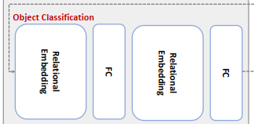

工作方式基本相同，W,H,U都是参数矩阵，第一个作用是降维。第二个作用就是将物体明确的分为subject和object。因为subject对object的关系和object对subject的关系可能是不同的，这也是目前业界比较公认的。

$f_c$ 函数纯粹是一个用来切换维度的矩阵。$\oplus$是按元素加。

这个模组的第一步就是看下节点之间的相似度，然后在**row-wise**上用softmax。第二步就是把信息整合。第三步维度变换。这似乎就是最经典的注意力信息整合方法。

$O_4$ 是最后的物体分数，之后进行分类。这里就相当于先用faster-rcnn给物体分类分数算了个初始值，之后再经过两个 relational embedding module，又得出了分数。这个模组把物体分类给弄好了，但是关系还没有预测，下一步还得用同样的方法去预测关系。

##### 4.2.2、关系分类

**Edge-Relational Embedding Module：**
关系向量构造方式如下图，其中argmax函数相当于取物体标签。所以$O_4'$就相当于是物体分类标签，然后用一个$K_1$矩阵把物体标签映射到200维的向量空间中。再和$O_3$拼在一起组成新的关系特征$E_0$。

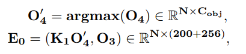

之后采用和_Object-Relational Embedding_完全相同的流程，就可以得到最后的特征$E_0$，这是N个8192维度的向量。

这里采用的模块如下图所示：

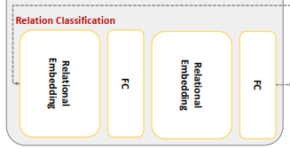

到目前位置，在物体分类那里用了两个relational embedding，在关系预测这里用了两个relational embedding。最后的分类按如下的方法进行处理：

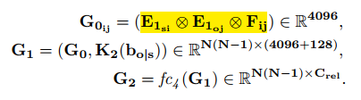

之前一顿操作得到了一个refine后的关系特征向量 $E_1$，这个向量是8192维的，现在我们把它拆成两部分。前半部分是 $E_{1si}$，后半部分是 $E_{1oj}$。这里的意思也就是，我们得到的这个 $E_{1}$，其实是“双面特征”，既包含其作为subject的特征，也包含其作为object的特征。

而在场景图中，一条关系可以表示成<subject,relation,object>，作者这里想为预测准备下两边的物体特征。

这样我们N个8192维向量可以分成两组。

第一组是N个subject向量（4096维）

第二组是N个object向量（4096维）

然后二者两两按subject-object组合（去掉自己和自己组），就会得到N(N-1)个配对。

所以 $G_{0ij}$是N(N-1)个4096维向量。

 $F_{ij}$表示的是物体配对后对应的视觉特征，具体来说可以参考下图，假设两个物体A,B他们的框如下，那么外面的那个红框就是他们的关系配对的框，提取这个框的ROI特征就会得到他们的关系配对的视觉特征。
 
 

这样按照<subject-relation-object>这三者的关系，现在我们也有了这三者分别是：

$$<E_{1si},F_{ij},E_{1oj}>$$

之后作者的第一步就是把这三个乘起来，得到整合后的关系特征表示 $G_{0ij}$

上面这一大堆操作就对应于图中这个区域:

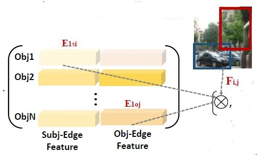

**Geometric Layout Encoding:**

上面存在一个配对环节，针对一个特定的配对，我们已经知道了双方物体的对应框。框在图像中反应的其实就是空间，所以如何表示空间关系，本文提出的方法比较简单，公式如下:


用一个四维向量表示了两个物体框之间的空间关系，然后线性变换成一个128维的向量。

#### 4.3、实验

**backbone用的是ResNet**

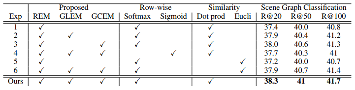

------

### 5、Knowledge-Embedded Routing Network for Scene Graph Generation(CVPR2019)

#### 5.1、主要思想

>作者发现物体和物体之间的关系有些是极为常见的而有些则不是很常见，这种关系分布的不均匀性导致在训练一个完备模型时需要大量的样本，因此将物体共存的统计学意义上的相关信息显式地引入到模型的训练中。这种做法可以有效的使语义空间正则化（即，很少见的物体间关系也可以在预测时凸显出来）并且可以准确的预测物体间的关系。

**问题：**
1. 文章中提到的物体之间的相关性（statistical correlation/co-occurrence）是如何统计出来的？
2. 所谓的statistical correlation是如何参与到GGNN模型的训练中并平衡罕见物体关系的训练的？即，如何做到Knowledge Embedding的？

#### 5.2、网络模型

##### 5.2.1、数学模型

对于指定的一张图像 $I$，最终生成正确场景图的概率为 $p(G|I)$，该概率满足的数学模型如下：
$$p(G|I) = p(B|I)p(O|B,I)p(R|O,B,I)$$

其中 B（Bounding Box）是所有的物体候选区域，O（Object Label）是对于候选区域的预测的物体类别标签，R（Relationship）是包含标签的物体区域之间的关系。可以看出，最后的场景图就是通过对这三个部分的预测而最终生成的结果。利用co-occurrence的信息，使用图卷积网络来为每个区域学习到contextualized representation并实现更好的预测效果，基于预测的label，relationship component $p(R∣O,B,I)$ 推断出目标两两之间的关系，最终生成全部的scene graph。我们对每两个目标建立一张图，其中结点表示目标和关系，边表示统计的所有关系的statistical co-occurrences，如上图b所示，同样的，另一幅图网络用来学习关系和目标之间的相互影响，全部的pipline如图所示:

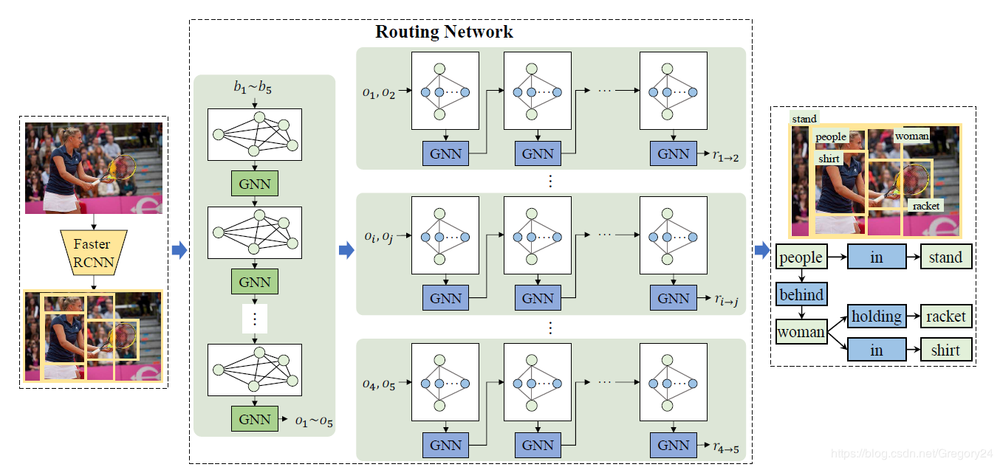

最开始的Faster RCNN物体检测网络模块就是用来做数学模型中$p(B∣I)$部分的工作的，在Routing Network中左边的GNN迭代结果就是对于每一个物体区域类别标签的预测，即$p(O∣B,I)$。右边的一系列网络就是针对每一个物体类别选框关系的预测网络，得到的结果即为$p(R∣O,B,I)$。最终得到的就是这张图像所对应的场景图，这就是用神经网络模型实现数学模型的大致过程。

##### 5.2.2、网络模型

**Bounding box localization：**
直接使用Faster RCNN来得到B，对于每个区域$b_i$，同时获取ROI pooling layer的特征向量$f_i$

**Knowledge-embedded routing network：**

**Object Feature:**
这一步利用统计信息来建立一张图以联系检测出的区域之间的关系，并且使用一个图网络来学习到 contextualized 的representation。

>计算目标co-occurrence的概率：对于两个类别 $c$ 和 $c′$，我们先计算出概率 $m_{cc}′$，当$c$出现时$c′$出现的概率，然后得到 $M_c\in R^{C\times C}$，给定两个区域 $b_i$ 和 $b_j$，我们将 $b_i$ 复制 $C$ 次，来得到 $C$ 个结点$\{b_{i1},b_{i2},...,b_{iC}\}$，其中 $b_{ic}$ 表示 $b_i$ 和 $c$ 的相互关系，在 $b_j$ 上执行同样的操作。直观上看，$m_{cc}′$ 可以被用来关联结点$b_{jc}′$ 到 $b_{ic}$，因此 $M_c$ 可以用来关联区域 $b_i$ 的结点和区域 $b_j$ 的结点，这样我们就可以是所有区域关联起来，然后建立图。

我们使用gated recurrent update机制来迭代地传送信息，特别的，在时间t，每个结点 $b_{ic}$ 有一个隐藏状态 $\mathbf{h}^t_{ic}$，因为每个结点关联某个区域，因此使用这个区域的特征向量来初始化隐层状态:
$$\mathbf{h}^0_{ic} = \varphi_0(f_i)$$

其中 $\varphi_o$ 将 $\mathbf{f}_i$ 映射到低维，通过一个全连接层实现。

在每个timestep t上，每个结点根据图结构融合它邻居的信息

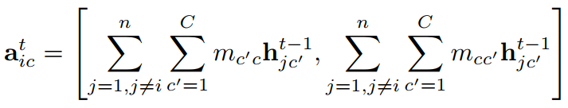

然后模型以 $a^t_{ic}$ 和前一个隐层状态为输入，来更新隐层状态

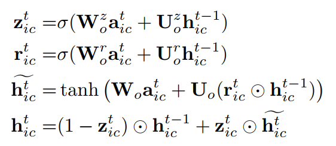

这样每个结点可以获取邻居的信息并传递信息给邻居，实现了结点间的关联，$T_o$ 步之后，结点信息在图上充分传播，然后我们得到每个region的隐层状态 $\{h^{T_o}_{i1},h^{T_o}_{i2},...,h^{T_o}_{iC}\}$，然后使用一个输出网络以初始隐层和最终隐层为输入，输出每个结点的特征：

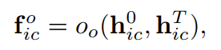

其中 $o_o$ 是全连接层，最后对于每个区域，融合所有关联输出特征向量来得到它最终的class label


输出的类别标签 $o_i=argmax(\mathbf{o_i})$ 用来做关系推断

**Relationship:**
给定一对目标和它们的类别，它们关系的概率分布是高度歪斜的，比如，给一个人和一匹马，它们的关系极有可能是骑，这里我们将目标对的关联在一幅图中表达，再使用另一个图网络来探索这两个部分的相互影响，最终进行relationship infer。

同样，我们计算co-occurrence，给定一个主体 $c$ 和一个客体 $c′$，我们计算所有关系的分布为 $\{m_{cc′1},m_{cc′2},...,m_{cc′K}\}$，其中K是关系数，对于 $o_i$ 和 $o_j$，我们计算一个图，上面有subject node,object node和 $K$ 个关系结点，我们使用 $m_{o_i o_j k}$ 来记作 $o_i,o_j$ 和关系结点 $k$ 之间的关联。这样graph with statistic co-occurrences embedded就建立完成了。

为了探索结点的关联，我们使用了identical graph gated recurrent update mechanism，每个结点 $v\in\{o_i,o_j,1,2,...,K\}$ 有一个隐层状态 $h^t_v$，在第 t 步的时候，我们用目标结点对应区域的特征向量初始化目标结点，用两个目标并集区域的特征向量以及两个目标的空间关系来初始化关系结点：


其中 $\varphi_o′$，$\varphi_r$ 都是全连接层，$\mathbf{f_{ij}}$ 是一个特征向量，它编码了两个目标并集区域的特征以及空间位置信息，在每个时间 t，关系结点综合位置结点的信息，位置结点综合关系结点的信息


然后模型结合这些融合的特征以及上一步的隐层装来来更新隐层状态，更新的方法和之前一样，然后生成最后每个结点的隐层状态 $\{h^{Tr}_{i1},h^{Tr}_{i2},...,h^{T_r}_{iC}\}$，然后用一个输出子全连接网层来计算node-level的特征；并融合这些特征来推断relationship

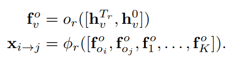

$\phi_r$ 是全连接层实现的

------

### 6、Factorizable Net：An Efficient Subgraph based Framework for Scene Graph Generation(ECCV 2018)

**MSDN团队的新文章**

#### 6.1、主要思想

>Paper认为目前有两种生成scene graph的方法，一种是two-stage的，先把object检测到（包括类别），然后再recognize他们之间的关系（motif 系列），另一种是基于region proposal对object的类别和他们之间的relation进行联合推理。两种方法的共同之处是都会用到object pair的union box的特征作为phrase feature，这个特征包括cnn特征和spatial特征，后者往往由mask体现。一个很常见的事实是，很多object pair的union box非常接近，因此他们的cnn feature也就是很接近的，于是一个自然的想法是让具有相似region（union box）的object pair共享cnn特征。

>依然使用了attention机制。

#### 6.2、网络模型

paper提出了一个基于子图的连接图，以便在推理过程中简洁地表示场景图。自下而上的聚类方法首先用于将整个图分解为子图，其中每个子图包含多个对象及其关系的子集。通过用较少的子图和对象特征替换场景图的众多关系表示，中间阶段的计算显着减少。此外，空间信息由子图特征维护，其由我们提出的空间加权消息传递（SMP）结构和空间敏感关系推断（SRI）模块利用以促进关系识别。

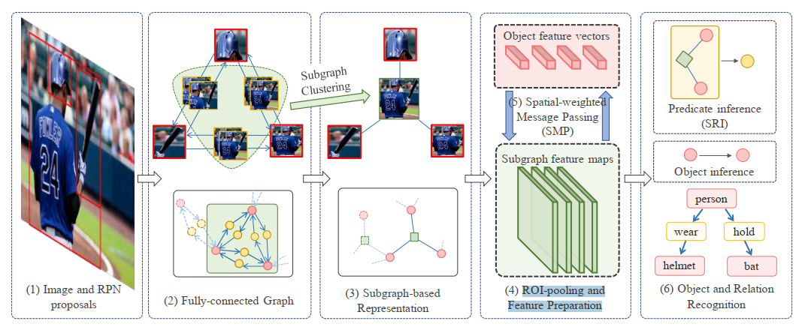

  
<b><span style="font-size:120%;"> step 1 : 通过RPN得到region proposal</span></b>

<b><span style="font-size:120%;"> step 2 : 构建fully-connected graph</span></b>

双向连接

<b><span style="font-size:120%;"> step 3 : 将fully-connected graph转换成了基于subgraph的graph，红色圆形代表object box，绿色方形代表shared union box</span></b>

在全连接图中，任意两个对象的关系用union box表示，利用置信分数和边界框位置，可以应用非最大抑制（NMS）来抑制相似框的数量，并保持具有最高分数的边界框作为代表。也就是说多个union box会被一个union box代替，object box不会被抑制，因此，**这些合并的部分组成一个子图并共享一个单一的表示来描述它们的相互作用**。因此，我们得到了完全连通图的基于子图的表示：每个子图包含多个对象；每个对象都属于多个子图；每个候选关系都指一个子图和两个对象。

<b><span style="font-size:120%;"> step 4 : 用roi pooling得到object feature和subgraph feature</span></b>

经过上一步聚类后，得到两组proposals：对象和子图。然后使用ROI池化来生成相应的特征。使用特征向量来表示对象，使用2-D特征映射来维持子图区域内的空间信息，使用2-D卷积层和完全连接的层来分别变换子图特征和对象特征。

<b><span style="font-size:120%;"> step 5 : 使用spatial-weight message passing(SMP)对这些特征进行refine</span></b>

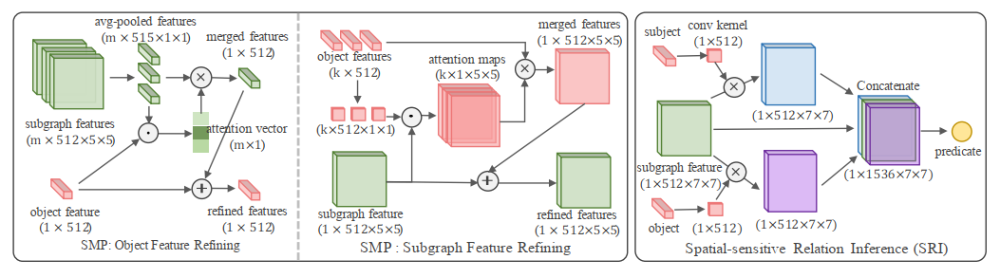

从对象传递到子图以及从子图传递到对象的消息是两个并行的进程。$o_i$ 表示对象特征向量，$S_k$ 表示子图要素图。

**1）Object feature refining：**
>对于第i个object，假设与之相连的subgraph有 m 个，首先将 m 个subgraph的 2-D特征进行avg pooling，然后将其变换（FC）到object空间并利用内积得到attention vector，将所有avg pooling之后的特征按attention vector加权求和并变换到object空间（FC），最后和object feature相加得到refined feature

因为每个对象都连接到不同数量的子图，我们首先需要聚合子图特征，然后将它们传递给目标对象节点:

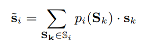

其中 $\mathbb{S}_i$ 表示连接到对象 i 的子图集。 ${\tilde{s}}_i$表示传递给对象i的聚合子图特征。$s_k$ 表示从2-D特征映射 $S_k$ 平均汇总的特征向量。$p_i(S_k)$ 表示 $s_k$ 传递给目标第i个对象的概率：

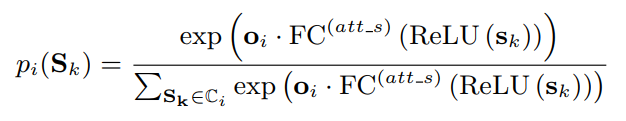

其中 $FC^{(\text{att\_s})}$ 将 $s_k$ 功能转换为 $o_i$ 的目标域。

获取消息功能后，目标对象功能将被重新定义为：

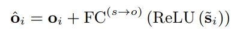

其中 $\hat{o}_i$表示重新定义的对象特征。FC（$s\rightarrow o$）表示将合并的子图特征转换为目标对象域的完全连接的图层。

**2）Subgraph feature refining：**
>假设一个subgraph与 k 个object相连，也就是说它的union bbox会包含多个object，因此要用这些object的特征来refine该subgraph的特征的话，必须考虑每个object在subgraph中的位置，因此先 **将每个object转换到subgraph空间（FC）后，用内积得到attention map，其通道数为k，attention map的每个位置对应的 k 维向量代表 k 个object在refine该subgraph feature时对该位置的贡献大小，于是按照这个attention map对k个object feature加权求和，然后变换到subgraph空间（conv）** 之后与原feature相加即可。

由于不同的对象对应于子图特征的不同区域，因此在聚合对象特征时，它们的权重还应取决于它们的位置：

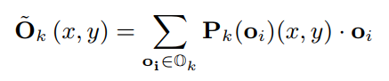

其中 $\mathbb{O}_k$ 表示子图 k 中包含的对象集。$\tilde{O}_k(x,y)$ 表示要传递到位置 $(x,y)$ 的子图 k 的聚合对象特征。$P_k(o_i)(x,y)$ 表示对象特征 $o_i$ 传递给位置 $(x,y)$ 的第 k 个子图的概率图：

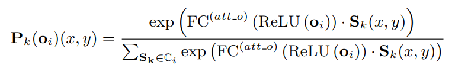

其中 $FC^{(\text{att\_o})}$ 将 $o_i$ 转换为 $S_k(x,y)$ 的目标域。在每个位置的所有对象上将概率求和为 1，以标准化消息特征的比例。但是在空间维度上没有这样的限制。

然后将子图特征重新定义为：

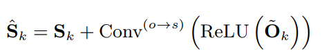

其中 $S_i$ 表示重新定义的子图特征。Conv（$o\rightarrow s$）表示将合并对象消息转换为目标子图域的卷积层。

<b><span style="font-size:120%;"> step 6 : 对object和relation进行recognize</span></b>

传递消息后，我们已经重新定义了对象 $o_i$ 和子图区域 $S_k$ 的表示。可以使用对象特征直接预测对象类别。因为子图特征可以引用多个对象对，所以我们使用主语和宾语特征及其相应的子图特征来预测它们之间的关系：

$$p^{<i,k,j>} = f(o_i,S_k,o_j)$$

由于不同的对象对应于子图特征的不同区域，因此主语和宾语特征作为卷积核来从特征映射中提取其关系的视觉线索：

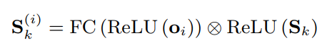

其中 $S_k^{(i)}$ 表示子图特征映射 $S_k$ 的卷积结果，其中第 i 个对象作为卷积核。 $\oplus$ 表示卷积运算。

然后将 $S_k^{(i)}$ 和 $S_k^{(j)}$ 与子图特征 $S_k$ 连接起来，并直接预测与完全连接层的关系：

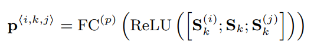

在 $FC^{(p)}$ 之前引入了额外的 $1\times 1$ 瓶颈卷积层，以减少通道数量。

### 3.3、实验

两个任务：PhrDet：短语检测任务。 SGGen：场景图生成任务。

------

### 7、Graph R-CNN for Scene Graph Generation(ECCV 2018)

**和我们将关系看成结点的思路是一致的，依然离不开 Attention**

#### 7.1、主要思想

>以往做scene graph generation，基本都是在faster rcnn基础上检测出图片的物体后，两两配对识别他们的关系，这样做是很有效但是很低效，毕竟并不是所有物体都有关系的，这样做太耗时。因此paper从faster R-CNN的RPN得到灵感，提出RePN，虽然之前就有一个叫RelPN的东西。实际上就是输入所有proposal的特征组成的矩阵，输出一个邻接矩阵，行列数为proposal的个数，矩阵的每个元素位于 \[0,1] 之间，表示对应的两个proposal有关系的confidence。

#### 7.2、网络模型

##### 7.2.1、数学模型

将一个image表示为I，V表示一组nodes，每一个node对应I中识别出来的一个object的区域，$E\in (\frac V 2)$ 表示edge的集合，O,R 分别表示object和relation的标签，则整个模型可以表述为 $P(S=(V,E,O,R)|I)$，分解后如下：

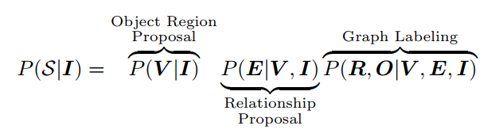

也就是最终的概率是三个部分相乘，分别预测object，relation（edge）和label。这里面对于object的预测 $P(V|I)$ 可以使用现成的物体识别系统；$P(E|V,I)$ 使用的是一个relationship proposal network（RePN），作者指出现存的生成edge的方法都是随机抽样的，因此不能视作是一个end-to-end的系统，而本文这个直接生成edge的方法使得整个模型变成了end-to-end的；最后的 $P(R,O|V,E,I)$ 一般采取一个迭代的优化过程，不断地进行修饰。


##### 7.2.2、网络模型

**step 1 : object node extraction -- Faster RCNN**  

模型的object识别采取的是用faster R-CNN提取出一组n个object proposal，每一个proposal i都对应着一个空间区域 $r_i^o = [x_i,y_i,w_i,h_i]$，一个pooled feature vector $x_i^o$，和一个初始的在k个类别上的label分布的预测 $P_i^o$。所有n个proposal对应的就是 $R^o\in R^{n\times 4},X^o\in R^{n\times d},P^o\in R^{n\times |C|}$。

**step 2 : RePN - relationship edge pruning：**

对于给定的n个object proposal，之间的可能存在的relation数量级是 $O(n^2)$，但是有很多物体之间是不需要加relation的，因此需要去掉很多edge，本文采取的方法是基于 $P^o$，也就是根据edge连接的两个object的类别来判断是否有必要加这个edge。原本需要构造一个relativeness函数 f，每次输入一对proposal的特征，然后得到两者的relativeness，但是这样的时间复杂度是 $O(n^2)$，因此paper用下面的方式进行计算，即先用两个函数分别将所有proposal映射为subject空间和object空间中的vector，然后直接进行矩阵的乘法得到邻接矩阵：

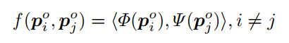

$\Phi (\cdot)$ 和 $\Psi (\cdot)$ 是两个投影函数，采用的是相同结构不同参数的MLP，计算完之后还要经过sigmoid得到0，1之间的score。

然后再对relation进行NMS，去掉相互重叠很大的object对，score就是前面的邻接矩阵，然后overlap就选两个关系各自的union box的IoU。具体来将，两个object对{u,v}和{p,q}，两对之间的重合（overlap）是：

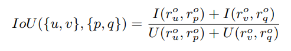

**step 3 : aGCN - graph context integration：**

根据上面的邻接矩阵得到了初步的graph，<span style="color:red;font-size:120%;"> 这个graph的node包括object（物体）和relation </span>，然后object node之间的link就是由RePN得到的关系，然后对每个relation node都将其与两个参与的object node相连，paper用提出的带attention的GCN（graph convolution network）更新object和relationship的特征。该graph有如下的三种连接：

**subject <-> relationship  /  relationship <-> object  /  object <-> object**

很自然地，更新object和更新relation的方式如下：

物体的context: 其他物体，它作为主语的relation，它作为宾语的relation  

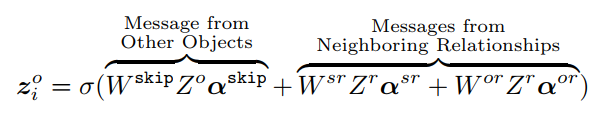

这是对object 的 feature 进行更新的操作，也就是说更新每一个node的信息的时候，是考虑了此node本身的信息，周围relation的信息，而且整合relation信息的时候还要考虑是relation和subject的关系，还是relation和object之间的关系，并且这个信息流动是不对称的。

关系的context: 主语物体，宾语物体

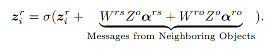

attention在于 $\alpha$ 在GCN中是预设好的，这里是动态计算的：

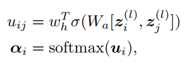

#### 7.3、实验

效果比 MotifNet 差挺多的，同是18年的论文，motif 但是还没出来，所以没有比较吧：


----------

## 8、PI-SG：Mapping Images to Scene Graphs with Permutation-Invariant Structured Prediction(NIPS 2018)

**论文不知所云，可能有点高深看不懂吧，果然是NIPS，说了一大堆理论**

#### 8.1、主要思想

>paper讨论了一种具有图置换不变性（graph-permutation invariant，GPI）的网络结构，并给出了其充分必要条件，并以scene graph generation为例解释了如何在深度结构化预测中使用这样的结构。

#### 8.2、网络模型

##### 8.2.1、数学模型

**graph-permutation invariant，GPI**

paper 先介绍了graph labeling问题，即给定一个图（V,E），其中 V 为节点特征的集合 $[z_1,\ldots,z_n]$，E为边特征的集合 $[z_{1,2},\ldots,z_{i,j},\ldots,z_{n,n-1}]$，希望找到一个函数$F:(V,E) \to Y$，Y 则是label的集合 $[y_1,\ldots,y_n]$。用通俗的话说就是，给定以点和边特征表示的图，函数 F 可以得到每个节点的label。一个很自然的对 F 的要求是，不管输入的图的节点顺序如何，都应该得到相同的labeling结果，这就是 GPI。paper 说不具备GPI的结构，在训练时会浪费更多的capacity。

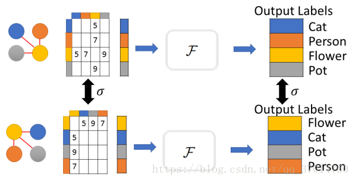

**定理：**
paper给出一个定理，假设 F 是一个graph labeling函数，那么F 是 GPI 的充要条件是存在函数 $\alpha ,\rho , \Phi \text{对} k=1,\ldots,n$ 满足：

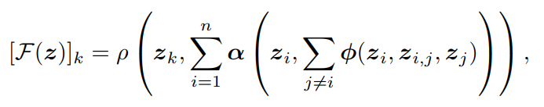

$$\Phi : \mathbb{R}^{2d+e} \rightarrow \mathbb{R}^L, \alpha : \mathbb{R}^{d+L} \rightarrow \mathbb{R}^W \text{and}\ \rho : \mathbb{R}^{W+d} \rightarrow \mathbb{R}$$

**证明：**

**必要性：**

因为**函数 $\rho$ 的第二个参数是与 k 无关的整个graph的context**，因此有 ：

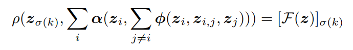

**充分性：**

给任意一个具有GPI的graph labeling函数，paper能构造出公式中的结构，主要的技巧在于使用了hash函数，使得无论输入的node顺序如何，hash函数都会根据node feature将输入重新整理成相同的形式，使得得到的context是一样的，这一步主要是构造了 $\alpha$ 和 $\Phi$。

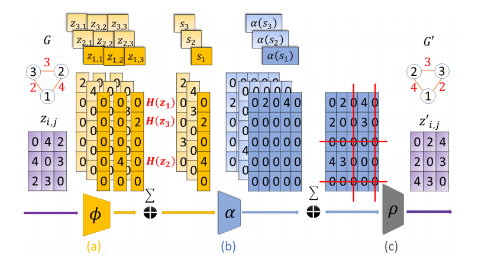

将context记为 M，假设 F 在 M 上的输出为 $y=y_1,\ldots,y_n$，直接令：$\rho(z_k,M) = y_{H(z_k)}$。

上面的定理考虑的是完全图的情况，如果是不完全图，对定理稍作修改也可以成立，只需要将 $\sum_{j\neq i}$ 改成 $\sum_{j\in N(i)}$ 即可，即对于单个node，只需要考虑其neighbor，而不用考虑除他外的所有node。

**paper又引入了attention机制和RNN：**

首先是attention，attention就是上面的第二个求和操作，应该考虑node间的relativeness作为权重加权求和。通过一个 $\beta$ 函数求两个node之间的relativeness，其输入和 $\Phi$ 相同。然后就可以利用softmax得到权重：

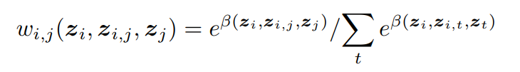

比如最简单的可以使用 $z_i$ 和 $z_j$ 的内积作为attention score，然后 $\alpha$ 定义为 $z_{ij}$ 的加权求和：

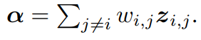

paper在保持 $s_i = \sum_{j\neq i}\Phi(z_i,z_{i,j},z_j)$ 的同时，实现了attention，**主要靠 $\beta$ 函数以及对 $\Phi$ 扩充了一个维度**，$\Phi$ 的 **前 e 维** 为：$e^{\beta(z_i,z_{i,j},z_j)}z_{i,j}$ ，因为 $z_{ij}$ 是e维的，**第 e+1 维** 为：$e^{\beta(z_i,z_{i,j},z_j)}$
然后便可定义：

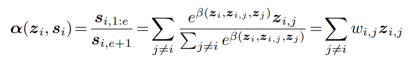

使用RNN则是基于组合多个GPI的函数，得到的函数还是GPI的性质。方式就是将一步 F 得到的输出作为下一步 F 的输入的一部分。

##### 8.2.2、网络模型

paper 以scene graph classification为例解释了如何使用自己提出的方法。第一个问题是，虽然scene graph往往非常稀疏，但是可以通过给不相关的node之间加入null连接，使之可以看作一个完全图。paper提出用于sgcls的模型包含两个组件，Label Predictor（LP）和Scene Graph Predictor（SGP），LP接收图片和bbox，输出node和edge的label分布，SGP接收LP的输出，产生更准确的label分布。

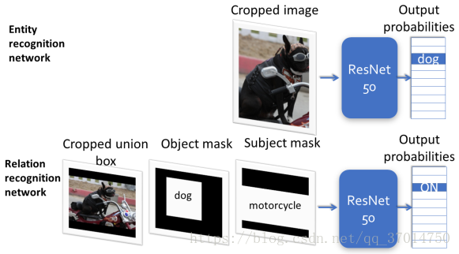

首先是LP，LP又包含两个部分，分别预测node和edge的label。均直接使用restnet-50作为预测网络，而输入则分别是按bbox和union box裁剪的图片。

SGP 则需要用到paper提出的方法进行构造，输入为 $[\ldots,y_i,\ldots]$ 和 $[\ldots,y_{ij},\ldots]$。node classification的部分可以参照最上面的定理给出的公式直接进行构造，但是为了classify edge，引入了另一个函数 $\rho_{\text{relation}}$，它也会使用在node classification中生成的GPI表示。

SGP的输入包括node和edge feature，node feature $z_i$ 是 LP 输出的第 i 个node的label分布拼接上这个bbox的坐标 $(x,y,w,h)$ 而成的，edge feature则是直接用 LP 输出的edge的label分布。

paper用两层 FC 实现 $\Phi$，输入为 $[z_i,z_{ij},z_j]$ 的拼接，输出一个500维的向量，同时用一层 FC 实现 $\beta$，输入和 $\Phi$ 一样，不过输出的是一个标量，然后对于每个 i，用 $\beta$ 加权求和得到context $s_i$。paper同样用一个两层 FC 实现 $\alpha$，输入为 $z_i$ 和其context $s_i$，同样也用一个单层 FC 得到权重score，将 $\alpha$ 的输出加权得到一个500维的向量 g 表示整个graph。$\rho_{\text{entity}}$ 是一个三层 FC，输入为 $z_i$，$s_i$和 g，输出是node的label分布。$\rho_{\text{relation}}$ 的输入是 $z_i$，$z_j$，$z_{ij}$ 和 g，输出为edge的label分布。


----------

### 9、总结

主流的框架：Faster-RCNN + Region Feature + Iterative Feature Finetune。从GRU -> BiLSTM -> GNN 变化的都是 Iterative Feature Finetune 的部分，并且基本都直接或间接地用到了 attention 的机制。并且可以看到对于关系的预测语义特征比视觉特征和位置特征要更重要。