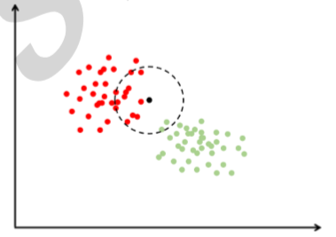

#### 1、基本要素
k近邻法（k-nearest neighbor, kNN）是一种基本分类与回归方法，由 Thomas 等人在 1967 年提出。它基于以下思想：要确定一个样本的类别，可以计算它与所有训练样本的距离，然后找出和该样本最接近的 k 个样 本，统计这些样本的类别进行投票，票数最多的那个类就是分类结果。因为直接比较样本和 训练样本的距离，kNN 算法也被称为基于实例的算法。 

k近邻法的基本做法是：给定测试实例，基于某种距离度量找出训练集中与其最靠近的 k 个实例点，然后基于这 k 个最近邻的信息来进行预测。通常，在分类任务中可使用“投票法”，即选择这 k 个实例中出现最多的标记类别作为预测结果；在回归任务中可使用“平均法”，即将这 k 个实例的实值输出标记的平均值作为预测结果；还可基于距离远近进行加权平均或加权投票，距离越近的实例权重越大。k 近邻法不具有显式的学习过程，事实上，它是懒惰学习（lazy learning）的著名代表，此类学习技术在训练阶段仅仅是把样本保存起来，训练时间开销为零，待收到测试样本后再进行处理。



在上图中有红色和绿色两类样本。对于待分类样本即图中的黑色点，我们寻找离该样本最近的一部分训练样本，在图中是以这个矩形样本为圆心的某一圆范围内的所有样本。然后 统计这些样本所属的类别，在这里红色点有 12 个，圆形有 2 个，因此把这个样本判定为红 色这一类。上面的例子是二分类的情况，我们可以推广到多类，k 近邻算法天然支持多类分 类问题。 

**距离度量、k值的选择及分类决策规则**是k近邻法的三个基本要素。根据选择的距离度量（如曼哈顿距离或欧氏距离），可计算测试实例与训练集中的每个实例点的距离，根据k值选择k个最近邻点，最后根据分类决策规则将测试实例分类。

###### 1.1、距离度量
特征空间中的两个实例点的距离是两个实例点相似程度的反映。K 近邻法的特征空间一般是 n 维实数向量空间 `!$R_n$`。使用的距离是欧氏距离，但也可以是其他距离，如更一般的 `!$L_p$` 距离或Minkowski距离。

设特征空间 X 是 n 维实数向量空间 `!$R_n,x_i,x_j \in X$`，`!$ x_i = (x_i^{(1)},x_i^{(2)},\cdots ,x_i^{(n)})^T, x_j = (x_j^{(1)},x_j^{(2)},\cdots ,x_j^{(n)})^T， x_i,x_j$` 的 `!$L_p $` 距离定义为：
```mathjax!
$$
L_p(x_i,x_j) = (\sum_{l = 1}^n | x_i^{(l)} - x_j^{(l)} |^P)^{\frac 1 P}
$$
```
这里 `!$p \ge 1$`。

当 `!$p=1$` 时，称为曼哈顿距离（Manhattan distance），即：
```mathjax!
$$
L_1(x_i,x_j) = \sum_{l = 1}^n | x_i^{(l)} - x_j^{(l)} |
$$
```
当 `!$p=2$` 时，称为欧氏距离（Euclidean distance），即：
```mathjax!
$$
L_2(x_i,x_j) = (\sum_{l = 1}^n | x_i^{(l)} - x_j^{(l)} |^2)^{\frac 1 2}
$$
```
当 `!$p=\infty$` 时，它是各个坐标距离的最大值，即：
```mathjax!
$$
L_{\infty}(x_i,x_j) = max_l|x_i^{(l)} - x_j^{(l)}|
$$
```
证明：
以二维实数向量空间（n=2）为例说明曼哈顿距离和欧氏距离的物理意义。
① 曼哈顿距离
 ```mathjax!
 $$
 L_1(x_i,x_j) = \sum_{l=1}^2|x_i^{(l)} - x_j^{(l)}| = |x_i^{(1)} - x_j^{(1)}| + |x_i^{(2)} - x_j^{(2)}| 
 $$
```
 图中绿色线即曼哈顿距离物理意义，其中横向线条表示 `!$|x^1_i-x^1_j|$`，竖向线条表示 `!$|x^2_i-x^2_j|$`。
② 欧氏距离
 ```mathjax!
 $$
L_2(x_i,x_j) = (\sum_{l = 1}^2 | x_i^{(l)} - x_j^{(l)} |^2)^{\frac 1 2} = \sqrt[2]{|x_i^{(1)} - x_j^{(1)}|^2 + |x_i^{(2)} - x_j^{(2)}|^2}
 $$
```
图中红色线即欧氏距离物理意义，根据勾股定理可得。


###### 1.2、k值的选择
k 值的选择会对 k 近邻法的结果产生重大影响。在应用中，k 值一般取一个比较小的数值，通常采用交叉验证法来选取最优的 k 值。

###### 1.3、分类决策规则
k 近邻法中的分类决策规则往往是多数表决，即由输入实例的 k 个邻近的训练实例中的多数类，决定输入实例的类。


#### 2、预测算法
k 近邻算法没有求解模型参数的训练过程，参数 k 由人工指定，它在预测时才会计算待预测样本与训练样本的距离。 

对于分类问题，给定 `!$l$` 个训练样本 `!$(x_i,y_i)$`，其中 `!$x_i$` 为维特征向量，`!$y_i$` 为标签值，设定参数 `!$k$` ，假设类型数为 `!$c$`，待分类样本的特征向量为 `!$x$`。预测算法的流程为：

 1. 在训练样本集中找出离 `!$x$` 最近的 `!$k$` 个样本，假设这些样本的集合为 `!$N$` 。 
 
 2. 统计集合 `!$N$` 中每一类样本的个数 `!$C_i ,i = 1,\ldots,c$` 。 
    
 3. 最终的分类结果为 `!$argmax_i C_i$` 。

在这里 `!$argmax_i C_i$` 表示最大的 `!$C_i$` 值对应的那个类 `!$i$` 。如果 `!$k = 1$` ，k 近邻算法退化成最近邻算法。 

k 近邻算法实现简单，缺点是当训练样本数大、特征向量维数很高时计算复杂度高。因 为每次预测时要计算待预测样本和每一个训练样本的距离，而且要对距离进行排序找到最近 的 k 个样本。我们可以使用高效的部分排序算法，只找出最小的 k 个数；另外一种加速手段 是 k-d 树实现快速的近邻样本查找。 

一个需要解决的问题是参数 k 的取值。这需要根据问题和数据的特点来确定。在实现时 可以考虑样本的权重，即每个样本有不同的投票权重，这称方法称为为带权重的 k 近邻算法。 另外还其他改进措施，如模糊 k 近邻算法。

kNN 算法也可以用于回归问题。假设离测试样本最近的 k 个训练样本的标签值为 `!$y_i$` ，则对样本的回归预测输出值为：
```mathjax!\
$$
y = (\sum_{i = 1}^k y_i) / k
$$
```
即所有邻居的标签均值，在这里最近的 k 个邻居的贡献被认为是相等的。同样的也可以采用带权重的方案。带样本权重的回归预测函数为： 
```mathjax!\
$$
y = (\sum_{i = 1}^k w_i y_i) / k
$$
```
其中 `!$w_i$` 为第 `!$i$` 个样本的权重。权重值可以人工设定，或者用其他方法来确定，例如设置为与距离成反比。 
 
#### 3、距离定义
根据前面的介绍，kNN 算法的实现依赖于样本之间的距离值，因此需要定义距离的计算方式。接下来介绍常用的几种距离定义，它们适用于不同特点的数据。 
 
假设两个向量之间的距离为 `!$d(x_i,x_j)$`，这是一个将两个维数相同的向量映射为一个实数的函数。距离函数必须满足以下条件，第一个条件是三角不等式：
```mathjax!
$$
d(x_i,x_k) + d(x_k,x_j) \ge d(x_i,x_j)
$$
```
这和我们学习的几何中的三角不等式吻合。第二个条件是非负性，即距离不能是一个负数： 
```mathjax!
$$
d(x_i,x_j) \ge 0
$$
```
第三个条件是对称性，即 A 到 B 的距离和 B 到 A 的距离必须相等：
```mathjax!
$$
d(x_i,x_j) = d(x_j,x_i)
$$
```
第四个条件是区分性，如果两点间的距离为 0，则两个点必须相同：
```mathjax!
$$
d(x_i,x_j) = 0 \Rightarrow x_j = x_i
$$
```
满足上面 4 个条件的函数都可以用作距离定义。

###### 3.1、常用距离定义
常用的有欧氏距离，Mahalanobis 距离等。欧氏距离是最常见的距离定义，它就是 n 维欧氏空间中两点之间的距离。对于 `!$R^n$` 空间中有两个点 x 和 y，它们之间的距离定义为： 
```mathjax!
$$
d(x,y) = \sqrt{\sum_{i = 1}^n(x_i - y_i)^2}
$$
```
这是我们最熟知的距离定义。在使用欧氏距离时应该尽量将特征向量的每个分量归一 化，以减少因为特征值的尺度范围不同所带来的干扰。否则数值小的特征分量会被数值大的 特征分量淹没。例如，特征向量包含两个分量，分别为身高和肺活量，身高的范围是 150-200 厘米，肺活量为 2000-9000，如果不进行归一化，身高的差异对距离的贡献显然为被肺活量 淹没。欧氏距离只是将特征向量看做空间中的点，并没有考虑这些样本特征向量的概率分布 规律。 

Mahalanobis 距离是一种概率意义上的距离，给定两个向量x和y以及矩阵S，它定义为：
```mathjax!
$$
d(x,y) = \sqrt{(x-y)^T S (x-y)}
$$
```
要保证根号内的值非负，即矩阵 S 必须是半正定的。这种距离度量的是两个随机向量的 相似度。当矩阵 S 为阶单位矩阵 I 时，Mahalanobis 距离退化为欧氏距离。矩阵可以通过计算训练样本集的协方差矩阵得到，也可以通过训练样本学习得到，优化某一目标函数。 对于矩阵如何确定的问题有不少的研究，文献（ Distance Metric Learning for Large Margin Nearest Neighbor Classification）指出，kNN 算法的精度在很大程度上依赖于所使用的距离度量标准，为此他们提出了一种从带标签的样本集中学习得到距离度量矩阵的方 法，称为距离度量学习（Distance Metric Learning）。

Bhattacharyya 距离定义了两个离散型或连续型概率分布的相似性。对于离散型随机变量 的分布，它的定义为：
```mathjax!
$$
d(x,y) = - ln(\sum_{i=1}^n \sqrt{x_i \cdot y_i}\ )
$$
```
其中 ,`!$x_i,y_i$` 为两个随机变量取某一值的概率，它们是向量 x 和 y 的分量，它们的值必须非负。两个向量越相似，这个距离值越小。

###### 3.2、距离度量学习
Mahalanobis 距离中的矩阵 S 可以通过对样本的学习得到，这称为距离度量学习。距离度量学习通过样本集学习到一种线性变换，目前有多种实现。下面是文献（Distance Metric Learning for Large Margin Nearest Neighbor Classification）的方法， 它使得变换后每个样本的 k 个最近邻居都和它是同一个类，而不同类型的样本通过一个大的间隔被分开。如果原始的样本点为 x，变 换之后的点为 y，在这里要寻找的是如下线性变换： 
```mathjax!
$$
y = Lx\
$$
```
其中 `!$L$` 为线性变换矩阵。首先定义目标邻居的概念。一个样本的目标邻居是和该样本同 类型的样本。我们希望通过学习得到的线性变换让样本最接近的邻居就是它的目标邻居：
```mathjax!
$$
j \sim \rightarrow i
$$
```
表示训练样本 `!$x_j$` 是样本 `!$x_i$` 的目标邻居。这个概念不是对称的，`!$x_j$` 是 `!$x_i$` 的目标邻居不等于 `!$x_i$` 是 `!$x_j$` 的目标邻居。

为了保证 kNN 算法能准确的分类，任意一个样本的目标邻居样本要比其他类别的样本 更接近于该样本。对每个样本，我们可以将目标邻居想象成为这个样本建立起了一个边界， 使得和本样本标签值不同的样本无法入侵进来。训练样本集中，侵入这个边界并且和该样本 不同标签值的样本称为冒充者（impostors），这里的目标是最小化冒充者的数量。

为了增强 kNN 分类的泛化性能，要让冒充者离由目标邻居估计出的边界的距离尽可能的远。通过在 kNN 决策边界周围加上一个大的安全间隔（margin），可以有效的提高算法的鲁棒性。 

接下来定义冒充者的概念。对于训练样本 `!$x_i$` ，其标签值为 `!$y_i$` ，目标邻居为 `!$x_j$` ，冒充者是指那些和 `!$x_i$` 有不同的标签值并且满足如下不等式的样本 `!$x_l$` ： 
```mathjax!
$$
||L(x_i - x_l)||^2 \le ||L(x_i - x_j)||^2 + 1
$$
```
其中 `!$L$` 为线性变换矩阵，左乘这个矩阵相当于对向量进行线性变换。根据上面的定义， 冒充者就是闯入了一个样本的分类间隔区域并且和该样本标签值不同的样本。

训练时优化的损失函数由推损失函数和拉损失函数两部分构成。拉损失函数的作用是让 和样本标签相同的样本尽可能与它接近： 
```mathjax!
$$
\epsilon_{pull}(L) = \sum_{j \sim \rightarrow i} ||L(x_i - x_j||^2
$$
```
推损失函数的作用是把不同类型的样本推开： 
```mathjax!
$$
\epsilon_{push}(L) = \sum_{i,j \sim \rightarrow i} \sum_l (1 - y_{il}) [1 + ||L(x_i - x_j||^2 - ||L(x_i - x_l)||^2]_+
$$
```
如果 `!$x_i=x_j$` ，则 `!$y_{ij} = 1$` ，否则 `!$y_{ij} = 0$` 。函数 `!$[z]_+$` 定义为：
```mathjax!
$$
[z]_+ = max(z,0)
$$
```
如果两个样本类型相同，则有：
```mathjax!
$$
1 - y_{il} = 0
$$
```
因此推损失函数只对不同类型的样本起作用。总损失函数由这两部分的加权和构成： 
```mathjax!
$$
\epsilon(L) = (1 - \mu)\epsilon_{pull}(L) + \mu \epsilon_{push}(L)
$$
```
在这里 `!$\mu$` 是人工设定的参数。求解该最小化问题，就得到了线性变换矩阵。通过这个线性变换，同类样本尽量都成为最近的邻居节点；而不同类型的样本会拉开距离。这会有效的提高 kNN 算法的分类精度。 

#### 4、k近邻法的实现：kd树
    实现 k 近邻法时，主要考虑的问题是如何对训练数据进行快速 k 近邻搜索，这点在特征空间的维数大及训练数据容量大时尤其必要。
	
    k近邻法最简单的实现方法是线性扫描（linear scan），这时要计算输入实例与每一个训练实例的距离，当训练集很大时，计算非常耗时。为了提高k近邻法搜索的效率，可以考虑使用特殊的结构存储训练数据，以减少计算距离的次数。具体方法很多，下面介绍其中的 kd 树方法（kd树是存储k维空间数据的树结构，这里的k与k近邻法的k意义不同）。

###### 4.1、构造kd树
    kd树是二叉树，是一种对k维空间中实例点进行存储以便对其进行快速检索的树形数据结构。kd树表示对k维空间的一个划分（partition），构造kd树相当于不断地用垂直于坐标轴的超平面将k维空间切分，构成一系列的k维超矩形区域。kd树的每个结点对应于一个k维超矩形区域。
	
    通常，依次选择坐标轴对空间切分，选择训练实例点在选定坐标轴上的中位数（一组数据按大小顺序排列起来，处于中间的一个数或最中间两个数的平均值。本文在最中间有两个数时选择最大值作中位数）为切分点，这样得到的kd树是平衡的。注意，平衡的kd树搜索时未必是最优的。

