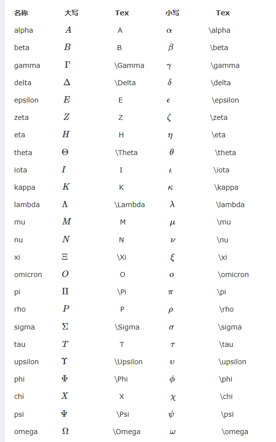
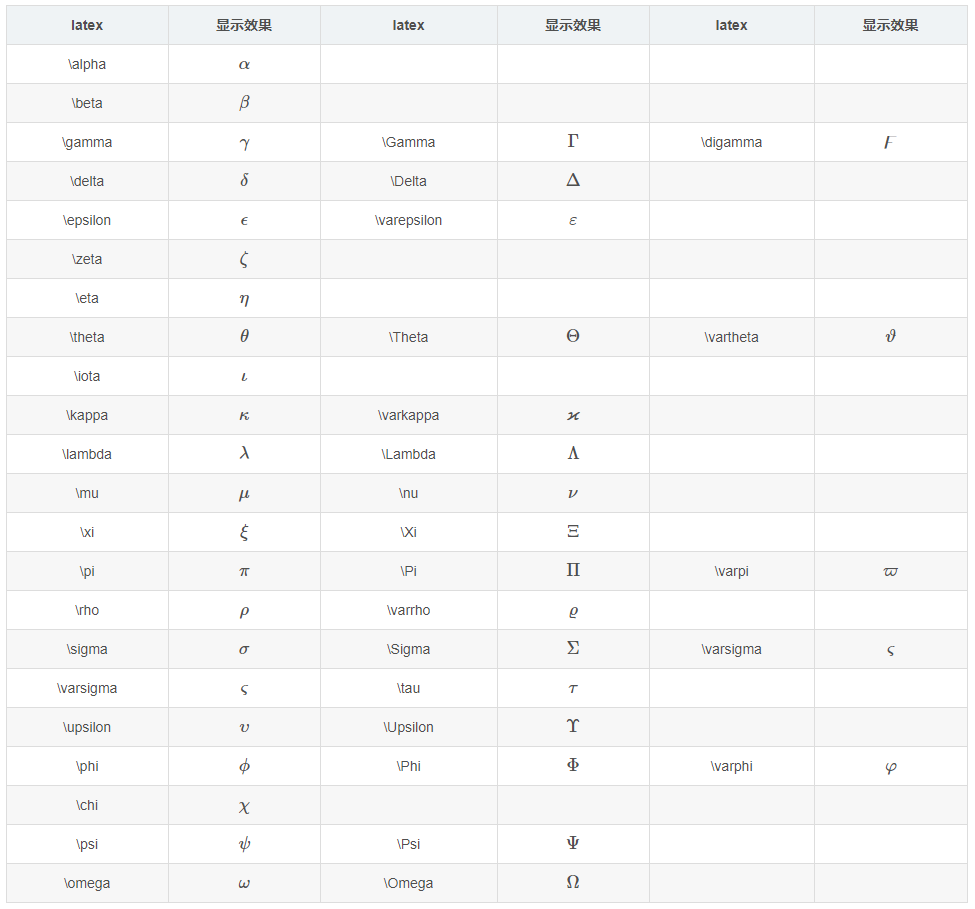
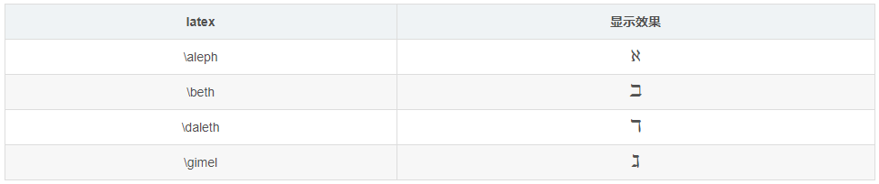
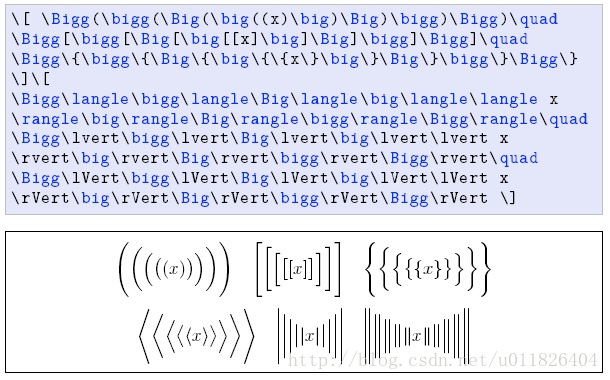
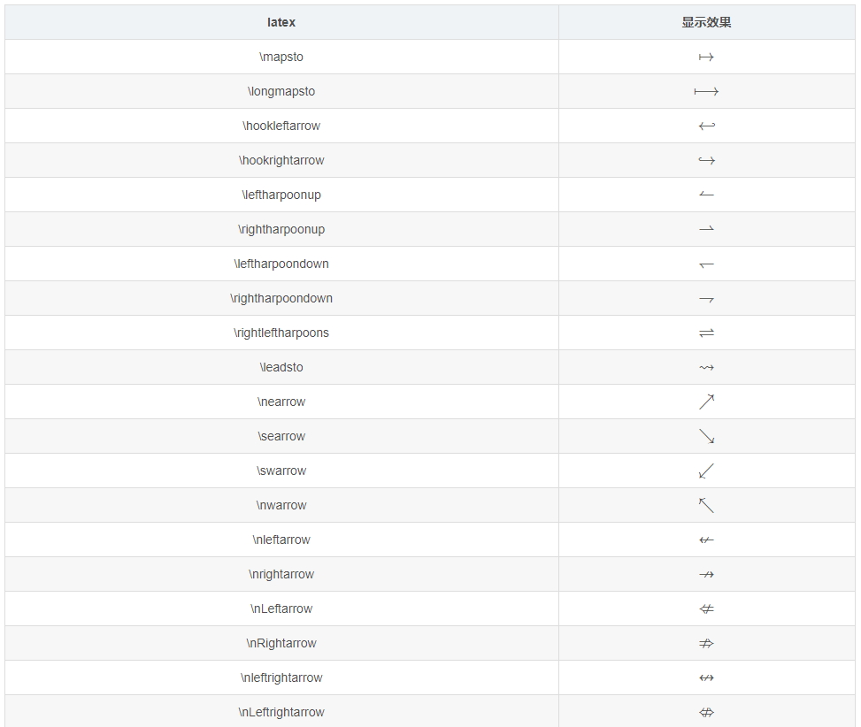
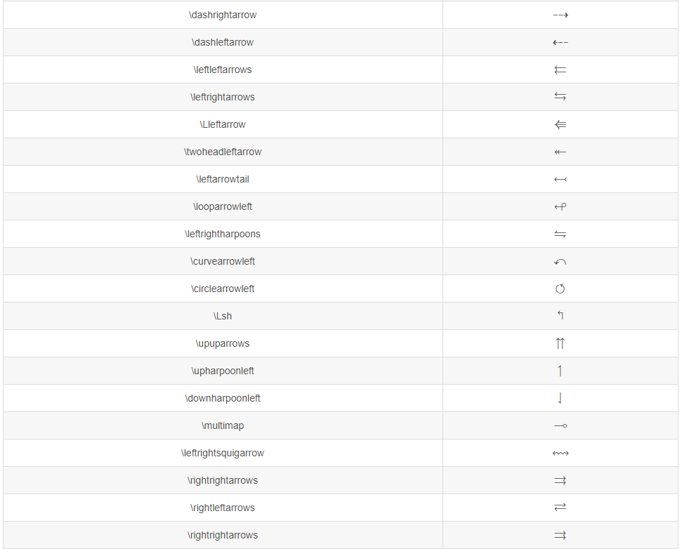
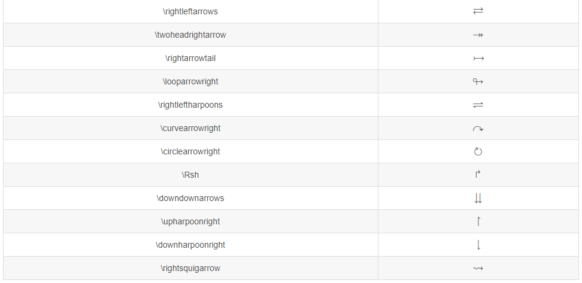
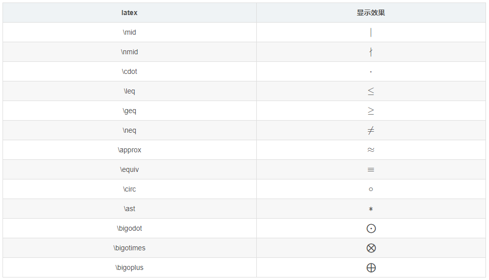
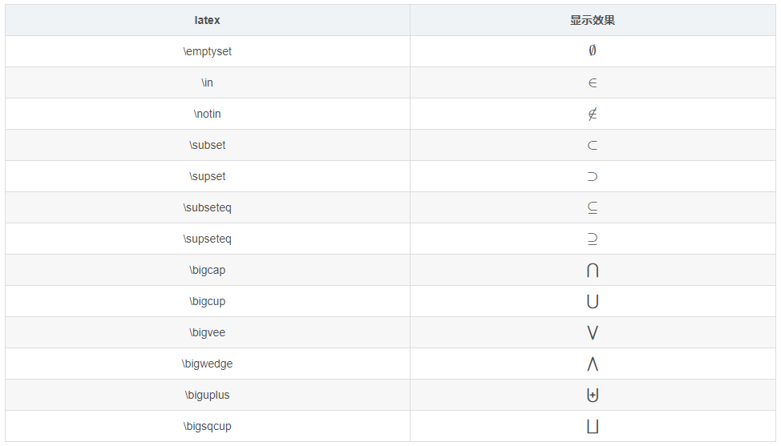
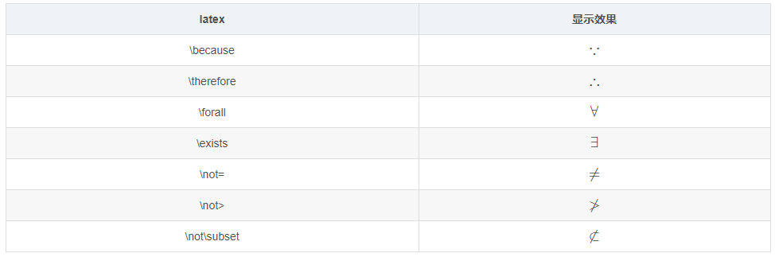

#### 一、MathJax简介
MathJax是一款运行在浏览器中的开源数学符号渲染引擎，使用MathJax可以方便的在浏览器中显示数学公式，不需要使用图片。目前，MathJax可以解析Latex、MathML和ASCIIMathML的标记语言。MathJax项目于2009年开始，发起人有American Mathematical Society, Design Science等，还有众多的支持者，个人感觉MathJax会成为今后数学符号渲染引擎中的主流。本文接下来会讲述MathJax的基础用法，但不涉及MathJax的安装及配置。此外，推荐使用StackEdit学习MathJax的语法，它支持Markdown和MathJax。
	
#### 二、基础
##### 1、公式标记与查看公式 
使用MathJax时，需要用一些适当的标记告诉MathJax某段文本是公式代码。此外，MathJax中的公式排版有两种方式，inline和displayed。inline表示公式嵌入到文本段中，displayed表示公式独自成为一个段落。例如，`!$f(x)=3×x$` 是一个inline公式，而下面
```mathjax!
$$
f(x)=3×x
$$
```
则是一个displayed公式。
在MathJax中，默认的displayed公式分隔符有 \$\$...\$\$ 和\[...\]，而默认的inline公式分隔符为(...)，当然这些都是可以自定义的，具体要看编辑器的设置。该笔记用小书匠书写。

##### 2、希腊字母







##### 3、上标与下标
上标和下标分别使用 \^ 与 _ ，例如 x_i^2: `!$x_i^2$`。默认情况下，上下标符号仅对下一个组起作用。一个组即单个字符或者使用 {...} 包裹起来的内容。也就是说，如果使用10\^10，会得到 `!$10^10$`，而 10\^{10} 才是 `!$10^{10}$`。同时，大括号还能消除二义性，如 x\^5\^6 将得到一个错误，必须使用大括号来界定 \^ 的结合性，如 {x\^5}\^6: `!${x^5}^6$` 或者 x\^{5\^6}: `!$x^{5^6}$`。

##### 4、括号
1. 小括号与方括号：使用原始的()，[]即可，如 (2+3)[4+4]：`!$(2+3)[4+4]$`

2. 大括号：由于大括号 {} 被用来分组，因此需要使用 \\{和\\} 表示大括号，也可以使用 \lbrace 和 \rbrace 来表示。
   如：\\{a\*b\\}：`!$\{a∗b\}$`，\lbrace a\*b \rbrace：`!$\lbrace a*b \rbrace$`
   
3. 尖括号：使用 \langle 和 \rangle 表示左尖括号和右尖括号。如 \langle x \rangle：`!$\langle x \rangle$`

4. 上取整：使用 \lceil 和 \rceil 表示。如 \lceil x \rceil：`!$\lceil x \rceil$`

5. 下取整：使用 \lfloor 和 \rfloor 表示。如 \lfloor x \rfloor：`!$\lfloor x \rfloor$`

6. 不可见括号：使用 . 表示

7. 使用 \big \Big \bigg \Bigg来调整其大小



需要注意的是，原始符号并不会随着公式大小缩放，可以使用 \left(...\right) 来自适应地调整括号大小：
```mathjax!
$$
\{\sum_{i = 0}^{0}i^2=\frac{(n^2 + n)(2n + 2)}{6} \}
\ \ \ \ \ \  (1.1)
$$
```
```mathjax!
$$
\left\{\sum_{i = 0}^{0}i^2=\frac{(n^2 + n)(2n + 2)}{6} \right\}
\ \ \ \ \ \  (1.2)
$$
```
可以看到，公式1.2中的括号是经过缩放的。

##### 5、求和与积分
（1）\sum 用来表示求和符号，其下标表示求和下限，上标表示上限。如 \sum_1^n：`!$\sum_1^n$`

（2）\int 用来表示积分符号，同样地，其上下标表示积分的上下限。如 \int_1^\infty：`!$\int_1^\infty$`

（3）与此类似的符号还有：\prod：`!$\prod $` , \bigcup：`!$\bigcup $`, \bigcap：`!$\bigcap $`, \iint：`!$\iint $`。

（4）用 \limits 与 \nolimits 来控制上下标是否被压缩。

##### 6、分式和根式
（1）分式的表示：

 - 第一种，使用 \frac ab , \frac 作用于其后的两个组a , b ，结果为`!$\frac ab $`。如果分子或分母不是单个字符，用 {...} 来分组。
 - 第二种，使用 \over 来分隔一个组的前后两部分，如 {a+1 \over b+1}: `!${a+1 \over b+1}$`。

（2）根式使用 \sqrt 表示，如：\sqrt\[4]{\frac xy} ：`!$\sqrt[4]{\frac xy} $`。

##### 7、字体
1. 使用 \mathbb 或 \Bbb 显示黑板粗体字，此字体经常用来表示实数、整数、有理数、复数。如：
   `!$\Bbb{ABCDEFGHIJKLMN}$`
2. 使用 \mathbf 显示黑体字，如：
   `!$ \mathbf{ABCDEFGHIJKLMN \ \ abcdefghijklmn}$`  
3. 使用\mathtt 显示打印机字体，如：
   `!$\mathtt{ABCDEFGHIJKLMN \ \ abcdefghijklmn}$` 
4. 使用 \mathrm 显示罗马字体，如：
   `!$\mathrm{ABCDEFGHIJKLMN \ \ abcdefghijklmn}$`
5. 使用 \mathscr 显示手写体，如：
   `!$\mathscr{ABCDEFGHIJKLMN}$`
6. 使用 \mathfrak 显示Fraktur字母（一种德国字体），如：
   `!$\mathfrak {ABCDEFGHIJKLMN \ \ abcdefghijklmn}$`
   
##### 8、特殊函数和符号


使用[Detexify](http://detexify.kirelabs.org/classify.html)，你可以在网页上画出符号，Detexify会给出相似的符号及其代码。这是一个方便的功能，但是不能保证它给出的符号可以在MathJax中使用，你可以参考[supported-latex-commands](http://docs.mathjax.org/en/latest/tex.html#supported-latex-commands)确定MathJax是否支持此符号。








##### 9、空间
通常MathJax通过内部策略自己管理公式内部的空间，因此a...b与a......b( . 表示空格)都会显示为 `!$a  b$`。可以通过在 ab 间加入\\,（逗号）增加些许间隙，\\;（分号）增加较宽间隙，\quad 与 \qquad 会增加更大的间隙，如 `!$a\ \,\;\quad \qquad b$`。


###### 1) 箭头上的文字

 - `!$\underrightarrow{\text{你的文字}}$` (\underrightarrow{\text{你的文字}})

 - `!$A \xleftarrow{n=0} B \xrightarrow[T]{n>0} C$` 
 
 - 定义：`!$\triangleq$` (\triangleq)

###### 2) 下标

使用 \limits 控制下标是在符号右侧，还是上下两侧，支持 \limits的数学符号有：

 - 连加（summation）：（`!$\sum_{i=1}, \sum\limits_{i=1}$`）

 - 连乘（prod）：`!$\prod_{i=1}, \prod\limits_{i=1}$`）（注意，连乘用的是 \prod 而不是 \Pi）

###### 3) 在符号底部写符号：\underset
```mathjax!
$$
\underset{0\leq j \leq k-1}{\arg\min}
$$
```
 A 在 B 下 :  \underset{A}{B}             
 A 在 B 上 :  \overset{A}{B}

##### 10、顶部符号
对于单字符，\hat： `!$\hat x$`
对于多字符，\widehat：`!$\widehat {xyz}$`
类似的还有 \overline , \vec , \overrightarrow , \dot , \ddot：`!$\overline {xyz} \ \vec a \ \overrightarrow x \ \dot x \ \ddot x$`


 **注：一些MathJax使用的特殊字符，可以使用 \\ 转义为原来的含义，如 \\\$ 表示 $ , \\\_ 表示下划线。**
 
 ##### 11、关系运算符
 
 
 
 ##### 12、集合运算符
 
 
 
 ##### 13、逻辑运算符
 
 
 
 #### 三、表格
 使用 \$\$\begin{array}{列样式}...\end{array}\$\$ 这样的形式来创建表格，列样式可以是 clr 表示居中，左，右对齐，还可以使用 | 表示一条竖线。表格中各行使用 \\ 分隔，各列使用 & 分隔，使用 \hline 在本行前加入一条直线。例如 
 ```mathjax!
 $$
 \begin{array}{c|lcr} n & \text{Left} & \text{Center} & \text{Right} \\ \hline 1 & 0.24 & 1 & 125 \\ 2 & -1 & 189 & -8 \\ 3 & -20 & 2000 & 1+10i \\ \end{array}
 $$
 ```
 ```mathjax!
 $$
 \begin{array}{c}\begin{array}{cc}\begin{array}{c|cccc} \text{min} & 0 & 1 & 2 &3 \\ \hline 0 & 0 & 0 & 0 & 0 \\ 1 & 0 & 1 & 1 & 1 \\ 2 & 0 & 1 & 2 & 2 \\ 3 & 0 & 1 & 2 & 3  \end{array} & \begin{array}{c|cccc} \text{max} & 0 & 1 & 2 & 3 \\ \hline 0 & 0 & 1 & 2 & 3 \\ 1 & 1 & 1 & 2 & 3 \\ 2 & 2 & 2 & 2 & 3 \\ 3 & 3 & 3 & 3 & 3 \end{array} \end{array} \\ \begin{array}{c|cccc} \Delta & 0 & 1 & 2 & 3 \\ \hline 0 & 0 & 1 & 2 & 3 \\ 1 & 1 & 0 & 1 & 2 \\ 2 & 2 & 1 & 0 & 1 \\ 3 & 3 & 2 & 1 & 0 \end{array}\end{array}
 $$
 ```
 #### 四、矩阵
 ##### 1、基本用法
 使用 \$\$ \begin{matrix}...\end{matrix} \$\$ 来表示矩阵，在 \begin 与 \end 之间加入矩阵的元素即可。矩阵的行之间用 \\ 分隔，列之间用 & 分隔。
例如：
```mathjax!
$$
\begin{matrix} 1 & x & x^2 \\ 1 & y & y^2 \\ 1 & z & z^2 \end{matrix}
$$
```

##### 2、加括号
如果要对矩阵加括号，可以像上文中提到的那样，使用 \left 与 \right 配合表示括号符号。也可以使用特殊的matrix，即替换 \begin{matrix}...\end{matrix} 中的matrix为pmatrix , bmatrix , Bmatrix , vmatrix , Vmatrix。
如：
pmatrix：`!$\begin{pmatrix} 1 & 2 \\ 3 & 4 \\ \end{pmatrix}$` bmatrix：`!$\begin{bmatrix} 1 & 2 \\ 3 & 4 \\ \end{bmatrix}$` Bmatrix：`!$\begin{Bmatrix} 1 & 2 \\ 3 & 4 \\ \end{Bmatrix}$` vmatrix：`!$\begin{vmatrix} 1 & 2 \\ 3 & 4 \\ \end{vmatrix}$` Vmatrix：`!$\begin{Vmatrix} 1 & 2 \\ 3 & 4 \\ \end{Vmatrix}$`

##### 3、省略元素
可以使用\cdots `!$\cdots $` \ddots `!$\ddots $` \vdots `!$\vdots $` 来省略矩阵中的元素，如：
```mathjax!
$$
\begin{pmatrix} 1 & a_1 & a_1^2 & \cdots & a_1^n \\ 1 & a_2 & a_2^2 & \cdots & a_2^n \\ \vdots & \vdots & \vdots & \ddots & \vdots \\ 1 & a_m & a_m^2 & \cdots & a_m^n \end{pmatrix}
$$
```

##### 4、增广矩阵
增广矩阵需要使用前面的 array 来实现，如：
```mathjax!
$$
\left[ \begin{array}{cc|c} 1 & 2 & 3 \\ 4 & 5 & 6 \end{array} \right]
$$
```

#### 五、对齐的公式
有时候可能需要一系列的公式中等号对齐，如：
```mathjax!
$$
\begin{align} \sqrt{37} & = \sqrt{\frac{73^2-1}{12^2}} \\ & = \sqrt{\frac{73^2}{12^2} \cdot \frac{73^2-1}{73^2}} \\ & = \frac{73}{12} \sqrt{1 - \frac{1}{73^2}} \\ & \approx \frac{73}{12} \left( 1 - \frac{1}{2 \cdot 73^2} \right) \end{align}
$$
```
这时候需要使用形如 \begin{align}...\end{align} 的格式，其中需要使用 & 来指示需要对齐的位置。

(1)长公式（对齐与不对齐）
```mathjax!
$$
\begin{split} \begin{multline} x = a + b + c + {} \\ d + e + f + g \end{multline} \end{split}
$$
```
```mathjax!
$$
\begin{split} x = {} & a + b + c + {} \\ & d + e + f + g \end{split}
$$
```
```mathjax!
$$
\begin{align} x = {} & a + b + c + {} \\ & d + e + f + g \end{align}
$$
```
**注：“split”环境中不会自动编号。**

(2)多行公式（对齐与不对齐）
```mathjax!
$$
\begin{gather} a = b + c + d \\ x = y + z \end{gather}
$$
```
```mathjax!
$$
\begin{align} a & = b + c + d \\ x & = y + z \end{align}
$$
```

#### 六、分类表达式
定义函数的时候经常需要分情况给出表达式，可使用 \begin{cases}...\end{cases}。其中，使用\来分类，使用 & 指示需要对齐的位置。如：
```mathjax!
$$
f(n) = \begin{cases} n/2, & \text{if $n$ is even} \\ 3n+1, & \text{if $n$ is odd} \end{cases}
$$
```
上述公式也可以移动到右侧，不过需要使用array来实现，如下：
```mathjax!
$$
\left. \begin{array}{l} \text{if $n$ is even:} & n/2 \\ \text{if $n$ is odd:} & 3n+1 \end{array} \right\} = f(n)
$$
```
最后，如果需要让分类之间的垂直间隔变大，可以使用  \\[2ex] 代替 \ 来分隔不同情况。（3ex, 4ex也可以使用，1ex相当于原始距离），3ex 的间隔如下：
```mathjax!
$$
\left. \begin{array}{l} \text{if $n$ is even:} & n/2 \\[3ex] \text{if $n$ is odd:} & 3n+1 \end{array} \right\} = f(n)
$$
```

#### 七、空间问题
在使用LaTex公式时，有一些不会影响公式正确性，但会使其看上去很糟糕的问题。
##### 1、不要在指数或者积分中使用 \frac
在指数或者基本表达式中使用 \frac 会使表达式看起来不清晰，因此在专业的数学排版中很少被使用。应该使用一个水平的 / 来代替，效果如下：
```mathjax!
$$
\begin{array}{cc} \mathrm{Bad} & \mathrm{Better} \\ \hline \\ e^{i\frac{\pi}{2}} \quad e^{\frac{i\pi}{2}} & e^{i\pi/2} \\ \int_{-\frac{\pi}{2}}^{\frac{\pi}{2}} \sin x \, dx & \int_{-\pi/2}^{\pi/2} \sin x \, dx \\ \end{array}
$$
```
##### 2、使用 \mid 代替 | 作为分隔符
符号 | 作为分隔符时有排版空间大小的问题，应该使用 \mid 代替，效果如下：
```mathjax!
$$
\begin{array}{cc} \mathrm{Bad} & \mathrm{Better} \\ \hline \\ \{x | x^2 \in \Bbb Z\} & \{x \mid x^2 \in \Bbb Z \} \end{array}
$$
```
##### 3、多重积分
对于多重积分，不要使用 \int \int 此类的表达，应该使用 \iint \iiint 等特殊形式，效果如下：
```mathjax!
$$
\begin{array}{cc} \mathrm{Bad} \mathrm{Better} \\ \hline \\ \int\int_S f(x) \, dy \, dx & \iint_S f(x) \, dy \, dx \\ \int\int\int_V f(x) \, dz \, dy \, dx & \iiint_V f(x) \, dz \, dy \, dx \end{array}
$$
```
此外，在微分前应该使用 \\, 来增加些许空间，否则 `!$\TeX $` 会将微分紧凑地排列在一起，如下：
```mathjax!
$$
\begin{array}{cc} \mathrm{Bad} & \mathrm{Better} \\ \hline \\ \iiint_V f(x) dz dy dx & \iiint_V f(x) \, dz \, dy \, dx \end{array}
$$
```
##### 4、连分数
书写连分数表达式时，请使用 \cfrac 代替 \frac 或者 \over，两者效果对比如下：
```mathjax!
$$
x = a_0+\cfrac{1^2}{a_1+\cfrac{2^2}{a_2+\cfrac{3^2}{a_3+\cfrac{4^2}{a_4+\cdots}}}} \tag{\cfrac}
$$
```
```mathjax!
$$
x = a_0+\frac{1^2}{a_1+\frac{2^2}{a_2+\frac{3^2}{a_3+\frac{4^2}{a_4+\cdots}}}} \tag{\frac}
$$
```
##### 5、方程组
使用 \begin{array}...\end{array} 与 \left{...与\right.配合表示方程组，如：
```mathjax!
$$
\left\{ \begin{array}{c} a_1x+b_1y+c_1z=d_1 \\ a_2x+b_2y+c_2z=d_2 \\ a_3x+b_3y+c_3z=d3 \end{array} \right.
$$
```
同时，还可以使用 \begin{cases}...\end{cases} 表达同样的方程组，如：
```mathjax!
$$
\begin{cases} a_1x+b_1y+c_1z=d_1 \\ a_2x+b_2y+c_2z=d_2 \\ a_3x+b_3y+c_3z=d_3 \end{cases}
$$
```
对齐方程组中的＝号，可以使用 begin{aligned}...\end{aligned}，如：
```mathjax!
$$
\left\{ \begin{aligned} a_1x+b_1y+c_1z & = d_1+e_1 \\ a_2x+b_2y & = d_2 \\ a_3x+b_3y+c_3z & = d_3 \end{aligned} \right.
$$
```

#### 八、颜色问题
命名颜色是浏览器相关的，如果浏览器没有定义相关的颜色名称，则相关文本将被渲染为黑色。以下颜色是HTML4和CSS2标准中定义的一些颜色，其应该被大多数浏览器定义了：
```mathjax!
$$
\begin{array}{|rc|} \hline \\ \verb+\color{black}{text}+ & \color{black}{text} \\ \verb+\color{gray}{text}+ & \color{gray}{text} \\ \verb+\color{silver}{text}+ & \color{silver}{text} \\ \verb+\color{white}{text}+ & \color{white}{text} \\ \hline \\ \verb+\color{maroon}{text}+ & \color{maroon}{text} \\ \verb+\color{red}{text}+ & \color{red}{text} \\ \verb+\color{yellow}{text}+ & \color{yellow}{text} \\ \verb+\color{lime}{text}+ & \color{lime}{text} \\ \verb+\color{olive}{text}+ & \color{olive}{text} \\ \verb+\color{green}{text}+ & \color{green}{text} \\ \verb+\color{teal}{text}+ & \color{teal}{text} \\ \verb+\color{aqua}{text}+ & \color{aqua}{text} \\ \verb+\color{blue}{text}+ & \color{blue}{text} \\ \verb+\color{navy}{text}+ & \color{navy}{text} \\ \verb+\color{purple}{text}+ & \color{purple}{text} \\ \verb+\color{fuchsia}{text}+ & \color{fuchsia}{text} \\ \verb+\color{magenta}{text}+ & \color{magenta}{text} \\ \hline \end{array}
$$
```

此外，HTML5和CSS3也定义了一些颜色名称，参见　。同时，颜色也可以使用 #rgb 的形式来表示，如下：
```mathjax!
$$
\begin{array}{|rrrrrrrr|} \hline \verb+#000+ & \color{#000}{text} & & & \verb+#00F+ & \color{#00F}{text} & & \\ & & \verb+#0F0+ & \color{#0F0}{text} & & & \verb+#0FF+ & \color{#0FF}{text} \\ \verb+#F00+ & \color{#F00}{text} & & & \verb+#F0F+ & \color{#F0F}{text} & & \\ & & \verb+#FF0+ & \color{#FF0}{text} & & & \verb+#FFF+ & \color{#FFF}{text} & & \\ \hline \end{array}
$$
```

#### 九、公式标记与引用 
使用 \tag{yourtat} 来标记公式，如果想在之后引用该公式，则还需要加上 \label{yourlabel} 在 \tag 之后，如：
```mathjax!
$$
a:= x^2-y^3 \tag{*}\label{*}
$$
```
为了引用公式，可以使用 \eqref{rlabel} ，如：
```mathjax!
$$
a+y^3 \stackrel{\eqref{*}}=x^2
$$
```
可以看到，通过超链接可以跳转到被引用公式的位置。

#### 十、补充

 - indicator function：\mathbb{I}：`!$\mathbb{I}$`
 - 空心的符号：\mathbb{KL}：`!$\mathbb{KL}$`
 - 向量、矩阵： \mathrm{x, y}：`!$\mathrm{x, y}$`
 - 实值：x：`!$x$`
 - 使用 \begin{align} 时，在每个式子末尾加上 \nonumber 可以去掉显示式子的标号。